# Calcium

**A framework for building terminal interfaces out of structured data.**

Describe what to show as data — a table, a curve, a log tail, a progress bar, a
diff — and it renders, measures, themes and degrades. Describe what operations
exist and it gives you completion, validation and help. You get a fullscreen shell
with a scrollable transcript, history and live views.

You do not write a terminal.


*[`docker-tui`](examples/docker/README.md) — the reference application, driven
against real containers. Everything in it is blocks; none of its adapters draws.*

---

## What it is

Two halves, and they are useful separately.

**A rendering layer that takes blocks and produces a terminal frame.** Sixteen
block types, every one of which reports its height as a pure function of width, so
a hundred thousand of them can be virtualised without being drawn. Themed by
palette slot rather than by colour. Degrading down to a 60-column monochrome ASCII
terminal without losing information.

**A shell layer that turns typed operations into an interface.** You describe your
operations once — verbs, flags, argument types, which are local and which spawn —
and completion, pre-flight validation, help and history all derive from it. Nothing
in the framework knows what your domain is.

```
        you describe                    Calcium                      it renders
   ┌──────────────────┐         ┌────────────────────┐         ┌──────────────┐
   │  what operations │ ──────► │  parse · validate  │         │              │
   │  exist, and how  │         │  complete · help   │         │  a frame,     │
   └──────────────────┘         └────────────────────┘         │  measured,    │
                                          │                    │  themed,      │
   ┌──────────────────┐         ┌─────────▼──────────┐         │  degraded     │
   │  structured data │ ──────► │  adapter → blocks  │ ──────► │              │
   └──────────────────┘         └────────────────────┘         └──────────────┘
```

The adapter is a pure function: data in, blocks out. That is the whole extension
model, and it is where an app spends nearly all of its effort.

---

## The block vocabulary

An adapter never draws. It returns blocks, and the framework renders them — so
every app built on it looks consistent, degrades identically, and measures
correctly without trying.

```
rule       ── ps · 4 of 11 · --mine ──────────────────────────────

notice     ✓ deployed · a3f9b21

keyValue   name        web
           status      ● running · 3 replicas
           resources   2 CPU · 4Gi · node-04

steps      ✓ resolving image         nginx:1.25
           ✓ validating config       22 rules · 0 errors
           ◐ rolling out             …

progress   replica 7 / 10   ████████████████████░░░░░░░░  70%    eta 2m 10s

plot         982 │⠉⠲⢄
                 │    ⠑⠢⣀
             311 │        ⠉⠒⠤⢄⣀⡀
                 └────────────────────────────
                  30m ago        15m       now

table        id       name     status     detail       cpu       age
           ▸ a3f9b21  web      running    3 replicas   12% ▁▂▃▅▆  23m
           ▸ 7c2d4e1  api      healthy                  4%       41m

diff       spec.replicas          2       →  3

pills      all ×11    running ×9    stopped ×2

logs       14:23:01.882  INFO   [server] request r-8f2a · 12ms
           14:23:02.551  WARN   [pool] slow query (87ms · 95p)

code       apiVersion: apps/v1
           kind: Deployment
           spec:
             replicas: 2

tip        next: /logs …   /status …
```

Plus `events`, `panel`, `group`, `patch` and `raw` — the escape hatch that renders
anything, so the vocabulary never has to be complete for the tool to be usable.

**One invariant sits under all of it:** `measure(block, width)` equals the rows
`render` occupies. Every kind, every width, both Unicode modes. That is what lets
the viewport virtualise, and it is the most load-bearing property in the system.

---

## The frame

Four regions with fixed ownership. Only the viewport flexes.

```
┌──────────────────────────────────────────────────────────────────────────────┐
│ ▲ ctr  v1.0.0   prod-eu · you@example.com            ● live         14:23:07 │  header
├──────────────────────────────────────────────────────────────────────────────┤
│                                                                              │
│   ✓ config validated                    22 rules · 0 errors · 587ms          │
│   next: /deploy …   /status …                                       587ms    │
│                                                                              │
│ ▌ ── ps · 4 of 11 · --mine · last 24h ───────────────────────────────────    │
│ ▌                                                                            │
│ ▌   all ×11    running ×9    stopped ×2                                      │  viewport
│ ▌   ● up ×1   ✓ healthy ×6   ✗ failed ×2   ○ pending ×1                      │
│ ▌                                                                            │
│ ▌     id       name      status     detail       cpu             age         │
│ ▌ ▸ ● a3f9b21  web       running    3 replicas   12% ▁▂▃▅▆       23m         │
│ ▌ ▸ ✓ 7c2d4e1  api       healthy                  4%             41m         │
│ ▌ ▸ ✗ 2e8a04c  worker    failed     OOM            —           1h 12m        │
│                                                                              │
├──────────────────────────────────────────────────────────────────────────────┤
│ ❯ /restart a3f9b21                                                           │  prompt
├──────────────────────────────────────────────────────────────────────────────┤
│ ↑↓ rows   ⏎ drill in   ␣ expand   f filter   s sort   esc prompt              │  footer
└──────────────────────────────────────────────────────────────────────────────┘
```

The `▌` marks the **live block** — the newest result, navigable right now with the
arrow keys. Everything above it is a frozen record that scrolls.

### Three tiers, decided by one question

**Does it need single-letter keybindings?**

| | Behaviour |
|---|---|
| **Transcript** | Read once, keep the record. Validation output, a deploy result |
| **Live block** | Newest result, navigable in place. Lists, detail views |
| **Pushed view** | Takes the screen, prompt goes away. Log tails, dashboards |

A live block keeps the prompt, so letters still type. A pushed view needs `l` to
mean "cycle log level", and a prompt cannot coexist with that. That test is the
whole rule.

---

## Operations, described once

You write a manifest: verbs, flags, argument types, arity, which verbs are local
and which spawn, which stream. Everything interactive falls out of it.

```
completion    every flag and enum value, from the manifest — nothing hand-listed
validation    a malformed invocation is rejected before anything is spawned
help          rendered from the same table dispatch uses, so it cannot drift
history       persisted, redacted, searchable
```

**Adding a flag makes it completable with no code change.** That is the property
the manifest exists for, and it is asserted directly: a test adds a flag to a
fixture manifest and checks it appears in completion, with a source scan forbidding
any hardcoded verb, flag or enum list.

The argument types stay deliberately generic — `string`, `int`, `bool`, `path`,
`enum`, `duration`, `pattern`. A type describes a *shape the framework can
validate without knowing what it means*. There is no `uuid` type, because a UUID is
a pattern, and adding one would mean the framework had started knowing your nouns.

---

## Where the data comes from

Acquisition is behind an interface with three implementations, chosen by one
environment variable:

```
   emulated      a stateful, animated world      → npm run dev
   fixture       a recorded corpus, no clock     → npm test
   subprocess    a real child process            → production
```

**Tests never run against the emulator.** An animated world serving tests becomes
the thing tests agree with, and drift then hides regressions silently. Fixtures are
*recorded* from the real source and replayed byte-for-byte, with provenance —
authored ones are marked, justified and counted.

Selection is **per operation**, so one verb can move from subprocess to native
TypeScript without anything else changing.

**Honestly: the built path assumes a subprocess.** The interface is real and has
three implementations, but the result shape carries `argv`, an exit code and a
signal — so a transport over HTTP or a socket would fit awkwardly today and the
adapter would receive fields it has to ignore. If your data arrives some other way,
the rendering half is what you want, and the acquisition half is where you would be
doing new work.

### Real data is awkward, and that is what adapters are for

The shapes that actually turn up:

```json
{"ID":"a3f9b21c8d2e","Names":"web,web-old","Image":"nginx:1.25",
 "State":"running","Status":"Up 3 hours","Ports":"0.0.0.0:8080->80/tcp"}
```

Capitalised keys. `Names` plural but usually singular. `Status` is *prose* while
`State` is the machine-readable one — and using the wrong field for the status
glyph gives you a table that looks right and is wrong. Everything is a string,
including the numbers.

An adapter over tidy data teaches nothing. Absorbing an awkward source **so it
never has to change for you** is the job, and it is why this layer exists rather
than the framework consuming your shapes directly.

Anything with no adapter still renders, through a fallback that turns arbitrary
structured data into something legible — so you add adapters one at a time, and an
operation added tomorrow is usable tomorrow, unstyled.

---

## Things that are easy to underestimate

### Columns drop by priority — and nothing is lost

Each column declares a priority and a minimum width. When the terminal narrows the
lowest survive last — and **everything dropped appears in the expanded row**, so no
field is ever unreachable.

```
  160 cols   id  kind  name  status  detail  cpu  age  owner  ref
  100 cols   id  kind  name  status  detail  cpu  age  owner
   80 cols   id        name  status  detail  cpu  age
   60 cols   id        name  status  detail
```

A row becomes expandable *because* columns dropped, whether or not it declared any
detail. Without that, narrowing a terminal would silently destroy information.

### Degradation is real, not aspirational

Four independent axes, one rule across all of them: **no information is lost, only
convenience.**

```
   24-bit truecolour  ─────►  256  ─────►  16  ─────►  monochrome
   full Unicode       ─────────────────────────────►  ASCII
   200 columns        ─────────────────────────────►  60
   everything up      ─────────────────────────────►  nothing reachable
```

A dropped column reaches the expand row. A lost colour is carried by a glyph. A
lost glyph is carried by a word. An unreachable service says so rather than
rendering empty.

```
   ✓ succeeded          →  under ASCII  →   + succeeded
   ● running · 3/3      →               →   * running · 3/3
   ▲ degraded           →               →   ! degraded
```

Substitutions are 1:1 by cell count, so a `LANG=C` session measures identically to
a UTF-8 one and the column drop order is the same in both.

### Failure is contained to the smallest thing that can report it

```
┌ cluster ──────────────┐  ┌ metrics · unavailable ───────────────┐
│ nodes      12         │  │ metrics backend unreachable          │
│ cpu        71%  ██████│  │ retrying in 12s                      │
│ pods      342         │  │                                      │
└───────────────────────┘  └──────────────────────────────────────┘
┌ running · 3 ─────────────────────────────────────────────────────┐
│ ● a3f9b21  web                3 replicas  ████████░░░░  12%  23m │
└──────────────────────────────────────────────────────────────────┘
```

One panel's query dies; the others keep working. A whole-screen error would hide
three working panels behind one broken one.

You get that from one builder:

```ts
b.live({ id: "metrics", title: "Metrics", every: 30_000, fetch: () => api.metrics(),
         render: data => { const m = data as Metrics;
                           return b.kv({ cpu: m.cpu, memory: m.memory }) } })
```

The cast is not decoration. `fetch` returns whatever the far side sent, so
`render` receives `unknown` and the consumer narrows it — which is honest about
where the type actually comes from, and is the one place this builder is less
pleasant than it looks.

Backoff, staleness marking, stagger offsets, teardown and the error rendering all
come free. **The behaviour is fixed and only the rendering is overridable** — a
guarantee you can switch off is not one.

---

## The same view, on five terminals

**This is the claim the rest of the README is making, in one picture.** The same
document — a CPU plot, a memory bar, network and block totals, a details panel —
rendered at five capability levels. Nothing is dropped, nothing is simplified, and
no adapter knows which terminal it is on.

Truecolour:

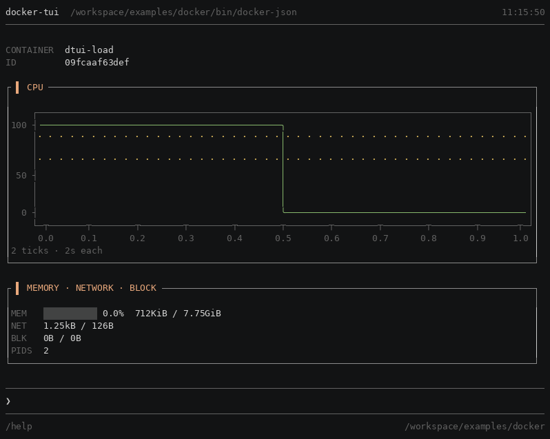

256 colours:

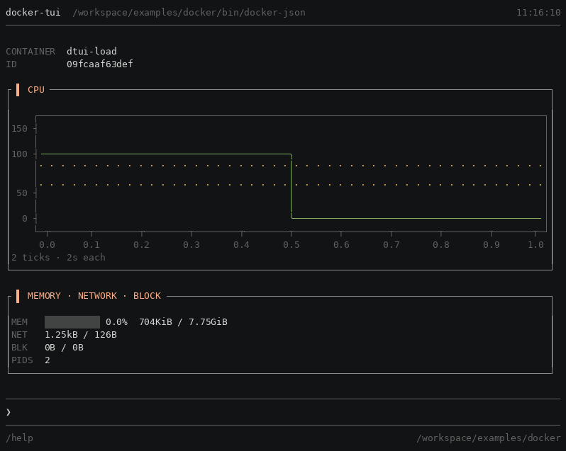

16 colours:

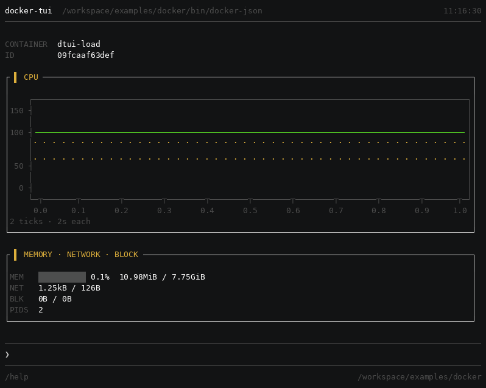

**1-bit** — no colour at all:

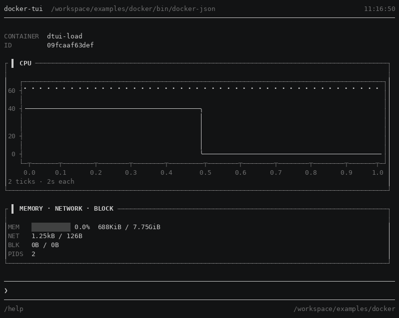

**1-bit and ASCII** — no colour, no Unicode:

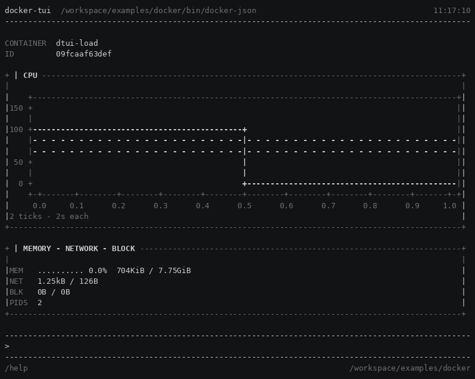

**Every element that carried meaning still carries it.** Where the colour goes, the
meaning moves channel rather than disappearing — measured on the wire, 1010
typographic sequences appear exactly where 1118 colour ones stop. The plot never
carried meaning in colour at all, which is why it is the one element that barely
changes. `examples/docker/DEGRADATION.md` has the byte counts and the three
places something *was* lost.

**An adapter writes `tone: "ok"` and `glyph: "running"` once.** What those become
on each of these terminals is not its problem, and that is the entire argument for
naming palette slots rather than colours.

The same is true of the variant. `/theme light` is one command, and no adapter
knows it happened:


**A theme decides whether it paints the page, and the two shipped ones decide
differently.** `dark` takes `background: "terminal"` and emits nothing behind the
text, because *background colours are the emulator's and a user may override
them* — so on a dark terminal it is a set of foregrounds chosen to pair with
what is already there. `light` takes `background: "surface"` and **paints**,
because it cannot work otherwise: dark foregrounds emitting nothing behind them
are dark-on-dark, and the name is the lie.

Grounds are separate from that choice and every theme has them — focus,
selection, wells, meter fills, diff lines — resolved through `resolveBackground`
and painted per cell. What a theme chooses is whether it also paints the page
underneath.

*This paragraph read "Calcium paints no background" until it was measured
against `tokens-light.ts:24`. The claim was true of `dark` alone, and its own
next sentence — that the image above needs a light terminal for that reason —
was a consequence of the false half.*

### Spinners and bars, every one

The two glyph catalogues the framework ships, drawn rather than listed — and generated from the
same tables the renderer reads, so neither picture can go stale against the code.


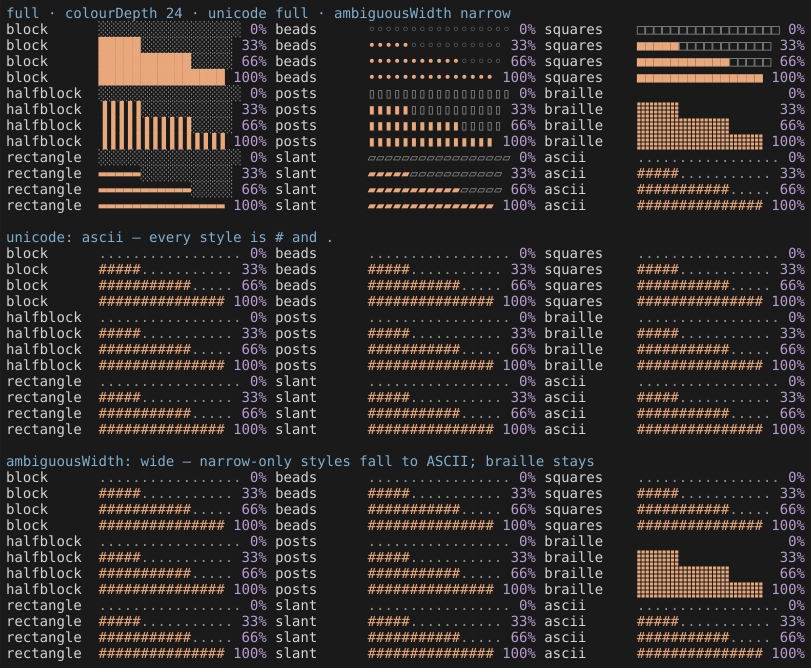

A block names a set (`Status.spinner`) or a style (`Progress.style`); the terminal decides what
is drawn. `spinnerSetNames()` and `barStyleNames()` list them for a consumer building a picker,
and the plots demo's `/spinners` and `/bars` are the first two.

---

## The reference application

`docker-tui` — a terminal interface over `docker`, and the app this framework was
proved against. Twelve surfaces, every block type, and sixty-nine findings logged
while building it.


The same table at 120 columns and at 80. `PORTS` is dropped by declared priority
and `USAGE` leaves the dashboard above it, neither of which the adapter asked for:


[`examples/docker/`](examples/docker/README.md) has the recording, how to run it,
and the ledger. [`docs/ROADMAP.md`](docs/ROADMAP.md) is what the ledger turned
into: four pieces of framework work, each with a real consumer behind it.

---

## The second application: plots

`plots-tui` is the other way round from `docker-tui`. That one is a real interface
over a real daemon; this one exists because **every instrument in this repository
compares bytes** — golden frames, the collision sweep, the terminal baseline — and
not one of them can see a flicker, a jump, or a colour that reads badly on a real
emulator. Until it existed, nothing had looked.

Forty-eight forms, and the greeting draws six of them at once:


Each figure is captioned by **what it says** rather than by what it is called —
*a curve · frame latency, ms*, *a distribution · stage timings, ms*. The form is
the renderer's business; a producer names the shape of its data.

`/live <form>` advances one of them in place. The transcript does not move under
it, which is C25's whole subject — a block is patched where it sits rather than
reprinted at the bottom:

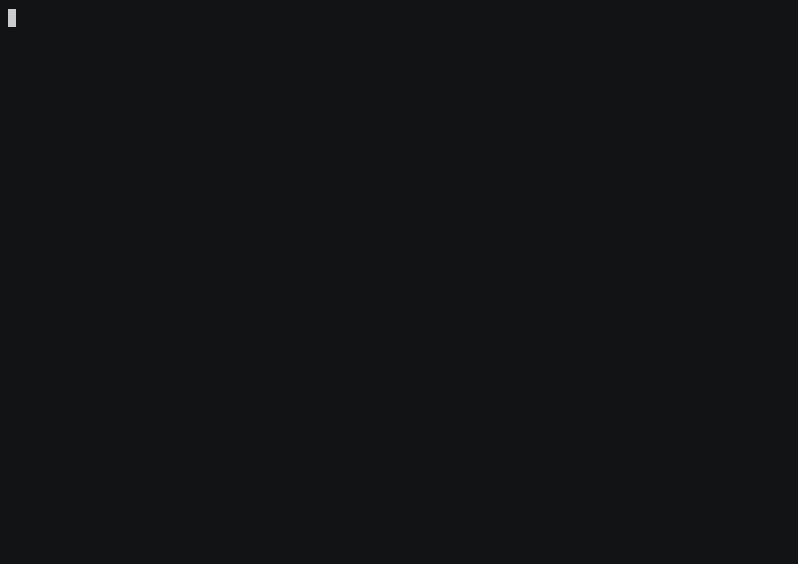

And `/compare <form>` draws the same block through both renderers at once:

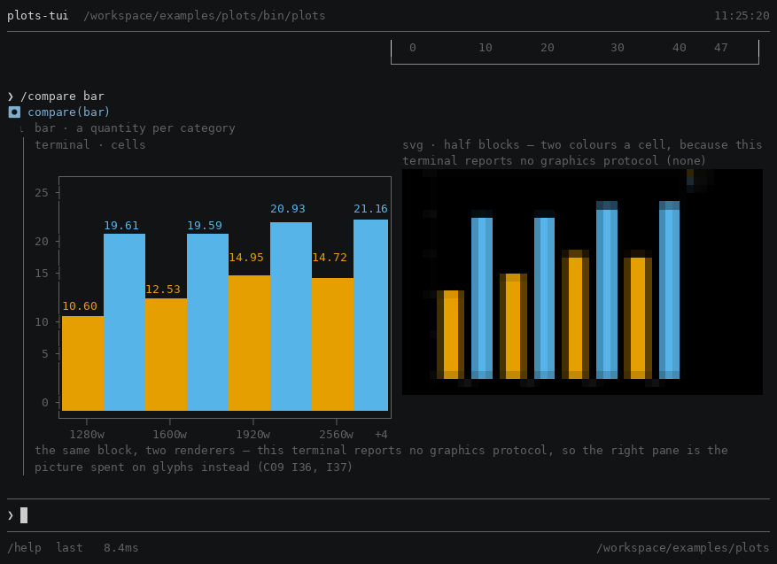

**The right pane is not a degraded left pane.** This terminal reports no graphics
protocol, so the SVG is spent on half blocks — two colours a cell — and that is a
decision the renderer took and can explain (C09 I36, I37), not a failure it fell
into. On a terminal that answers Kitty or iTerm2 it is pixels instead, and nothing
above the renderer changes.

---

## The layout engine

Calcium owns its box model. Sizes fit, grow, shrink or are declared; a row of
children is solved in five passes — fit width, grow and shrink width, re-fit
height, grow and shrink height, then position — and `measure` stops after the
fourth because it only ever wanted a number.

`/mosaic` is the surface where the engine is the subject rather than the means. A
layout is **named as a string**: one character a cell, `/` a row, `.` a hole.

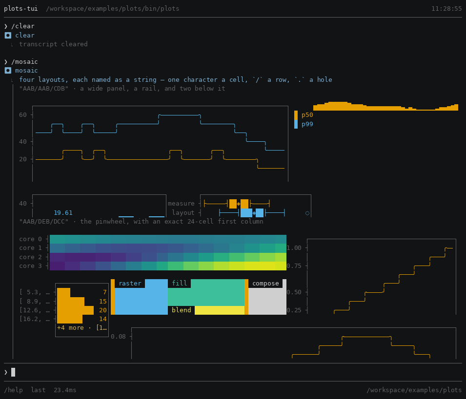

`".A./BBB/.C."` has holes in it, which a `group` has no way to say, and `"AB"`
leaves `rows` unused — the degenerate case, which still holds. The engine is in
[`src/presentation/layout/`](src/presentation/layout/) and
[`docs/components/C29_layout_engine.md`](docs/components/C29_layout_engine.md) is
the component spec, with
[`docs/design/layout/LAYOUT_ENGINE.md`](docs/design/layout/LAYOUT_ENGINE.md) the
design it was built to.

---

## The profiler measures the framework, with the framework

C28 ships as the seventh verb every application gets for free. **Every figure it
draws is a Calcium plot**, which is the honest test of the plot system and not a
flourish: if the profiler is hard to read, the plots are hard to read.

`/report verdict` answers the only question that matters first — does the frame
budget hold, and if not, by how much:


*justified*, *marginal*, and the regime the reading was taken in — node version,
CPU count, tier, elapsed. A number with no regime is not a measurement.

`/report where-the-frame-went` breaks one frame into its sites, **self time and
not total**, so the bars sum to the frame rather than to some multiple of it:

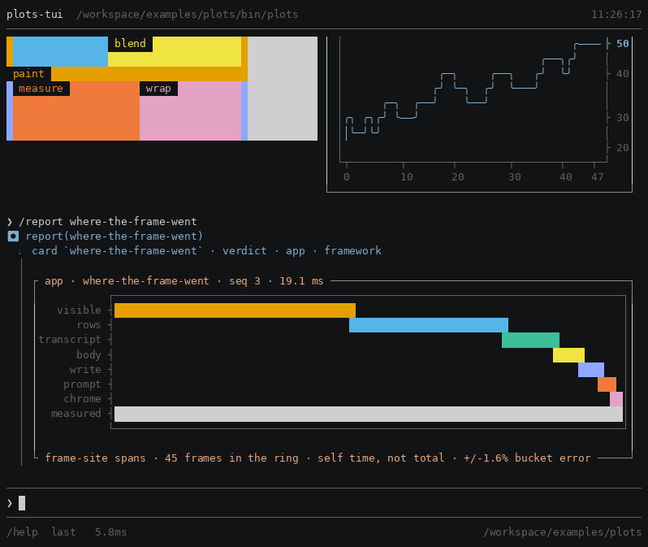

`/report memory` is the heap over the session, sampled rather than snapshotted —
a heap profile reports what *survived*, and what a leak looks like is a line that
does not come back down:

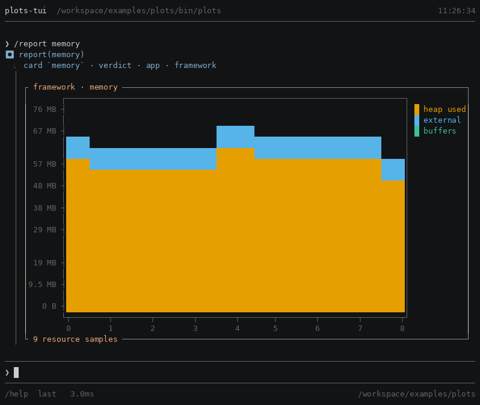

Thirty-eight cards in three groups — `verdict`, `app`, `framework`. `/profile`
opens them as a pushed view rather than a transcript entry, and `n`/`p` walk the
cards while `tab` walks the groups:

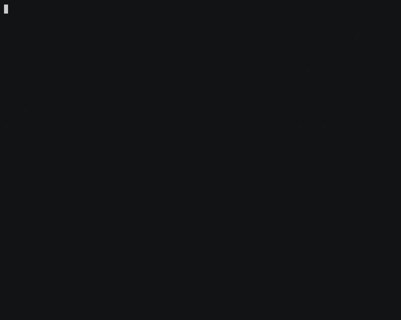

**A view that redrew on every frame would raise the frame that redraws it**, so
every commit it makes is bracketed as the profiler's own and excluded from the
figures (C28 I12, I49) — the header says how many self-inflicted frames were
dropped. The cards are exported: `profileCard()` and `CARDS` let an application
draw its own, which is what `plots-tui`'s `/report` does.
---

## The smallest complete example

A far side that prints JSON, a manifest saying what operations exist, an adapter
turning one shape into blocks. That is the whole of it — everything else is
Calcium's.

<!-- verified against examples/minimal/main.ts by examples/minimal/test/minimal.test.ts -->

```ts
import { b, createTui, defaultTheme } from "@fmx/calcium";
import type { Adapter } from "@fmx/calcium";

const manifest = {
  schema: "tui.manifest/1",
  binary: "svc",
  version: "1.0.0",
  tools: [{ name: "list", local: false, summary: "List services", args: [], flags: [] }],
} as const;

const list: Adapter = {
  schema: "tui.view/1",
  adapt: (raw, ctx) => {
    const rows = raw.stdoutRaw
      .trim()
      .split("\n")
      .map((line) => JSON.parse(line) as Record<string, unknown>);
    return {
      schema: "tui.view/1",
      command: ctx.command,
      status: "ok",
      blocks: [
        b.table({
          columns: [
            b.col("name", { label: "SERVICE", minWidth: 12, flex: true }),
            b.col("state", { label: "STATE", minWidth: 10 }),
            b.col("replicas", { label: "REPLICAS", minWidth: 8, align: "right" }),
          ],
          rows: rows.map((r) => ({
            id: String(r["name"]),
            cells: {
              name: { text: String(r["name"]) },
              state: {
                text: String(r["state"]),
                tone: r["state"] === "running" ? "ok" : "muted",
                glyph: r["state"] === "running" ? "running" : "queued",
              },
              replicas: { text: String(r["replicas"]) },
            },
          })),
        }),
        b.notice("muted", `${String(rows.length)} services`),
      ],
      meta: { adapter: "list" },
    };
  },
};

const tui = createTui({
  name: "svc-tui",
  binary: new URL("bin/svc", import.meta.url).pathname,
  manifest,
  theme: defaultTheme,
  env: process.env,
  adapters: { list },
});

await tui.start();
```

and it draws:

```
❯ /list

SERVICE                                                                 STATE       REPLICAS
api                                                                     ● running          3
worker                                                                  ● running          8
cron                                                                    ○ stopped          0
3 services
❯
```

The glyphs, the tones, the column widths, the header and the prompt are all the
framework's. The adapter said `tone: "ok"` and `glyph: "running"`; what those
become on a 256-colour terminal, a 16-colour one, or an ASCII one is not its
problem.

**The whole thing is `examples/minimal/`, it runs, and it is checked** — the block
above is quoted from that file line for line by a test, because a README example
that has drifted is worse than none: it fails on your machine and not on ours.
`make proof` runs it from the packed tarball rather than from this workspace, so
what is verified is the published package.

**This is 0.x, deliberately.** The example above is the surface most likely to
stay put; the rest of the API will break between minor versions, and it will
break without a deprecation cycle. Twenty-five specs and their invariants are
the contract that is stable — the names in front of them are not yet, and saying
so is the difference between a breaking change and a broken promise. Pin an
exact version.

---

## The parts you do not write

Twenty-five components. **Eleven of them you never touch** — and that is the
measure of whether the layering worked.

```
   L5  app          your adapters, manifest, theme
   ──────────────────────────────────────────────────────────
   L4  shell        composition · execution pipeline
   L3  interaction  input · editor · parser · completion · history
   L2  viewport     transcript · scrolling · overlays
   L1  presentation blocks · theme · tables · plots · patches
   L0  foundation   terminal | view model · transport · adapters · process
```

Imports go down only, and L0's two halves never touch each other — checked
mechanically rather than by discipline.

Your extension points are five: **manifest content, adapters, theme tokens, the
command prefix, and dynamic completion sources.**

---

## Some deliberate decisions

**Actions fill the prompt; they do not run.** Selecting `↑ deploy` puts
`/deploy a3f9b21 --confirm` in the input for you to read before you press enter.
Only filter pills execute directly, because a filter is reversible.

**Frozen blocks are read-only.** Scroll back to a five-minute-old table and its
actions are refused. Its data is stale, and acting on stale data is the mistake
worth preventing.

**Blocks name palette slots, never colours.** And glyphs are tokens, not
characters — so both degrade mechanically instead of each renderer reimplementing
it badly.

**`/` prefix for the app's operations.** `/ps` is yours; `ps` is Unix's. One
character removes an entire class of collision — and anything with a shell operator
goes to your actual shell, so globbing and quoting are exactly right rather than a
reimplemented subset.

**Measured height equals rendered height.** The most load-bearing invariant in the
system, and the easiest to violate silently.

---
