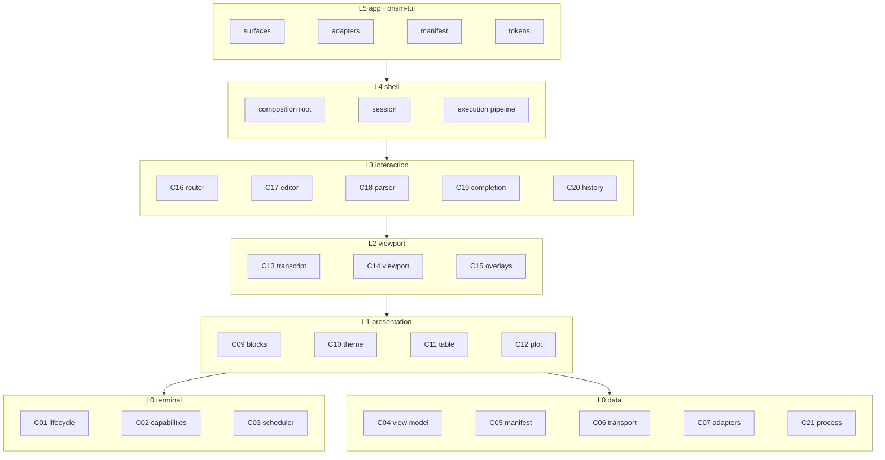
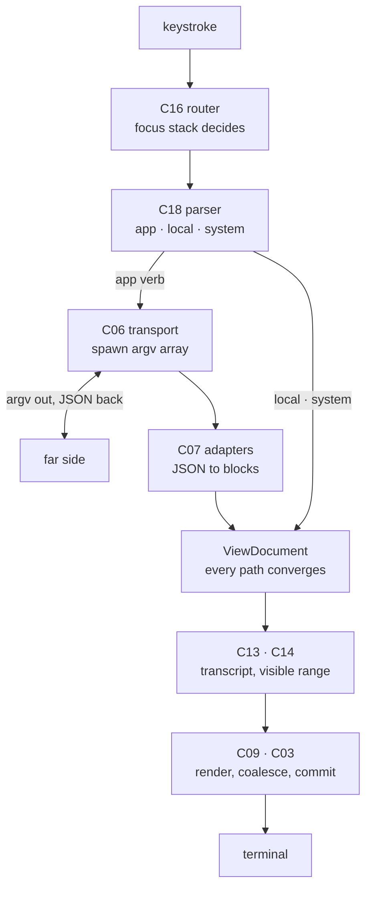

# A02 — `tui-kit` internal architecture

| Field | Value |
|---|---|
| **Type** | Architecture |
| **Package** | `tui-kit` |
| **Relationship to A01** | A01 is the **outward** contract — decisions, and what the far side must do. A02 is the **inward** one — how the kit is built |
| **Consumed by** | C01–C07, C09–C21; the composition root of any consuming app |
| **Status** | Draft |

---

## 1. Layering

Six layers. **A layer may import strictly downward. Never upward, never cyclically within a layer.** This is the rule that keeps 21 components from becoming a mesh, and it is lint-enforced, not merely stated.

```
L5  app            surfaces · adapters · manifest content · tokens · policies
L4  shell          composition root · session · execution pipeline
L3  interaction    input router · editor · parser · completion · history
L2  viewport       transcript store · viewport · overlay manager
L1  presentation   block library · theme · table engine · plot renderer
L0  foundation     terminal (C01 C02 C03)   ·   data (C04 C05 C06 C07 C21)
```

**L0 has two halves that do not know about each other.** Terminal knows nothing of view models; data knows nothing of terminals. That independence is not incidental — it is what allows C04–C07 to be built in parallel with C01–C03, and it is the first thing a lint rule should protect.

### Where a shared type is declared

**A type belongs to the layer that consumes it structurally, not to the component with the most to say about it.**

This has come up twice in ten components, both times as a draft that put the type with its domain expert and produced an edge in the wrong direction:

- **`ColumnDef` → C04, not C11.** C11 has everything interesting to say about columns — priority, flex, drop order, planning. But `ColumnDef` is a field of `Table`, so C04 cannot declare `Table` without it, and the first draft's placement made L0 depend on L1. C11 keeps `PlannedColumns` and `planColumns`, which are genuinely plan rather than content (C04 §, C11 §).
- **`Fixture` → C06, not C08.** C08 owns provenance, recording, redaction and the authored ratio — all the rules. But `createFixtureTransport` reads `Fixture`, and it is expressed in C06's own `RawResult` and `RawPatch`, so declaring it in C08 would have put a cycle inside L0 data (C06 §2, C08 §1a).

The pattern in both: the component with the domain knowledge keeps the *rules*; the consumer holds the *shape*. C11's rejected alternative is worth remembering because it is the one that hides — a type-only import erases at build and so passes the module-graph check, which makes it worse than an edge `make enforce` catches.

The next likely instance is C13/C14 over transcript entries.




L0T and L0D have no edge between them. That absence is the point.

| Layer | Components |
|---|---|
| L0 terminal | C01 lifecycle · C02 capabilities · C03 frame scheduler |
| L0 data | C04 view model · C05 manifest · C06 transport · C07 adapters · C21 process runner |
| L1 | C09 blocks · C10 theme · C11 table · C12 plot |
| L2 | C13 transcript · C14 viewport · C15 overlays |
| L3 | C16 input router · C17 editor · C18 parser · C19 completion · C20 history |
| L4 | composition root · session · execution pipeline |

C11 and C12 sit beside C09 rather than under it: the table engine and plot renderer *are* block renderers, registered like any other.

### Whose claim is this

Every component spec carries a commitment list and an invariant list, and they must pair: **an invariant is what a test cites, so a commitment with no invariant is a promise nothing enforces.** Two rules decide the cases where they legitimately do not pair, and both answer the same question — whose claim is this.

**Structural invariants carry no commitment.** An invariant asserting the module graph rather than behaviour — "C13 imports nothing from `terminal/` or `presentation/`" — is enforced by A03 and consumed by no caller, so a commitment would restate a build rule as a promise to a reader who cannot act on it. Ten specs carry such an invariant and none commits to it; that is one decision, not ten omissions.

**A spec commits only to what it can enforce. A rule owned elsewhere is a cross-reference, not a commitment.** The test is whether the spec can *fail* when the rule is violated. C04 committed to capability substitution being width-preserving, which happens in C09's renderers: C04 cannot fail if it is broken, so C04's version was an overclaim, and C09 I5 is where the rule lives. C02 committed to D29 — no information carried by colour alone, anywhere — which C02 has no view of at all.

The failure mode is specific and worth naming: **a claim restated downstream is a claim made where it cannot be tested, and the duplication is what hides that neither copy is backed.** Three rules were each stated in two specs and asserted in neither.

**Both rules are mechanical, not advisory.** Every commitment carries one of three markers, and A03 SP1 fails the build without one:

```
3. …text… (I5)            backed by one invariant — the common case
7. …text… (I3, I4)        the readable form of several
6. …text… (→ C09 I5)      someone else's rule, cross-referenced
```

A commitment that fits none of the three is a § detail rather than a commitment, and belongs in the section that explains it. That is the demotion the audit applied to four of them: an exact column cap, a shell fallback, a layout breakpoint and a menu policy were §-level facts wearing contract clothes.

The markers are what make the check exact. A word-overlap heuristic cannot do this — a commitment is the readable form, so it deliberately shares few words with the invariant it summarises — and it is why the audit was worth doing by hand first. **The categories are what told us which markers the template needed.**

---

## 2. Interfaces

**The component specs are authoritative for every signature.** This section declares only the **seams** — the contracts that cross a layer boundary or encode an architectural decision. Restating twenty-one interfaces here would guarantee they drift, which is exactly what happened to the first draft of this section.

| Surface | Authoritative in |
|---|---|
| Terminal lifecycle, capabilities, frame scheduling | C01, C02, C03 |
| View model, manifest, transport, adapters, fixtures | C04, C05, C06, C07, C08 |
| Block registry, theme, table, plot | C09, C10, C11, C12 |
| Transcript, viewport, overlays | C13, C14, C15 |
| Input, editor, parser, completion, history | C16, C17, C18, C19, C20 |
| Process runner | C21 |

### Seam 1 — measurement injection

```typescript
type MeasureFn = (block: Block, width: number) => number;
type Measure<B extends Block = Block> =
  (block: B, width: number, measureChild: MeasureFn) => number;
```

Container kinds measure children whose kind they do not know. The registry passes **itself** as `measureChild`, so no kind imports the registry and measurement stays pure. C04 defines the contract; C09 owns the registry that satisfies it.

### Seam 2 — transport is an interface with two implementations

```typescript
interface VerbTransport {
  invoke(inv: Invocation): Promise<RawResult>;
  stream(inv: Invocation): AsyncIterable<RawPatch>;
}
```

All three implementations are fully substitutable in every test that does not concern spawning (C06 I15), and selection is **per verb** (D13) — which is what allows a verb to migrate from Python to native TypeScript without touching anything else.

### Seam 3 — focus priority

```typescript
type FocusTarget =
  | "overlay" | "copyMode" | "pushedView" | "prompt" | "liveBlock" | "global";
```

Array order **is** the priority. Focus is derived on every dispatch from what is on screen, plus exactly one stored bit (`prompt` vs `liveBlock`) owned by C16 and reset on every transcript append. C16 §3 owns the resolution rules.

### Seam 4 — L4 orchestrates cross-layer effects

No component reaches sideways or upward to cause an effect in another. Where an effect must cross, **L4 sequences it**:

| Effect | Sequence |
|---|---|
| Child process needing a TTY | `lifecycle.suspend()` → `runner.handoff()` → `lifecycle.resume()` → `scheduler.invalidate()` |
| Theme switch | `theme.setVariant()` → `scheduler.invalidate()` |
| Scroll | `viewport.scroll()` → `scheduler.commit("input")` |
| History recall | `history.previous()` → `editor.setText()` |
| Command submit | `parser.parse()` → `transport` → `adapters` → `transcript.append()` → `scheduler.commit()` |

This is the rule that keeps L0's two halves unaware of each other and keeps L1 and L2 unaware of the terminal. It has caught four attempted violations during specification — contamination, invalidation, scroll commits and handoff — and it is the first thing to check when a component wants a dependency that feels awkward.

### Seam 5 — the five extension hooks

Manifest content, adapters, theme tokens, prefix policy, dynamic completion sources. Full shapes in §6.

## 3. Composition root

```typescript
type TuiConfig = {
  name:    string;
  binary:  string;
  manifest: Manifest | string;                        // object or path

  adapters?:          Record<string, Adapter>;        // hook 1
  theme:              ThemeSet;                       // hook 2
  commandPolicy?:     CommandPolicy;                  // hook 3
  completionSources?: CompletionSource[];             // hook 4
  chrome?:            { header: ChromeFn; footer: ChromeFn };  // hook 5

  blocks?:    Record<string, BlockDefinition>;        // extra block types, F1
  transport?: TransportRouter;                        // override; default subprocess
};

function createTui(config: TuiConfig): TuiInstance;
```

Every optional field has a working default. `createTui({ name, binary, manifest, theme })` produces a usable shell: fallback adapter, default `/` policy, manifest-derived completion, default chrome.

### Startup sequence

Order is load-bearing; three steps are not reorderable.

```
1  parse argv, TTY check                    → non-TTY: help, exit 0
2  load app config
3  detect capabilities                      C02
4  build registries (blocks, adapters, completion)
5  load manifest                            C05
6  register cleanup handlers                ← must precede 7
7  acquire terminal                         C01
8  first paint                              ← must follow 6
9  accept input
```

6 before 7 closes the window where terminal state is held with nothing to release it. 6 before 8 means a crash during first paint still restores. 3 before 4 because block definitions may vary by capability.

### Shutdown

One function, five callers — `/exit`, Ctrl-D confirm, double Ctrl-C, signal, fault. Flush history → release terminal → print diagnostics if any → exit with the caller's code. Release precedes printing so faults land in the real scrollback.

---

## 4. State ownership

Every piece of mutable state has exactly one owner. Nothing else writes it.

| State | Owner | Mutated by | Read by |
|---|---|---|---|
| Terminal acquired-state | C01 | C01 only | C03 |
| Capability record | C02 | nobody — immutable after probe | C09 C10 C11 C12 C17 |
| Pending-frame flag, contamination | C03 | C03; `invalidate()` called by the L4 shell after `lifecycle.resume()` | C03 |
| Transcript entries, live id | C13 | execution pipeline (L4) | C14 C15 |
| Scroll state | C14 | C14 via reducer | render |
| Wrap cache | C14 | C14; invalidated on width change | C14 |
| Overlay stack | C15 | C15 | C16 |
| Focus stack | C16 | `push`/dispose | C16 |
| Editor buffer, cursor | C17 | C17 | C18 C19 |
| Completion cache | C19 | C19, TTL-expired | C19 |
| History entries | C20 | C20 | C17 |
| `lastUuid` for `$_` | L4 session | execution pipeline | C18 |

**There is no global store.** State is owned by the component whose invariants depend on it, and passed down through React context at the composition root. A store would let anything write anything, which is what makes ownership tables like this one fiction.

---

## 5. Render pipeline

```
ViewDocument ─► TranscriptStore ─► Viewport ─► BlockRegistry ─► React ─► Ink ─► Yoga ─► terminal
                                (selects visible)   (render)              (layout)
```




**What is React:** block renderers, frame chrome, overlays, pushed views. Anything that re-renders when state changes.

**What is pure:** measurement, adapters, parsing, classification, capability detection, tone resolution, viewport maths, column planning, transport, history search, completion. No hooks, no context, no terminal.

The split is the testing strategy. Pure functions get fixture tests that run in milliseconds; React gets `ink-testing-library`; only C01–C03 need a PTY. **If a component is hard to test, it is probably React and should not be.**

Two paths bypass the pipeline, both deliberately: C21's `handoff()` suspends everything and gives the child the real terminal; C03's `invalidate()` discards the front buffer and repaints from blank.

---

## 6. Extension hooks

The five things an app supplies. Anything not listed is framework-internal.

| # | Hook | Shape | Default |
|---|---|---|---|
| 1 | Adapters | `Record<verb, Adapter>` | Fallback adapter renders any JSON |
| 2 | Theme | `ThemeSet` — tone → colour per variant | None; required |
| 3 | Command policy | `CommandPolicy.classify` | `/`-prefix, slash-after-0 is a path (D20, D23) |
| 4 | Completion sources | `CompletionSource[]` | Manifest-derived static sources only |
| 5 | Chrome | header and footer render functions | Name, binary, clock |

Plus `blocks` for extra block types (F1) and `transport` for per-verb overrides (D13).

**A hook is added when the reference app or Prism needs it. Never speculatively.**

---

## 7. Requirements

### Performance

| Budget | Target |
|---|---|
| Keystroke → frame | < 16 ms p95 |
| Command commit → frame | < 33 ms p95, excluding subprocess time |
| Page Down through 10,000 blocks | < 50 ms |
| Streaming at 1,000 lines/s | ≤ 30 frames/s, < 25% of one core |
| Resize → correct frame | < 33 ms, zero corruption |
| Idle CPU | ~0% — no polling render loop |

Measured in M-T3 and recorded in A01 Appendix B.

### Compatibility

Node ≥ 22 (Ink 7's floor). macOS Terminal, iTerm2, Ghostty, Kitty, WezTerm, Windows Terminal, VTE-based Linux terminals, plus tmux and SSH. Anything without alternate-screen support refuses to open (D28).

### Failure isolation

**No component failure takes down the session**, and more precisely: **failure is contained to the smallest part that can render its own failure.**

That unit is a **part** — anything that fails independently and can say so in place without disturbing its neighbours. A dashboard panel, a banner section, a block, a completion source, a table's data source. The pattern below is the same for all of them, and the specs that apply it cite it rather than re-deriving it.

#### The four rules

**1. A failed part renders in place, at its own size.** One line naming what failed, a countdown if it will retry, and nothing else on screen changes. A part that vanishes reads as a bug; a part that takes the screen with it is the thing this rule exists to prevent.

**2. Fetching retries; computing does not.** A failed fetch is transient — a network, a far side, a slow query. A failed render, measure, adapt or parse is deterministic: same input, same failure, so retrying burns cycles and flickers. This is the distinction that decides whether a part gets a retry loop at all.

**3. Retry applies to periodic parts only.** A part with a natural interval — a dashboard panel, a banner section, a live view's data — backs off and recovers on its own. A **one-shot** fetch does not retry: the user re-runs the command, and silently re-attempting something they asked for once is a surprise. A dead stream is reported and offered a manual reconnect, never reconnected silently, because the lines missed in between would go unmentioned.

**4. Escalation is a decision, never automatic.** A failing part never fails its parent. Where enough parts fail that the whole is meaningless, the **parent** says so explicitly — S13's "all five panels down → one notice rather than five" is a judgement it makes, not a cascade.

#### One backoff everywhere

Double from the part's natural interval, cap at **five minutes**, reset on success, show the countdown. Owned by C23 §3b for periodic parts; nothing else implements its own.

#### The exceptions, and why

| Failure | Containment | Why not the pattern |
|---|---|---|
| Block render throws | Error block in its place | Compute — no retry (rule 2) |
| Measurer throws | Height treated as 1, logged | Compute; a throw here would break scrolling, so it degrades rather than propagating |
| Adapter throws | Fallback adapter plus a muted notice | Compute — deterministic |
| Transport fails | An error `ViewDocument` | One-shot — the user re-runs (rule 3) |
| Completion source throws or times out | Dropped from the candidate set | One-shot per keypress; others still contribute |
| History write fails | In-memory history continues, retried next write | Periodic by accident — the next write is the retry |
| **Terminal acquire fails** | **Abort before first paint** | **The only fatal case in the system.** Nothing can render its failure in place when there is no place |

### Testability

Six tiers per component: unit, contract, edge, integration, e2e, fail-on-revert. Plus golden frames at 80 / 100 / 120 / 160 for anything with a table, and a PTY harness for C01–C03.

**Behaviour is not a seventh tier.** The tiers mix axes already — unit/integration/e2e are scope, edge is input coverage, contract is subject, fail-on-revert is purpose. Behaviour is a *kind* of assertion that cross-cuts scope: the same ordering property is tested at unit, integration and e2e scope depending on how many components it spans. A separate tier would duplicate those or drain unit to nothing for stateful components.

**State-machine completeness rule.** Any component owning a state machine enumerates its full transition table in its spec — every state × every operation, including the invalid combinations. Valid transitions are tested in tier 1 or tier 4 by scope; invalid transitions in tier 3. Components that are pure functions (C04 measurement, C10 resolution, C11 planning) have no state machine and skip it.

The rule earns its place by finding gaps: applied to C01 it surfaced four untested transitions and forced an undecided question — whether a released instance can be re-acquired.

**The reference app is the acceptance signal for the framework**, not Prism.

---

## Commitments

1. Six layers; imports strictly downward; lint-enforced.
2. L0's two halves — terminal and data — do not import each other.
3. A02 declares seams; the component specs are authoritative for signatures. The architecture doc never restates a component's full interface.
4. Focus priority is overlay → copy mode → pushed view → prompt → live block → global; first consumer wins.
5. `createTui` requires four fields; every other field has a working default.
6. Startup order 6→7→8 is not reorderable: handlers, then acquire, then paint.
7. One shutdown function, five callers; release precedes printing.
8. Every piece of mutable state has exactly one owner. **There is no global store.**
9. React only where something re-renders; everything else is a pure function.
10. Five extension hooks, each with a default except theme. Hooks are added on demand, never speculatively.
11. Failure is contained to the smallest part that can render its own failure, in place, at its own size.
12. Fetching retries; computing does not. Retry applies to periodic parts only; one-shot failures are reported and re-run by the user.
13. Escalation is a parent's explicit decision, never a cascade.
14. One backoff rule everywhere — double from the interval, cap five minutes, reset on success — owned by C23.
15. A failed terminal acquire is the only fatal case, because it is the only failure with no place to render itself.
16. Performance budgets in §7 are measured in M-T3, not asserted.
17. Six test tiers, not seven. Behaviour cross-cuts scope and is carried by the existing tiers.
18. Every stateful component enumerates its transition table; invalid transitions are tier-3 tests.
19. Cross-layer effects are sequenced by L4; no component reaches sideways or upward to cause one.
20. **Every commitment cites an invariant, several, or another spec's.** §1's two rules for whose claim a commitment is are mechanical, not advisory: A03 SP1 fails the build on a commitment with no marker, on a citation naming an invariant its spec does not declare, and on a cross-reference that does not resolve. Self-referential deliberately — this is the document that states the rule, so it is the document that commits to it.
