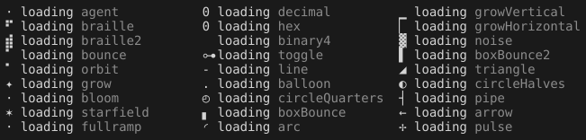

# Spinners — the set, the widths, and the timing

For `spinnerFrames(caps, name)`. Every sequence below is width-checked; the unsafe ones are
recorded with their reason so nobody re-proposes them.

---

## The rule that governs the set

**Every frame is one cell, by `cells()` and by the terminal.** A frame that is two cells wide
where its neighbours are one **reflows the row every tick** — and neither `cells()` nor a
frame-read on the machine that picked it will show that, because the disagreement depends on
locale and font.

**Two ways a character fails:**

```
EA=Ambiguous        two cells in a CJK locale
emoji presentation  two cells wherever the font prefers the emoji form
```

**Assert it at construction**, not in a comment: every frame of every registered set is one
cell and has no emoji form. That is the row that stops the next addition being `▓ ▒ ░`.

**And the interval belongs to the set, not the caller.** Frames × ms should land near
**800–1600 ms per cycle** for a spinner; a caller picking a 28-frame set and getting the
10-frame default makes it frantic. The one deliberate exception is `fullramp` — see below.

---

## The keepers — the dingbat family

These vary by **weight and spoke count**, not by angle, so they **pulse rather than rotate**.
A rotation built from them reads as a flicker.

| name | frames | ms | cycle | sequence |
|---|---|---|---|---|
| `fullramp` | 54 | **130** | 7.0 s | see below |
| `grow` | 12 | 90 | 1.1 s | `✦ ✢ ✲ ✶ ✷ ✹ ✺ ✹ ✷ ✶ ✲ ✢` |
| `bloom` | 14 | 95 | 1.3 s | `⋅ ✧ ✦ ✢ ✻ ✾ ❀ ✿ ❀ ✾ ✻ ✢ ✦ ✧` |
| `wink` | 10 | 120 | 1.2 s | `✧ ✦ ✧ ✦ ✧ ✢ ✲ ✱ ✲ ✢` |
| `starfield` | 8 | 110 | 0.9 s | `✶ ✷ ✸ ✹ ✺ ✹ ✸ ✷` |
| `spokes` | 10 | 100 | 1.0 s | `✦ ✢ ✲ ✶ ✷ ✸ ✷ ✶ ✲ ✢` |
| `florette` | 6 | 150 | 0.9 s | `✿ ❀ ❁ ❂ ❁ ❀` |

**`grow` counts spokes up** — 4 → 6 → 8 → 12 → 16 and back. The closest thing to rotation this
family offers, because more points reads as faster turning even though nothing turns.

**`bloom` morphs across families** — star into flower and back. The only one that changes *what
the shape is* rather than how much of it there is.

**`wink` is two beats then a swell**, which reads as *alive* rather than *working*.

### `fullramp`, and why it is a different category

The ordered ramp, ping-ponged with a dwell at each end:

```
⋅ · ∘ ◦ ✧ ✦ ✢ ✲ ✳ ✵ ✶ ✷ ✱ ✺ ✹ ✸ ✼ ✻ ✽ ❃ ❁ ✾ ❀ ✿ ❂ ❄ ❆ ❈
```

**Two of its frames are unsafe** — `·` `✽` are ambiguous, `✳ ✴ ❄ ❈` have emoji forms. **The
shipped form drops them:**

```
⋅ ∘ ◦ ✧ ✦ ✢ ✲ ✵ ✶ ✷ ✱ ✺ ✹ ✸ ✼ ✻ ❃ ❁ ✾ ❀ ✿ ❂
```

**The loop is `0 → N → 1`, not `0 → N → 0`.** Repeating an endpoint across the turn stutters
twice per cycle. **The dwell adds one repeat at each extreme deliberately** — that is how you
fake easing in a fixed-frame system, and it is the difference between breathing and
oscillating.

**At 130 ms a 54-frame ping-pong is a 7-second cycle.** Everything else in the library is
0.9–1.6 s and reads as *working*; this reads as *present*. **That is a second category**, not a
slow spinner — closer to an idle pulse than to a job indicator, and it is why it carries its
own tick.

---

## Counters — each frame is a number, not a pose

**A counter says work is being done; a spinner says time is passing.** Different signals, and
a tool call and a thinking pause are not the same thing.

| name | frames | ms | sequence |
|---|---|---|---|
| `binary4` | 16 | 120 | `U+2800 + n` for n in 0…15 |
| `binary8` | 64 | 70 | `U+2800 + 4n` for n in 0…63 |
| `hex` | 16 | 110 | `0 1 2 … e f` |
| `decimal` | 10 | 140 | `0 1 2 … 9` |

**Braille patterns are literally an 8-bit field** — dots 1–8 are bits, so adding 1 to the
codepoint increments the pattern. `binary4` visibly carries; `binary8` reads as a register.

---

## Standard sets

### braille — the de-facto default

| name | frames | ms | sequence |
|---|---|---|---|
| `dots` | 10 | 80 | `⠋ ⠙ ⠹ ⠸ ⠼ ⠴ ⠦ ⠧ ⠇ ⠏` |
| `dots2` | 8 | 80 | `⣾ ⣽ ⣻ ⢿ ⡿ ⣟ ⣯ ⣷` |
| `bounce` | 4 | 130 | `⠁ ⠂ ⠄ ⠂` |
| `orbit` | 8 | 90 | `⠁ ⠈ ⠐ ⠠ ⢀ ⡀ ⠄ ⠂` |

### ascii — the fallback, and it needs no substitution

| name | frames | ms | sequence |
|---|---|---|---|
| `line` | 4 | 130 | `- \ | /` |
| `star2` | 3 | 180 | `+ x *` |
| `balloon` | 5 | 160 | `. o O @ *` |
| `dotgrow` | 3 | **400** | `. .. ...` — slow, or it reads as a stutter rather than as typing |

### geometric — quiet, and genuinely turning

**These differ by angle, which no dingbat does.**

| name | frames | ms | sequence |
|---|---|---|---|
| `arc` | 6 | 100 | `◜ ◠ ◝ ◞ ◡ ◟` |
| `circleQuarters` | 4 | 140 | `◴ ◷ ◶ ◵` |
| `squareCorners` | 4 | 140 | `◰ ◳ ◲ ◱` |
| `boxBounce` | 4 | 140 | `▖ ▘ ▝ ▗` |

### toggle — a heartbeat rather than a spin

**Two frames need ~400 ms or they strobe.**

| name | frames | ms | sequence |
|---|---|---|---|
| `toggle` | 2 | 400 | `⊶ ⊷` |
| `toggle2` | 2 | 400 | `▫ ▪` |
| `hamburger` | 3 | 280 | `☱ ☲ ☴` |

---

## Refused, with the reason — and the reason expired, so they are a tier now

**This section refused eight sets on `EA=Ambiguous`, and roadmap 51 then made ambiguous width a
capability** — `ambiguousWidth: "narrow" | "wide"` on `TerminalCapabilities` (C02 I9), with
`SPINNER_SETS` carrying a `narrowOnly` tier that serves the set where the terminal says narrow
and its ASCII pair where it says wide. So *ambiguous* stopped being a refusal the day the tier
existed, and only `growVertical` had crossed. **Re-measured 2026-09-03, every frame of all eight
through `cells()` on both conventions**: 1 cell narrow, 2 cells wide, none in T2.71's emoji list —
every one is legal on the `narrow` arm and every one now ships as a `narrowOnly` set
(`src/presentation/blocks/glyphs.ts`). The table is kept as the measurement it was:

| set | measured | disposition |
|---|---|---|
| `growVertical` `▁▃▄▅▆▇` | every frame EA=Ambiguous | `narrowOnly`, already shipped with roadmap 51 |
| `growHorizontal` `▏▎▍▌▋▊▉` | every frame EA=Ambiguous | `narrowOnly`, 12-frame ping-pong at 120 ms — 1440 ms, in band |
| `noise` `▓▒░` | all three ambiguous (`░` too — the row said two) | `narrowOnly`, 100 ms a frame |
| `boxBounce2` `▌▀▐▄` | all four ambiguous (the row said three) | `narrowOnly`, 120 ms |
| `triangle` `◢◣◤◥` | all four ambiguous | `narrowOnly`, **120 ms and not the catalogue's 50** — 50 is below the per-frame floor T2.72 asserts for a short set |
| `circleHalves` `◐◓◑◒` | all four ambiguous (the row said two) | `narrowOnly`, **120 ms and not the catalogue's 50**, same reason |
| `pipe` `┤┘┴└├┌┬┐` | all eight ambiguous — box drawing is ambiguous throughout | `narrowOnly`, 100 ms — 800 ms, in band |
| `arrow` `←↑→↓` | all four ambiguous; the diagonals `↖↗↘↙` were emoji bases and left with F833 | `narrowOnly`, 200 ms — 800 ms, in band |

**Three rows undercounted their own ambiguity** — `noise`, `boxBounce2` and `circleHalves` each
named a subset of frames as ambiguous and every frame is — which changed nothing about the
verdict and is recorded because a table that is right about the answer and wrong about the
count is the kind that gets copied. **And `pulse` `✢ ✲ ✱ ✻ ✱ ✲`**, the agent-tui playground's
set (`tools/spinner.js`), measured with them: 1 cell on both conventions, no emoji form, six
frames at 120 ms is 720 ms — in band on every arm, so it ships without the tier.

**And the near-dots**: `·` `•` `‧` `°` are all ambiguous. **`⋅` (dot operator), `∘` (ring
operator) and `◦` (white bullet) are narrow** and give the same quietest-possible frame.

---

## Degradation

**Each set carries its own ASCII fallback**, not one shared `- \ | /` for all of them.

**Degradation preserves meaning, not appearance** — but a bloom falling to a rotation loses
more than it needs to, so pair by *shape of motion*:

```
pulse or bloom   →  . o O @ *        keeps the grow-and-shrink
rotation         →  - \ | /          keeps the turning
counter          →  0 1 2 … 9        already ASCII
toggle           →  + x              two frames, two frames
```

---

## The one honest exception to *animation is decoration*

The roadmap's rule is that animation may draw the eye to a fact stated some other way and may
never be the only statement of it — because at 1-bit a pulsing colour loses its meaning
entirely.

**A spinner that is still running is the exception, and it is safe**: it says *this step has
not settled*, which is information the motion genuinely carries without colour. **Stopping is
the signal, not the frames** — so nothing is lost at 1-bit, where the frames still run and the
result text still names the state.

---

## The gallery — every set, turning



`docs/media/spinner-sets.gif`, generated by `tools/animation-proof.mjs` from `spinnerSetNames()`
(C24 §6) — so a set added to the table above arrives in the picture without anyone editing a
list. Forty frames at the C03 tick; **every set advances one frame per tick here**, because that
is what a session with several sets on screen does (`animationIntervalOf` ticks at the fastest),
so the cadence a set has alone — the `intervalMs` column above — is not what this shows. The
plots demo's `/spinners` draws the same frame live; `unicode: "ascii"` swaps every set for its
own fallback in the same layout.

