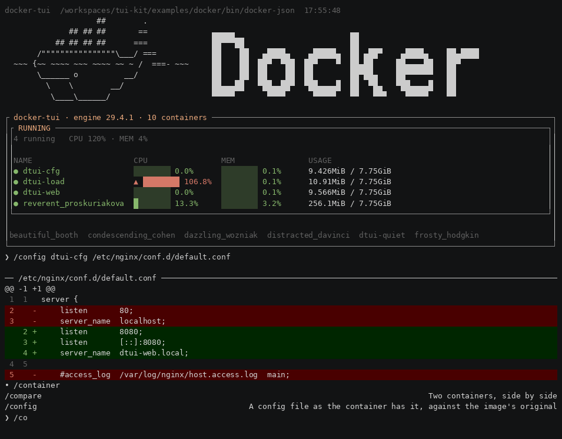

# docker-tui — findings

**Triaged in [`TRIAGE.md`](TRIAGE.md)** — the same forty-four grouped by shape and ranked by
how many surfaces hit them. This file is the log, in the order things were found; that one
is the view a reader deciding what to do next needs. Past thirty entries, *filed* stops
telling anyone which are one change and which are forty.

What the first consumer found, in the shape Calcium recorded its own: **the surface that
needed it**, **what was reached for**, and **whether it is adapter-side work or a real
Calcium finding**.

Nothing here is fixed in Calcium by this app. R01's premise is that a framework change
arrives with a consumer proving it was needed — so the app absorbs what it can, records
what it absorbed, and the framework moves later with this file as the argument.

---

## F1 — Calcium assumes the far side accepts `--json`, and docker does not ★

| | |
|---|---|
| **Surface** | S2 `/ps` — the first invocation of anything |
| **Reached for** | any way to say what the far side's JSON flag is called |
| **Verdict** | **a real Calcium finding**, absorbed app-side for now |
| **Absorbed by** | `bin/docker-json`, and `binary` pointing at it |

`src/data/transport/argv.ts` appends `--json` unconditionally:

```
$ docker ps --json
unknown flag: --json
```

Docker wants `docker ps --format json`.

**It is a premise, not a line.** `withJson` is imported by the subprocess, emulated and
fixture transports; C23 reads `argv.includes("--json")` to decide `userRequestedJson`;
C06 §3 and C07 §4 both document the flag as the contract. *The far side speaks `--json`*
is something the framework is built on rather than something it configures.

R01 §2 chose docker because containers are **not Prism-shaped** — "a Prism concept quietly
absorbed into the framework surfaces here, visibly". This is that row paying off on the
first contact with a real far side, before a line of app code.

**What a fix would look like**, when one is argued: the flag belongs beside `binary` on
`TuiConfig`, because it is a property of the far side the app author is the only party who
can know — the same reasoning C05 uses for `ToolDef.interactive`. Detection is not
available and a list of known CLIs would fail silently for every wrapper.

**How it closes:** `bin/docker-json` is deleted and `binary` goes back to `"docker"`. The
file is the finding; its deletion is the finding closing.

---

## F2 — Calcium was not a publishable package, and CI had a job that proved nothing

| | |
|---|---|
| **Surface** | the proof gate (R01 §8), before it could be written |
| **Reached for** | `npm publish` into a local registry |
| **Verdict** | **a real Calcium finding** — fixed in Calcium, because the app cannot absorb it |

`package.json` carried `"private": true`, and `npm publish` refuses a private package
outright. R01 commitment 9 rests the whole monorepo arrangement on a pack-and-install gate,
and that gate could never have run.

**The sharper half:** `ci.yml` already had a `publish` job. It is tag-gated, so it had never
executed, and it could not have succeeded if it had. A release path that has never run reads
exactly like one that works — A03 §2's vacuity class arriving in CI rather than in a rule.

Fixed by `chore/package-identity` (PR #13) rather than absorbed, because there is no app-side
version of "the package can be published".

**And one that would have bitten the gate:** `publishConfig.registry` beats a `--registry`
flag. A dry run pointed at `localhost:4873` published to `npm.pkg.github.com` regardless. The
Verdaccio step must override `publishConfig`, not merely pass a registry.

---

## F3 — R01's own premise about docker has expired

| | |
|---|---|
| **Surface** | S2 `/ps` — the adapter's coercion boundary |
| **Reached for** | R01 §4's table of what docker emits |
| **Verdict** | **adapter-side work**, plus a small R01 correction |

R01 §4 says *"Everything is a string, including numbers"*. Docker 29.4.1 does not agree:

```json
"Platform": {"architecture": "arm64", "os": "linux"}
```

A nested object, in the middle of an otherwise flat record.

**And docker pre-truncates its own fields**, with U+2026:

```json
"Mounts": "/host_mnt/User…"
```

That one is the hazard rather than the curiosity. `cells()` measures `…` as one cell, so a
field docker has already shortened, rendered into a column narrower than it, is truncated
**twice** and shows two ellipses. It is the class where *a value belongs to the far side and
the code assumes it owns it* — invisible until a real far side that pre-truncates arrives,
which is the first thing this app did.

R01 §4's row wants rewording: docker's values are strings *except where they are not*, and
the far side changed under the spec, which is the argument R01 makes about docker made
against R01.

---

## F4 — a surface drawn before anyone ran the far side encodes the mock's assumptions ★

| | |
|---|---|
| **Surface** | S2 `/ps`, the `PORTS` and `IMAGE` columns |
| **Reached for** | the drawn frame, as the source for a truncation ruling |
| **Verdict** | **a finding about the design documents**, not about Calcium or the adapter |

S2 draws `PORTS` as `80→8080, 443→8443` and `IMAGE` as `nginx:1.25` in an 18-wide column.
Docker emits `0.0.0.0:8080->80/tcp, [::]:8080->80/tcp` — forty characters for one published
port, with an IPv6 twin per IPv4 entry — and image names up to **85 characters**
(`vsc-tui-kit-07d4a92ac4a68f…-features`). `Status` reaches 22 (`Exited (0) 5 weeks ago`)
against a drawing that assumed thirteen.

**It cost a wrong ruling, which is how it was found.** S2 and R01 R3.4 disagreed about
which end `PORTS` truncates from. The disagreement was real and worth ruling on, and the
ruling — *keep the field's identifying end; for a mapping that is the tail* — was reasoned
from `80→8080`, where the host port **is** the tail. In the string docker actually sends
the host port is on the **left**, so the ruling inverted the answer, and R01 R3.4's own
wording ("truncated from the left, keeping the host port") is not satisfiable at all.

The generalisation survived; only which end identifies flipped. But nothing in either
document could have caught it, because both were describing the same imagined string.

**Two things follow.**

1. **A classification table is written against captured far-side output, never against the
   drawings in the spec it is testing.** The row *`Ports` long meets `truncate`* cannot be
   decided from a document that shows a string the far side never sends. This is the rule
   the walk needed and did not have.
2. **The remaining speculative surfaces are suspect in the same way** — S3's plot, S6's
   comparison, S7's drift were all drawn before anything ran. Each should be checked
   against real output before its ruling, not after. Knowing the pattern now is the
   cheapest it will ever be.

This is one level worse than Calcium's own *a figure encoding unstated intent*: there, the
figure was drawn from something real and the intent went unwritten. Here the figure was
drawn from nothing, so it encoded intent that was **wrong**, and it read exactly as
authoritative.

**And a second argument for verbatim, beyond the fail-on-revert.** Condensing
`0.0.0.0:8080->80/tcp` to `8080→80` discards the bind address, and `0.0.0.0` versus
`127.0.0.1` is the difference between a port exposed to the network and one that is not.
A parser decides in advance which information nobody will need, and it decided wrong here
while looking tidier.

---

## F5 — "never drops" is a sentence Calcium has no way to express

| | |
|---|---|
| **Surface** | S2 `/ps` — "`NAME` and `STATUS` never drop" |
| **Reached for** | a `ColumnDef` field meaning *required* |
| **Verdict** | **open** — arguably a real Calcium finding, absorbed as arithmetic for now |

S2 and R01 §5 both state that some columns never drop. `planColumns` has no such concept:
it admits by priority until the next column will not fit and then stops
(`src/presentation/table/plan.ts:126`). Only the single highest-priority column is forced,
and that is the degenerate `overflowed` path for a terminal narrower than one column.

So "never drops" is not a guarantee the engine offers — it is an **outcome** of priority
and arithmetic, true at the widths where the sums work and false below them. With the step-1
columns it holds to roughly 66 columns and fails beneath.

**Absorbed rather than fixed**: the app picks priorities and `minWidth`s that make the
claim true across the range that matters, and the walk states it as arithmetic instead of
as a guarantee.

**Why it may be a real finding.** A `required: true` on `ColumnDef` would be a different
kind of promise — one the planner could refuse to break, dropping a *lower*-priority column
or accepting `overflowed` rather than losing an identifying column. Whether that is worth a
field is genuinely open: priority may be the right primitive and "never drops" may simply be
imprecise prose in two app-level specs. What is not open is that **two documents claim a
behaviour the layer beneath cannot express**, which is the shape that reads as satisfied
and is not.

Deferred to a surface that can settle it. S4's dense live table has more columns and less
room, and will meet the boundary properly.

---

## F6 — R01 names a glyph the vocabulary does not have

| | |
|---|---|
| **Surface** | S2 `/ps` — the `paused` state |
| **Reached for** | `▪`, as R01 §5 specifies |
| **Verdict** | **adapter-side**, plus an R01 correction |

R01 §5: *"State glyphs follow the framework's vocabulary: `running` → `●` ok, `restarting`
→ `▲` warn, `paused` → `▪` warn, `exited` → `✗` error, `created` → `○` muted."*

Four of the five exist. `▪` is not in C09's `GLYPH_TABLE`, and the sentence claims to be
following the vocabulary while naming a character outside it — which is the tell: the
vocabulary is **slots**, not characters (C04 I6, and CLAUDE.md's *a block names a palette
slot*). Writing the character down at all is how the mismatch got in.

**Ruled:** `paused` → `pending` (`◌`), tone `warn`. Suspended, not progressing, and visibly
distinct from `restarting`'s `▲`. The unknown-state arm takes `bullet` (`•`) rather than
`queued` (`○`), so an unrecognised state does not render identically to `created` — a real
state wearing an unknown one's mark is worse than an unknown one looking unfamiliar.

Small, and the same class as F4 one size down: a spec written in the far side's terms, or in
a drawing's terms, rather than in the terms of the layer that has to satisfy it.

---

## F7 — `createTui` could not be called from the public surface at all ★★

| | |
|---|---|
| **Surface** | S2 `/ps` — starting the application |
| **Reached for** | `createTui({ manifest })`, either arm |
| **Verdict** | **a real Calcium finding, and a blocking one.** Fixed in Calcium, with this app as the consumer proving it |

`TuiConfig.manifest` is typed `Manifest | string`. **Neither arm worked.**

**The object arm** throws at construction: *"the manifest is missing Calcium's own verbs
(help, clear, theme, history, debug, exit) — pass the raw document, or the result of
parseManifest, rather than a hand-built Manifest"*. `parseManifest` is the only thing that
appends them — `construct.ts:261` says so in a comment — and it was exported from **none**
of the three entry points. So the advice in the error names a function the reader cannot
reach.

**The string arm** is a file path. `FileSystem.readFile` returns a `string`;
`parseManifest(raw: unknown)` rejects anything that is not a record; `construct.ts:257`
passed one directly to the other with **no `JSON.parse` between them**. Every call took
`"a manifest must be an object"`. That arm had never run.

**Why nothing caught it, which is the finding under the finding.** Calcium's own harnesses
build a session like this:

```ts
// test/support/session.ts:16
import { parseManifest } from "../../src/data/manifest/index.js";
// test/support/fixture.mjs:534
const { parseManifest } = await import("../../dist/data/manifest/index.js");
```

Both **reach through the package boundary** and hand `createTui` an already-parsed object.
Every test of construction therefore exercises a path no consumer has. This is the
producer testing itself, and it is precisely the thing R01 exists to detect — the
`exports` seal is what makes the deep import visible, and the seal only bites on a
consumer, because a package cannot reach through its own boundary and notice.

C24 §1 states the test the component serves: *"Phase 1 is done when someone who is not its
author builds a working TUI from the README without asking a question."* It has never been
satisfiable. The README carries no runnable `createTui` example, so nothing was there to
fail either.

**Fixed rather than absorbed**, because there is no app-side version of "the entry point
works". The alternative was fabricating six framework `ToolDef`s in app code — inventing
summaries and flags the app cannot know, against a reconciliation (C23 I27) that compares
them with the real handlers — which would have hidden the finding behind something that
looked like ordinary app code, and made the reference app a liar about what Calcium can do.

**The ruling, and it is about the axis rather than the arm.** The object arm's real defect
is that it *requires the output of a function the author cannot reach*. Two remedies were
available — export `parseManifest` and tell the author to call it, or have construction
append the framework's verbs itself — and the second is right for the same reason C05
appends them during parse: **the framework's own verbs are the framework's to add, not the
author's to know.** Exporting `parseManifest` would leave `TuiConfig.manifest: Manifest`
still misleading, because a bare `Manifest` would remain the one thing that does not work.
So the object arm now accepts what an author can actually write — their own tools — and
the string arm gains the missing `JSON.parse`, with a malformed document reported as a
manifest error rather than thrown.

**And the seal test is what would have caught it.** R2.3 was written first, before any app
code, on the argument that a source scan tests the app's habits while only a real
resolution tests the boundary. F7 is the payment: the surface the harnesses reached around
turns out not to work, and it could only be discovered by something that respected the
boundary. A package cannot reach through its own edge and notice.

---

## F8 — omitting `env` does not degrade the shell, it stops it opening

| | |
|---|---|
| **Surface** | S2 `/ps` — starting the application, immediately after F7 |
| **Reached for** | nothing. `env` is optional and was left out |
| **Verdict** | **adapter-side** (the app passes `process.env`), plus a false sentence in C22 |

`TuiConfig.env` is optional, and its own documentation says:

> Omitted, it defaults to `{}`, and the shell degrades to ASCII with no colour: the safe
> direction, and the alternative is a fifth required field.

**It does not degrade.** `detectCapabilities(config.env)` reads `TERM` from that record;
with `{}` there is no `TERM`, so `usable` is false, so `altScreen` is false — and
`acquire()` treats a missing alternate screen as **fatal**: *"alternate screen unsupported
— the shell cannot open"*. The safe direction turns out to be no direction at all.

The app supplies `env: process.env`, which is what C22 I20 intends — no file under `src/`
reads the environment, deliberately. So this is app-side work and the finding is the
sentence: it describes a graceful degradation that does not exist, and it reads as
reassurance while being the opposite. A03 §2's class arriving in prose, one document over
from where C19's `--flag=value` sentence did.

**The same shape as F7, and found one minute after it.** An optional field whose default
makes the framework unusable, invisible because every harness passes a real environment.
Two in a row is not a coincidence: **the defaults have never been exercised together**, and
the thing that exercises them is a consumer that supplies only what it was told to.

**Re-checked in the tier-4 pre-check and it stands, with one fact the entry did not have.**
`env?` is still optional, the sentence is still in `src/shell/types.ts`, and `acquire()` still
treats `!capabilities.altScreen` as fatal. Measured rather than read:

```
env {} → altScreen: false   colourDepth: 1   unicode: ascii
warnings: []
```

**The sentence is true about two of the three consequences and silent about the one that
matters** — colour and unicode *do* degrade, and `altScreen: false` ends the process. And
`warnings` is **empty**, so C02's one channel to the author says nothing either. That half is
new: the entry describes a false sentence, and the measurement shows the failure is also
unreported, which is F15's class in a fourth place.

**Closed** — C22 gate 3b (C22 I61, commitment 32), the sentence corrected in three places,
`T3.20`–`T3.20e`, four mutations.

**The where-is-this-written check found the sentence three times and the third made a claim of
its own.** `C22 §117` answered its own silence with *"C02's warnings surface on the restored
primary screen and an empty record is one of them"* — a mechanism that has **never existed**.
C02 produces a warning for a rejected override (C02 I4, T3.5) and for nothing else, which is
why `warnings` is empty and always was. That is the sixth blind spot pointed at the document
that carried the remedy rather than at the one that carried the defect.

**And the remedy was wrong twice, which is what decided the fix.** It routed the notice to §8
step 3 — reached from `stop()`, which this path never calls, because `start()` rejects and the
session never runs. Measured under a PTY. A warning there would have been **the same silence
with more machinery**, so the ruling is a refusal at the point of exit rather than a warning.

**What the refusal has that C01's did not: the cause.** C01 is entitled to the capability
record alone, so *"alternate screen unsupported"* names the consequence and cannot name the
reason — an author who omitted `env` was told about a capability they never mentioned. C22
holds the record and the config and is the only layer that holds both. Measured, all four
arms:

```
env: {}                          → `TuiConfig.env` is empty … pass the process environment as `env`
env: { HOME }                    → `TERM` is not set in the `env` the app supplied
env: { TERM: "dumb" }            → `TERM` is `dumb`, which declares no alternate screen
env: {}, capabilities.altScreen  → the shell opens
```

**The fourth line is the gate's position, not a courtesy.** C02 I4 makes a valid override win
unconditionally including for `altScreen`, and it resolves during construction — so a gate
reading `config.env` ahead of step 3, which is where I36 would want it, refuses exactly the app
that had said what to do. `T3.20b` is that row and it fails against every simpler tree.

**Then the implementation falsified the ruling.** The gate was specified *after* the size gate,
on the reasoning that both read the same terminal. Reading the diff showed a terminal both too
small and unusable would defer — wait for a resize that cannot cure an absent `TERM`, then
reach C01's fatal from inside `onResize`, which `resizeSubscribers` dispatches **unguarded**,
so the throw leaves the SIGWINCH handler with `start()` long since resolved. The author's
`catch` cannot see it and the gate never runs: **F8's silence, restored by the fix for F8.**
It is gate 3b, ahead of gate 4 — the incurable condition answered before the curable one.

**`isUsable` came off MG25's allow-list by being consumed.** A03 §9 had it as *a rule expressed
twice, the second expression unreachable*; gate 3b is the caller. The list is compared by
equality, so `make enforce` refused the commit until the entry went — the disposal MG25's own
note asked for rather than a second exemption.

**Not closed, and separated from the claim** (F140): the refusal leaves a constructed graph, so
an author who **catches** the rejection and continues has a process that never exits. Measured
on both trees — it is identical before this change, where C01's fatal throws from the same
position — so the gate inherits it rather than introducing it. The realistic path is clean:
uncaught, node prints the named message and exits 1.

---

## F9 — startup step 7 named the effect and had no mechanism ★★ · **closed**

| | |
|---|---|
| **Surface** | S1, the landing dashboard — *the live block on launch* |
| **Reached for** | a way to put a `ViewDocument` into the transcript at startup |
| **Verdict** | **a real Calcium finding**, F7's shape exactly |

`docs/surfaces/S02_the_welcome.md` specifies a first entry and is unambiguous about what it
is:

> **It is an ordinary `ViewDocument`, not a screen.** It is appended to the transcript like
> any command's output, which means `/clear` removes it, it scrolls away as the session
> fills, and its action buttons work through C23's normal `fill` path. There is no banner
> renderer.

Its `Source` row cites **C22 §4 step 7**. C22 §4 step 7 is the terminal lifecycle. Nothing
in C22's twelve construction steps or eight startup steps appends anything, `TuiConfig` has
no landing or greeting field, and `TuiInstance` is `start` / `stop` / `session` — three
members, none of which can carry a document. **The surface is specified, agreed, and
structurally impossible**, which is F7's sentence with a different subject.

**C22 already wrote down the day this would arrive.** §8a, on why `I7` (history flushes on
every path) and `I5` (cleanup lives only in `beforeRelease`) do not conflict:

> nothing can be appended to history before input is accepted, which is startup step 8 …
> **If anything ever appends earlier — a startup notice, a restored session — that is the
> day I7 and I5 genuinely conflict**, and this paragraph is what makes it visible then
> rather than a silent empty file.

It was written as a hypothetical because nothing could produce one. S1 produces one.

**And there is a precedent in the same document.** C22 line 96 records the local-handler
gap: C23 §2 said an app registers its own handlers, C23 I27 failed construction when a
`local` verb had none, and *nothing carried the app's handlers into the pipeline* — so the
framework refused a configuration it gave no way to complete. Same shape, same file, found
the same way: by a consumer trying to use what the spec promised.

**And the entry above was wrong about the shape of the gap, which is worth keeping.** It
said no seam was specified. One was: **§4 step 7, *"fire banner fetches, non-blocking"***,
present since the document was written — with prose about its timing, and with T3.10 and
T3.11 testing it. Nothing in `src/` fired anything, `TuiConfig` had no field, and neither
T-row had ever been written, because there was nothing to write them against.

So the gap is not *unspecified* but **a step with a name and no mechanism** — and C22 §3a
already records that happening once, to step 12: *"accept input" was a step with a name and
no mechanism, and a session built from this document decoded nothing while every component
it needed was finished and tested.* Twice in one twelve-item list is a property of how the
list was written rather than two accidents: a step is a name until something calls it, and
nothing distinguishes the two by reading.

Finding it required looking for the *mechanism* rather than for the *field*. The first pass
grepped `TuiConfig` and the construction steps, found nothing, and concluded correctly from
incomplete evidence.

**Closed by C22 I44.** `config.greeting: () => ViewDocument | Promise<ViewDocument>`, fired
at step 7 and not awaited; C23 appends it, which is A02 Seam 4 and what makes a `b.live`
part inside it driven (C23 I33a). T3.10 and T3.11 are rewritten and written. The app's
launch frame is the dashboard, with nothing typed:

```
┌ docker-tui · engine 29.4.1 · 8 containers ───────────────────────────────┐
│┌ RUNNING ────────────────────────────────────────────────────────────────┐│
││3 running   CPU 1% · MEM 3%                                              ││
││● g2                      ░░░░░░░░ 0.9%  …    →  1.1% one capture later  ││
```

**The ordering was still right.** The seam was designed after the dashboard worked, and it
is why the seam has no freeze mechanism in it: building it first would have meant building
S1's drawn *freeze on first command*, which C23 I9 forbids. See F17a.

---

## F10 — `docker stats --format json` is a screen redraw, not a stream of JSON

| | |
|---|---|
| **Surface** | S1's running panel, and S4's dense live table |
| **Reached for** | `docker stats --format json` as the `b.live` `stream` source |
| **Verdict** | **adapter-side**, and an S1/S4 correction |

The dashboard's whole premise is that stats streams. It does not stream *data*. With
`--format json` and no `--no-stream` it emits **ANSI cursor control interleaved with the
JSON**, redrawing a fixed region of the terminal:

```
^[[H{"BlockIO":"44.3MB / 234MB","CPUPerc":"0.31%",…,"PIDs":"6"}^[[K
^[[K
^[[J^[[H{"BlockIO":"44.3MB / 234MB","CPUPerc":"0.31%",…,"PIDs":"6"}^[[K
```

`ESC[H` home, `ESC[K` erase-line, `ESC[J` erase-display — and **each interval written
twice**. Ninety-eight lines in seven seconds, of which zero parse as JSON.

Consuming it means writing a terminal emulator inside an adapter. This app already has one
(`tools/screen.py`) and building it was the right call — for **reading frames the
application drew**. Putting one on the far-side boundary is the same code in the wrong
place: the adapter would be interpreting a presentation of data rather than data.

**Ruled: the dashboard polls `docker stats --no-stream --format json` on each tick,
through `b.live`'s `fetch` arm.** `--no-stream` is clean NDJSON — no escapes, one object
per container — and `fetch` is the arm the entry host is tested against.

**Two consequences worth naming.** `b.live`'s `stream` arm goes unexercised by this app, so
it stays in the same position `RefreshHost`'s `view` arm was in before step 3 — specified,
implemented, and unreached by any consumer. And "stats streams" was an assumption nobody
had run, which is F4's class again: this one just happened to be checked before it cost a
ruling rather than after.

Four smaller facts from the same probe, each of which changes a design:

| probe | result | consequence |
|---|---|---|
| `--no-stream` default scope | everything `docker ps` shows — **running *and paused*** | the stopped pills come from `ps -a`; **the panel joins two sources** |
| a stopped container named explicitly | a zero row, not an omission | absent and zero are different, and only one of them is a fact |
| an unknown container | `exit=1`, message on stderr | `/ps`'s error path transfers unchanged (R3.6) |
| a timestamp field | **none** | history is stamped app-side, and `AdapterContext` carries no clock (gap 1) |
| row order across five ticks | stable, matching `ps` | stable **in observation**, guaranteed nowhere — see below |

**The scope row is a correction to this entry, made the day after it was written**, and the
way it happened is worth more than the fact. The first probe ran against a machine with one
container running and none paused, and "running only" is a perfectly good reading of that
output — it is also what the docker docs imply. It is wrong: `stats` shows what `docker ps`
shows, which includes **paused**. The moment there was a paused container the panel headed
`RUNNING (n)` had a paused one in it.

A rule inferred from a single observation had been tested against nothing, and it went into
a findings entry as a fact with a table row of its own. That is the same shape as *two
instances fitting a rule is not evidence for the rule* one instance further down, and the
cost of finding it here was a second probe.

**Row order is the other thing the multi-container probe made askable.** Five consecutive
ticks returned the same order, matching `docker ps`. That is an observation and not a
contract: `stats` fans out per container, nothing documents an ordering, and a **live**
block re-rendering in daemon order would let rows swap places under the reader between
ticks — a defect that cannot exist in a static table and so has never been met. The panel
sorts explicitly. A stable order that nothing promises is the most expensive kind to rely
on, because it is right in every test.

---

## F11 — three more surfaces drawn before the far side was run

| | |
|---|---|
| **Surface** | S1's header, S3/S4's history, S6 `/compare`, S7 `/drift` |
| **Reached for** | nothing yet — checked ahead of their rulings, which is the point |
| **Verdict** | **findings about the design documents**, F4's class, four instances |

F4 ended with *"the remaining speculative surfaces are suspect in the same way … each
should be checked against real output before its ruling, not after"*. This is that check,
run two steps early. Three of the four drawings are wrong.

**S7 `/drift` — the two objects do not line up.** The drawing diffs `docker inspect <c>`
against `docker image inspect ` field by field. Their `Config` objects share only part
of a shape: the image's has `ExposedPorts` and `StopSignal`; the container's has
`Hostname`, `Domainname`, `Attach*`, `Image`, `StopTimeout`, and `ExposedPorts: null`. A
key-union diff invents a `changed` row for every key present on one side only — which is
most of them, and each one would read as drift.

Worse, the drawing's own headline row cannot be produced structurally at all. `ports: 80`
versus `80→8080` reads `Config.ExposedPorts` on the image and `HostConfig.PortBindings` /
`NetworkSettings.Ports` on the container — **two different paths**. So `/drift` is a
hand-written list of semantic field pairs, not a diff of two objects, and the drawing
implies the opposite.

**S6 `/compare` — two of the rows have no source.** The objects are the same shape here, so
a structural diff does work. But the drawn rows include `cpu %` and `mem`, which are not in
`inspect` at all; they are `stats`. The surface needs two sources joined and says nothing
about it — the same join S1 now has to make, arrived at from the other direction.

**S3's plot and S4's sparkline — there is no history to plot.** Docker emits an instant and
no timestamp. Gap 1 predicted the ring buffer; the new part is that `AdapterContext` has no
clock either, so history is keyed by tick rather than by time, and "60 seconds" on S3's
axis is `ticks × interval` rather than anything measured.

**S1's own header — `CPU 34%` is not a quantity docker can supply.** Summing `MemPerc` is
meaningful: each is a fraction of total host memory. Summing `CPUPerc` is not — it is
per-core-normalised and exceeds 100% routinely on a multi-core host, so the sum has no
ceiling and reads as a percentage of something. The drawing shows a system utilisation
figure that its source cannot express.

**What this run of the check is worth.** F4 cost a wrong ruling that had to be reversed
across three documents. These four cost one afternoon of probes and no rulings at all,
because none had been written yet. That difference is the entire argument for the practice.

---

## F12 — `npm publish --registry` is accepted and ignored

| | |
|---|---|
| **Surface** | the proof gate itself, owed since step 1 |
| **Reached for** | `npm publish --registry=<local>`, to publish somewhere other than the configured host |
| **Verdict** | **a fact about npm**, and the reason the gate asserts a line of output rather than trusting a flag |

`package.json` carries `publishConfig.registry: "https://npm.pkg.github.com/"`. It beats
the flag, silently:

```
$ npm publish --dry-run --registry=http://localhost:4873
npm notice Publishing to https://npm.pkg.github.com/ with tag latest and default access
```

No warning, no error, exit 0. `npm_config_registry` in the environment behaves the same
way. The flag that does win is the **scoped** one:

```
$ npm publish --dry-run --@fmx:registry=http://localhost:4873
npm notice Publishing to http://localhost:4873 with tag latest and default access
```

**Why this is worth an entry rather than a code comment.** The obvious way to wire a local
registry into a proof gate is `--registry`, and it would have aimed every publish at the
real host. In CI that is an authentication failure that reads as a problem with the local
registry — the operator debugs the thing that was working. It is the vacuity class in a
command-line flag: accepted, plausible, and doing nothing.

The gate therefore **asserts npm's own `Publishing to …` line** rather than passing a flag
and assuming. Mutating that assertion back to `--registry` turns the gate red with the
message naming where it would really have gone, which is the only reason the assertion is
worth having.

---

## F13 — a local handler must hand-write nine `meta` fields, seven of them fiction

| | |
|---|---|
| **Surface** | S1's `/dashboard`, the first local handler this app writes |
| **Reached for** | a way to build a `ViewDocument` |
| **Verdict** | **a real Calcium finding**, small but structural |

`LocalHandler` returns a `ViewDocument`, whose `meta` is required and has nine members:
`verb`, `adapter`, `exitCode`, `durationMs`, `truncated`, `argv`, `stderr`, `transport`,
`origin`. On the adapter route the registry overwrites six of them (C07 I13) precisely
because *a provenance an app author supplies once per verb is a provenance that is wrong
somewhere*. On the local route **nothing overwrites anything but `command`**.

So an app author writing a local handler declares an `exitCode` for a process that never
ran, a `durationMs` of a subprocess that does not exist, an empty `stderr`, and an `argv`
they have to invent. `compose()` exists inside `shell/documents.ts` and fills exactly these
defaults — and it is not exported.

The same argument C07 I13 makes applies here unchanged: the framework knows the route is
local, knows nothing ran, and knows the origin. The author knows none of it better.

---

## F14 — a local handler cannot find out how wide the terminal is

| | |
|---|---|
| **Surface** | S1's panel title and column plan |
| **Reached for** | the width, to decide what the header can hold |
| **Verdict** | **a real Calcium finding**, and the app's workaround is the thing CLAUDE.md forbids |

`AdapterContext` carries `width`, with the comment *"some adapters choose column sets by
width"*. `LocalContext` is `Readonly<{ command: string }>`.

So the one route an app writes entirely itself is the one that cannot know the width, and
the app ends up calling `process.stdout.columns` — which is C01's job, done a second time,
in the one place C01 I13 exists to prevent. It is also **wrong across a resize**, because it
is read once per command rather than handed down, and nothing tells a local handler the
terminal changed.

Two records of one number, and the app's copy is the stale one. The asymmetry looks like an
oversight rather than a decision: nothing in C23 §2 argues that a local verb needs less
context than an adapted one.

---

## F15 — a rejected document produces no entry, no error, and no clue ★★ — **CLOSED**

| | |
|---|---|
| **Surface** | S1's `/dashboard`, on its first run |
| **Reached for** | nothing. The document was invalid and the shell said nothing at all |
| **Verdict** | **a real Calcium finding** — the diagnostic exists and is discarded |

`/dashboard` rendered an empty transcript. The prompt cleared, so the line was submitted;
no entry appeared, no error, nothing on stderr. `/ps` and `/help` worked, so routing worked.

The document had two blocks with the id `running` — the live panel and the table inside it —
which C04 I14 forbids because `ViewPatch` addresses blocks by id. That is my bug, and C13
raises it with a sentence that says exactly what is wrong:

```
blocks: id "running" appears 2 times (C04 I14) — ViewPatch addresses blocks
by id, so a duplicate has no correct target
```

**`appendAndCommit` catches it and throws it away.**

```ts
} catch {
  deps.scheduler.commit("input");
  return null;
}
```

A bare `catch` with no binding, then a frame committed as though nothing happened. C23 I1 —
*every submission produces exactly one outcome* — names this as its second exception, so the
behaviour is deliberate and the invariant is honest about it. What is not deliberate is that
**the reason is destroyed**. There is a `TranscriptError` in hand, carrying the precise
violation, and it is discarded rather than appended as the error entry every other
containment path in C23 produces.

The cost is not theoretical: this took a long time to find, and the route was suspicion of
the PTY harness, then of `screen.py`, then of the paste window, then of local routing —
four wrong turns against a framework that had the answer in one sentence the whole time.

**And it is the exact class C23's own history records.** `documents.ts` carries a comment
about every containment path building a `warn` notice with no glyph, throwing inside
`appendAndCommit`, and producing no entry — *"C23 I1 says every submission produces exactly
one outcome, and the paths that exist to guarantee it produced none"*. That was found and
fixed at the call sites. The swallow that made it invisible is still here, waiting for the
next invalid document, which for a framework means waiting for its first app author.

The fix is small and does not touch I1's exception: append a notice naming the validation
error, or at minimum let it reach the fault handler. A silent no-op is the one outcome that
teaches the author nothing.

---

### CLOSED — tier 3 row 3. Two channels, and the fix was already specified

**The remedy was written down three times and built nowhere.** C23 §5's table, I1's second
exception and §8a A5 all said the failure was *"logged as a defect"*; `grep` finds no sink in
any component, and C13 and C14 each delegate diagnostics to C23 §5 by name. One unmeasured
claim, restated until it read as a mechanism. **This is the *ask where a settled claim is
written down* instrument pointed at a spec rather than at a plan**, and it is the fourth time
it has changed what a row was going to build.

**The moment was already chosen, twice.** C02 rules that a component decides what is wrong and
never when the user is told, because C22 §8 restores the screen before printing; C20 §Warnings
says that transfers whole. C23 is the third instance and takes the same shape — a readable
collection, drained at C22 §8 step 3.

So there are two channels and they fail independently, which §8e is what forced:

| | |
|---|---|
| **an entry, at the moment** | the fault notice, `origin: "defect"`, carrying C13's own sentence |
| **an accumulation, at exit** | `Pipeline.faults`, on the restored primary screen |

**The reporting path is the path that failed**, so a single channel could not work: in the row
where `transcript.append` throws, appending is precisely what cannot be relied on.

### Measured, at the public entry

`/dashboard`'s document — two blocks with the id `running` — submitted through `createTui`,
the frame read rather than the collection:

```
prism  prism  22:13:20
✗ appendAndCommit: TranscriptError: transcript.append: invalid document (C13 I10) — blocks: id
  "running" appears 2 times (C04 I14) — ViewPatch addresses blocks by id, so a duplicate has no
  correct target
❯
```

Before, at the same size, the whole transcript was empty. The same sentence appears again
after `⌃d`, on the restored primary screen, asserted to fall *after* the alternate-screen
release rather than merely after `stop()` began — which the first version of the row did not
distinguish, and the mutation pass said so.

### What the finding got wrong, and what the count turned up

- **"The fix is small"** — the *remedy* is, and the subject was not. Checking how many callers
  reach the swallow turned up a **third** subject: `HistoryStore.warnings` is read by nothing
  in `src/`, so a corrupt history file, a read-only home and a full disk have each been
  detected, described and discarded for the life of the component. **T2.9 passed throughout**,
  because what it asserts is that neither stream is written to — the silence it was written to
  make safe is indistinguishable from the silence of a warning nobody collects. C22 §8 step 3
  drained one of three collections and now drains three.
- **"Waiting for the next invalid document, which for a framework means waiting for its first
  app author"** — it was not waiting. **F138** was already in the tree: every notice composed
  with `status: "error"` was invalid under C04 I3, so a handoff exiting non-zero produced no
  entry. F15's own mechanism was hiding a second instance of F15's own class, and the thing
  that found it was the fabricated row for this fix's ladder.

### Also settled here

**§8e, the walk** — a classification table over the five statements under one catch, indexed
by which threw. §5's row is written as though only the first can. Four of five abandoned
`resetFocus` between the append and the commit, which T4.7b asserts the position of because
one frame with focus in a frozen block is the failure it prevents; abandoning it is that
failure with no bound. The return value was `null` in four rows where the entry exists, and it
is corrected without a row, because nothing can observe it without adding the consumer the row
would be testing for.

**Eleven mutations, all caught, with a control the harness verified live** — and two of the ten
survived first time, both findings about the tests rather than the code: *"the reset was
attempted"* was satisfied by the try's reset alone, and *"the reason appears after `stop()`"*
was satisfied by both orderings of release and drain.

---

## F16 — a live part's title cannot carry live data

| | |
|---|---|
| **Surface** | S1's panel header — `RUNNING (9) · CPU 34% MEM 61%` |
| **Reached for** | a title recomputed each tick, as S1 draws it |
| **Verdict** | **adapter-side** (the summary moved into the body), plus an S1 correction |

`LiveSpec.title` is a string captured at declaration. The driver's `titleOf(part)` returns
`part.spec.title`, plus its own `· 14s ago` when stale; `render` returns the part's **child**
and nothing else. So the title is fixed for the life of the part.

S1 puts the counts and the totals in the title, which is where they belong visually. They
froze at the first fetch and stayed there while every row beneath them ticked — a header
describing a moment that had passed, which is worse than no header at all.

**Invisible in a frame, and invisible in the tests.** One frame cannot show that a line is
stale; the tests asserted the title was *right*, which it was, once. It was found by
replaying prefixes of a single capture and noticing the one line that never moved.

Adapter-side, because C23 I34 and I35 have a good reason to own the title — it is where
staleness and failure are said, and a title the app rewrote each tick would race with them.
The finding is that **nothing says so**, and `b.live`'s own field is called `title` with no
hint that it is the one part of a live block that is not live.

---

## F17 — an adapter's `b.live` is never driven ★★

| | |
|---|---|
| **Surface** | S1's running panel, and every live part S3 and S4 will want |
| **Reached for** | `b.live` from an adapter, as `b.live` from a local handler already worked |
| **Verdict** | **a real Calcium finding**, fixed — C23 I33a, T1.38, T6.38 |

**Measured before it was written up, and the measurement is the entry.** A probe declaring
the same one-field live part on each route, run against the real shell and replayed through
the terminal emulator, twelve seconds at a one-second interval:

| | 55% | 70% | 85% | 100% |
|---|---|---|---|---|
| adapter route | `tick 0` | `tick 0` | `tick 0` | `tick 0` |
| local route | `tick 4` | `tick 7` | `tick 9` | `tick 13` |

`declareLive` was reached only inside `appendAndCommit`. The app route appends a **pending**
entry and reaches the transcript through `settle(id, doc)`, so the document carrying the
blocks arrived at a call that did not register anything. An adapter's live part rendered its
loading state and stayed there for the life of the session, with nothing anywhere reporting
a fault.

**The comment was the tell.** *"Called from the one place a document reaches the transcript,
so a part declared on any route is driven and no route has to remember to."* There are two
such places. A sentence claiming total coverage of a set it had miscounted — and no test in
the repository could contradict it, because none of them declared a live part from an
adapter. Fixed by making the sentence true rather than softer: **declared on any route is
driven; stopped on settle, pop, eviction, clear or shutdown, never on freeze.**

After the fix, the same probe: `tick 3 · tick 6 · tick 9 · tick 12`.

**It gates step 3, which is why it was fixed before it.** S4's `/stats` is adapter-driven
and would have refreshed never; S3 puts a part in a pushed *view*, and gap 7's answer would
have been contaminated by an entry-route defect leaking into it.

---

## F17a — the half that is not a defect, and the instruction that would have broken it ★★

| | |
|---|---|
| **Surface** | S1's *"typing a command freezes it into the transcript"* |
| **Reached for** | a release trigger on `append`, so a landing dashboard stops polling |
| **Verdict** | **not a defect** — the specs considered this and ruled against it |

The app's measurement was real: a `/dashboard` entry keeps ticking after `/ps` renders
below it, and two dashboards tick independently and out of step — so every dashboard ever
opened polls docker until eviction. From the consumer's side that reads exactly like the
other half of F17.

It is not. Three documents already settle it:

- **C23 I9** — *a frozen entry keeps receiving patches until settled.*
- **C23 I33** — a refresh stops on five triggers, *"and **not on freeze**"*.
- **C24 §5** — its own *teardown on freeze* row was **deleted** against I9: *"freezing is
  not stopping — a `--watch` scrolled out of view is still running, which is the whole of
  what I9 protects."*

So "wire release to append" would have re-introduced a row removed for cause, and broken
the case it was removed for: a long-running `--watch` would die the moment the user typed
anything.

**The finding is that the instruction to build it came from the design authority and was
wrong, and that checking it against the invariant before building is what caught it.**
That is the by-hand walk applied to a kickoff rather than to a component — *when a ruling
names an operation, check the operation exists before the ruling is written down*, with
"exists" reading here as "is not already forbidden". The cost of the check was one grep;
the cost of skipping it would have been a spec commit, a code commit, a fail-on-revert row
and a regression in the behaviour I9 exists to protect.

**What changes instead is S1.** The drawing claimed a mechanism that contradicts a settled
invariant, which is F11's class one step further in: not a drawing wrong about the far
side's output, but a drawing wrong about the framework's own rules. `DOCKER_TUI_SURFACES.md`
now says the landing block ticks until evicted or cleared, and the launch seam declares its
part one-shot if launch cheapness matters more than a live landing screen.

---

## F18 — a live part looks exactly like a static one

| | |
|---|---|
| **Surface** | S1's `▌` gutter, drawn on the running panel |
| **Reached for** | any mark distinguishing the refreshing panel from the static chrome |
| **Verdict** | **a real Calcium finding**, small, and the app must not work around it |

S1 and S13 both draw `▌` down the side of the live region, and C09's glyph table has a
`live` slot for exactly that (`▌` unicode, `|` ascii). The driver's `livePanel` builds
`{ kind: "panel", id, title, children }` — a plain panel. Nothing renders the slot, so in a
frame the live panel is a box with a title, indistinguishable from the static one wrapping
it until something happens to change.

The app cannot fix it. `Panel` has no glyph field, and putting `▌` in the title means writing
a character instead of naming a slot — which is F6's mistake made deliberately, and it would
not degrade to `|` on an ASCII terminal.

So the vocabulary has the slot, two surfaces draw it, and nothing connects them: a slot
reserved and unreachable, which is A03 §2's class in the glyph table.

---

## F19 — `ManifestDocument` accepts the one value construction refuses ★★

| | |
|---|---|
| **Surface** | none of this app's. Found by tier 5, three weeks of commits after F7 |
| **Reached for** | nothing — the type said yes and the runtime said no |
| **Verdict** | **a real Calcium finding**, and the reason F7's fix shipped broken |

F7's fix made `createTui` run both arms of `TuiConfig.manifest` through `parseManifest`,
so the framework appends its own six verbs rather than demanding the author know them.
C05 §3 also *refuses* a document that already declares `help`, `clear`, `theme`,
`history`, `debug` or `exit` — an app must not shadow verbs it does not own. Both correct.

Together they mean **an already-parsed `Manifest` is now exactly what construction
rejects**, and step 1 wrote a test asserting that (C22 T1.4l). What step 1 did not do was
check whether the *type* still permitted it:

```ts
export type ManifestDocument = Omit<Manifest, "appTools">;
```

`Manifest` has every member of `ManifestDocument` and one more, so it is structurally
assignable to it. `const d: ManifestDocument = parsedManifest` compiles clean. The field's
type says a parsed manifest is welcome; the constructor throws on it.

**And that is not hypothetical, because it is what happened.** `test/support/fixture.mjs`
— tier 5's only session harness — passed `parsed.value` to `createTui`, with a comment
explaining that this was required. It compiled. **Forty-four of a hundred and one tier-5
rows failed**, and the branch merged.

Three harnesses were converted with the F7 fix and this was the fourth. It was invisible to
the search that found the others because it is `.mjs` importing from `dist/`, so no grep for
a deep TypeScript import could see it, and `npm test` excludes tier 5 by design.

**The type is the fix.** A nominal marker — a branded `Manifest`, or a `parsed: true`
witness — makes the mistake a compile error at every call site at once, which is the only
scale at which it can be caught: the value is produced in one place and consumed in
another, and nothing in between is wrong. This is the *consumer finds variance a producer
cannot* shape with the arrow reversed — here the producer's own test suite was the
consumer, and the boundary it crossed was `.ts` to `.mjs`.

**A note on how it was reported, because that is half the finding.** Step 1 was declared
green on `make all 2>&1 | tail -15; echo $?`, which reports **`tail`'s** exit status. The
suite had failed. The same construction was used twice more this session before it was
noticed, and the second time the symptom was blamed on machine contention. An exit code
read through a pipe is the pipe's.

---

## F20 — gap 7's premise was false, and its answer is a reserved ruling ★★

| | |
|---|---|
| **Surface** | S3's drill-in, and the whole of what step 3 was pointed at |
| **Reached for** | a route by which an app's `b.live` part is hosted by a pushed view |
| **Verdict** | **a finding about the design documents**, and the ruling it uncovers is C22 §13's |

Gap 7 was filed as *"the driver's `view` host arm, specified and shipped tested against an
entry host only"* and called the most valuable thing this app surfaces. It is, and the
premise was wrong. Answered by reading, before a probe was built:

| gap 7 asks | answer |
|---|---|
| Does `declare` accept a `view` host and tick it? | **Yes, and has since C23 §3b landed.** `test/contract/refresh.test.ts:535` — T4.21, cited to C24 I12 — declares `{ kind: "view", id: "dash" }`, asserts the part patched through C15's seam, then that `release` stops it. T2.20 declares one host of each kind and asserts `dispose` stops both |
| Does `release` on **pop** reach it? | **No call site exists.** A popped view is torn down lazily, one tick late, when `put` returns false against a layer that has gone (`refresh.ts:317`, `:326`) |
| Does a refresh hold the **scroll**? | **The question has no subject.** C15 holds no offset *by design* — `overlay/manager.ts:10-15`: *"it does not know … where a view has scrolled. Each of those was written into the spec as a duty here and moved back to the owner"* — so the offset belongs to the producer, and there is no producer |

**What is missing is not coverage. It is a producer.** `declare` has exactly one call site
in all of `src/` (`execution.ts:938`) and hard-codes `{ kind: "entry", id }`. T4.21's own
comment says so: *"The host arm with no shell-level producer. Nothing in the tree pushes an
app-supplied view yet."*

All three questions therefore trace to one row, which names itself:

> **C22 §13** — **A verb whose result is a pushed view.** *Still undecided, and narrower
> than it was.* … What makes a **verb's result** a view rather than a transcript entry, who
> decides, and what `Esc` does to the entry it came from are all exactly as open as they
> were. … **Recorded this way because a partial producer is the most likely thing to be
> mistaken for a resolution.**

So gap 7 is not a defect to fix. It is a decision the framework deliberately left open,
with a written warning about the precise way it would be misread, waiting for a consumer
concrete enough to force it. That is the difference between this and F7, F17 and F19: those
were wrong. This was **reserved**.

**Five sites asserted the false premise** and are corrected in the same commit:
`DOCKER_TUI_SURFACES.md` §S3's seam section, `:268`, `:281`, `:560`, `FINDINGS.md`'s open
list, and `DOCKER_TUI_START_HERE.md:140`.

**And one test's assertion names a mechanism it does not exercise.** T4.21 closes with
`expect(calls, "and the pop stopped it")` while the test calls `release(host)` directly —
there is no pop, and release-on-pop is the thing that does not exist. The assertion is
correct and its message describes a route that has never run.

---

## F21 — the action model has no route from a keystroke ★★

| | |
|---|---|
| **Surface** | S3's drill-in gesture, and every row action every surface draws |
| **Reached for** | pressing a key on a focused row and having its action fire |
| **Verdict** | **a real Calcium finding**, and the one that was actually under gap 7 |

`src/shell/actions.ts` implements all five `Action` arms — `fill`, `exec`, `open`, `expand`,
`view` — and is wired into the pipeline at `execution.ts:837`. **`pipeline.onAction` is
called only from `test/unit/execution.test.ts`.** Nothing in `src/` invokes it. `paint.ts`
builds every render context with `theme` and `capabilities` alone (`:136-139`), so
`RenderContext.onAction` falls back to the no-op at `render-lines.ts:65`.

An app can build a `{ kind: "view", label, target }`, have C04 validate it and C09 render
its label into a row's action bar, and **no keystroke will ever reach the dispatcher**. This
is C24 I16's own subject — *"a consumer could declare a refreshing part, type-check, and
never be called"* — arriving on `Action` rather than on `ViewRefresh`.

Three things compound it, and each is separately true:

- `TuiConfig` has no keymap seam. `construct.ts:564` is `createKeymap(defaultKeymap)` with
  nothing merged in.
- The `liveBlock` target has three bindings — `escape`, `down`, `up` (`keymap.ts:276-278`).
  There is **no `enter`**, and no `rowActivate` in `KeyAction`, which is a closed union.
- `BlockKeymap` is exported and dead: no block field carries one, and `Keymap.mergeBlock` is
  called only from `test/unit/router-keymap.test.ts`.

So `/ps` renders a table you can move a cursor through and cannot act on.

**Gap 7 predicted the right place and the wrong mechanism.** It said the view arm was
untested; the view arm ticks fine, and what is missing is the route from a key to the action
that would push a view. Worth recording as a miss rather than a hit: the prediction was
**wrong about the mechanism and right that a gap was there**, which is F17's shape — the
answer was a third thing rather than either of the two offered. A prediction scored as
simply correct teaches nothing about how it was reached.

---

## F21b — the fork was drawn wrong, and the source corrected it ★★

| | |
|---|---|
| **Surface** | S3, and which ruling step 3 was about to settle |
| **Reached for** | a decision on whether S3's drill-in is an affordance or a verb's result |
| **Verdict** | **not a defect** — a design-authority ruling that failed review, caught by reading |

Gap 7's three answers were put as a fork: is S3's `⏎`-on-a-row an **affordance on a block**
(the C25 shape, which §13 says answers none of its question) or a **verb's result** (the
case §13 reserves)? The fork was framed, and ruled *affordance*, **before
`docs/behaviours/B03_drill_chain.md` §2 had been read.** §2 answers it outright:

> **There are exactly two, and confusing them is the mistake this document exists to
> prevent.**
>
> | | Append | Push |
> | Used by | **`⏎` on a row**, every action `fill` | `--logs`, `/dashboard` |

`⏎` on a row **appends**. An action never pushes — it `fill`s. B03's canonical path
(`:49-50`) shows the real gesture as two steps: `≡ logs` is a `fill` that writes
`/ps a3f9b21 --logs` into the prompt, and the *next* `⏎` submits it and pushes. S3's drawing
showing *"`⏎` on a `ps` row pushes a view"* is compressed notation for that, not a third
mechanism.

Had the affordance ruling stood, it would have installed precisely the confusion B03 exists
to prevent — and it would have been found after the producer was built, not before.

**Filed alongside F17a, and for the same reason.** F17a records an instruction that would
have re-introduced a deleted row; this records a fork drawn from incomplete evidence and
corrected by the source. A record that logs only the framework's errors is measuring one
side of the work.

**The general form is the one already in CLAUDE.md**: a correct conclusion from incomplete
evidence is still wrong. F9 grepped for a field when the seam was a step; this read §13 and
C25 without reading the behaviour document that governs both.

---

## F22 — `gapBefore` cannot be carried on the view arm

| | |
|---|---|
| **Surface** | S3, the first view that will hold more than one block |
| **Reached for** | nothing yet — found while reading `put` for gap 7 |
| **Verdict** | **a real Calcium finding**, dormant until its subject exists |

`put` carries a part's `gapBefore` across a refresh by reading the block currently in place
(`refresh.ts:254-258`), and the comment above it explains why — the declared panel has a gap,
a replacement built fresh does not, and *"the document's rhythm therefore changed on the
first tick, with the part's own content correct and every assertion about it passing"*. C04
I25 makes that the renderer disagreeing with the declaration. It was found by looking at a
frame.

**The fix reaches one arm of two.** `currentPanel` reads the real block on the entry arm —
`entry.doc.blocks.find(...)` — and on the view arm *reconstructs* one through `livePanel`
(`refresh.ts:367-375`), which sets no `gapBefore` (`:79`). So `existing?.gapBefore === true`
is structurally always false for a view host. C24 I12 says `b.live` *"behaves identically in
a transcript entry and in a pushed view"*, and here it cannot.

**Observability was established before this entry was written, not assumed.** A layer's
content goes through `measureSequence` (`overlay/place.ts:110`, `:128`) and
`renderSequenceToLines`, both of which honour `gapBefore` — *"the only thing in C04's
vocabulary that produces vertical space"*. But C24 I17 strips the **first** block's gap, and
the only view that has ever existed holds exactly one block (`patch-view.ts:95`,
`content: [windowPatch(...)]`).

So the branch has been dead for the whole life of the code and wakes the day a view holds
two blocks — which is S3, with its plot, its MEM/NET block and its static ports/mounts.
**An invariant is vacuous until its subject exists**, arriving on a fix rather than on a
rule.

---

## F23 — `view: true` on a local tool is accepted and does nothing

| | |
|---|---|
| **Surface** | S3, while choosing its route |
| **Reached for** | a local verb that pushes a view |
| **Verdict** | **a real Calcium finding**, filed rather than fixed |

`asView` is computed in `runApp` (`execution.ts:596`) and nowhere else. `runLocal` (`:408`)
never consults it, so a `local: true` tool declaring `view: true` parses, seals, validates,
runs — and appends a transcript entry, silently, exactly as if the field were absent.

C05 I20 refuses `view` with `interactive` and with `oneShot`, both because the flag would be
inert and A03 §2's vacuity class in a manifest is what I19 exists to prevent. `view` with
`local` is inert in the same way and is refused by nothing.

**Filed, not fixed, and the reason is not cost.** The repair is to extend the local route,
because `/dashboard` is local and S6/S7 will want views; refusing the combination would
foreclose them to close a hole. What this app can prove today is that the combination is
reachable and silent, and it proves it by having had to route around it.

---

## F24 — a live part re-renders with no width ★★

| | |
|---|---|
| **Surface** | S3's plot, whose window length is a display decision |
| **Reached for** | a sample count that suits the terminal |
| **Verdict** | **a real Calcium finding** |

`LiveSpec.render` is `(data: unknown) => Block` (`builders/types.ts:126`). Data, and nothing
else — no width, no context. So anything width-dependent inside a live part is fixed when
the document is built and cannot follow a resize.

S3's plot is the concrete case. `form: "line"` does no windowing, so the ring's length *is*
the window, and one sample per column is the density that neither downsamples nor stretches.
The cap is taken from `AdapterContext.width` when the view opens and is wrong from the first
resize afterwards: a view opened at 120 and read at 80 draws two samples per column.

**F14's shape, one layer over, and worth separating from it.** F14 is the *local* route
lacking width. This is the *refresh* route lacking it, and it bites the adapter route too —
`ctx.width` is available at build and gone by the first tick. The app cannot compensate: the
only other source is `process.stdout.columns`, which would be a second place the terminal's
width lives, and C01 I13 exists to prevent exactly that.

---

## F25 — the dashboard takes a width it never reads

`dashboard(snap, width, engine)` (`dashboard.ts:368`) accepts a width and uses it nowhere.
`createDashboardHandler` threads it in from `main.ts`'s `width()`, which is F14's workaround
reading `process.stdout.columns` — so the app pays F14's cost for a parameter no code
consumes. Found while looking for whether the width reached a live part at all (F24).

Small, and left in place rather than removed: the day a local handler is handed a width, the
parameter is the seam it arrives on. Recorded so its uselessness is a decision.

---

## F26 — `docker stats` streams by default, and a request/response transport cannot consume it

The same class as F1, and the second line the shim carries. `docker container stats` without
`--no-stream` redraws a region forever and never exits; C06 invokes and waits for the
process to end, so the verb would hang rather than fail. `bin/docker-json` supplies the flag
for that verb only.

**A translation, not a workaround, and the boundary matters.** The shim adds a flag docker
has; it does not rewrite a verb. The shim earning its keep on a second far-side mismatch is
evidence for F1's argument rather than against it — the framework's contract and the far
side's defaults disagree in more than one place, and an app is where they are reconciled.

One thing the shell found: `[ … ] && …` as the script's last command is a non-zero exit under
`set -e`, so the short form of the guard would have made the shim fail for every verb that is
not `stats`, after docker's output had already been written. Covered by S2.4.

---

## F27 — `b.plot` could not pin an axis or label one ★★ — **the pin is fixed**

| | |
|---|---|
| **Surface** | S3's CPU plot |
| **Reached for** | `yMin`, `yMax`, `xLabels` |
| **Verdict** | **a real Calcium finding**, and the frame is the evidence |

The `Plot` block carries `yMin`, `yMax`, `yFormat`, `xLabels` and `emptyMessage`. The builder
passes `series`, `height` and `axes` (`builders/index.ts:283`) and nothing else, so an app
using the public surface cannot reach any of them.

**The consequence is not cosmetic, and only the frame showed it.** A container pinned at 100%
CPU renders like this:

```
│100.21 │⠑⠢⢄⡀                                                    ⣀⠤⠒⠑⠢⢄⡀
│       │   ⠈⠑⠢⢄⡀                                            ⢀⡠⠔⠊      ⠈⠒⠤⣀
│100.02 │                          ⠈⠑⠒⠒⠒⠒⠒⠢⠤⠤⠤⠤⠤⠤⠤⠤⠤⢄⣀⣀⣀⡠⠔⠊⠁              ⠈⠑⠢⢄
```

The axis auto-ranges to the data, so **a 0.2% wobble is drawn as a mountain range**. A reader
sees a load swinging violently; the load is flat at 100%. `yMin: 0, yMax: 100` would say the
truth in one line and cannot be written. The block type has had the field the whole time.

Second half, smaller: with no `xLabels`, the horizontal unit has to be a separate notice
block — which is why S3's caption exists and why walk B1 had to rule on where it lives.

### Resolved in part, and the parts are not the same size

**`yMin` and `yMax` now pass through the builder** (C24 §4, spec-first), and S3 sets
`yMin: 0`. The frame before and after, same container held at 100%:

```
before   99.93 … 100.83     a 0.2% wobble drawn as a mountain range
after    0 … 50 … 101       a flat line at the top, which is the truth
```

A second-order gain nobody designed: the axis labels shortened from six cells to four, so the
plot itself got wider. **No `yMax` on S3**, deliberately — DASHBOARD_WALK A4 ruled `CPUPerc`
per-core-normalised, so 780% is ordinary on an eight-core host and C04 I29 clamps rather than
drops; a ceiling would render a busy container identically to a saturated one.

**The other three stay unexposed, each for its own reason**, written into C24 §4 rather than
left as an omission: `yFormat` is a trap in the shape a caller wants it (F31), `xLabels` is a
fixed three-tuple that cannot hold S3's caption sentence, and `emptyMessage` has no consumer.

> **Two of three now.** `yFormat` was exposed when F31 was fixed, and the reason recorded here
> is why it took a separate row to see it: *a trap in the shape a caller wants it* is a reason
> to fix the trap and it was written as a reason to withhold the field. The trap was the
> **naming** — `percent` multiplied by 100 — and renaming that arm to `fraction` left nothing
> to withhold (C04 I41). An omission with a recorded reason is a decision until something
> presses on it, and nothing had.

**And the shape of this finding is worth keeping.** C12 implemented all five fields, its
tests were right, and every one of them passed — the mechanism was complete and *unreachable
from the public surface*. A green suite over a mechanism nobody can invoke, which is MG25's
class arriving from the consumer's side rather than the producer's.

---

## F28 — an app cannot reach the live parts it just declared — **CLOSED, and the record did not know**

`b.live` records its `LiveSpec` in a `WeakMap` beside the document (`builders/live.ts:30`),
and neither the map nor `liveDeclarations` is exported. So an app that builds a document
holding live parts cannot get at the `fetch` or `render` it supplied — the declaration is
write-only from the app's side.

The cost is to testing, and it is the cost that matters here: a `fetch` can only be exercised
by running the whole refresh driver, which needs a shell, a transport and a clock. S3 works
around it by exporting `createCpuTick` so the tick has a seam, which is honest but is the app
building a testing affordance the framework withheld.

**And that shape is the one this branch already paid for.** Four defects in the previous
stretch survived a green suite because every row called a mechanism directly and nothing
called the wiring. A framework that makes the mechanism unreachable pushes every consumer
toward whole-stack tests or none.

**CLOSED — the seam exists and cites this finding by name.** `src/testing/live-parts.ts`
exports `liveParts(doc): readonly LivePart[]`, giving back the `block` and *exactly* the
`LiveSpec` the declarer supplied, and `@fmx/calcium/testing` re-exports it. Its own header
carries the argument this entry makes, including why it lands on the testing surface rather
than the runtime one: *a production consumer reading back what it just declared holds a second
record of the document, which is the class this repository removes; a test reading it is
exercising the thing it declared.*

Found by the tier-4 pre-check rather than by anything failing. **This is the population where
that matters most**: a finding with no consumer has nothing pressing on it, so nothing corrects
it either — and this one had been built against, closed, and left standing in three documents.

---

## F29 — the framework's own default `renderError` could not be constructed ★★★

| | |
|---|---|
| **Surface** | S3, during an induced stall |
| **Reached for** | nothing — this is what runs when a live fetch fails |
| **Verdict** | **a real Calcium defect, fixed**, with this app as the consumer proving it |

`partOf` builds the default error notice with `block()` rather than `b.notice`
(`execution.ts:1030`), so it skipped `glyphFor` and produced `tone: "error"` with **no
glyph** — which C04 I6 refuses and `block()` enforces. The one thing that runs when a live
part's fetch fails could not be constructed at all:

```
BlockShapeError: notice "cpu-error": tone "error" requires a non-empty glyph (C04 I6, D29)
    at requireGlyph (dist/data/viewmodel/construct.js:64:11)
    at Object.renderError (dist/shell/execution.js:870:34)
    at dist/shell/refresh.js:197:43
```

Thrown out of a `.then` inside the refresh driver: **unhandled, one tick after any fetch
failure, on any part whose declarer did not override `renderError`.** The frame showed a view
frozen mid-tick with the exception on stderr behind it — and a frozen live panel is exactly
what a slow far side looks like, so nothing in the frame said *defect*.

**A03 §2's vacuity class, in a default.** Every existing test either succeeds or supplies its
own `renderError`, so the branch had never run — and a branch that has never run passes
exactly like one that works. Forty lines above, the *stream*-failure path constructs the same
notice **with** the glyph, so the pattern was known and missed in one place.

Fixed, with `T1.40` driving a rejecting fetch through the pipeline and asserting the notice
is rendered rather than thrown. Reverting the glyph kills that row and only that row.

**It took inducing a stall to find, which is the part worth keeping.** Two frame-reads of a
healthy container at two widths saw nothing — the path only runs when a fetch fails, and
nothing about a working view suggests it exists. `docker rm -f` on the watched container,
mid-capture, is what produced it.

---

## F30 — `Comparison` has no `added` or `removed` verdict

Its union is `same | better | worse | changed` (`viewmodel/types.ts:315`), and S7's own
drawing marks a row `▐ added`. The drawing showed a verdict the block has never had.

**Absorbed rather than filed as a blocker**: absence goes in the *data*, so a field present
on one side only renders `changed` with the absent side as `—`. Filed rather than fixed by
extending C04 because `same`/`changed` is a **change** axis and `better`/`worse` a
**judgement** axis — the union already mixes two, and a third pair wants a ruling about what
the field means rather than one more member.

---

## F31 — `yFormat: "percent"` expects a fraction, and the callers that want it do not have one

`formatValue` returns `${Math.round(v * 100)}%` (`plot/axes.ts:28`). So `percent` wants
`0.84`, and every far side that emits a field *called* a percentage emits `84`. Docker's
`CPUPerc` is `100.2%`, parsed to `100.2`; the obvious call renders **`10020%`**.

This is why `b.plot` exposes `yMin`/`yMax` and **not** `yFormat` (F27). The format is correct
for the loss curves C12 was written against and a trap in the shape a CLI-wrapping consumer
reaches for. Fixing it means a second format or a documented sentence at the call site, and
neither is a builder change.

**Re-checked and it stands.** `plot/axes.ts` still returns `` `${Math.round(v * 100)}%` ``,
`yFormat` is still on the public block type (`viewmodel/types.ts:360`), and `b.plot` still
withholds it. Nothing has moved.

**Closed** — C04 I41, `b.plot` carries the field, T1.12/T1.12b/T1.12c, T1.16b, T2.12c, a new
golden, five mutations.

**The arms are named for the unit that arrives, not the unit that renders.** Both draw a
per-cent sign, so the rendered form could never separate them and naming them by it is what
gave one member two plausible meanings:

| arm | in | out |
|---|---|---|
| `fraction` | `0.84` | `84%` |
| `percent` | `100.2` | `100%` |

`fraction` **is the old `percent`, renamed** — the arithmetic never moved. Proof it did not:
regenerating the goldens after migrating the existing fixture from `percent` to `fraction`
produced **144 insertions and 0 deletions**. Every frame of that fixture is byte-identical;
the insertions are the new arm's own case.

**`percent`/`percentage` was the alternative and it is worse.** Two members one letter apart
meaning opposite things is the two-meanings-one-word class this project has found the hard way
three times already — `dismissable`, `origin`, `viewState`. Renaming a public enum member is
breaking and the freeze is ahead, which is the argument for doing it now rather than against:
two callers in the tree, both fixtures.

**It is geometry, not appearance**, and that is the half a formatting change hides. C12 §3
sizes the gutter with `labelWidth` over the *rendered* labels, so an arm that changes a
label's width changes the plot area — which is why T1.12c asserts widths and why the new arm
got a golden rather than a unit row.

**And the arm is validated now, in both places.** It never was: an unknown string fell through
to the numeric arm, so a typo rendered plain values in silence. The rename is exactly the
event that produces one, because `percentage` is what a reader guesses. The check is in the
constructor **and** the validator, on §3's standing reason — a document can arrive from a
fixture without passing through a constructor, and a constructed block never reaches the
validator, so a check in one covers half the ways a plot is built.

**Two exemptions disposed of by their subjects being wired**, neither remembered by anyone:
MG27's `BUILDER_OMISSIONS` entry for `plot.yFormat` and — in the row before this — MG25's for
`isUsable`. Both lists are compared by equality, so `make enforce` refused each commit the
moment the subject was consumed. That is the difference between an exemption that expires and
one that outlives its reason unread.

---

## F32 — three passes on one sentence, each accurate about what it had measured ★★

Not a Calcium finding. A finding about **how this record gets written**, and it earns an
entry because otherwise a fourth reader measures a fourth pair.

| pass | claim | what it had measured |
|---|---|---|
| 1 | the image's `Config` carries `ExposedPorts` and `StopSignal`, the container's does not | one service-image pair |
| 2 | the shape varies by image, so no fixed key list works | two *images*, no container |
| 3 | **a container's `Config` is the image's inherited, then filled with runtime fields** | both sides of both pairs |

Pass 3, measured: **zero image-only keys and twelve container-only, on both pairs**, image ⊆
container. Pass 1 was true of `nginx:alpine` and false of `typescript-node:22`. Pass 2 was an
inference — image keys measured, container keys assumed — and the inference was reasonable
and wrong.

**The failure is not error. Every word of every pass was accurate; the scope was not.** A
true observation promoted to a general claim reads exactly like a general claim, and review
cannot separate them. The method that can: **a claim about how two things relate needs both
measured**, and *"I measured A and inferred B"* is the shape to distrust.

Pass 2 was written one message after the lesson from pass 1 was recorded. Knowing the failure
mode does not prevent it — from the inside a wrong generalisation is indistinguishable from a
right one. Same shape as F20 being filed against T4.21 and the identical test being written a
branch later.

**And it paid for itself**: measuring the second pair produced `nginx:alpine` as the drift
fixture, which carries every field kind and both tally arms in one container.

---

## F33 — `Comparison` cannot label its columns

The renderer hard-codes `field`, `a` and `b` (`blocks/kinds/structured.ts`), and the block
type carries no header fields. Both drawings show labelled columns — S6's
`FIELD | api-gateway | worker-1`, S7's `FIELD | image (nginx:1.25) | running` — and neither
is expressible.

What a reader sees:

```
field                    a                        b
ports 80/tcp             exposed                  → 8080
```

`a` and `b` are the type's field names leaking onto the screen. The renderer's own comment
defends them as *positional rather than directional*, which is right about the **type** and
does not follow for the **header**: a consumer that knows which side is which cannot say so.

Absorbed with a `keyValue` block above the comparison naming the two sides. That works and it
is not the same thing — the mapping is one block away from the columns it explains.

---

## F34 — a comparison's verdict is colour and nothing else ★★ — **the checker's blind spot is fixed**

`comparisonTone` maps `better → ok`, `worse → error`, `same → muted`, and everything else to
`default`. That tone styles the `b` cell. **There is no glyph, no mark, and no verdict
column** — the drawings show `▐ changed` and `▐ differ`, and neither exists.

So a `changed` row and a `same` row differ **only in colour**. C04 I6 makes exactly this
argument for notices and cells — *colour alone survives neither 1-bit nor a colour-blind
reader* — and `block()` enforces it there. The comparison block is where the framework does
not hold itself to it.

**Bounded honestly, and the bound moved once it was measured.** Two of the four verdicts are
recoverable and two are not:

- **`same` and `changed` survive without colour.** The two cells sit side by side and either
  read alike or do not — a reader derives the verdict from the row itself. So frame-read 2
  is safe, and so is the `/drift` surface as built.
- **`better` and `worse` do not.** `200ms` against `150ms` says nothing about which is
  wanted, and the tone on the `b` cell is the only thing that does. Nothing in `field`, `a`
  or `b` expresses a judgement, and `ComparisonRow` has no glyph field to put one in.

So the first write-up of this entry — *"a `changed` row and a `same` row are identical"* —
overstated it, in the same way F32's first pass did: accurate about the mechanism, wrong
about the consequence. Closing the half that is real means a glyph on `ComparisonRow`, a C04
spec change, recorded there.

### The checker had a blind spot, and that half is fixed

`expectDocument().degradesTo1Bit()` ends in `hasNoColourOnlyDistinction`, whose whole job is
finding meaning carried by colour alone. It switched on `block.kind` and ended
`default: break`:

| | kinds |
|---|---|
| checked | 4 — `notice`, `keyValue`, `pills`, `table` |
| traversed | 2 — `panel`, `group` |
| **passed in silence** | **11**, including `comparison` |

`validate.ts` has solved exactly this since T2.10 with `Record<BlockKind, KindCheck>` —
*"a new kind without a row here is a type error, not a silent pass"* — and the compliance
sweep, in the same package, had the opposite property. **A03 §2's vacuity class in the
checker**, found because a consumer built the one block kind it skipped.

Fixed: the default now asserts against an enumerated
`KINDS_WITH_NOTHING_TO_CHECK`, each entry carrying the fact that makes it nothing —
`logs` prints its level, `steps` selects a glyph from `state`, `plot` substitutes stacked
strips at one bit, and seven kinds carry no meaning-bearing field at all. `comparison` is
listed as a schema gap with its reason, the disposal `pills` and `keyValue` already had.

**T2.13** drives the corpus through it, so a kind added tomorrow and wired nowhere fails
there. **T2.13b** drives an *app-registered* kind, which is the property T2.13 cannot reach:
with every shipped kind accounted for, deleting the guard kills nothing, because its subject
is a kind that does not exist yet. A registry takes kinds the union has never seen — that is
what makes C09 §3's extension mechanism real — so the alien kind is the case an app hits
first, and before this the sweep reported it compliant without looking at it.

**One measurement in this entry was wrong twice before it was right.** The count above first
read *four of eleven carry a meaning-bearing field*; a regex reading the type declarations
ran past `}> & Gap;` and attributed a neighbour's `tone` and `glyph` to `Rule`. `Rule` is
`{ kind, id, label }`. The compiler is what said so, and the true count is **two** —
`steps` and `comparison`.

---

## F35 — an invalid document is discarded, and the command vanishes ★★★

| | |
|---|---|
| **Surface** | `/drift no-such-container` |
| **Reached for** | an error entry |
| **Verdict** | app-side defect ×3, on a framework path that reports nothing |

`transcript.append` validates and throws (C13 I10). `appendAndCommit` catches, discards the
outcome and commits the frame anyway — C23 §5's *one stage whose failure loses the outcome*,
documented and deliberate. **For an app author the effect is that a malformed document is
indistinguishable from a verb that did nothing**: prompt clears, transcript unchanged, no
notice, no stderr, nothing.

The frame that found it:

```
❯ /drift no-such-container
❯
```

The cause was mine and there were **three of them**: `/drift`'s error document, `/ps`'s
failure arm and `/container stats`'s, all setting `status: "error"` and omitting `error`,
which C04 I3 requires. Two had shipped. **None had ever run**, because no frame-read has yet
had docker fail on those verbs — and a suite of 91 rows agreed with all three.

Closed as a class rather than as three instances: `test/documents.test.ts` runs every
document the app can produce through `validateDocument`, failure arms first, with a control
proving the failure arms are failures and a control proving the validator refuses the
stripped shape.

**The framework side is not a defect and is worth stating anyway.** C23 §5's swallow is
argued and correct — an escaping failure would be worse. But the swallow has no diagnostic
channel at all, and the layer that knows exactly what was wrong with the document is the one
that throws it away.

---

## F36 — an app cannot validate a document it built

`validateDocument` is not exported (`src/index.ts`). An application therefore has no way to
check the one thing the layer below will silently refuse (F35), and the test that closes
F35's class reaches it by deep import — `../../../dist/data/viewmodel/index.js` — which is
not a thing an application may legitimately do.

The alternative is asserting C04 I3 by hand in the app, which encodes the rule in a second
place and would agree with a document the framework rejects. Same shape as F28: the
framework holds a check the consumer needs and does not offer it.

---

## F37 — no producer can see the region, and one cannot measure a block either ★★★

**The threshold a view's producer needs is unreachable from the only two places that build
a document.** `AdapterContext` carries `width` and no height (`data/adapters/types.ts`);
`LocalContext` carries `command` and nothing else; and reading the terminal is forbidden
outside `terminal/lifecycle.ts`. So an app deciding how to divide content for a **pushed
view** — whose whole bound is the region — has no legitimate way to know what it is
dividing against.

`INSPECT_WALK.md` B1 ruled *"split by keys while a block overflows the region, and measure
to decide"*, and the code falsified it within an hour. What is reachable is a **declared
floor**, and the asymmetry is what saves it from being the fixed constant the walk rejected:
over-splitting costs granularity, under-splitting strands rows a reader cannot reach, so a
floor is correct at every region above it and honest below. `SPLIT_FLOOR = 21` is a 24-row
terminal's region — measured, 114 blocks, **0 rows stranded at 40 rows and 3 at 24**,
against 208 stranded by no split at all.

**The second half is that the app cannot measure a block.** `createBlockRegistry` is not
public, so `codeRows` reimplements the measurer's arithmetic — exactly the drift CLAUDE.md
forbids. `cells` *is* public, which is the sanctioned half; the rest is pinned against the
real measurer by deep import (`test/inspect.test.ts` I1), and **it caught the arithmetic
being wrong on its first run**: 69 against 68, because a code block wraps at the full width
and the first version assumed a border inset.

Same family as F14 (a local handler has no width) and F36 (an app cannot validate). Three
instances now of *the framework holds a fact the consumer needs and does not offer it*, and
this is the first where the missing fact is the one the surface is defined by.

---

## F38 — a drawing's footer promises a key with no binding

S5 draws `r raw` in the view's footer. There is no plain `r` at the `pushedView` target —
`keymap.ts` has `Ctrl-R` at `prompt` and at `overlay`, and nothing else. A toggle is a C16
keymap change *and* a mode the view does not hold, so `--raw` is a flag in this step.

Fourth time a drawing has committed the framework to something unbuilt (F4, F11, F30's
verdict, this). Filed rather than fixed: a view that re-fills itself from a mode it holds is
a real feature, not a binding.

---

## F39 — a flag that selects a rendering is sent to the far side ★★★ — **CLOSED**

**Every flag a `ToolDef` declares is transmitted.** C06 I4 sends argv over verbatim, which
is right for `--all` and wrong for `--raw`: `/inspect <c> --raw` ran
`docker inspect <c> --raw` and docker exited 125 with `unknown flag: --raw`. There is no way
to declare a flag that selects a **rendering** rather than an invocation.

**Found by reading the frame, and the suite could not have found it.** All twelve rows for
this verb passed, because they hand argv to the adapter directly and never spawn anything —
the tests cover the mechanism and this is the wiring. The recurrence CLAUDE.md names, in the
place it keeps happening.

Absorbed at the time by the shim, which stripped `--raw` for `inspect` before
`exec docker` — honest, and not a fix.

### CLOSED — and the PARTIAL marking above it was the same error one level up

**C05 I21 closes it.** `validateInvocation` returns `transmitted`, a `shellOnly` switch is
absent from `argv`, and the consumer says so at `examples/docker/src/inspect.ts:190`: *"`ctx.flags`,
not `result.argv`: a shellOnly flag is absent from argv by construction, **which is the whole of
what F39 asked for**."* `--raw` selects a rendering today — the adapter returns `splitRaw(…)`
instead of `structuredBlocks(…)` — and docker never sees the flag.

**This was marked PARTIAL for an hour, and the reason it was wrong is worth more than the
correction.** The second sentence of this finding — *there is no way to declare a flag that
selects a rendering rather than an invocation* — is **literally true at HEAD**, and it was read
as an open defect without asking whether any app still hits one. All three wants this finding
names work: `--raw` and `--wide` are `shellOnly` switches the adapter reads, `--json` is
transmitted because the far side understands it.

*A citation reads as coverage* inverted: a sentence read as a **gap** because it is literally
true, with nothing checked about whether anything is missing. The test is the same in both
directions — **would landing this close it** — and what landed was I21.

**And the sentence named the wrong axis, which is why only the code could show it.** It said
*rendering rather than invocation*; the axis it needed was **transmission**. Rendering was never
the framework's decision — the adapter composes the document and which blocks go in it is the
adapter's business (A02 Seam 2). C13's patch gate is the precedent: two instances looked like
one axis and the third showed the axis was wrong rather than the classification incomplete.

`examples/docker/bin/docker-json:152` records the strip being **deleted** rather than
commented, citing this finding: *"a shim that strips a flag Calcium already removed is a second
answer to a settled question."*

**The paragraph above said the shim "now strips `--raw`" while the shim said the opposite**,
and it survived because nothing re-reads a body once its title still reads true. That is F86,
F89 and F92's mechanism arriving from the other end: not a summary that dropped a condition,
but a **body** that kept a state the title never named. *Read the abstract against its own
section* catches the first and not this — what catches this is a walk that goes to the code
the body describes. C05 §8b.1 is where that happened.

**And I21 settled the axis the remaining half has to avoid.** *The axis is transmission, not
presentation, and the two do not coincide*: `--json` selects a rendering **and** is
transmitted, `--raw` selects one and is not. So the open half cannot be `shellOnly` widened,
and that is inherited rather than a design option. C05 §8b.2 carries the table.

---

## F40 — the document view measured its window a block at a time ★★★ — **fixed**

A rendered sequence separates its blocks, so *n* blocks occupy *n* rows more than the sum of
their heights. `document-view.ts` projected by adding `measure(block)` one at a time, so it
packed nearly twice what the region holds and C15 cut the excess in silence. The registry
has `measureSequence` and C14 is already given it; the view was handed the per-block one.

**Invisible for the same reason S3's granularity was.** With four blocks the error is four
rows against a region with room to spare; with 103 it is 103. A defect proportional to a
count that every existing surface kept small reads as correct until one does not — and no
arithmetic finds it, because both sides of the comparison are the code's own.

Found by reading a frame and seeing a blank row between every block. Fixed, with the
contract test's fixture corrected from 6 to 8 rows — the control had stated the region as
`height / ROWS`, which was the arithmetic the code used rather than the one the terminal
does, and it failed the moment the view started measuring what is drawn.

---

## F41 — `b.patch` cannot say what it elided below the last hunk

`Patch.collapsedAfter` exists and is documented at length — *"one hunk at line 18 of a
200-line file elides 14 lines above and 170 below"* — and `b.patch` passes `path`,
`language`, `hunks` and `layout`, and not that. `Hunk.collapsedBefore` **is** reachable, so
a patch can state what it skipped above each hunk and never what it skipped below the last
one.

`/config` is the consumer: a 44-line file with one hunk near the top ends with about thirty
lines that simply stop. `test/config.test.ts` C4 asserts the gap rather than only filing it.

**F27's shape, third instance** — a complete mechanism on one side, unreachable from the
builder. F27's `yMin`/`yMax` closed the same way and this is one line.

---

## F42 — a drawing named a layout the framework chooses by width

S8 called itself *"the unified-diff-with-context showcase"*. `layoutFor` picks split at a
wide terminal and unified below, so the app pinning `layout: "unified"` would have discarded
a capability to satisfy a sentence. Frame-read at both: **split at 120, unified at 80, from
one verb and no flag.**

Not a defect in either — it is the fifth time a drawing has described the framework rather
than been checked against it (F4, F11, F30's verdict, F38, this), and the pattern is worth
the entry more than the instance is. Corrected in `DOCKER_TUI_SURFACES.md` in place.

---

## F43 — an app cannot ask what the terminal supports ★★★

`detectCapabilities` is not exported (`src/index.ts`), and `LocalContext` carries `command`
and nothing else. So the one route an app writes entirely itself cannot ask the framework
what the terminal can draw, and `main.ts` sniffs `TERM` and `LANG` itself — duplicating
`terminal/capabilities.ts` in the app, which is precisely what C02 exists to prevent.

**It is not avoidable by deferring to the framework**, and that is what makes it a gap
rather than a preference. Step 1's em-dash finding established that *capability
substitution covers glyphs the framework picks, not text an adapter supplies*: `▄ ▀ █` in a
`raw` block pass through untouched and draw as garbage on a terminal that cannot show them.
So the app **must** choose, and it must choose without being told.

Third instance of the family, and now the strongest: **F14** (a local handler has no width,
so `main.ts` reads `process.stdout.columns`), **F36** (an app cannot validate a document it
built), and this. All three are *the framework holds a fact the consumer needs and does not
offer it*, all three are worked around by the app duplicating framework code, and F14's
workaround is already documented as wrong across a resize.

---

## F44 — the banner's own document was wrong three times, and measuring caught each

Not a Calcium finding — an artefact one, filed because the *pattern* is the fourth of its
kind (F4, F11, F32, this) and the pattern is worth more than any instance.

`DOCKER_TUI_BANNER.md` stated the whale's per-row extents as `40, 31, 31, 33, 40, 28, 25, 22`;
measured, they are `31, 31, 31, 33, 40, 29, 26, 23` — **four of eight wrong**. It stated
`whale(40) + gap(4) + wordmark(60) = 103`, which comes to 104, because the wordmark's
content is 59 and its stored width 60. And its tier table gave fixed thresholds that are
right for the block wordmark and wrong for the ASCII one, which is 76 cells and fits the
tier the table reserved for the whale alone.

Every one was found by building the thing and measuring, and none by reading. All three
corrected in place.

The one claim that was **right and would have bitten if trusted as written**: the wordmark's
top pad is already in the document — 8 rows, first blank, 7 of content. The instruction said
*add one row*, which would have produced nine, and a build step that trimmed blank lines
would have silently undone a padding its author believed applied. `test/banner.test.ts` K3
holds it, and the whole art is pinned against the document's fenced blocks so the two cannot
drift.

---

## F45 — an app cannot render a stream that is not JSON ★★★

C07 rules that **an adapter with `adaptPatch` owns the `data` row and nothing else**
(`adapters/stream.ts:64`). The degradation rows are the transport's own reporting, and for a
JSON far side that is right: an unparseable line among good ones is noise, not content.

**For `docker logs` every line is unparseable**, so the app's `adaptPatch` is never
consulted and C07's fallback accumulates the whole follow into **one growing `raw` block**
(`REMAINDER_ID`, replaced per line). In a transcript entry that is fine — C14 windows an
entry by rows. In a **view** it is precisely the pathology C22 I47 was written for: the
window falls on block boundaries, so one block taller than the region is shown cut and
reachable by no key, and a follow makes it taller every second.

Two mechanisms, each correct, whose combination is not. **Measured in a frame**: the
indicator fired with *"81 more rows"* and the follow was unreadable.

**The app has no route at all** — it cannot see the lines, so it cannot choose a block per
line. Absorbed by the shim, which wraps each line as `{"line": "..."}` and thereby makes
`docker logs` into the JSON-emitting CLI this framework is for. That is an honest
translation rather than a workaround (R01's premise is a far side that speaks JSON, and this
verb does not) — and **the cost is `exec`**: a pipeline means the shim waits rather than
being replaced, so C21's SIGTERM arrives at the shell instead of at docker and a `trap`
forwards it.

The fix with a consumer behind it is narrower than *expose everything*: **an adapter that
declares `adaptPatch` should be offered `malformed` when the stream has degraded**, which is
the state in which those lines are content rather than noise.

---

## F46 — the stdout/stderr split is a JSON-CLI assumption, and a log verb inverts it

C06 streams stdout; stderr is diagnostics. That is the right split for a far side whose
stdout is data — and `docker logs` relays the *container's* two channels, so for most server
software the content is on stderr. nginx writes every `[notice]` and every request line
there.

**The first `/logs` frame showed the entrypoint's seven start-up lines and then nothing, for
ever** — which reads exactly like a container that has gone quiet, and is the most plausible
wrong reading available. Found by reading the frame and noticing which lines were missing
rather than that any were.

Absorbed by the shim (`2>&1` for `logs` only). Filed because the general form is real: a
verb whose output *is* the far side's stderr has no way to say so, and `Invocation` has no
field for it.

---

## F47 — a pushed view did not follow its own stream ★★★ — **fixed**

`/logs` on a container that stopped mid-follow showed twenty-six lines of start-up and no
sign that anything had happened since. The window sat at offset 0 while the document grew
beneath it, so **the output the reader asked to watch and the terminal notice above it were
both below the fold, permanently**.

**Neither walk artefact reaches it.** A rule about what a frame *contains* is invisible to a
table indexed by obligations and to a trace indexed by events — the fifth recorded blind
spot, third surface it has caught. And it is invisible to the suite for the same reason: the
route tests assert *the patch arrived in the document*, which was true throughout.

Fixed as C22 I48's last clause: **an append holds the window at the bottom when it was at
the bottom, and leaves it alone otherwise.** Both halves are the ruling — a window that
never moves shows its first screen for ever, and one that moves under a reader who has
scrolled up is the same fault reversed.

---

## Open, not yet reached

Recorded so their absence is a decision. Each gets an entry above when the surface that
needs it is built.

- **Gap 7 — resolved, and it was not what it said it was.** See F20. The `view` host arm
  ticks and has been tested since C23 §3b; what is absent is a *producer*, and the answer is
  C22 §13's reserved ruling rather than a defect. Step 3 settles it.
- **Gap 3 — value-colour vs tone-colour.** A CPU bar encodes load on a continuum; Calcium's
  palette is tone slots. Step 2.
- **Gap 1 — history across ticks.** `b.live` re-renders from the latest fetch; a sparkline
  needs the previous values. Adapter ring-buffer first, and keyed by tick rather than by
  time — F10 found that neither docker nor `AdapterContext` supplies a clock.
- **Does a `b.live` entry freeze on the next command?** S1's claim is that the launch entry
  freezes into the transcript when something is typed. Asked against the working
  `/dashboard` before F9's seam is designed, because if freezing a live entry has its own
  gap the seam has to know. This is C22 §8a's I7/I5 conflict made concrete: a live first
  entry is exactly the *restored session* the paragraph anticipated.
- **`b.live`'s `stream` arm.** F10 rules this app onto `fetch`, so `stream` is specified,
  implemented and unreached by any consumer. It was described here as holding the position
  `RefreshHost`'s `view` arm held; F20 corrects that — the `view` arm was *tested* and
  unreached, which is a weaker gap than `stream`'s and a different one.
- **The line budget — over, at 354 of 300** (comments and blanks stripped; `src/*.ts` plus
  `bin/docker-json`). R01 commitment 1's rule is that exceeding it is a finding about
  Calcium rather than app bloat, so here are the lines that did it:

  | lines | what | why it is generic |
  |---|---|---|
  | 22 | `src/ndjson.ts` | C06 parses the whole of stdout as one document and hands adapters the raw string when that fails. Every `--format json` far side is NDJSON. DEPENDENCIES.md already argues an NDJSON parser is not a dependency because `node:readline` exists — true, and neither is reachable from an adapter |
  | 11 | the `meta` block in `createDashboardHandler` | F13. `compose()` fills all nine fields and is not exported; seven of them describe a subprocess that never ran |
  | 9 | `bar()` and its width arithmetic | Gap 3. A value-coloured bar with a reserved glyph slot, because tones are severity and `b.progress` is a labelled progress bar |
  | 6 | the collapse-the-tail decision | *Show N, then say how many are hidden* is a density decision every live list makes, and each one will get the `N = 1` boundary wrong on its own |
  | 2 | `width()` in `main.ts` | F14. C01 already knows this number and a local handler is not told it |
  | **50** | | |

  **As a prioritised list of what the consumer surface lacks**, which is what the budget is
  a proxy for. Ordered by what a second app would hit first, not by line count:

  | # | the affordance | who needs it | shape of the fix |
  |---|---|---|---|
  | 1 | **an NDJSON-aware transport** | every far side that speaks `--format json`, which is most modern CLIs | C06 already retains `stdoutRaw` when the whole-document parse fails (I6). One step further — a per-line parse behind a flag on the tool, or an exported helper — and no adapter writes this again. It is also 22 of the 50 lines |
  | 2 | **`compose` on the public surface** (F13) | every local handler, which is every app-owned verb | Export it, or overwrite `meta` on the local route as C07 I13 already does on the adapter route. The argument is C07 I13's own: *a provenance an app author supplies once per verb is a provenance that is wrong somewhere* |
  | 3 | **a value bar** (gap 3) | anything rendering a quantity — CPU, disk, progress toward a limit | `b.progress` is a labelled progress bar and tones are severity slots, so a load bar borrows `warn`/`error` and means neither. Needs either a value-scale primitive or a documented ruling that severity is the only axis |
  | 4 | **width for a local handler** (F14) | every app-owned verb that lays anything out | Two lines in the app and wrong across a resize. `AdapterContext` already carries `width`; `LocalContext` carries `command` and nothing else, and nothing argues a local verb needs less |
  | 5 | **a density helper** | any live list longer than the panel | *Show N, then say how many are hidden*, with the `N = 1` boundary decided once. Six lines here, and every app will get that boundary wrong independently |

  354 − 50 = **304**, against a budget of 300. That is close enough to the line that the
  arithmetic should not be leaned on — the point is not that the budget is exactly right,
  it is that **every line of the overrun has a name and an owner**, and none of them is
  docker. R01's claim was that an app over 300 lines has been made to write something
  generic; five things, and the largest is a parser for the format the framework's own
  transport could not read.

---

## F48 — a builder narrower than its block, where the narrowing was never ruled ★★★ — **fixed**

`KeyValue.rows` is `readonly { label; value; tone? }[]`. `b.kv` took
`Record<string, string | KeyValueInput>`. So the block could always carry a repeated label
and the builder could not.

The consumer is `/port`. A published container port has one binding per address family:

```
$ docker port dtui-port
80/tcp -> 0.0.0.0:8080
80/tcp -> [::]:8080
443/tcp -> 127.0.0.1:9090
```

A record built by `reduce` keeps the second and loses the first, with nothing said. Three
mappings become two, and the frame shows a container publishing on IPv6 only.

**What makes this worth an invariant rather than a patch**: C24 had already ruled on a
narrowing here, and it is a different one — `KeyValueInput` against `CellInput`, because a
`KeyValue` row has nowhere to put a glyph. That ruling is sound and it is about the
*value*. The container went unremarked, through eleven builders and one whole application,
because the documented narrowing reads as covering the parameter.

**Fixed**: C24 I18 and commitment 16, `b.kv` gains an array arm, the record arm stays and
stays the one to reach for. `S11_WALK.md` A5.

---

## F49 — a change axis has no home in a health palette ★★★

S10 draws `/diff` with `+` added in **ok** tone, `-` deleted in **error**, `~` modified in
**warn**. `b.row` threw:

```
cell: tone "error" requires a non-empty glyph (C04 I6, D29)
      — colour alone does not survive 1-bit or a colour-blind reader
```

**The throw was right, twice over.** A deleted file is a fact about a container, not a
fault, and `error` is a health slot; and the marker `-` already carries the distinction
without colour, which is what I6 exists to guarantee. So the app carries the change axis in
the marker and the word, and takes its tones from the slots that claim no severity —
`ok`, `accent`, `muted`.

But the drawing was not being careless. It wanted **three colours meaning added, deleted
and modified**, which is a change axis, and `Tone` is a judgement axis with ten slots and
no room for one. That is **gap 3's shape on a surface with no numbers in it** — gap 3 was
filed about a CPU load gradient, and this is the same collision with a categorical axis
instead of a continuous one.

**And it is F30's other half.** F30 filed `Comparison`'s verdict union — `same | better |
worse | changed` — for mixing a change axis with a judgement axis in one type. This is the
same two axes colliding one block over, where the palette has only the judgement one. Two
blocks, two symptoms, one absent concept.

Filed, not fixed. Adding a change axis to `Tone` is a theme change across C10, every block
kind and both degradation paths, and the app has a correct rendering without it. What this
entry buys is that the next surface wanting *added versus deleted* finds the reason rather
than the workaround — and that F30 and this are read together, because separately they each
look like one block's oddity.

---

## F50 — a column with no `flex` is allocated its minimum and nothing more

Not a Calcium defect: `planColumns` does what C11 says. It is a **shape a consumer gets
wrong twice**, and both instances were invisible to the suite.

| surface | written | rendered at 120 |
|---|---|---|
| `/ps` NAME | `flex: true` | 54 spare columns absorbed by the name, PORTS truncated |
| `/diff` PATH | `flex: true` | `modified` at column 108, an empty row between it and its path |
| `/diff` PATH | no flex, `maxWidth: 72` | truncated to 20 cells with 80 empty beside it |
| `/top` all but CMD | `minWidth: 4` | `109…` for a PID, `sta…` for a user |

The rule underneath: **a non-flex column is allocated its `minWidth`, so a `minWidth` that
ignores the content is a truncation, and a `flex` column takes everything, so a fixed
column after one is pushed to the terminal's edge.**

`/diff`'s answer is the fixed column **first** and the flexible one second — the only
arrangement of two columns where both are read together. `/top`'s is that each column asks
its own content how wide it needs to be, through `cells` rather than `.length` (C24 I14),
because the columns are not known in advance and so the widths cannot be either.

**The `/ps` instance is documented in a comment three lines from where `/diff`'s was
written.** Having read it did not prevent writing it again, and the mutation for `/top`'s
half failed nothing — twenty-four rows green against every column truncated. Only the frame
showed either. `verbs.test.ts` T7 exists because of that mutation.

---

## F51 — `events` cannot say which of its events is bad, and `logs` can

Two block kinds of the same shape, and only one of them tones its rows.

| kind | row | what the renderer paints |
|---|---|---|
| `logs` | `{ ts, level, message }` | `level` in `levelTone(level)` — error, warn, dim, info |
| `events` | `{ ts, type, message }` | `type` in `accent`, always |

`/events` is the consumer. A container lifecycle stream is `create`, `start`, `die`,
`kill`, `oom` — and on screen a `die · exit 137` is the same colour as a `start`. The
surface the kind is *named for* is the one that cannot say which line the reader should be
looking at.

The remedy is not obviously "add a tone to `EventLine`". `logs` solved it with a **fixed
vocabulary the renderer knows**, which is why it needs no tone field, and docker's actions
are not that vocabulary. Either the kind takes a `tone`, which puts the choice in the
adapter and makes two kinds inconsistent in the other direction, or it takes a severity in
the vocabulary `logs` already uses, which asks every producer to map its own words onto
four levels.

Filed, not fixed, and it is **F49's neighbour rather than a separate thing**: F49 is a
change axis with no home in a health palette, and this is a health axis with no way onto a
block. Both were found the same week by two surfaces, and the pair is the argument for
looking at C10's model rather than at either block.

*Meanwhile*: the app puts the exit code in the message, so `die · exit 137` says what it
needs to in words. That is the same answer C04's `Glyph` comment gives — what the
vocabulary cannot say goes in the text — and it is why this is a finding rather than a
blocker.

---

## F52 — a parameter fully tested and unreachable at once ★★★ — **fixed**

`detectCapabilities(env, overrides)` has taken overrides since C02 was written. C02 I4
makes a valid one win unconditionally, including for `altScreen`; T1.9, T3.4 and T3.5 test
the rules; T5.5 asserts one reaching the wire. All of it passed while `construct.ts` called
the function with **one argument**, and the only other caller in the repository was
`test/support/fixture.mjs` — which reaches in by deep import and composes its own frame,
and whose comment says the wiring is C22's.

A03 §2's vacuity class arriving through a **parameter**. C24 I16 is written about exported
declarations and MG25 scans free functions and constants, so neither could see an argument
nothing supplies.

**S12 is the consumer, and it found it at the depth that matters most.** Four of the five
depths come from the environment. `colourDepth: 1` comes from none of them: the only rule
producing it is C02's `dumb` gate, and that gate also clears `altScreen`, which C02 I7
makes the one refusal that stops the shell. Measured:

```
$ TERM=dumb docker-tui
Error: alternate screen unsupported — the shell cannot open
```

**Fixed**: C22 I49 and commitment 23, `TuiConfig.capabilities`, three lines.

---

## F53 — `exactOptionalPropertyTypes` makes an optional field unsupplyable — **DISPOSED**

A consumer computing an optional config value cannot pass it. Neither form compiles:

```ts
capabilities: maybeUndefined                                  // TS2379
...(maybe === undefined ? {} : { capabilities: maybe })       // TS2379 as well
```

Under the flag an optional property and a property that may be undefined are different
types, so `capabilities?: Partial<TerminalCapabilities>` accepts a value or *absence of the
key* — and a spread of a conditional produces `T | undefined`, which is the second thing.
Only a cast gets past.

**A consumer finds this and a producer cannot**: every internal caller passes a literal, so
nothing in `src/` or the test tree could ever have met it. Fifteen optional fields on
`TuiConfig` have the shape; **one of them has been wanted conditionally**, and that one now
carries `| undefined`. The rest are filed rather than changed, because a variance widened
for no consumer is a guess about the next one.

**DISPOSED, and the disposition is the sentence above.** `TuiConfig.capabilities` reads
`Partial<TerminalCapabilities> | undefined` today (`src/shell/types.ts:484`), with *"fixed here
because this is the field with a consumer"* beside it. The fourteen others are deliberately
unwidened. **So there is no task here unless a second consumer appears** — this is a ruling
already taken, and it was sitting in a plan as work.

---

## F54 — the app drew five characters an ASCII terminal cannot show ★★★ — **fixed**

Capability substitution covers the glyphs C09 picks, **not text an adapter supplies** —
which is documented, correct, and had gone unpaid for four surfaces. At `LANG=C` the S3
frame kept `░░░░░░░░` beside a plot that had correctly become `.::-==++**##@@`.

| character | where | how it was found |
|---|---|---|
| `░` `█` | the CPU/MEM bar | reading the ASCII frame |
| `—` | the absent-value dash | fixing the bar, in the same function |
| `·` | three captions and a panel title | scanning the frame for codepoints > 127 |
| `…` | `loading…` — **the framework's**, not the app's | a test asserting a *range* rather than the three known characters |

**The fourth row is the finding inside the finding.** The first assertion listed `█ ░ —` —
a coverage set drawn from the defects already found, which covers exactly those and nothing
else. Changing it to *no codepoint above 127* found a fifth character immediately.

**Fixed** app-side by threading a flag from `main.ts` through `bar`, `rowOf`,
`livePanelBody`, `summaryLine`, `ioBlock`, `cpuBlock`, `axisCaption` and `containerView`.
The predicate was called `blockElements` and is now `unicodeText`: it was written for the
banner's `▄▀█`, and its second and third consumers wanted it for a `·` and an em-dash,
which are not block elements at all.

**That thread is the price of F43** — `AdapterContext` carries `width` and no capabilities,
so an adapter cannot ask, and every adapter emitting non-ASCII text must be constructed
with an app-computed flag. Eight functions for one boolean the framework already holds.

---

## F55 — the framework draws two characters it does not substitute ★★★

With the app's five fixed, the ASCII dashboard contains exactly one non-ASCII character:

```
U+276F '❯' x2    the prompt — `PROMPT = "❯ "`, src/shell/config.ts:32
U+2026 '…'       `loading…` — b.live's default renderLoading
```

Both are string constants concatenated into a frame with nothing between them and the
terminal. C09 §4's whole argument is that a glyph is a *slot* and never a character,
because *"C09 substitutes 1:1 by column count for the glyphs it owns, and emitted a
block-supplied one verbatim — the guarantee held for the box drawing and failed for
whatever an adapter wrote"*. These are neither: they are L4 text, outside the vocabulary
the argument is about.

**The prompt is the sharper half.** It is on every frame the shell ever draws, on the one
line the reader types into, and no application can replace it — `renderLoading` an app can
supply, and does. On a terminal that reports `unicode: ascii` the framework's own prompt is
the last thing left that cannot render.

Filed, not fixed. C22 §6 owns the prompt and gives it no capability-dependent form, so this
wants a ruling — a pair like C09's, or a `PROMPT` that takes the record — rather than a
character swapped in place.

### Amended when it was ruled on — two characters was one app's frame, not the class

**The count is right about the dashboard and wrong about the framework.** *"Exactly one
non-ASCII character"* was measured over the ASCII dashboard's own frame and holds there.
Swept over `src/`, the framework draws **six** characters it does not substitute: the
prompt and `loading…`, plus `⋯` and `⠋` in `paint.ts`, `… n more` in C19's menu, and `▸`
marking the selected choice in `confirm.ts`. A frame is a sample of the class, and this
finding measured the sample.

**And *"wants a ruling"* is right about half of them.** Three bypass a function that
already holds their ASCII form — `spinnerFrames(caps)`, `GLYPH_TABLE.expand`,
`collapse.ts`'s pair. For those there is nothing to rule and there is a call that was
not made. Ruled as C09 I22 and C22 I52, enforced by SS47, and the whole measurement is
F122.

---

## F56 — a `bin` entry is a claim about an executable, and nothing checks it ★★★ — **fixed**

`examples/docker/package.json` has declared

```json
"bin": { "docker-tui": "./src/main.ts" }
```

since the app's first commit. It could never have run, and the declaration was accepted at
every stage that could have refused it — install, pack, `npm publish --dry-run`, and `make
proof`, which installs the real tarball into a clean tree and runs the suite against it.

**Which of the two problems was fatal was measured, because the first version of this entry
guessed and guessed wrong.** It said npm links the path without looking at the mode or the
shebang. Half of that is false:

```
$ cat package.json               # bin: { "bt": "./cli.ts" }, cli.ts is mode 644
$ npm install file:../pkg
after install, source: 755       # npm chmods the bin target
after install, linked: 755
$ ./node_modules/.bin/bt
./node_modules/.bin/bt: 1: Syntax error: word unexpected (expecting ")")
```

**npm fixes the mode and cannot fix the shebang.** So the mode was never the barrier — it
explains an unrelated puzzle instead, which is why `src/main.ts` had quietly become `755`
in the working tree: npm had been chmodding it at every install for as long as the field
pointed there. The fatal half is the missing `#!`: the kernel hands the file to `sh`, which
parses TypeScript as shell and says so. That line is what a user would have got.

**The `.ts` extension is the second half and is independent.** With a shebang added, the
file would load — Node strips types by default from 22.18 — and fail with a syntax error on
22.0, which `engines: ">=22"` permits.

**The reason nothing noticed is the reason it is worth filing.** Three separate consumers
existed and all three reached around the entry point:

| consumer | what it ran |
|---|---|
| the test suite | the modules, imported directly |
| every session | `npm start`, which named `src/main.ts` itself |
| `tools/capture.py` | `node --experimental-strip-types src/main.ts` |

That is **F7's shape exactly** — `createTui` unusable from the public surface and invisible
because every internal caller reached around it — reproduced one level out, in a manifest
field rather than an export. And it is **F52's vacuity shape**: a declaration with a
documented purpose, a value, and no producer. F52 was a parameter with a spec, a precedence
rule, four unit rows and a tier-5 row, all green, and no consumer; this is the mirror.

**The app's own help had been advertising the broken command for four steps.** Run without
a TTY it prints `docker-tui  open the interactive shell`, which is a sentence about a
command that did not exist.

Fixed: `bin/docker-tui.js`, a shebanged launcher, mode `0755`, with `package.json`
repointed. **`tools/capture.py` now spawns the bin rather than the module**, so every frame
this repository reads goes through the entry point a user has — which is where a broken
launcher becomes cheap to notice.

`test/bin.test.ts` covers it in four rows, resolving the path *through the manifest field*
so that repointing the field moves the test with it. Mutations, each run inside the
container:

| mutation | rows killed |
|---|---|
| `bin` back to `./src/main.ts` | 4 of 4 |
| the execute bit removed | 2 — the mode row, and the spawn with `EACCES` |
| the shebang removed | 2 — the shebang row, and the spawn |
| the launcher imports nothing | 1 — the spawn |

**And the mutation pass produced a finding about itself.** Run from the host, `chmod 644`
left the container reading `755` — measured: Docker Desktop's bind mount does not propagate
the mode. A mutation applied on the host never reached the file the test opens, and it did
not fail cleanly either; it produced a *partial* result, which reads as a weak assertion
rather than as a broken experiment. The rule is the fixture rule pointed at the harness:
**mutate in the same filesystem view the test reads**, and the row now records the limit
beside itself rather than leaving it to be rediscovered.

---

## F57 — a comparison frame that varied two axes, in the document arguing for frames ★

`DEGRADATION.md`'s banner pair was captioned *"at both ends of the unicode axis"* and was
not. The block-element wordmark is **103 cells** wide and the ASCII one is **76**; the five
depth frames beside it were captured at **100**, where the block variant cannot fit and the
app falls back for a reason that has nothing to do with the locale. Either the pair was
taken at a width it never stated, or it was taken at 100 and the frames disagree with the
caption. Both frames were also **cut mid-line** — the one rule the document exists to
argue for.

Re-captured at 120, where both variants fit, with the width stated and the frames whole.
The claim survives: same terminal, same width, `LANG=en_GB.UTF-8` against `LANG=C`.

**The general form is not "state the width".** It is that a fallback ladder has as many
axes as it has guards, and `bannerLines` has two — `if (v.blocks && !blocks) continue` and
`if (widthOf(v.lines) <= width) return`. A comparison that varies one of them while the
other silently decides the answer is a frame-read that cannot be wrong, which is A03 §2's
vacuity class arriving as a demonstration. **Read the ladder before choosing the pair.**

---

## F58 — the only way to satisfy the compiler is to assert something false ★★★

`RawResult.exitCode` is `number | null`. `DocumentMeta.exitCode` is `number`. So
the obvious line does not type-check:

```
meta: { exitCode: raw.exitCode, … }
  Type 'number | null' is not assignable to type 'number'.
```

**Every adapter in this repository writes `result.exitCode ?? 0`** — `ps.ts:176`,
`logs.ts:106`, `verbs.ts:46`, `container.ts:367`, `inspect.ts:216`. `RawResult`
carries `signal` beside it and `DocumentMeta` has no field for it, so the
information is available at the coercion and has nowhere to go.

**Found by the second consumer, which is the whole argument for having one.**
Nobody writing the sixth adapter in an existing file questions a line the five
above it already contain. `examples/minimal` is forty lines written from the
public surface with no house style to copy, and it hit the same wall on its first
compile — which is the evidence that this is the API's shape rather than a habit.

### Corrected 2026-08-05, measured — right about the wall, wrong about the damage

Step 9 went to build on this and went looking for the record first. Two claims
were carried, neither measured, and **both are false**:

| carried claim | measured |
|---|---|
| `?? 0` reports signal-death as a clean success | an adapter returning `exitCode: 999` yields **`0`**; a `SIGTERM` death yields **`143`** |
| `docker stop` produces a null exit code | `docker stop` exits **`0`**; the container's `137` is a field in the payload |

`authoritativeMeta` (`registry.ts:84`) is applied on **every** route and sets
`exitCode: exitCodeOf(raw)` unconditionally, ignoring what the adapter supplied.
`exitCodeOf` maps `SIGTERM → 143` and never-started → `-1`, which is C07 §85's
table working exactly as written. So `meta.exitCode` was comparable across apps
the whole time, and the five coercions never reached a document.

The second claim was a conflation of two different exit codes. `RawResult.exitCode`
is the **docker binary's**; the 137 a stopped container reports is the
**container's**, and it is data in the JSON envelope. They were being read as one
number. Nothing in the mutation family produces a null `RawResult.exitCode` at
all — that path belongs to cancellation and timeout, which C07 §4 already maps.

**Wrong in both directions, which is the shape to watch for.** The field was not
broken for the reason given, and there *is* a defect nobody had stated — see F58b,
which is what is left of this once the false half is removed. `DocumentMeta` is
**not** widened to `number | null`: the ruling C24 §8a and ROADMAP F58 were both
waiting for would have been taken on a premise that measurement falsifies.

Twenty minutes to check, against a change to a public type that is expensive to
reverse after publication. This is CLAUDE.md's sixth blind spot: the claim was
re-stated across four documents and never held a measurement, and re-stating is
what made it feel settled.

---

## F58b — the type demands ten fields and the registry honours three ★★★

What is left of F58 once the falsified half is removed, and it is the reason the
five dead coercions exist.

`Adapter.adapt` returns a `ViewDocument`, so the compiler requires a complete
`meta` — ten fields. `authoritativeMeta` then keeps exactly **three** of them
(`resultId`, `adapter`, `truncated`, per C07 §3's "the three the registry cannot
know") and overwrites the other seven from the `RawResult` and the context.

So an adapter author is **required to compute seven values that are discarded**,
with no signal that they are. That is the whole of F58's real content: the
compiler does not merely force a false line, it forces a false line *and throws it
away*, which is why nobody noticed the value was wrong — nothing downstream ever
showed it.

Measured: an adapter returning `exitCode: 999` produces a document reading `0`.

**The count is five and they are one consumer only in the sense that one
repository contains them** — the same argument F58 made and the same one that
holds here. Every adapter that will ever be written hits this, because the type
requires it.

The fix is a type rather than a field: the adapter's return wants a `meta` narrowed
to the three honoured keys, so that supplying `exitCode` does not compile instead
of not mattering. That is a C07 and C24 surface change, it belongs before the
freeze, and it is **not** taken here — step 9 is the consumer that found it, not
the step that rules on it.

---

## F59 — a published example that does not compile, and the reason it does not ★★

The root README's `b.live` snippet, unchanged since it was written and shipped in
every tarball (`files` includes `README.md`):

```ts
b.live({ id: "metrics", every: 30_000, fetch: () => api.metrics(),
         render: data => b.kv({ cpu: data.cpu, memory: data.memory }) })
```

Type-checked for the first time in step 8. Three errors:

| | |
|---|---|
| `title` is missing | it is required on `LiveSpec`, and the example never had it |
| `data.cpu` | `render` is `(data: unknown) => Block` |
| `data.memory` | the same |

**The second is the finding and the first is the symptom.** `fetch` returns
`Promise<unknown>` — honestly, because the far side's shape is not Calcium's to
know — so `render` receives `unknown` and every real call site narrows it:
`render: (data) => ioBlock(data as Row | null, unicode)`. The README advertised
an ergonomics the builder does not have, and it read as correct because the
shape is exactly what a reader expects.

Corrected in place, with the cast shown and named rather than tidied away. The
generalisation is F27's, one level out: **an example is a claim about an API, and
an unchecked one is a claim nothing can refute.** The marked block in the README
is now quoted from `examples/minimal/main.ts` and checked by a row; this snippet
is not, and that limit is recorded beside the row rather than left implicit.

---

## F60 — the proof gate had been red for two PRs, and it is the one CI does not run ★★★ — **fixed**

`make proof` fails on `main`. Two of the app's test files import
`../../../dist/…` — F36's missing validator and F37's missing measurer, both
recorded — and **that path is relative to this checkout.** The gate copies the
example into a tree that has never seen the repository, where `../../../dist`
resolves to nothing, so both files fail at import before a single assertion runs:

```
Error: Cannot find module '../../../dist/data/viewmodel/index.js'
       imported from /tmp/tmp.hfOh8ELsp0/docker/test/documents.test.ts
Test Files  2 failed | 12 passed (14)
```

`inspect.test.ts` landed in PR #20. **The gate has been broken since, and nothing
noticed, because `make proof` is the one target CI does not run** — which
`docs/ROADMAP.md` already listed as an outstanding item. This is what the item
cost: two merges past a red gate, and the roadmap's own entry sitting one line
above the reason it mattered.

**Three findings stacked, and only the third is new.** F36 and F37 are why the
reach exists. This is that the reach was aimed at a *repository*, so the
workaround for a missing export silently excluded itself from the check that
exists to test the package. **A workaround that cannot survive the boundary it
works around is a second defect wearing the first one's clothes.**

Fixed in `test/deep.ts`: `dist/` is inside the tarball, so the same modules
resolve from the package root — the repository in the dev loop,
`node_modules/@fmx/calcium` under the gate. One expression, both worlds, and it
is still a deep import and still F36/F37.

`make proof` now runs both examples and passes: `PROOF_EXIT=0`, 233 and 3.

---

## F61 — `/logs` had never worked, and no assertion could have said so ★★★ — **fixed**

`/logs dtui-web` opens a pushed view and renders **an empty screen**. Reproduced
in isolation, then narrowed to the shim, then to one word of it.

`bin/docker-json` wraps each log line as `{"line":"…"}` — F45's translation,
because `docker logs` emits no JSON — and it did the wrapping with `awk`.
**mawk, which is `/usr/bin/awk` on Debian and therefore in this container,
block-buffers its input.** `fflush()` governs output and has nothing to say about
that. Measured:

| | |
|---|---|
| `docker logs --follow ... \| cat`, 4s | **150 lines** |
| `docker logs --follow ... \| awk '{print NR; fflush()}'`, 4s | **0 lines** |
| the same with 11 KB of log already present | still 0 |
| a slow generator into `sed -u` or `while read` | every line, immediately |

A stream that *ends* is fine: mawk hits EOF, processes the remainder, everything
appears. A `--follow` never ends. So the defect is invisible to every finite
test and visible in every real use.

**Why nothing caught it, and this is the part worth keeping.** `test/shim.test.ts`
had twenty rows and every one asserts **argv** — what the shim hands docker.
There was no row asserting a line comes back out, and the fake `docker` the rows
use *prints and exits*, which is exactly the shape that hides it. A test that
calls the mechanism and never the wiring, with the fake supplying the very
property under test.

It is also the empty-block class arriving through the instrument rather than the
data: *nothing on screen* and *nothing to show* are the same picture, and a
pushed view removes the prompt, so there was not even a cursor to suggest the app
was alive.

Fixed with `sed -u`, which is line-buffered by request. Its output was diffed
against the awk program's on every escape case — plain, quote, backslash, tab,
CR — **before** the replacement was written, so the repair could not quietly
change the format while fixing the buffering.

Two rows added, and they are about **arrival**, not about which program wraps:
a second fake that writes three lines slowly and then does not exit, and
`timeout` rather than `head`, because closing the pipe ends the stream and hands
back the buffered-flush behaviour being ruled out. Reverting the shim to `awk`
kills both and nothing else.

---

## F62 — the headline shot was a flat line ★★

`make fixtures` ran `dtui-load` as `while :; do :; done`, which is what you reach
for when you want load. Read back off the recording, the live single-container
view — the composition the whole demo was built around — was **a flat line at
100% across the full width of the plot.**

Correct, honest, and the least interesting figure C12 can draw.

**Nothing in any suite could have said so.** The plot's height, its axis labels,
its sample count and its bounds were all exactly right; `degradesTo1Bit` passed;
the arithmetic was perfect. A constant is a valid series. Only looking at it
says that a demo of a plot should have a shape.

Bursts of differing length instead — `5 3 7 2 6 4` seconds busy, three idle
between — measured at 108%, 0%, 65%, 109%, 0%, 68% across six samples. The
recording now shows a curve rising and falling.

**The class is "correct for the fixtures is a property of the fixtures".** It has
appeared before as a defect proportional to a small count; this is its other
face, where the fixture is not too small but too *uniform*, and no assertion
about the code can reach it.

---

## F63 — the recording and the frames disagreed, and the recording was wrong ★★

`tools/capture.py`'s new asciicast writer decoded each read independently with
`errors="replace"`. `os.read` splits on **bytes**, so a 64 KiB read lands
mid-UTF-8-sequence whenever the terminal is drawing box characters — which is
continuously, here. The result was U+FFFD in the middle of a panel border, and
the panel then wrapped: a corrupted frame in the recording with the raw capture
beside it perfectly intact.

Found by reading a beat, not by reading the writer. The raw stream and the cast
come from **one** capture on purpose — so that a frame-read and a played beat
cannot disagree about what happened — and this was the two disagreeing.

Fixed with an incremental decoder, which carries a partial sequence into the next
chunk. `errors` is left strict: there is now nothing for it to paper over, and a
failure would be a real one. Zero U+FFFD in the re-recorded cast, against 1 per
beat before.

**And the cut had the same shape as the corruption.** The first frame-read of the
recording sliced the stream at chosen timestamps — "beat one is t=8.0" — and
showed a container listed twice and a row with a broken sequence. Both were the
cut landing mid-redraw. `tools/beats.py` cuts at a **gap in the output** instead:
a terminal redraws in a burst and then goes quiet, so the last frame before a
pause is a settled screen by construction. VERIFYING.md §8's hazard, pointed at
the reading instrument rather than at the capture.

---

## F64 — the app never built the block the surface was written for ★★

`DOCKER_TUI_SURFACES.md` **§9** — line 591, and the citation matters, see below — draws a
pushed logs view with a titled panel, a `following · 342 lines` header, key hints along the
bottom, and `▐` tone on a `WARN` line. Its **Exercises** line claimed *tone on individual lines
(WARN/ERROR coloured)*.

`src/logs.ts` builds `b.raw(text)`. One block per line, no timestamp, no level, no tone.

**Every step of the chain removes the information the drawing needed**, and each step is
correct on its own:

- `docker logs` emits plain text, so there is nothing structured to read (F46 already
  found that half of it goes to stderr);
- the shim wraps each line as `{"line":"…"}` because C07's fallback would otherwise
  accumulate the whole follow into one growing `raw` block (F45);
- so the adapter receives one opaque string per line, and `b.logs` wants `{ts, level,
  message}`.

**`b.logs` therefore has no consumer in this application at all**, which is the same
shape as F10 — `b.live`'s streaming arm, unexercised for a different reason. Two block
behaviours the reference app was expected to demonstrate and does not, and in both cases
because the far side is not the shape the block assumes.

Filed rather than fixed. Parsing a level out of arbitrary container output is the thing
R01 commitment 5 forbids for `Ports` and forbids here for the same reason: *a parser would
be wrong within a release*, and nginx, postgres and a shell script agree on nothing.

**What it costs is a claim, not a feature.** The surfaces document says this app exercises
tone on log lines. It does not, and until this entry nothing said so.

**Re-checked, and this entry's own citation misdirected.** "S9" is section 9 of
`DOCKER_TUI_SURFACES.md`, where the claim sat at line 591. It is **not**
`docs/surfaces/S09_test.md`, which is a different surface entirely, and not `S12_logs_view.md`,
which is the per-surface document for the logs view. A reader following the old citation finds
a file without the sentence and concludes the finding is stale — which is what nearly happened
here. Corrected in the heading of this section rather than only noted, because a note about a
misleading citation and the misleading citation can sit in one document indefinitely.

**Closed as an audit** — `DOCKER_TUI_SURFACES.md` §9's *Exercises* line no longer claims the
tone, and the drawing is kept with the claim recorded beside it, because redrawing it would
lose what was intended. `examples/docker/src/logs.ts:58` still builds `b.raw(text, …)`; the substance never
changed and the fix was always going to be the sentence.

**And the where-is-this-written check widened it.** This entry says `b.logs` has no consumer
*in this application*. Measured across the whole tree, it has exactly **one caller anywhere**
and it is a contract-test fixture (`test/contract/builders.test.ts:130`) — and Calcium's own
logs surface composes the view from `raw` as well: `docs/surfaces/S12_logs_view.md` §Blocks
lists *`panel` … wrapping `raw` (5 log lines)*. So the block is unreached by the reference app
**and by the design that specified the view it was built for**.

That is a different finding from this one and it is not closed by this row: F64 is about a
claim, and *a published block kind whose own surface spec composes something else* is about
the block. Filed as the residue rather than folded in — the test is whether landing this closes
it, and it does not.

---

## F65 — a drawing wrong about itself, which no measurement could catch ★

S10's tally:

```
   ~ /var/log/nginx           modified
   + /var/log/nginx/access.log added
   + /tmp/cache               added
   - /etc/nginx/default.conf  deleted

   3 added · 1 modified · 1 deleted
```

Four rows above; five in the tally. Two `+`, not three.

**Every other instance of the drawing-was-wrong class is a drawing wrong about the
world** — what docker sends, what the framework does. Running docker a thousand times
would not have found this one, because it is not a claim about docker. It is the picture
disagreeing with its own caption.

That is the class the by-hand walk reaches and nothing else does: a classification table
indexed by rule interaction reads a drawing **against itself**, which is exactly the
operation no test performs. And it is the same shape as the tally rows in `/drift` that
DRIFT_WALK insisted on — a summary that a reader can check against the thing it summarises
is worth having *because* a reader can check it, and this one has been unchecked since it
was written.

Corrected in the index rather than in the drawing, with the tone mapping beside it: S10 is
the surface where the drawing was wrong twice, once about the framework (F49 — `b.row`
throws, because C04 I6 requires a glyph for `error`) and once about arithmetic.

---

## F66 — an impossibility asserted, never measured, and wrong about its own reason ★★

Frame-read #5 of step 4 — *`/drift` on a container whose image is gone* — was carried
from step to step as **impossible**: *docker refuses to remove an image a running
container references and it cannot be forced.* It was listed as a stated impossibility
rather than a skipped read, which is the right way to record one.

It was never run, and it was never written down either. Step 8 went looking for the
record, found none, and measured it instead. Both halves of the claim are wrong:

```
docker tag alpine dtui-probe:latest
docker run -d --name c dtui-probe:latest sleep 300
docker rmi dtui-probe:latest      -> Untagged: dtui-probe:latest      # succeeded, no -f
docker rmi -f dtui-probe:latest   -> Error: No such image             # already gone
docker image inspect dtui-probe:latest -> fails: the name is gone
```

**`rmi` does not refuse. It untags, without `-f`, while the container runs** — the blob
survives because the container references it, and the *tag* does not. So a container whose
`Config.Image` names something unresolvable is trivially constructible, and the read was
available the whole time.

> **Amended 2026-08-06, step 10 — the sentence above is true of the case it measured and
> too general by one word.** `rmi` *does* refuse; what decides it is whether the tag being
> removed is the image's **last** reference:
>
> | `rmi` target, container running | exit | says |
> |---|---|---|
> | a non-last tag (`dtui-probe-tag:v1`) | 0 | `Untagged: …` |
> | the last tag (`alpine:latest`) | 1 | `conflict: … (must be forced) - container … is using its referenced image` |
>
> The original claim — *docker refuses and it cannot be forced* — remains wrong on both
> counts, and the probe's setup made the distinction invisible because it had tagged the
> image twice and removed the second tag. So the correction was right about the read being
> available and generalised one measurement into a rule about `rmi`.
>
> **This is the finding's own lesson arriving a second time, in the correction rather than
> in the claim.** F66 exists because nobody measured the case that would falsify the
> belief; the amendment exists because the measurement that falsified it was not itself
> falsified. Measure the case that would break your own counter-example — the second tag is
> exactly the variable the probe happened to set and never varied.

**The read was then run, and `/drift` worked.** It printed `IMAGE alpine:latest` against a
container created from a tag that no longer exists — because the app resolves the image
from the container's top-level `Image`, which is `sha256:…`, and asks the daemon for the
**digest**. RepoTags on the answer supplies a display name.

So the impossibility is real and the reason given was not:

> **A container pins its image blob by digest for as long as it exists, and the app looks
> it up by digest. The reference cannot dangle while there is a container to drift.**

That is a structural statement about the far side's model, and it is worth having where
the old one was not: the old one would have been falsified by any docker release that
changed `rmi`'s behaviour, and this one is falsified only by a container outliving its
own image, which docker's storage model forbids.

**The consequence is a live branch with no reachable input.** DRIFT_WALK A1 ruled that a
failed image lookup must keep the block — the container's own facts are still good, and
the thing reporting the absence must not replace the thing that would have explained it.
That ruling is correct, implemented, and covered by `drift.test.ts` through the injected
`Lookup` seam. **The real far side cannot produce the input.**

Which is the honest shape of it, and the reason this is filed rather than deleted: the
branch is not vacuous — a different far side, a pruned image store, or a `Lookup` pointed
somewhere else all reach it — but *this* far side does not, and a defensive path whose
only caller is a test should be labelled as one. The walk was right about what to do and
the frame-read could never have confirmed it.

**The rule this leaves**: an impossibility is a claim, and a claim carried across four
steps without a measurement is exactly the thing this project files findings about. It
cost twenty minutes to check and it was wrong in both directions — the case was reachable,
and the reason it is uninteresting is better than the reason given.

---

## F67 — below a certain terminal size the shell draws nothing, says nothing, and stays alive ★★★ — **CLOSED**

Found while shrinking a capture to make a compact README image. At **14 rows** the
application produced an empty picture and the pipeline reported success.

Measured, with the terminal size set on the PTY master before the child draws:

| size | bytes to stdout | bytes to stderr | process |
|---|---|---|---|
| 100 × 12 | **0** | **0** | still running |
| 100 × 15 | **0** | **0** | still running |
| 30 × 16 | **0** | **0** | still running |
| 100 × 16 | 11287 | 0 | still running |

**It is not a crash and it is not a refusal.** There is no exception, no message on
either channel, and no exit — the shell acquires the terminal and then draws nothing at
all, for ever. A user on a short window gets a blank screen and a process they have to
kill.

**And the floor is two-dimensional**: 30 × 16 is as blank as 100 × 12, so it is not a row
count but some minimum region that both axes feed. `frame.ts` computes
`rows − HEADER_ROWS − FOOTER_ROWS − promptRows` and clamps at zero
(`Math.max(0, …)`), and **nothing anywhere refuses a region too small to use.** C02 I7 is
the framework's one hard refusal and it is about `altScreen`; there is no equivalent for
size.

**This is C02 I7's argument with a different subject.** That invariant exists because a
terminal that cannot open the alternate screen must be told so on the primary screen
rather than left dark — *"help on the primary screen and a clean exit, and nothing is
constructed"*. A terminal that is too small to draw into is the same situation reached by
a different route, and it gets the opposite treatment.

Not isolated to the framework or to the app: `createTui` is all this application calls, so
the fault is on that path, but which component owns the floor is not established here.
Filed with what was measured.

**The instrument found it and no assertion could have.** Golden frames are rendered at
60 / 80 / 120 / 160 columns and a fixed height; the height axis has no equivalent sweep,
and a document that renders to zero visible rows produces a frame that is *correct* — it
is what was asked for. It took someone wanting a smaller picture.

---

### CLOSED — tier 3. The mechanism existed, was specified, and neither half ran

**The gate was built and the record did not know.** `tooSmall()`, `drawFallback()`,
`MIN_COLUMNS = 60`, `MIN_ROWS = 16`, wired as C22 gate 4, specified in C22 I8, I9 and I36,
with unit rows — landed in `16ad934` on 2026-07-31, after this was filed. `CALCIUM_FIX_PLAN.md`
still called it an open *ruling* and `TRIAGE.md` still called it open.

**And measuring it reproduced the finding exactly.** Through a real PTY at F67's own table:

| size | before | after |
|---|---|---|
| 100 x 12 | **0 bytes**, alive | `Terminal too small` / `100x12` / `Needs 60x16` |
| 100 x 15 | **0 bytes**, alive | the same, with its own size |
| 30 x 16 | **0 bytes**, alive | the same — the *columns* bound, which is why 30x16 was as blank as 100x12 |
| 100 x 16 | opens | opens |
| 100x12 → resize 100x30 | **0 further bytes**, no alternate screen | opens |

### Two halves, one class, and it is the class that survives review

**The fallback was drawn through `config.stdout`, which is not a route to the screen.** C01
redirects `stdout.write` into its `debug` sink at **construction** (C01 I3, I9) — not at
acquire — and `lifecycle.writer` is the only handle that still reaches the real stream.
`constructGraph` has already run when gate 4 is read, so every byte went to a sink nobody
reads. `fallback.ts`'s own doc explains the two-sink design and gets this one backwards:
*"the terminal was never acquired and there is no alternate screen — this writes to the
primary one, directly."* **Every clause is true.** It conflates *not acquired* with *not
redirected*, and C01 separates them deliberately. The mid-session call site forty lines away
has always used `writer`.

**And the deferral deferred for ever.** C22 I8 registers an `onResize` to continue from step 5,
and C01's `onWinch` began `if (state !== "acquired") return;` — while gate 4 deliberately does
not acquire. T3.18's stated reason, *while suspended the dimensions belong to the child*, is
true of `suspended` and of nothing else; `released` is terminal; `constructed` has neither
property. **A guard covering three states with a reason that holds for one**, and C22 I8
depended on a delivery C01 declined to make while C01 I12a recorded the asymmetry as though it
were a decision. Ruled and fixed as C01 I12b.

Both halves are **a correct sentence justifying a wider condition than it warrants** — MG24's
class, twice in one defect, in two components.

### Why no test could see either

**A unit row hands `drawFallback` its own spy sink**, so a fallback written into C01's debug
sink renders perfectly to it. **A fake lifecycle delivers a resize the real one dropped.** Each
component was correct on its own side of the seam and the pair did nothing — which is why the
rows that close this are tier 5, at F67's exact sizes, against a real PTY: **C22 T4.21** and
**T4.21b**, plus **C01 T3.18c**, which is the pair T3.18 never had. Four mutations, all caught,
with a control the harness verified.

**The height axis still has no sweep**, and that half of the finding stands: golden frames run
60/80/120/160 columns at one height. What exists now is three rows at three small sizes, not a
sweep, and the difference is worth stating rather than letting the closure imply more.

### One thing measured on the way

`test/e2e/lifecycle.test.ts`'s pre-existing failure — C22 T5.6, *piping the shell to `cat`* —
is **never saw `/❯/`**, and the cause is that this PTY carries no `LANG`, so C02 resolves the
ASCII pair and the prompt is `>`. One of the 44 explained, and the reason the row here waits on
the alternate-screen sequence rather than on a glyph.

---

## F68 — WITHDRAWN. The overlay is correct; the finding was not ★★★ — **retracted**

**Filed, published in two READMEs, and wrong.** It claimed that the completion
menu paints no background and that the transcript reads through the gaps between
its columns. The second half is what a reader sees; the first half is not why,
and there is no defect.

### What was filed

The menu photographed like this, and the line was quoted as the evidence:

```
/compare                                              Two containers, side by sidequiet  frosty_hodgkin
/config        A config file as the container has it, against the image's original──────────────────────
```

Two texts on one line. Supported by a real measurement — `/config`'s diff emits
**72** `48;2;` background sequences and the completion capture emits **zero** —
and by C10 §4a, which added `background` to `Style` as a requirement. The
conclusion drawn was that the overlay does not use the channel the diff does.

### What going to fix it found

`src/shell/composite.ts` is not only correct, it is **written against this exact
symptom.** I29's own words:

> Every cell of a box is written, background included. The prompt or the
> transcript beneath has already painted those cells, so a loop writing only the
> glyphs a layer's blocks produced leaves the old content showing in the gaps —
> **and the symptom is text bleeding through a menu, which reads as a C09 defect
> rather than a compositing one.**

`layerRows` pads every row with `exact(lines[i] ?? "", p.width)`; `spliceRow`
writes `head + body + tail`. Every cell of the box is written.

**Measured, rather than read.** The same session captured twice — one with the
Tab, one without — and the frames diffed row by row:

| row | columns that differ |
|---|---|
| 29 | 0 – 11 |
| 30 | 0 – 81 |
| 31 | 0 – 81 |

**The box is columns 0–81 on every row of it.** Row 29 differs only to column 11
because its content is short *and the cells it padded were already blank* — the
padding is written, it simply matches. Everything past column 82 is the
transcript, correctly untouched, on all three rows.

So the menu is an 82-cell box composited exactly as specified, over a 110-cell
screen. **What I photographed is what an overlay looks like.**

### The picture that settles it



**The menu drawn over a surface that is coloured to its right edge.** If cells
went unwritten, the diff's red and green would show through the gaps *inside* the
box — between `/compare` and `Two containers, side by side` most obviously. They
do not: that gap is black, the box's edge is a straight vertical line at one
column on all three rows, and the colour resumes beyond it.

Asked for an image proving the bug was fixed, this is the image, and it proves
there was nothing to fix. It was captured against the coloured diff **because**
the original photograph was taken over a dark transcript, where a written black
cell and an unwritten one look identical. **The first picture could not have
distinguished the two states, and I read a conclusion off it anyway.**

### What is actually true, and it is much weaker

The completion menu has **no border and no background tint**, so its right edge is
not visible: a narrow box over text reads as text overlapping text. That is a
legibility observation about one surface's chrome, not an invariant violation —
and C10's refusal to paint a background is a deliberate decision with its reason
written down (*"background colours are the emulator's and a user may override
them"*), not an omission.

Whether the menu should carry a border is a design question worth asking. It is
not a bug, and filing it as one was wrong.

### Why it got through, which is the part worth keeping

**The measurement was real and the inference was not.** Zero background sequences
is a true fact about the capture; it does not imply cells go unwritten, because a
space written in the default colours *is* a written cell and emits no background
sequence at all. I had a number, and a specification paragraph that mentioned the
exact symptom, and I stopped — **the spec passage that seemed to confirm the
finding was in fact the note explaining why the implementation does not have it.**

The rule this leaves: **a symptom named in a spec is evidence the authors thought
about it, not evidence they got it wrong.** The paragraph that made the diagnosis
feel certain should have been the first thing to check the code against.

And it is the sixth blind spot pointed at myself one step later. F66 was a claim
carried across four steps without a record. This is a claim published within the
hour of being formed, from a measurement that was accurate about the wrong thing.
The check that catches both is the same: *go and look at the mechanism.*


---

## F69 — a tier-5 timing row that passes and fails on identical code ★★

`T5.3a` — *a live stream appending above a detached viewport does not move it* —
failed CI on `feat/more-surfaces`:

```
AssertionError: the stream advanced past 3 unseen: expected 4 to be greater than 6
```

**The same commit, merged, passed on `main` minutes later.** Two runs of identical
code on the same runner class, one red and one green. It also passes locally on
every run: `make all` reports 94 tier-5 rows green.

The row detaches the viewport, sends sixty page-downs, and asserts the stream has
advanced by more than three in the meantime. On a contended runner it advanced by
one. **The assertion is about a race it does not control**: how far a background
stream gets while sixty keystrokes are processed is a function of the machine, and
the invariant under test — *appending above a detached viewport does not move it* —
is not.

**This is VERIFYING §7's class arriving without a load generator.** That entry
records a busy container making this exact row fail, and step 8 re-measured it and
could not reproduce the failure — the conclusion drawn there was that C03's
thresholds have margin on an idle host and none on a busy one. This is the same
thing with the contention supplied by whoever else was on the runner, and it is
the evidence the re-measurement lacked: **the row is nondeterministic, and the
load generator was one way of showing it rather than the cause.**

Filed rather than fixed. The repair is to make the row wait for the stream to
advance rather than assert how far it got in a fixed window — a `waitForFrame` on
the count instead of a threshold — which is a change to a tier-5 row and wants its
own pass over the neighbouring rows, several of which are the same shape.

**And it is why `make load-down` keeps its place** on the asymmetry rather than
the odds: a row that fails under contention will fail eventually whether or not
anyone introduced the contention deliberately.

**Reproduced, immediately afterwards, by forgetting the rule.** `dtui-load` was
left running after a batch of demo captures and tier 5 was run without a thought:

| | with `dtui-load` up | after `make load-down` |
|---|---|---|
| `T5.6` — a session with no far side installed | **timed out at 75 s** | **898 ms** |

**And `make all` reproduces it with no load generator at all**, which is better
evidence than either measurement above and was found by running the pipeline four
times on one commit:

| what ran before tier 5 | tier 5 duration | `T5.6` |
|---|---|---|
| nothing (`npm run e2e`) | 219 s | **passed** |
| `golden` | 225 s | **passed** |
| `test`, `golden` | 219 s | **passed** |
| `check`, `enforce`, `audit` | 214 s | **passed** |
| all six (`make all`) | **291–301 s** | **failed, three times for three** |

No subset reproduces it and the whole does, every time. The suite is 35% slower
in the failing runs with identical rows, which is what says this is the machine
rather than an ordering defect: `make all` is simply the largest load this
container ever carries, and `T5.6` is the row that goes first under one.

**Its failure is a bare timeout on `pty.done()`**, with no frame printed, because
that wait is unbounded — so the repair is a different one from the rest of F69's:
a bounded wait on exit, which would fail with the last frame attached instead of
with a stack pointing at the `it`.

**Ruled out along the way, and worth recording so it is not re-checked:** the
as-you-type menu (C19 I19) costs **0.15 ms per keystroke** where a keystroke that
opens nothing costs 0.014 ms — eleven times, and four orders of magnitude below
anything that could produce a 75-second timeout. Measured with 200 keystrokes
through a constructed graph, `/h` against `xy`.

**Eighty-three times, and it hangs rather than missing a threshold** — which is the
worse failure mode, because a timeout reads as a deadlock in the code under test.
The investigation opened on a change to the paint path that had nothing to do with
it, and what ended it was stashing that change and watching the row fail
identically without it.

So the class is settled: **these rows are contention-sensitive, the load generator
is a reliable way to demonstrate it, and step 8's "it did not reproduce" was a
statement about that afternoon's machine.** Three measurements now, two of them
failures, and the one that matters is the pair taken four minutes apart on the
same commit.


---

## F70 — a completion source cannot be tested by the app that writes it

`TuiConfig.completionSources` invites an application to answer for a slot. The
answer is a function of a `CompletionContext`, and **nothing outside the package
could build one**: `contextAt` derives a context and lived behind the boundary,
and the `Manifest` it takes had no reachable parser either, since an app hands
`createTui` an unparsed document. So a source's `complete()` was callable only by
the shell that owns it.

Found by writing `test/completion.test.ts` — the first thing anyone does after
implementing a hook is try to run it — and the alternatives are each worse than
the export. A hand-built context is a literal that agrees with the test rather
than with the derivation, which is the class C19 §8b's rows exist to catch; a
deep import is F7.

Closed in Calcium: `contextAt` and `parseManifest` are on the public surface
(C24 I19, §8b). **The fifth mechanism this month found complete on one side of a
seam and unreachable from the other**, after C02's capability overrides, the
ghost's compositing, `commonPrefix`'s missing caller, and the menu's remainder
argument.

---

## F71 — the second Tab into a subdirectory draws nothing

Read from a frame: `/config dtui-cfg /etc/ngin`, `Tab` — which completes to
`/etc/nginx/` correctly — then `Tab` again, and **no menu appears at all**.

C19's cache is keyed on the slot's identity and deliberately not on the prefix:
a UUID list does not change between `a` and `ab`, and keying on what has been
typed makes every keystroke after a `Tab` a fresh fetch. That premise is stated
as *a dynamic source answers for the slot and the engine filters by prefix* —
and it is **false for a path**, whose answer is a function of the directory part
of the prefix. So the second `Tab` was served the first's listing of `/etc/`,
filtered by `/etc/nginx/` to exactly one entry, which rule 3 then inserted
without changing the buffer.

**The framework's own `pathSource` has the same shape and had carried this since
C19 landed.** No test reached it: completing one directory is enough for every
row that existed. The app's source is what put a second directory in a frame.

Closed in Calcium: a source may declare `cacheKey(ctx)` (C19 I25), and both path
sources return the directory. A hook rather than a rule on the key, because only
the source knows which part of a prefix it interpreted.

---

## F72 — `ls -p` does not mark a symlinked directory

`/etc/nginx/modules` on the fixture container is a symlink to
`/usr/lib/nginx/modules`. `ls -1p` appends `/` to real directories only, so the
path source offered `modules` as a **finished word with a trailing space** — and
the one thing a user wants to do with a directory, descend into it, is the thing
that prevents.

Measured out of the corpus rather than reasoned about: the listing was captured
from a real container and read before it was asserted against. `ls -1pL`
dereferences, and the corpus carries the marked form.

Nothing about the candidate looks wrong. It is the delimiter, which is invisible
until it is typed past — the same class as F68's withdrawal in reverse: there,
the frame said a defect existed and the mechanism said otherwise; here the block
list said nothing and only the trailing character did.

---

## F73 — contention fails the scan tests too, not only tier 5

F69 records `dtui-load` making a tier-5 row time out. The same hazard was
measured against **tier 2** while a build, a capture and a suite ran together:
six rows failed, every one of them a source scan — SS10, SS19, SS44, C12's fuzz
corpus — each timing out at 15 s having taken 24 s.

| | load average 5.2 | quiet |
|---|---|---|
| `npm test` | **6 failed** | 2521 passed |

**A third victim shape, measured on the branch after this one:** C17 T3.15 is a
*ratio* rather than a timeout — a 1 MB paste against a 0.5 MB one, asserting the
work is not four times the text. Under load it read 6.0 against a limit of 3, and
three consecutive runs on a quiet box passed. So the class is not "slow rows time
out": it is anything whose assertion is about time, and a ratio fails in a way
that reads as an algorithmic regression rather than as a busy machine.

The rows are unchanged between the two runs. It is worth recording because the
failure names an *enforcement rule* — "SS10 finds no terminal env read outside
capabilities.ts" — which reads as a real violation and sends a reader to look for
one. The scans walk 174 files, and they are the slowest rows in tiers 1 to 4.

**A fourth reading, 2026-08-15, and it is the one that says what the ratio does not
measure.** With load average **19.63** — nearly four times F73's original 5.2, an unrelated
process at 440% CPU — T3.15 read **4.08**, *lower* than the 6.0 measured at 5.2. So the ratio
is not a load gauge: it is bimodal, and its magnitude carries no information about how busy the
box is. Anyone reading 4.08 as "less contention than last time" has the relationship backwards,
which is the same trap as *a quiet machine is not less contention*.

**And the failing set moved again**, which is the property already recorded: `test/revert/lifecycle.test.ts`
T6.5 timed out at its 5 s budget in the same run and has never appeared in this class before.
Both were green on an immediate rerun, unchanged. A changed set reads as noise where an
identical one would have read as evidence — which is why the rerun is the ruling and not the
first result.


---

## F74 — the demo's completion beat never worked

Beat 4 of `demo.cast` types `/co` and shows the menu. Read back frame by frame,
**the prompt is empty for the whole beat** — and it has been since the beat was
written, through every version of the gif that has shipped.

Beat 3 walks the `/ps` table's rows with `↓`, which moves focus *into* the live
block (C16 I22). A printable key arriving there does nothing: C16 §"unconsumed
keys" says in as many words that it must not leak into the prompt behind it. So
every character of the next beat was dropped, correctly, by a rule written to
prevent exactly the thing that would have made the beat work by accident.

`Esc` returns focus to the prompt and the beat now runs. What is worth recording
is why it survived: **an empty prompt is what a prompt looks like.** There is no
frame to compare against, no assertion that could have failed, and the beat is
one of ten in a ninety-second recording. It took reading the beat at a settled
point and asking where the menu was.

The instrument that found it is the one `README.md` already names — a screencast
is a frame-read with an audience — and it is now four for four on that recording.


---

## F75 — a view leaves nothing behind, and three of them made the demo bounce

The overview gif jumped back to the banner every few commands. Two rounds of
pacing changes did not fix it, because the cause was not in the script.

**Measured from the frame after `Esc` leaves `/container stats`:** the transcript
held the dashboard and `/ps` and nothing else. `view: true` verbs — `/container
stats`, `/inspect`, `/logs` — are fullscreen layers that append no entry (A01
D7), and C15 T5.5 states it as *the transcript is untouched*. So the recording
went transcript → fullscreen → **the same transcript** → fullscreen → the same
transcript, and each return was a frame the viewer had already seen.

**Correct behaviour, wrong material.** Nothing on the pop path touches the
viewport — the position was never moved; the transcript was simply short enough
to fit, so its first entry was at the top. A recording that wants to read as one
session has to be built from verbs that append, and the demo now uses one view
rather than three.

**A second jump was scripted rather than structural**, and it is the more
embarrassing half: a beat pressed `⌃Home` to "reach the patch's first hunk", but
`/config` is `local: true` — a transcript entry, not a view — so `⌃Home` at
`global` is `scrollTop` over the whole session. It scrolled to the banner every
time it ran.

**And `PageUp` was not the fix either.** Replacing it, `beats.py` still reported
that beat at the top: two screens of transcript is one page, so a single `PageUp`
reaches the banner anyway. The diff is on screen when it lands, and scrolling
belongs to the closing beat where it is the point.

## F76 — the reading tool answers the question now

The bounce was in a measurement taken before any of this: a per-beat table showed
the banner returning at three timestamps, and it was explained away as a
detector artefact instead of looked at. The numbers were right and the reading
was not.

`tools/beats.py` prints, per beat, the transcript's top row and **whether the
banner is on screen** — so "did it jump" is answered by the tool rather than by
eye, and cannot be read past.

**Its beat list is derived from `screencast.BEATS` rather than hand-written**,
which is the other half. Hand-maintained timestamps went stale the first time a
beat was shortened: every label after it named a different moment, and the report
said the deliberate scroll-to-top beat was *not* at the top while an ordinary one
was. Nothing was wrong with the recording. A settled frame is one followed by a
pause, so the pauses in the script are exactly the frames worth reading, and
taking them from the script means the two cannot disagree.

---

## F77 — a verb that asks a question cannot be an adapter ★★★

`ctx.ask` is on `LocalContext` (C23 I36) and nowhere else. An adapter is handed
one `RawResult` and returns one document; it has no way to suspend, so **any verb
that confirms must be a local handler**.

Five of step 9's eight verbs confirm, and every one of them would otherwise have
been an adapted verb of about fifteen lines. Instead the family is 185 lines of
local handler, and the difference is not the confirm itself — it is everything an
adapter gets for free and a local handler must do by hand: `meta` (F13), the
failure arm, the invocation record, and the spawn.

**This is the third distinct reason this application has reached for `local`**,
and the first two were about state rather than input:

| surface | why local |
|---|---|
| the dashboard | a ring that has to outlive a fetch |
| the events window | the same |
| the mutation family | `ctx.ask` is not on `AdapterContext` |

Three different needs, one escape hatch, and the escape hatch costs the whole of
C07 each time. The pattern F14, F36 and F43 describe from the other side — a fact
the consumer needs and is not offered — with the consequence made structural: it
is not that a local handler is missing something, it is that **asking anything at
all forces a route change**.

Filed rather than fixed, because the fix is a ruling and not a field. An adapter
that could ask would need a suspension point in C07's contract, which is a much
larger thing than it looks and may well be the wrong shape — an adapter is
specified as a pure mapping from result to document, and that is worth keeping.
The alternative is to say plainly that interaction belongs to L4 and that the
local route is where it lives, which is what the code already says three times.

**What is not in doubt is that the count is now three.** Two instances is the
threshold for noticing; the third is where a workaround stops being a workaround.

---

## F78 — `b.live`'s `stream` arm is declared, validated, and never driven ★★★

`LiveSpec` offers two ways to feed a live part:

```ts
fetch?:  () => Promise<unknown>;
stream?: () => AsyncIterable<unknown>;
```

`b.live` **validates the pair**: it throws with *"b.live needs a `fetch` or a
`stream`"* when both are absent, and throws again when both are present because
*"they are exclusive"*. Two throws that exist only to police a choice between two
alternatives.

**One of the two alternatives does nothing.** `partOf` (`src/shell/execution.ts`)
builds the driver's part with:

```ts
fetch: spec.fetch ?? ((): Promise<unknown> => Promise.resolve(null)),
```

and never reads `spec.stream`. Nothing in `refresh.ts` reads it either. So a part
declared with `stream` is registered, driven once with a `fetch` that resolves
`null`, rendered as `render(null)`, and the generator **is never invoked**.

Measured: the built block carries no reference to the stream at all — only the
`loading…` notice — and no site in `src/` mentions `spec.stream`.

**The validation is what makes this expensive.** An unimplemented field that
nobody mentions is a field nobody uses. A field the constructor *insists* on —
"supply one of these two" — reads as a decision the author is being asked to
make, so choosing the unimplemented one is the natural outcome of following the
API. Step 11 chose it first, for `docker build`, which is exactly the case it
looks written for.

**And it fails silently in the worst direction**: `render(null)` produces a
plausible empty panel rather than an error, so a build that streams nothing looks
like a build that produced nothing.

The workaround is the one three other surfaces here already use: `fetch` plus
`every`, polling a buffer the process fills. That is the dashboard's ring (gap 1)
and the events window's, arriving a fourth time — see F77, which is the same
shape one layer down.

Filed rather than fixed: implementing it is C23 §3b's, and the ruling is whether
a streamed part's ticks are patches like a fetched part's or something else. What
should not survive either way is the pair of throws policing a choice where one
option is inert — **that is A03 §2's vacuity class expressed as an API**.

---

## F79 — the frame-read instrument mis-renders a 256-colour sequence ★★

Step 11's build frame showed a step named `38;5; RUN sleep 2 && echo two > /two`.
The `[3/3]` prefix was gone and an SGR fragment stood in its place, exactly six
cells wide where `[3/3] ` is six cells wide.

**The application is correct.** The raw capture holds:

```
\x1b[38;5;188m[3/3] RUN sleep 2 && echo two > /two
```

— a well-formed CSI followed by the right name. `tools/screen.py` renders it
wrongly. Its `CSI` pattern (`\x1b\[([0-9;?]*)([a-zA-Z])`) matches this sequence,
so the fault is elsewhere in the replay — the `OSC` substitution runs first over
the whole stream and an unterminated `\x1b]` anywhere will consume an arbitrary
span, which is the shape that produces a localised corruption like this one.

**Why it is worth ★★ rather than a note: it is the instrument.** Every frame-read
in steps 9, 10 and 11 went through `screen.py`, and this is the first time its
output has been checked against the bytes it was replaying. A capture tool that
silently mangles one cell is a tool that can also silently mangle the cell an
assertion is about — and a frame-read exists precisely because it is the thing
that sees what assertions cannot.

The practice that caught it generalises: **when a frame shows something
surprising, read the raw bytes before believing the render.** It was noticed only
because `38;5;` is obviously not something this application would print. A subtler
corruption — a digit, a truncation mark — would have read as an app defect and
been "fixed" in the app.

Not repaired here: it is a tool in `examples/docker/tools/`, the app's output is
verified correct by the bytes, and repairing a replay parser mid-step is how a
step stops being about its subject. Filed with the reproducer above.

---

## F80 — `interactive` is a property of the verb, and `docker run` is not ★★

`ToolDef.interactive` declares that a verb takes the terminal (C05 I19), and C23
§4 routes on it: `suspend` → `handoff` → `resume` → `invalidate`. The flag is on
the **tool**, and `FlagDef` has no equivalent.

`docker run` attaches by default and detaches with `-d`. Same verb, two terminal
contracts, chosen per invocation:

```
/run -it alpine sh      needs the terminal
/run -d nginx           must not take it
```

C05's own comment argues the declaration belongs to the app author because
*"whether a child wants a TTY is not knowable before running it"* — and that is
right about detection. **For this verb the author cannot know either**, because
it is not a property of the verb. The declaration has one slot and the verb has
two behaviours.

**Declared `interactive: true` here, which is the safe direction of a choice with
no right answer.** Wrong that way, `/run -d nginx` suspends and resumes around a
call that returns at once — a flicker on a detached run. Wrong the other way,
`/run -it alpine sh` spawns a shell with no terminal and the session waits on a
child nothing can answer. One is cosmetic and one is a hung session.

`exec` and `attach` are unambiguous and take the flag honestly; `create` never
touches the terminal. **`run` is the only verb in this family the type cannot
describe**, which is what makes it a finding rather than a preference.

The fix is not obviously a per-flag `interactive` — that would let two flags
disagree, and C05 already rejects that shape for `view`. More likely the
declaration wants to be a predicate over the invocation, which is a larger change
than it looks and is C05's to rule on. Filed with the consumer that needed it.

### Amended when it was ruled on — three of its four claims were unmeasured

Ruled as C05 I23. **Two premises and the severity argument were wrong**, and the
finding survives because its subject was right: the type cannot describe `run`.
Amended rather than restated, on F66's terms.

**1 · "C05 already rejects that shape for `view`."** It does the opposite. C05 I20
declares `view` on a `ToolDef` **and** on a `FlagDef`, and *an invocation is a view
if either declares it* — a disjunction, under which two declarations cannot
disagree. The objection was raised against the precedent that answers it.

Where the claim came from is the useful part: I19 and I20 each refuse `view`
**with** `interactive`, two *fields* on one tool. That is a refusal of a pair, read
here as a refusal of *the same field declared twice*. Both readings are about
"C05 refusing a combination", nothing in the prose forces a choice, and it went
into a finding unchecked — the conflation F58 had, one document earlier.

**2 · "The declaration wants to be a predicate."** It cannot be one. §1 of C05:
the manifest is JSON the app ships, and T2.7 asserts `parseManifest` accepts its
own serialised output. **A function does not survive that round trip**, so the
shape this finding recommended is unimplementable in the transport it must cross.
What works is a declaration per flag, resolved by the walk that knows which flags
are present.

**3 · The severity asymmetry, which chose the direction — measured, and inverted:**

| | this finding said | measured |
|---|---|---|
| `/run -it alpine sh` not declared interactive | the session waits on a child nothing can answer | `docker run -it` with non-terminal stdin exits **1** at once — *cannot attach stdin to a TTY-enabled container*. An ordinary error document |
| any REPL spawned without a handoff | the same hang | C21 spawns `stdio: ["ignore", "pipe", "pipe"]`. **stdin is `/dev/null`**, so a child reading it gets EOF and exits. The named mechanism does not exist |
| `/run -d nginx` declared interactive | a flicker on a detached run | C23 §4 suspends, docker writes the container id to the **real** terminal, `resume()` and `invalidate()` repaint over it, and the transcript reads `run finished`. The invocation's only output is gone |

So the direction called cosmetic is the one that discards the result, and the
direction called catastrophic is a reported error. **Wrong in both directions**,
and both halves were one line of C21 and one docker invocation away — twenty
minutes, the figure that instrument keeps earning.

**And the defect it concealed is the one nobody stated**: not that `run` is
mis-declared, but that a handoff's document *cannot carry output at all*. Every
correctly-declared interactive verb is fine with that, because a REPL's output
belongs on the screen it owns. `run -d` is not a REPL. The old reason would be
falsified by a docker release changing how `-it` fails; this one only by a
handoff learning to capture.

---

## F81 — a cache hit is a kind and `Tone` is a grade, found a fourth time ★★★

`docker build --progress=rawjson` reports `vertexes[].cached === true`. A step that
was cached and a step that ran are **different kinds of thing**, and `Tone` is a
goodness axis — `ok`, `warn`, `error`. Reaching for it would say a cache hit is
*better* than work, which is not what a reader wants to know; they want to know
which steps ran.

So `renderBuild` carries the distinction in a **column, in words** (`HOW`:
`cached` / `ran` / `…`), and leaves `Tone` alone.

**This is F30/F49/F51's absent concept reached a fourth time, by a surface built in
a different step for a different reason** — which is the threshold the triage ranks
on. F30 wanted `added`/`removed` on a comparison, F49 wanted `+ - ~` to mean change
kind, F51 wanted a lifecycle event to say which event is bad. None of the three
knew about the others, and none of them is a build.

**The surface found the axis boundary by hand, and the boundary is the useful
part.** The same block *does* take a tone, on the same row, for the neighbouring
column:

```ts
step: s.error !== undefined
  ? { text: s.name, tone: "error", glyph: "error" }
  : s.name,
how:  s.cached ? "cached" : s.completed !== undefined ? "ran" : "…",
```

**Failure is a goodness axis and caching is not**, so one cell takes a tone and the
one beside it cannot — in a single row, built by a single expression. That is the
sharpest statement of the gap in the repository: not *this block needs a colour it
does not have*, but *this row needs two axes and the model has one*, demonstrated
by a cell of each sitting side by side. C04 I6 then required a glyph for the
`error` tone, correctly, and there is no equivalent obligation available for the
axis that has no home.

### Why it is filed now and not in step 11

**It was written down and it was written down in the wrong place.** The reasoning
above existed the whole time as a comment at `examples/docker/src/progress.ts:31` and again at
`:160`, and the first of them ends:

> This is F30/F49/F51's fourth consumer, **filed rather than worked around**.

It was not filed. The comment is a claim about a record, and there was no record —
so the strongest group on the triage's list looked like three consumers rather than
four for a whole step, and a reader of `FINDINGS.md` had no way to know otherwise.

**That is the sixth blind spot in its cheapest form.** F58 was a claim restated
across four documents that never held a measurement; F66 was one carried across four
steps that was never written down at all. This is the inverse of both: the *content*
was correct, complete, and measured — and it sat somewhere no mechanism reads. SP5
checks that every citation resolves to a finding that exists. **Nothing checks the
other direction: whether something that should have been a finding is one.**

The generalisation is not "grep comments for findings", which would be noise. It is
that **a comment is the natural place to explain a decision and the wrong place to
record a gap**, because the two read identically at the point of writing. The
decision — *use a column, not a tone* — belongs exactly where it is. The gap it was
taken in response to belongs here, and only the author, at that moment, can tell
which they have just written.

---

## F82 — the counter added because the rule shipped vacuous twice, shipped vacuous ★★★ — **fixed**

SP5 returns `scanned` and `citations` beside its violations, and `findings.d.mts`
says why in as many words:

> A count is the only thing that tells "clean" from "did not run", so it is part
> of the return rather than something a caller could forget to ask for.

`citations` was incremented **inside the violation branch**, after the
`if (known.has(id)) continue` that skips every citation which resolves. So it
counted failures, which is what `violations.length` already counts, and the two
were equal on every input SP5 has ever seen.

Measured on the tree at F81:

| | |
|---|---|
| `citations`, as reported | **0** |
| resolving citations actually walked past | **412, across 66 files** |

**Zero is what it reports on a clean tree, and zero is what it would report if the
regex matched nothing, if `CITED_FROM` excluded every citing file, or if the walk
returned an empty list.** Those are the exact two failures SP5 had already shipped,
and the field existed to tell them apart. It could not: a clean run and a dead run
were the same number, which is the property it was built to destroy.

**Third time, inside the instrument built after the second.** The rule was vacuous
once by scope (`walk("src")` holds none of the files that cite this ledger) and once
by range (a guard that skipped every number past the maximum, on a gapless ledger).
The counter was the response to both — and it was written in a way that could not
report either.

### The test agreed, in a way that is worth reading twice

```ts
expect(v).toHaveLength(0);
expect(v.citations, "it looked at the citation and accepted it").toBe(0);
```

**The message states the intent and the number asserts the opposite.** If it looked
at a citation and accepted it, `citations` is 1. Both halves were written in one
sitting, from the same understanding, and neither was checked against the other —
which is F65's shape, an artefact wrong about itself, arriving in a test rather than
in a drawing. Nothing in a review distinguishes the two: a message and an assertion
that disagree read exactly like a message and an assertion that agree.

**And the corpus row asserted the wrong count.** It checked
`scanned > 50` — *files opened* — which stays high when the regex matches nothing and
when the scope holds the wrong files entirely. `scanned` proves the walk ran;
**only `citations` proves the regex and the scope work together**, and that pair is
what failed both earlier times.

### How it was found, which is not by looking for it

Verifying the F81 triage's own claim — *"`make enforce` resolves every `Fnn` cited
above"* — by running the rule and reading its counters rather than its exit status.
`enforce` was green, as it has been through all three vacuities. The number beside
the green is what disagreed with the tree.

**That is the frame-read applied to an enforcement rule**: the exit status is the
assertion, and the counters are the frame. Three vacuities in one rule, none of them
visible from a passing run, is the strongest case in this repository for the habit —
and `citations: 0` is a fact a reader can check against a tree in one command, which
is what makes it worth returning at all.

Fixed: `citations` is incremented before the resolution check, so it counts every
citation walked past. The corpus row now asserts `citations > 200` — a floor well
under 412 so that filing findings does not move it — and the row above asserts `1`
under its original message.

**Mutation**, reverting the increment to the violation branch:

| row | killed |
|---|---|
| the corpus row (`citations > 200`) | ✓ — *expected 0 to be greater than 200* |
| a live number passes (`citations === 1`) | ✓ — *expected +0 to be 1* |
| SP5 fires: past the end of the ledger | unaffected, correctly |
| SP5 fires: a gap in the middle | unaffected, correctly |

The two `fires` rows are untouched because they never depended on the counter, which
is why four green rows and a broken field coexisted for as long as they did.

### The second half, which the first half found within a minute

**A working counter is a number you can check against a tree, and the first thing
it said was that the scope was wrong again.** `415` looked low, so it was compared
against what the repository actually holds:

| | scanned | citations |
|---|---|---|
| the scope as written | `src`, `docs`, `examples/docker/src`, `examples/docker/test`, the ledger, `CLAUDE.md` | **415** |
| what it was missing | **13 top-level documents under `examples/docker/`** | **250** |
| `TRIAGE.md` alone | — | **175** |

**The most-cited artefact after the ledger was outside the rule's scope**, and it is
the one whose entire job is to cite. So were `VERIFYING.md`, `README.md`, and every
`*_WALK.md` — the by-hand walks, which cite findings constantly because that is what
a walk produces.

**That is this rule's first vacuity repeating**, three instances of one class now: a
scope naming the directories thought to matter rather than covering the directory and
naming its exceptions. Fixed by walking `examples/docker` and letting `CITED_FROM`
filter, which is the shape that stops it recurring — a new document is covered on the
day it is written rather than on the day someone remembers the rule exists.

**No violation was hidden.** All 250 resolve; the gap was in what could have been
caught, not in what was. That is worth stating plainly rather than implying a near
miss: the cost was a guarantee nobody had, not a defect nobody saw.

**And the dedupe was caught by arithmetic, not by a test.** Widening the walk put the
ledger in scope twice — once walked, once named — so it was scanned twice and its 116
self-citations counted twice. `415 + 250 = 665` and the run reported **781**. The
difference is exactly 116. A counter that can be checked against a sum is a counter
that catches its own double-count, which is the second argument this finding makes for
returning numbers rather than a boolean.

Final: **306 files, 665 citations, 0 violations.**

---

## F83 — MG24 counts the implementing module as a consumer ★★★

MG24 asks whether an `export interface` member is *"named somewhere else under
`src/`"*. An interface declared in `types.ts` and implemented in `store.ts` is two
files, so **every member of it has a consumer by construction** — the implementation.

Measured over 280 interface members:

| | |
|---|---|
| MG24 sees a consumer for | **265** |
| ...of which **no** consumer outside the declaring component | **28** |

Two of the 28 are real and neither is allow-listed:

```
HistoryStore.rerun     types.ts:65 declares it, store.ts:136 implements it, nothing calls it
TransportRouter.busy   types.ts:74 declares it, router.ts:71 implements it, nothing reads it
```

**`busy` is the sharper one, because the tree says so out loud.** `router.ts:64`
comments that a guard *"replaced `busy` and `shellChild`"*, and `construct.ts:1024`
counts *"seventeen until `busy` and…"*. The member survived its own removal, and
MG24 could not see it because `router.ts` implements the interface `types.ts`
declares.

**This is the class MG24 exists for, hiding inside MG24's own definition of a
consumer.** A02 Seam 4 is about a component complete on its own side with nothing on
the other — and the *implementation* is the same side. The file boundary was taken as
a proxy for the seam, and within a component it is not one.

The fix is a boundary rather than a rule: count a consumer only outside the declaring
component. 28 candidates is a reviewable number, and the remainder disposes the same
way `UNCONSUMED_MEMBERS` already does — an entry with a reason, and the equality arm
that stops it outliving that reason.

---

## F84 — MG24 walks `export interface`; this codebase publishes with `export type` ★★★

MG24's member walk is anchored on `export\s+interface`. Every object type published
as `export type X = Readonly<{…}>` is outside it, and that is how most of this
codebase declares a contract:

| | members | inspected by any rule |
|---|---|---|
| `export interface` | 280 | **yes** — MG24 |
| `export type` object types (163 of them) | **798** | **no** |

`AdapterContext`, `LocalContext`, `RenderContext`, `ToolDef`, `Layer`, `ThemeTokens`
and `GlyphSet` are all in the unwatched 798. **Nearly three times as many published
members are unwatched as watched.**

**The current yield is low, and saying so is the finding's other half.** Measured
both ways:

- **no use anywhere in `src/` at all: 0.** The literal version of the gap is empty.
- **never named outside the declaring component: 67**, and they are dominated by
  deferrals already recorded — `ToolDef.oneShot` has three paragraphs in C22 §4
  explaining that it has no subject because `createTui` takes no argv, and
  `ThemeTokens.palettes` is `ThemeStore.applyOverrides`' known gap seen from the
  other side. **A documented deferral is the correct disposal and not a finding**,
  which is C04's `status: "proposed"` model.

**What is left after that filter is small and real:** `GlyphSet.teeLeft`,
`GlyphSet.teeRight` and `GlyphSet.hollow` are declared glyph slots with **zero uses
outside `glyphs.ts`** — three characters in a vocabulary with a degradation path and
no drawer.

So the scope hole is large and its present contents are not. **That is worth filing
precisely because the two are usually confused**: a rule whose scope excludes 74% of
its subject is a rule whose clean result means much less than it reads, whatever it
happens to contain today. F82 is the same sentence about a counter.

**And the measurement itself needed correcting mid-flight**, which is recorded because
it is the same trap: the first version inherited MG24's *skip the declaring file* rule
and reported `EngineOptions.onSourceError`, `FrameSchedulerOptions.windows` and
`ViewRefresh.offsetMs` as dead. All three are used in the file that declares them.
MG24's skip is right for interfaces, which live apart from their implementations, and
wrong for `export type` objects, which are usually declared beside their use. **A
filter carried from one shape to another produces confident false positives**, and
the only thing that caught it was opening the three files.

---

## F85 — a context requires two fields whose supplier cannot supply them ★★★

`RenderContext` has eight fields. Every construction site supplies all eight, so the
partial-context pass reports it clean. Two of them are ceremonial, and the code says
so:

```ts
// The registry replaces both of these with itself; they are here because
// the type requires them, and a caller should not have to know that.
measureChild: registry.measure,
renderChild: () => {
  throw new Error("renderChild is supplied by the registry");
},
```

`render-lines.ts` builds a `RenderContext` at two sites and both write a `renderChild`
that **throws if it is ever called**, because `BlockRegistry.render` overwrites it
before any renderer sees it (`registry.ts:157`).

**This is F58b's class, reached independently by a second component.** There, an
adapter must compute ten `meta` fields and `authoritativeMeta` honours three. Here, a
caller must supply eight context fields and the registry honours six. Both times the
compiler demands a value, the consumer discards it, and the only way to satisfy the
type is to write something untrue — a `?? 0` in one case, a throwing stub in the other.

**A throwing stub is the more honest of the two and the more dangerous.** F58b's
false value was silently discarded and nothing downstream ever showed it; this one
is a live landmine that is correct only because the overwrite is unconditional. The
comment is the whole of the guarantee.

**The fix is the same shape and it is a narrower type**: the fields the registry owns
do not belong in what a caller constructs. `Omit<RenderContext, "measureChild" |
"renderChild">` at the construction boundary makes supplying them fail to compile
rather than fail to matter — which is exactly F58b's disposition, and the second
instance is what says it generalises beyond the adapter surface.

Two independent consumers is this project's threshold for a shape being real.

---

## F86 — F79 named a mechanism it did not measure ★★

F79 recorded that `tools/screen.py` mis-rendered a build step, quoting the raw bytes,
and proposed a cause:

> the `OSC` substitution runs first over the whole stream and an unterminated `\x1b]`
> anywhere will consume an arbitrary span

**Measured against the tool, which is unchanged since before F79 was filed:**

| input | rendered |
|---|---|
| the exact quoted bytes, alone | **correctly** — `[3/3] RUN sleep 2 && echo two > /two` |
| an unterminated `\x1b]0;docker-tui` earlier in the stream | the SGR line **still correct**; the OSC leaks as visible text |

```python
OSC = re.compile(r"\x1b\][^\x07\x1b]*(?:\x07|\x1b\\)")
```

**The pattern is anchored to a terminator, so an unterminated OSC matches nothing and
consumes nothing** — the opposite of the proposed mechanism. `[^\x07\x1b]*` cannot
cross an ESC either, so the span it can eat is bounded by the next escape in any case.

**Two results, and they point in different directions:**

1. **F79's symptom is not reproducible at HEAD** from the bytes it recorded. It was
   real — the bytes are quoted and the frame was read — but the cause is unestablished
   and the reproducer in the finding does not reproduce it.
2. **A different, real `screen.py` defect exists**: an unterminated OSC is printed as
   text rather than consumed, so a title-set sequence appears in a frame as
   `0;docker-tui`. That is a corruption of exactly the kind F79 argues about, arrived
   at from the other end.

**This is the sixth blind spot inside the finding that founded the instrument group.**
F79's own text says *"when a frame shows something surprising, read the raw bytes
before believing the render"* — and then names a mechanism without running it. A
hypothesis in a finding reads exactly like a measurement in a finding, which is the
whole of F58 and F66 restated.

**It also prices the group's disposition.** *Every instrument gets a fixture it must
reproduce* is not a tidying exercise: the two commands above are the entire cost, and
they turn one unreproducible anecdote into one falsified mechanism and one reproducible
defect. Neither was available while the tool had no fixture.

**Closed, both halves** — `examples/docker/tools/screen_test.py`, 15 rows, and the leak
repaired.

**The repair, measured before and after.** The pattern required a terminator, so
`\x1b]0;docker-tui` with no BEL matched nothing, the render loop skipped its two escape bytes
as *an escape we do not model*, and the remainder was written into the grid as text:

```
before   0;docker-tui[3/3] RUN sleep 2
after    [3/3] RUN sleep 2
```

A terminal abandons an OSC at the next ESC and discards it at end of input, so both are
terminators now. The lookahead consumes the body **without** swallowing the escape that follows
— a fix that ate the CSI too would repair the leak and lose the colour, and one row cannot see
the difference, which is why four forms are asserted.

**F79's row is kept even though it does not reproduce.** *Strips SGR without consuming the text
around it* is what stops the symptom returning silently, and a finding whose cause was
falsified still names a property worth holding.

**The port is not a pure port, and the mutation pass is what said so.** The six rows came from
`test/support/screen.ts`, which models what `composeFrame` writes — HOME, CUP at column 0,
`\r\n`. Making CUP **ignore its column entirely** left all ten rows green, because not one of
them addresses a column. This instrument replays a *real capture*, so its input domain is
strictly larger: five rows were added for CUP's column, CUF, EL, ED and CUU, and each kills a
mutation the ported six could not. **A port inherits the domain of the thing it was ported
from**, and here the two domains differ by the whole of the far side's output.

**And the fixture failed on its own arithmetic first**, which is the argument for running it:
the F86 row used F79's full seventeen-cell line against a ten-column screen, so it wrapped and
the row read `[3/3] RUN` against an expectation of the whole line. The tool was right and the
expectation was not.

**Group 9 does not close on this: 1 of 11.** Said in `CALCIUM_FIX_PLAN.md` rather than only
here, because a disposition recorded in the finding it disposes of is how F53 sat in a plan as
work for a tier.

---

## F87 — the triage's partition is claimed, and the count that checks it cannot see the claim ★★

`TRIAGE.md` §*How this file was checked* states the property and the check in one
breath:

> The inventory is derived, not hand-copied. `grep '^## F' FINDINGS.md` yields 89 ids
> and every one appears in **exactly one** group above — 10 + 12 + … = 89.

**The sum is right and the property is false.** F30 is a bolded key in group 4 (a
change axis) *and* in group 7 (an artefact wrong about the framework). Measured:

| | |
|---|---|
| ids in the ledger | 89 |
| distinct ids keyed in the triage's groups | **89** |
| ids keyed in **two** groups | **1** — F30 |
| ids group 7's rows name | **15** |
| ids group 7's heading claims | **14** |

**The two errors cancel exactly.** Group 7 declares 14 because it silently excludes
the id already counted under group 4, so `10 + 12 + 6 + 4 + 6 + 2 + 14 + 8 + 7 + 5 +
6 + 2 + 1 + 6` reaches 89 whether the partition holds or not.

**The count is a proxy and it agrees with itself.** A sum over group sizes tests that
the sizes add up; it cannot test that the groups are disjoint, because a duplicate
placed once and counted once is arithmetically invisible. The check was built against
the F55 version's failure — a heading reading *5 surfaces* over six rows — and it
catches that shape and only that shape.

**F30's placement is not the defect.** It genuinely is both: a verdict the union
lacks, and a drawing that asserted one. **The sentence claiming a strict partition is
the defect**, and the remedy is to state that groups may overlap and to mark the
second appearance as a cross-reference — not to move the finding.

This is F65 arriving in the document written to sort F65, and *assert the artefact,
not a proxy* is the rule it fails: a disjointness claim wants a duplicate check, which
is one `sort | uniq -d` and was never run.

---

## F88 — `CALCIUM_ROADMAP.md`'s own cross-references point at the wrong entries ★★

The roadmap's body refers to Order entries by number — *"the same mechanism as
selection's full-row background (#22)"*, *"see #16, which supersedes an earlier
draft"*. Every such reference was resolved against the Order list:

| | first count | **amended** |
|---|---|---|
| `#NN` references in the body | 31 | **32** |
| resolving to the entry the sentence means | 17 | 17 |
| **resolving to a different entry** | 12 | **13** |
| ambiguous (a section, not an entry) | 2 | 2 |

**The first count was one low, and how it was missed is the useful part.** Line 2152
is `#31` *inside Order entry 25* — *"Design with as-you-type (#31)"* — and as-you-type
is entry 40; 31 is completion ranking. The roadmap's own body says the right thing
forty lines above it. Thirty references were resolved against the Order list and
**that one was waved through as "inside the Order block"**, because its position made
it look like bookkeeping rather than a claim.

**A count that agrees with its own rows and is one short of the tree — in the finding
written about a count that agreed with its own rows.** F87's shape, in the document
about it, produced by the same move: a category exempted rather than resolved. **An
exemption is where the next instance hides**, and this one exempted by position.

Not near-misses. A sample, each checked by reading both the sentence and the entry it
lands on:

| written | means | lands on |
|---|---|---|
| `#20` — *"appears in `/theme --help` for free once #20 lands"* | 21, `--help` per verb | off-screen live parts |
| `#16` — *"see #16, which supersedes an earlier draft"* | 18, shared pollers | one popup |
| `#24` — *"With ranking (#24), 'best' becomes meaningful"* | 31, completion ranking | more default themes |
| `#26` — *"it pairs with `b.row` (#26)"* | 38, horizontal composition | view trace in transcript |
| `#25` — *"worth doing with the scroll-anchor rule (#25's neighbourhood)"* | 8, the scroll-anchor rule | ghost text |
| `#32` — *"a theme declares the background it assumes (#32's ruling)"* | 39, theme background | prefix-out |

**The cause is a renumbering that did not propagate**, and it is the edit-script
discipline stated in `CLAUDE.md` — *an edit script asserts every replacement matched* —
failing in the direction that leaves no trace: the Order list was reordered, every
`#NN` in 2,000 lines of body kept its old target, and each one still resolves to a
real entry. **A dangling reference would have been visible; a wrong one is not.**

**Why it matters beyond tidiness.** Several of these are dependency statements — *do
ranking before ghosting*, *build the wash with the background* — so a reader following
them builds in the wrong order. `#20` and `#16` are the sharpest: both are read as
prerequisites, and both name an unrelated entry.

**The general form is worth more than the fix, and the disposition is *not* a rule.**
A reference into a numbered list is checkable exactly as `Fnn` citations are, and the
tempting fix is an SP-class rule resolving `#NN` against the Order list. **That would
make a fragile scheme checkable rather than removing the fragility.**

**Ruled: anchors, not numbers.** A `#NN` encodes a *position*; an anchor encodes the
*thing*, and a renumber cannot invalidate it. That is *make the wrong state
unbuildable rather than corrected* — the trade this project has now taken five times,
after the TDZ `const`, `Exclude<ParseResult, {kind:"empty"}>`, glyphs-as-tokens and
`origin` over `viewState`. **Enforcement is for classes that cannot be designed away,
and this one can.**

**The Order list keeps its numbers**, because a sequence is what they are good for.
Numbers for the list, anchors for references — only the reference use was ever
harmful. Inside the list's own code fence, where a link cannot render, a cross-entry
reference becomes the entry's *name*.

**Fixed at `80bd50b`+**: 32 references converted, 18 anchors added, and **each of the
13 resolved by reading the sentence rather than retargeting the number** — a stale
reference lands *somewhere*, so a mechanical retarget preserves the defect in a new
form. Several were dependency statements, and a dependency pointing confidently at the
wrong entry is worse than one pointing nowhere.

---

## F89 — an Order entry carries a claim its own document records as corrected ★★

`CALCIUM_ROADMAP.md`'s Order list, entry 32:

> `32 prefix-out / defaultRoute` — **CommandPolicy is exported and unreachable — a
> config field.** And prefix-OUT (prose by default) is a separate ruling that
> `agent-tui` needs

The body of the same document, forty lines apart, says both things:

| | |
|---|---|
| *"~~The command prefix is unreachable~~ — **CORRECTED: it is wired**"* | `TuiConfig` has `commandPolicy?`, threaded `config.ts:108 → construct.ts:673 → execution.ts:174 → parse` |
| *"~~superseded~~"* (struck heading, live body) | *"`TuiConfig` has no policy field… there is no way to get one into a session — the eleventh instance of exported-and-unreachable"* |

**Measured at HEAD, and the correction is the true one:**

```
src/shell/types.ts:318      commandPolicy?: CommandPolicy;     ← the field exists
src/shell/config.ts:108     commandPolicy: config.commandPolicy ?? slashPolicy
src/shell/construct.ts:699  commandPolicy: config.commandPolicy
src/shell/execution.ts:174  policy: deps.commandPolicy
src/interaction/parser/parse.ts:51   const policy = ctx.policy ?? slashPolicy
```

An app can supply its own prefix today. **The struck section's body was never amended
and the Order list was drawn from it**, so the summary a reader acts on carries the
falsified half while the correction sits above it in the same file.

**The surviving half is real and different.** Prefix-*out* — prose by default, verbs
by exception — is genuinely inexpressible: `prefixPolicy("")` makes every token a verb.
That is a live gap with a named consumer, and it is not *"a config field"*; it is a
ruling about whether the default route belongs inside `CommandPolicy` or beside it.

**So the entry does not earn its stated place, and the reason is F66's shape one
document out.** A claim was corrected in place and the correction did not reach the
summary that cites it. Repetition inside a single document is not corroboration either:
the strikethrough marks the *heading* as superseded and the body reads as current,
which is exactly enough ambiguity for a summariser to take the wrong half.

**What a triage cannot see, stated plainly**: this was not reachable from `FINDINGS.md`
at all. It came from resolving the Order list's summary against its own body, which is
*going to find where the claim was written down* pointed at a roadmap.

---

## F90 — the frame is recomputed and rewritten whole, and the four fixes are one chain ★★★

**Filed as one finding because they are not independently actionable.** Each stage
pays off only once the one before it lands, and landing them out of order converts
continuous lag into a single long stall rather than fixing it. Four ids would invite
exactly that.

**Measured in the source, not profiled.** Two multiplicative costs on one keystroke:

| | |
|---|---|
| `shell/session.ts:368` | `write(`${hide}${HOME}${lines.join("\r\n")}${cursor}`)` — **no comparison against the previous frame.** On 200×50 that is ~10,000 cells of styled output to change one character |
| `shell/paint.ts:152` | `renderSequenceToLines(...)` per visible entry **per frame**, and nothing caches rendered lines. Only `measure` is cached — C14, on `(entryId, rev, width)` |

**`region()` is the sharper statement**, and it is three lines below the call:

```ts
const lines = renderSequenceToLines(deps.registry, blocks, width, {...});
const out: string[] = [];
for (let i = 0; i < n; i += 1) out.push(exact(lines[i] ?? "", width));
```

**Every line past `n` is computed and discarded.** A 5,000-line patch renders 5,000
lines, keeps thirty, and with highlighting `lowlight` tokenises all 5,000 first — per
keystroke. The virtualisation is at *entry* granularity; C14 selects which entries are
visible and the renderer then renders each one whole.

### The chain, and the order is the finding

| | stage | why it cannot move |
|---|---|---|
| **1** | **output diffing** — keep the last frame as rows, write only those that differ | Cuts every frame regardless of block size. Smallest, contained to one file, and **the invalidation story already exists**: `contaminated` forces a full repaint when the screen's contents are unknown |
| **2** | **render caching** on `(entryId, rev, width)` | The frame *after* the first becomes free. **Alone it is not enough** — the first frame still renders 50,000 lines, so this converts continuous lag into one long stall |
| **3** | **window the block** — reduce a block to a valid smaller block of the same kind | The one that actually fixes it. `windowPatch` proves the pattern at `shell/patch-view.ts:97`, but **only inside a pushed view** — the transcript has no equivalent. Per divisible kind: `patch` `table` `keyValue` `logs` `code`. The plot does not divide, and that is permanent (C12 I1) |
| **4** | **cap with a visible marker** | Even windowed, `measure` walks the whole block once to know its height. `MAX_ROWS = 2_000` at `data/adapters/fallback.ts:39` is **the fallback adapter's own limit** and D40's cap bounds *blocks per document*, not rows within one — so an app adapter has no bound at all |

**Stage 4's marker is what keeps it honest.** `fallback.ts:251` already writes
*"Showing the first 2,000 rows; N more were not rendered"* for its own cap; a silent
truncation is the empty-block class, and D40's eviction carries a marker for the same
reason.

**Anticipated in a comment and never built.** `terminal/frame-scheduler.ts:175` reasons
about *"diffing against a screen whose contents nobody knows"* — a sentence that only
means something if diffing is the normal case. **Specified in prose, absent in code**,
which is this project's most-instantiated shape and the reason stage 1 is first.

**Independent confirmation of the diagnosis, from the other side.** `code.ts:69` memoises
tokenisation because *"a transcript re-renders on every frame; tokenising it on every
frame…"* — **someone already knew rendering repeats and mitigated its most expensive
part** rather than the repetition. The memo stays correct after stage 2 and stops being
load-bearing.

**Why it was never filed.** It is not a docker-tui finding: no surface *failed*, and the
app's own documents are small. It was found by reading `session.ts` and `paint.ts`
against each other, which is the instrument no triage contains.

**The acceptance test is a frame-read, not a benchmark** — type into a 5,000-line diff
and watch. A microbenchmark that improves while the frame still stutters has measured
something other than what a reader experiences.

---

## F91 — every `b.live` part owns its own fetch, and two views of one source disagree ★★★

> **CLOSED** — tier 3 row 2, `36e850d` `1c78ab6` `af90056` `b2f63c3` `372cff3`. Measured
> before and after in `docs/notes/TUI_NOTE_shared_pollers_baseline.md`: two panels of one
> document, read from **one composed frame**, went from `19` and `20` to `10` and `10`; the
> poll rate halved; the reference app's drill-in went from 7 `docker container stats` in
> fourteen seconds to 4; and a source polls nothing at all while nobody is looking.
>
> **Two of this finding's own claims were wrong and are corrected here.** `/stats` **does not
> exist** — `manifest/read.ts:59` reserves the name deliberately, *"so that `/stats` stays
> free"* — so the three sharers are two, and they are `container.ts`'s `cpu` and `io`, in one
> document, running identical argv every 2 s. And the dashboard's `docker stats` (all
> containers) is a *different* command from the drill-in's, so those two were never sharers.
>
> **What stayed owed**: staleness is still measured per part from its own `lastOk`, so two
> parts on one `sourceVersion` can agree on the data and disagree in their titles (C23 §8d
> D10). And **F137** — a fold runs on a version, so an attempt that failed at the transport is
> no longer counted.

**The optimisation is the weaker half.** The landing dashboard, `/stats` and a
single-container panel each spawn `docker stats --no-stream` on their own interval —
three subprocesses, one endpoint, no coordination.

**The correctness half is the finding.** Two parts polling the same source at different
moments **hold different data**: one plot and one sparkline each keep their own history
and the two diverge on screen. Two renderings of one fact showing different numbers is a
defect, not a cost — and it is the two-records-of-one-fact class, which this project has
now found in a type, in a document and here in a clock.

**The split that fixes it, and it is a design rather than a cache:**

```
SOURCE       fetch, shared, versioned            one poll per tick
DERIVATION   pure, shared, memoised              the ring buffer · the parse · averages
PART         view state + render, per instance   one expanded, one collapsed
```

> **Per-part state is view state only. Anything that accumulates belongs in a derivation.**

That rule is what makes the rest safe. Expanded/collapsed and which-tab do not need
updating while nobody is looking; a ring buffer does — so **a paused part cannot fall
behind, because it holds nothing that could.**

**`assignOffsets` and `backoffOf` are the existing seam** (`shell/refresh.ts:93,108`).
They stagger *parts*; with shared sources there are far fewer things to stagger and parts
sharing one are aligned by construction rather than by arithmetic. The stagger gets
simpler and has less to do.

**Its second consumer is already written down and depends on it.** `refresh.ts` holds
**no visibility check of any kind** — its only `viewport/` import is `TranscriptStore`,
and the two occurrences of *"visible"* in the file are comments about something else. So
a part ticks whether or not its entry is on screen: scroll past a `/stats` entry and it
**keeps spawning `docker stats` every two seconds for a panel nobody can see.** Unlike
the render cost, this one spawns processes and hits the far side.

**I9 is not violated by pausing, and the distinction is the ruling.** I9 protects a
*frozen* entry — a newer entry appeared, the thing is still running, patches keep
arriving. **Scrolled-off is a different state**: nobody is looking now, and the data must
be fresh when they look. Pause and catch up on re-entry; with a shared source, one visible
part keeps the source polling for everything sharing it, so returning is frequently free.

**Where to stop: two levels, not a reactive graph.** `source → derivation → part` covers
every case here. That is the same call as `b.row` being a container rather than a layout
engine, and windowing being block-boundary rather than mid-row — **three rulings with one
shape**, which is the evidence it is the right one.

---

## F92 — `usageBlocks` renders per-verb help and only an exit code can ask for it ★★ — **CLOSED**

**The claim this was filed from was wrong and the correction is the finding's shape.**
`CALCIUM_ROADMAP.md` states *"`usageBlocks(tool, id)` is built, exported, and has no
caller in `src/`"* and its Order entry compresses that to *"built, exported, and
uncallable"*. **Measured:**

```
src/data/adapters/mapping.ts:159   export function usageBlocks(tool, id): readonly Block[]
src/data/adapters/mapping.ts:237     ...usageBlocks(ctx.tool, id("usage-block"))   ← inside `if (raw.exitCode === 2)`
```

**It has a caller and it is not uncallable.** The roadmap's own body says as much two
paragraphs later — *"it exists as the far side's usage-error path"* — so the summary
overstates a body that is correct, which is F89's shape in a second entry of the same
document.

**The true gap is narrower and still real: the only thing that can ask for it is the far
side exiting 2.** A reader who wants to know what a verb takes cannot get this document.
`/ps --help` reaches the far side instead, because **every declared flag is transmitted**
— which is F39, and `--help` is now its **second independent consumer**.

**Its own comment argues for a trigger it does not have:**

> *Exit 2 is an invocation problem, so the document says what a correct invocation looks
> like — generated from the manifest, because a hardcoded usage string is wrong the first
> time a flag is added and nobody notices until someone reads it.*

**Two rulings when it is built.** Reserve `--help` framework-side rather than making apps
declare it — C05 already appends the framework's six verbs to every parsed manifest, and a
per-app discipline means one app forgetting it is a verb with no help. And it **shrinks**
`/help`: verbs with summaries at the top level, detail behind `/verb --help`, so the
fifty-verb wall becomes two levels and the second one is already written.

**Blocked on F39.** Filing it separately is the point — F39 was one consumer and a shim
absorbed it; it is now two, and the second is the framework's own.

### CLOSED — both rulings built, and the roadmap kept the pre-build wording for both

**The trigger exists.** `src/shell/execution.ts:1300` routes `--help` on the `app` and `local`
paths before any spawn, gated on `validation.ok` — *a malformed invocation should say what is
wrong rather than what is possible*, so `/ps --nonsense --help` reports the misspelling.
`usageDoc` (`src/shell/documents.ts:211`) composes from the manifest with `status: "ok"`,
because asking what a verb takes is not an error. T4.8 asserts both halves: the document, **and
that nothing spawned** — a test checking only the blocks would pass while the child still ran.

**Both rulings this finding named are built, and the second had gone unread.**

| ruling | at HEAD |
|---|---|
| reserve `--help` framework-side | `FRAMEWORK_FLAGS`, `src/data/manifest/framework.ts:148`, `shellOnly: true`, appended to every tool (C05 I22) |
| `/help` shrinks to two levels | `src/shell/local/handlers.ts:110` groups by C05 §3's partition, with `/help keys` as a second question |

**And *blocked on F39* resolved the other way round.** F39 was closed by C05 I21 — `--help` is
`shellOnly`, so it never travels, which is the mechanism this finding was waiting for and it
arrived under the other finding's name. The roadmap's entry 21 still read *"built, exported, and
uncallable"* through all of it: this finding corrected that summary once, the correction was
right, and **the row it corrected was never updated and then went stale a second way.** A
finding can fix a claim and leave the document holding it.

---

## F93 — C09 §4a promises a registration path that was never built ★★★

`src/presentation/blocks/kinds/code.ts:31` is `createLowlight({ json, yaml })`. Everything
else renders flat: TypeScript, Python, a stack trace, a diff, SQL.

**This is a regression against a stated design, not a scoping choice.** The file's own
header commits to languages *arriving*:

> *"measures identically whether or not its language is registered — a grammar shipping
> tomorrow does not reflow yesterday's transcript"*
>
> *"An unregistered language renders as plain text, not an error"* — readable today and
> **highlighted whenever someone registers it**
>
> *"The fallback is a fallback, not a filter."*

**Every one of those sentences is pointless under a fixed two-language set.** `measure`
ignores tokenisation *so that* adding a grammar later is safe; unregistered renders as text
*so that* it is readable until someone registers it. Then the constructor shipped with **no
registration path**, so *"whenever someone registers it"* has no someone. The spec's own
promise is unreachable.

**The recorded objection does not survive measurement.** Grammars import individually —
`diff` 1.2 KB, `python` 9 KB, `typescript` 21 KB — and **24 mainstream grammars total
180 KB**. The 9.3 MB figure is the whole package: 384 grammars, minified duplicates and CSS
themes, none of which is pulled in. For a Node CLI that is noise, and a highlighter that
flattens the language you actually use reads as broken rather than as economical.

**Why nothing caught it, and this is the part worth keeping.** C09 was built when the only
consumers were `docker inspect` (JSON) and an nginx config (YAML). **Two grammars satisfied
every test, and nothing in the suite could distinguish *we ship two* from *we ship two for
now*** — §4a's promises about future languages are prose, and no rule checks prose against
behaviour. That is the standing gap named by both coverage audits and by the step-3a
partition, arriving with a consumer.

**Two changes, and the second is the one the spec obliges.** Ship the mainstream set, and
**expose registration** — which matters more at 24 than at 2, because a mainstream set never
covers a consumer's own domain. Exported block kinds with unexported grammars is the same
asymmetry as a factory you can import and cannot install.

**Amend the comment rather than deleting it.** Its principle holds — the full 384 *is* most
of the weight and none of the value. What changed is that *"actually needed"* was measured
against two consumers and now has more.

### Amended when it was built — its own figures held and it named one change of three

**Rare, and worth saying: every measurement in this entry re-measured true.** 384 grammars,
9.2 MB for the package, and sixteen mainstream ones at 121 KB. The size objection survives
and the scope of it was the thing that was wrong.

**But two changes were missing, and both are the kind only the build finds.** F123 has them:
`registerGrammar` without clearing the memo leaves §4a's sentence false, and shipping the
set without extending `SLOTS` ships two grammars that highlight nothing.

---

## F94 — `export interface` does not mark a seam, and MG24's premise rests on it ★★★

**One level past F83.** F83 said MG24's definition of a *consumer* was too weak.
This says its definition of a *seam* is wrong, and it is the reason F83's fix could
not be applied as written.

MG24's header states the premise outright: *"A member of a published interface is
the discriminator, and it is not a convenience: the interface **is** the seam."*
Measured over 280 members with three definitions of consumed:

| consumer is… | unconsumed |
|---|---|
| a bare name in another **file** — the rule before F83 | 15 |
| a **call** in another file | 39 |
| a **call** in another **component** — A02 Seam 4 read literally | **76** |

**76 of 280 is 27% of the published surface**, and a rule whose violation describes a
quarter of the tree is describing the architecture rather than a defect.

**Re-measured after F95 removed the four phantom members: 73 of 276**, and the
conclusion is unchanged. The figures above are recorded at the parser that produced
them, because a table silently restated at a later measurement is how a document stops
being checkable — and `componentSeamSignal` now prints the live number on every
`make enforce`, so it is the summary line and not this paragraph that goes stale. Categorising
the 38 that the component-scoped form produced says why:

| | | |
|---|---|---|
| **2** | no call anywhere | the class MG24 exists for |
| **24** | called inside their own component | an **internal contract**, not a seam |
| **11** | called only by a test | a **diagnostic surface**, not a seam |
| **1** | called by the reference app | an out-of-tree consumer (C24 I11's category) |

**Three kinds of interface wear one keyword, and no textual rule separates them**,
because `export` is per *module* and a component spans modules. An interface shared
between two files of one component **must** be exported for TypeScript to permit it,
so exporting is not evidence of anything.

**A component barrel was tried as the discriminator and does not work either.** 21
components have an `index.ts`; L4 has none, because nothing imports from the top —
so every C22 and C23 interface would be exempted for the wrong reason.

**Ruled: gate on the narrow half, report the wide half.** A consumer is a *call*
outside the declaring file — which is F83's real defect, since the implementing file
was counted as a consumer — and that produces **22 violations**, a list small enough
to read, containing both of F83's own instances. The component-scoped measurement
becomes a reported signal rather than a build gate, which is the line **C24 I11
already draws** for the unused-export scan: *a reported signal rather than a build
gate*. Reusing that disposal rather than inventing one is the point.

**What this costs, stated rather than hidden:** the wide reading is the one A02 Seam
4 actually describes, and it is not enforced. A member consumed only inside its own
component still satisfies MG24. That is the same trade C24 I11 made and it should be
re-read when a component's public surface becomes expressible.

---

## F95 — MG24 counted method parameters as interface members ★★

`interfaceMembers` matched its member pattern against every line of an interface
body, and a parameter inside a multi-line method signature is such a line:

```ts
take(
  sourceId: string,        // ← matched as CompletionCache.sourceId
  key: string,             // ← CompletionCache.key
  ttlMs: number | undefined,
  run: () => Promise<…>,
): …
```

**Four of 280 in this tree, all from one signature, and two reached the violation
list** — where they read exactly like an unwired seam, because no such member exists
and therefore nothing can consume it. **A phantom is the worst shape a violation can
take**: it cannot be fixed by wiring, it cannot be fixed by deleting, and the only
resolution is an allow-list entry giving a reason for something that is not there.

**Found by opening the file a violation named**, not by any assertion — the fix's own
list was short enough to read, which is the argument for keeping it short.

The fix is a nesting-depth counter: a member sits at depth 0 in the interface body.
Four phantoms disappeared and the violation count went 24 → 22.

**Its general form is the one to keep.** A line-oriented pattern over a nested
structure is right about the line and wrong about the structure, and it fails
*inward* — matching more than it should, never less — so it can only ever be found by
reading what it produced. The same shape as the comment-stripping trap MG24's header
records, and the third parsing defect in one rule.

---

## F96 — history persistence never creates its directory, and the member that would is uncalled ★★★

**`FileSystem.mkdir` and `FileSystem.exists` are declared, implemented and never
called.** Nothing anywhere in `src/` creates a directory:

```
src/shell/types.ts:100    mkdir(path: string): Promise<void>;     ← declared
src/shell/session.ts:66   mkdir: async (path) => void (await mkdir(path, { recursive: true }))
```

That second line is the **implementation supplied into the seam**, and it is the only
`mkdir` in the tree. There is no `mkdirSync`, no `recursive: true` anywhere else, and
C20's writer uses exactly four members — `readFile`, `writeFile`, `appendFile`,
`appendFileSync`.

**So on any machine where the history directory does not already exist, history never
persists.** `persist.ts:91` appends to `paths.commands`, the write fails ENOENT, and
the catch at :94 does the right thing:

```ts
issued = from;                       // rewound, not dropped
warn("history could not be written", err);
```

**It is not silent — it is permanent.** The rewind means the next append retries the
same rows, and no code path ever creates the directory, so the retry fails identically
forever. C20's error handling is correct and cannot help: it is built for a transient
write failure, and this one never becomes transient.

**Why no test catches it.** Every history test injects a fake `HistoryFs` whose writes
succeed, which is right for testing the rewind and blind to the directory. **The fake
supplies the behaviour** — the precondition the real filesystem imposes is exactly what
a fake removes.

**The fix is a call, not a feature**: ensure the directory before the first write. It
belongs to **C22, not C20** — `HistoryFs` deliberately omits `mkdir`, and its own
declaration says a wider type would let a later edit reach for something the component
never needed. Widening it would trade this defect for F58b's and F85's shape. C22 owns
`FileSystem` and owns `stateDir`.

**It has a second consumer, and the fixture found it rather than the reasoning.** Once
`fakeFs` modelled directories, removing the `mkdir` call turned **T4.5 — `/theme light`
persists and survives a restart** — red, not a history row. Theme persistence writes to
the same directory and was equally broken on a fresh machine; the test had passed since
it was written because the double allowed it. **So the defect was never about history**:
it was *nothing in the shell creates the directory every persisted thing writes into*,
and history was simply where it was noticed.

**`FileSystem.exists` was removed rather than wired.** It was declared, implemented over
`fs.access`, supplied by both fakes and called by nothing, and there was nothing to wire
it to — `mkdir` is `recursive: true`, so a prior existence check is a call whose answer
changes nothing. MG24's disposition is *wire it or remove it*, and narrowing a public
type is cheap now and a breaking change after the freeze.

---

## F97 — reverse search opens and cannot be typed into ★★★

**`HistoryStore.searchType` and `searchBackspace` are declared, implemented,
revert-tested, and never called from `src/`.**

```
src/interaction/history/types.ts:69   searchType(text: string): void;
src/interaction/history/types.ts:70   searchBackspace(): void;
src/interaction/history/store.ts:155  searchType(text) { … }        ← implemented
test/revert/history.test.ts:107       store.searchType("ps");        ← the only callers
```

**The shell reaches ten of C20's members and not these two.** Measured over
`src/shell/` and `src/interaction/router/`: `append` `drain` `entries` `next`
`previous` `searchEnd` `searchLayer` `searchOlder` `searchOpen` `searchState`.

And the overlay keymap has no printable-key row — `tab`, `down`, `up`, `enter`,
`escape`, `⌃r`, and nothing else. **So `⌃r` opens a reverse search whose query can
never become non-empty**, and `⌃r` again steps older through an unfiltered list.

**This is MG24's founding class, arriving again.** C22 I38 was *C19 answered
`spinning` and `src/shell` never read it*; this is the same shape with a keystroke on
the end. And it is invisible in the way that class always is: **the producer is
covered at revert tier**, which is the strongest protection this suite offers, so
`searchType` is guarded against removal while nothing reaches it.

**A revert test is the most misleading place for an unwired member to be covered.**
Its whole promise is *removing this breaks a named test* — which is true, and says
nothing about whether anything calls it. The protection reads as evidence of use.

**Both defects together are the fixed rule's yield**, and it is worth stating as a
number: MG24 over 276 real members produced **two user-visible defects**, F96 and
this. Neither was reachable by any test in either suite.

---

## F98 — the suite leaves eleven sessions' process handlers attached ★★

`npm test` prints, twice per worker:

```
MaxListenersExceededWarning: 11 uncaughtException listeners added to [process]
MaxListenersExceededWarning: 11 unhandledRejection listeners added to [process]
… and the same for SIGINT · SIGTERM · SIGHUP · SIGWINCH · SIGTSTP · SIGCONT
```

**Measured before assuming, and it inverted the guess.** The pairing in `src/` is
correct and the asymmetry is *specified*:

```
lifecycle.ts:561   register()          ← at CONSTRUCTION, all eight events
lifecycle.ts:374   disposeHandlers()   ← only inside release()
```

> **C01 I3** — handlers exist before `acquire()` is reachable. **Construction has side
> effects deliberately**: a two-call API invites the ordering bug it exists to prevent.

So this is not a lifecycle gap. **`buildGraph()` never calls `release()`**, and neither
does any session test — so every constructed lifecycle leaves eight process-global
handlers attached, and a vitest worker running many files accumulates them until Node
complains at eleven.

**The consequence is not the warning.** `SIGWINCH` on an abandoned session is latent,
because the suite sends no real signals. **`uncaughtException` and `unhandledRejection`
are not latent**: they fire on any unhandled error anywhere in the worker, so a single
stray rejection in one test would be routed into eleven dead sessions' fatal paths, each
running `fault()` against a fake stdout and an `onFatal` whose test finished. The failure
would surface in whichever test was unlucky, attributed to it, with the cause eleven
files away.

**Node's warning is the whole of the detection**, and it is a warning about a count —
the same shape as reading a green gate's counters. Nothing asserts it, so raising
`MaxListeners` would silence the only signal there is.

**What is unmeasured, stated rather than guessed:** whether the harness should call
`release()` or dispose explicitly. `release()` does more than drop handlers — it unwinds
the terminal, and a fake terminal's unwind may assert. That is the question a fix has to
answer, and it is why this is filed rather than patched.

**Filed because it was a real observation living in a report.** It surfaced while reading
the F96 and F97 suite output, was set aside as harness noise, and *harness noise* is what
F62 and F79 also looked like. **F81 is the measured cost of the alternative**: a finding
that stayed a comment for a whole step, so the strongest group on the triage read as three
consumers rather than four.

---

## F99 — eleven published members no rule could see, and six of them are one shape ★★★

**F84's widening, landed and measured.** MG24 now walks `export type X = Readonly<{ … }>`
as well as `export interface`: **276 members → 1055**. Of the 41 violations that
produced, **eleven are named nowhere at all** — not in `src/`, not in `test/`, not in
`tools/`, not in the reference app:

| | |
|---|---|
| `GlyphSet.teeLeft` `teeRight` `hollow` `blocked` `warning` `bar` | **six declared glyph slots with no drawer** |
| `VerbRatio.derived` `authored` `ratio` | C08 provenance — three of a five-field record; `recorded` and `flagged` are read |
| `EngineOptions.cache` · `Grid.dots` · `Failure.actual` | one each |

**The coverage audit predicted three of these** (`teeLeft`, `teeRight`, `hollow`) and
stopped there, because it filtered by hand. The rule found six in the same record — and
the three it added are the ones that matter more: `warning` and `blocked` are *semantic*
slots, not box-drawing, so a theme declaring them gets nothing and the absence looks like
a theme error rather than a missing renderer.

**`VerbRatio` is the sharper instance.** Two of its five fields are read and three are
not, in one record, computed together — so the arithmetic that produces `ratio` runs on
every call and the answer is discarded. **A partially-consumed record is invisible to
every rule that asks about a type**: the type is used, the file is imported, and the
member is dead. That is the class F84 was filed for, and it needed the widening plus a
consumer definition that fits how records are actually used.

**The consumer test differs by keyword now, and that is F94 applied.** An `interface` is
implemented and *called into*, so a property access is its consumer. A record is *built*,
so `{ placed: …, popLayer: … }` names the member with no dot. **Measured: dot-access
alone reported 82 over the widened walk**, mostly deps records supplied by object literal;
using both tests everywhere made four allow-listed interface members read as consumed,
which the equality arm caught in the same run. One test each, matched to the keyword.

**The other thirty are the diagnostics category** — conformance reports and fixture-diff
records whose consumer is a suite, which is what a reporting type looks like from inside
the package that publishes it.

**Disposition: wire or delete, and the glyphs are the ones to rule on first.** Six slots
a theme can declare and nothing draws is the same shape as a spec promising registration
with no registrar — the reader's evidence that the feature exists is the declaration.

---

## F100 — narrowing the adapter's return exposed three things the wide type hid ★★★

**F58b landed**, and the interesting part is not the fix. `authoritativeMeta` honours
`adapter`, `truncated` and `resultId` and overwrites the other seven on every route, so
`AdapterMeta` now carries three keys and types the seven `never`.

**Three defects surfaced that the wide type had been holding up.**

### 1 · `Pick` alone does not narrow anything a helper returns

The first version was `Partial<Pick<DocumentMeta, …>>`, and **the app compiled unchanged.**
TypeScript's excess-property check fires only on a *fresh object literal*; a helper
returning a full `DocumentMeta` is structurally assignable to a `Pick` of it. The app's
`metaOf()` — **nine fields, duplicated verbatim in two files** — kept computing the
discarded seven and kept type-checking.

Typing the seven `never` is what forced it: `readonly string[]` is not assignable to
`never` whether it arrives by literal or by helper. **A narrowing that only catches
literals catches the easy half**, and the helper is where the duplication lives.

### 2 · An app cannot obtain a document to test against

`createAdapterRegistry` was not exported, so *"every document this app produces is valid"*
— the app's own F35 closure — could only reach `adapter.adapt()`, which is no longer a
document. **The suite failed the moment the narrowing landed**, which is C24 I19's
`contextAt` argument arriving on the adapter surface: a producer the framework can test
and a consumer cannot is one whose app-side tests assert against something the user never
sees. Now exported.

### 3 · A mechanical rewrite matched fourteen sites and seven were wrong

The nine-field `meta:` block is uniform, so one regex rewrote every occurrence — and
**half of them were not adapter returns**: `transcript/cap.ts`, four test-support
fixtures, two app *local* handlers, and two far-side documents that arrive on stdout
already complete. Every replacement matched. `tsc` stayed clean through the first pass and
**166 tests failed at runtime**, because a document missing seven `meta` fields still
satisfies a `Partial` type and fails validation.

**Reverted by asking which files contain an `adapt`** — and the first version of that check
was wrong too, grepping `adapt:` when the app uses method shorthand, so it reported *all
seven real adapters as non-adapters*. Two bad filters in one repair.

### And the fixture that had been lying

`documents.test.ts` built its `AdapterContext` with `as never` and omitted `tool`, a
**required** field. `usageBlocks` guards `tool === null`, `undefined !== null`, so routing
through the registry reached the exit-2 branch and threw on `tool.args`. The rows had
called adapters directly and never reached it. **`as never` is the mechanism**: a fixture
narrower than the interface it stands for cannot fail on the difference, and the cast
removes the compiler that would have said so.

---

## F101 — `stderr` and `exitCode` on a route with no far side ★★

**Measured while fixing F13**, which asked which of the seven `meta` fields the
framework can compute on the local route. Five are straightforward — `verb`, `argv`,
`durationMs`, `transport`, `origin`. Two are not, and they fail differently.

### `stderr` has no source, and the app used it as a second error channel

A local handler spawns nothing, so there is no standard error stream to report. Three of
the four helpers wrote `stderr: ""` — an invented constant. The fourth passed the failure
message, and **the same string appears three times in one document**:

```ts
error: { message, stage: "local" },     // C04 I3 — required when status is "error"
blocks: [b.notice.error(message)],
meta: meta(argv, 1, message),           // ← and again, as stderr
```

**So nothing is lost by emptying it**, and something is gained: `meta.stderr` meant *what
the far side printed* on one route and *what the handler decided to say* on the other,
which makes it incomparable between entries in exactly the way F58 wrongly claimed
`exitCode` was.

**The residue, and it is a type question rather than a bug**: `stderr: ""` is still
written, so the field is a constant on one of two routes. Removing it from
`DocumentMeta` is not available — the spawn route needs it — so the honest options are a
route-tagged union or leaving it empty and saying why. **Left empty with the reason
recorded**, because a union here changes a public type for a field nothing currently
misreads, and the freeze argument cuts the other way: making it a union later is additive.

### `exitCode` is derivable, and carrying both is two records of one fact

Every local document in the reference app pairs `status: "error"` with `exitCode: 1` and
`status: "ok"` with `0` — **eight sites, no exceptions**, checked rather than assumed. So
the handler was choosing a number that its own `status` already determined, and the two
could disagree with nothing to notice.

`runLocal` now derives it. **The disagreement was reachable**: a handler returning
`status: "ok"` with `exitCode: 1` produced a document C13 accepts, and `$?`-style
consumers would have read the two differently.

**And the diff-read caught one thing the suite could not.** Removing the four helpers
removed `adapter: "destructive"` with them, so every local verb's `meta.adapter` fell back
to `completeLocal`'s `"local"` default — eight handlers that used to name themselves,
anonymous. **Both suites stayed green**: `meta.adapter` is asserted three times and all
three are on the adapter route, so nothing on the local route could see it.

`adapter` is one of the three keys a producer owns, so each builder names itself again.
The catch is the argument for the read: the last mechanical rewrite was caught by 166
runtime failures, and this one had none to be caught by.

---

## F102 — D29's sweep exempts a *kind*, and the guard against that catches only a new kind ★★★

`expectDocument().hasNoColourOnlyDistinction()` ends in a `default` arm that calls
`assertNothingToCheck`, and its comment is the strongest self-description in the file:

> `default: break` accepted a new kind in silence, and silence in a compliance checker is
> indistinguishable from compliance. A03 §2's vacuity class in the checker.

That repair is real and it closed the case it named. **It does not close the neighbouring
one.** `KINDS_WITH_NOTHING_TO_CHECK` is a `Set<BlockKind>`, so membership is earned once,
by the fields a kind had on the day it was listed, and nothing re-reads it when the fields
change. A new *kind* is a compile error; a new meaning-bearing *field* on an exempted kind
is silence.

**Verified by fabricated violation**, because a claim about a hole is worth nothing
asserted:

```ts
// `events` is exempt. F51's remedy is a tone on EventLine. Land it and sweep:
{ kind: "events", id: "e", events: [{ ts: "12:00", type: "", message: "", tone: "error" }] }
expect(() => expectDocument(d).hasNoColourOnlyDistinction()).not.toThrow();  // passes
```

A bare `error` tone with no glyph and no text — the exact shape the `notice`, `keyValue`,
`pills` and `table` arms each throw on — passes, because the kind carrying it was exempted
before it could carry one. **Four arms enforce the rule and the fifth kind is outside its
subject**, and the difference is invisible from a green run.

**The class, and it is why this is three stars rather than one.** A03 §2 says a rule with
nothing to be wrong about passes like a rule that is satisfied. The repair above understood
that and built a guard — and the guard has the same property one axis over. **An exemption
is a claim about what the excluded set contains, and it is never re-checked, because the
whole point of exempting was to stop looking.** That is the count-an-exemption rule arriving
in a compliance checker rather than in a grep.

**The fix is not a wider sweep.** Keying the set on the fields rather than the name — a
kind is exempt while it declares no `tone`, no `glyph` and no other meaning-bearing slot —
makes the exemption expire when its premise does. C04 I37.

**And it did not fire on the change-axis ruling, which is the useful negative.** I35 forbids
a producer supplying a colour for a categorical axis, so the case D29 would have to catch is
unbuildable and the sweep needs no new arm. The hole is real and this ruling does not widen
it; those are two findings and only one of them is a bug.

---

## F103 — three renderers implement one pattern and none of them names it ★★

`patch`'s `TONES`/`MARKERS`/`SURFACES`, `structured.ts`'s `levelTone`, and the same file's
`comparisonTone` are the same construction: a frozen map from a domain vocabulary to a
palette slot, owned by the renderer, with the distinction carried in text or a marker so
that losing the colour loses nothing.

**Three instances in one layer, two of them in one file, and no shared name** — so when a
fourth surface needed it, it was not found. F30, F49, F51 and F81 are four independent
reports of *the model has one axis and needs two*, filed across four steps by surfaces that
knew nothing of each other, and the answer was in `src/presentation/` the whole time.

**What the absence cost is measurable and it is not code.** Each of the four solved it
correctly by hand — the app's `+`/`-`/`~`, the `HOW` column, the exit code in the message —
so nothing shipped wrong. What it cost was **four findings, one of which sat open for four
steps as a ranked gap in the triage**, and a plan entry reading *a change axis distinct from
`Tone`, 4 consumers, ⚠ C04 · C09 · C10* for work that turns out to be one type split and a
sentence.

**The pattern is now C04 I35 and the ruling is the deliverable**, but the finding is about
how it stayed invisible: **a pattern with three implementations and no name reads as three
local decisions**, and a fourth surface has nothing to search for. `levelTone` and
`comparisonTone` sit forty lines apart.

---

## F104 — `block()` is transparent to excess properties, so every C04 narrowing lands unenforced ★★★

C04 commitment 29: *"C04's constructors enforce the shape invariants and C24's `b` delegates
to them. One enforcement point."* The signature is

```ts
export function block<B extends Block>(spec: B): B
```

and **`B` is inferred from the argument**, so the literal's own type *becomes* `B`. There is
no fresh-literal check against `Block`, because nothing is ever checked against `Block` — the
constraint is satisfied structurally by a type that already has the extra keys.

**Verified by fabricated violation:**

```ts
block({ kind: "rule", id: "r", label: "x", utterGarbage: 42, anotherOne: { deeply: "wrong" } });
// tsc --noEmit: zero errors
```

**How it was found, and it is the more useful half.** Splitting `Comparison`'s verdict union
(F30) removed the field `comparison` from the type. `tsc` came back clean across `src`,
`test` and `tools` — 175 files — with **eleven fixtures still supplying `comparison: "same"`**.
A narrowing that removes a field from a public type should break every producer of it, and it
broke none, because all eleven go through `block()`.

**This is F85 and F58b's class arriving in the framework's own constructor**, and it is worse
than either: those were single boundaries with a stub or an overwrite behind them, and this is
the boundary *every* block passes through. Both suites were green either side, because a
fixture carrying a dead key renders identically to one that does not.

**The remedy has a precedent in the tree.** `ProducedMeta` makes forbidden keys unbuildable
with `Partial<Record<Exclude<keyof T, K>, never>>`; the same idiom distributed over the union
by `kind` would give `block()` the check its commitment claims. **Not attempted here** — the
blast radius is every block literal in the tree and it is not this item's scope. Filed with
the fabricated violation so the next narrowing does not repeat the measurement.

**What this means for the three narrowings already landed, and it has to be said here.**
F85, F58b and F13 all narrowed a type at a construction boundary, and every producer they
constrain reaches that boundary through `block()` or through a builder that delegates to it.
So **those three are correct by inspection and not by the compiler**: they were verified by
reading each call site and by the suites, which is weaker than what the diff appears to
promise. Nothing about them is known to be wrong — but a reader who assumes the type is now
enforcing them is assuming something this finding says is false, and the next narrowing
should not be planned as though the check exists.

**The generalisation, which is the fourth instance of one rule.** *A type narrowing needs
something to bite on* — and the thing that removes the bite has now been, in order: a stub
that throws, an unconditional overwrite, `as never` in a fixture, and **a generic constructor
that infers its constraint instead of checking against it.** The first three were call sites.
This one is shipped framework code sitting under all of them.

---

## F105 — MG24 matches member names globally, and a frozen marker table flipped two unrelated members ★★

`CHANGE_MARKERS` in C09 was added with the keys `unchanged`, `changed`, `added`, `removed`.
MG24's record arm counts `(?:^|[{,(\s])name\s*:` as a consumer, so `CorpusDiff.changed` and
`CorpusDiff.removed` — dead members of C08's corpus diff, two layers away — read as consumed,
and the bidirectional equality arm failed the build.

**The arm was right and the consumer test was wrong**, which is the good half: an exemption
that stops being true is exactly what that arm exists to catch, and it caught one within
minutes of an unrelated table being added.

**The obvious remedy was measured and is worse.** Scoping the shorthand match to files that
also name the owning type — a file building a `CorpusDiff` surely writes `CorpusDiff` — was
implemented and produced **19 new violations**, and they share one shape:

```
ConstructDeps.repaint · KeyDeps.anchor · RefreshDeps.viewBlock · ActionDeps.pushView
```

A `*Deps` record is built inline at a call site whose type comes from the callee's signature
and **is never written down**. That is the dominant legitimate use of the record arm, so the
scoping trades one false consumer for nineteen false violations. Reverted, and the figure is
recorded in the rule so the next person does not re-derive it.

**What was done instead**: the two `CorpusDiff` entries left `UNCONSUMED_MEMBERS` with the
reason in a comment. They are still genuinely unconsumed; if the collision ever goes, MG24
fires again and they come back — the entry re-earning its place rather than outliving its
reason.

**The residue, stated rather than left implied.** MG24's subject is a *name*, not an
`owner.name`, and no regex over stripped source can close that. F94 already says the rule is
textual; this is the first measured instance of the collision, and it went in the direction
nobody expected — a false *consumer*, silently weakening the rule, surfaced only because a
second arm disagreed with the first.

---

## F37 confirmed at a cost — an app cannot read the frame of a block it just built

Not a new finding; a measurement against an existing one. The change axis' first consumer is
`/drift`, and reading its rendered block from the app took **four attempts, each blocked by a
different unexported symbol**: `renderToLines`, `block`, `resolveTheme`, then the theme store's
shape. Abandoned, and the marker column was read from the framework's own harness instead.

`test/verbs.test.ts` already records the workaround as a decision — *"what a `Table` row
carries is a complete description of what will be drawn"* — and for a table that is true. It
is **not** true for the change axis, whose whole content is a marker the renderer derives: the
rows say `added` and only the frame says `+`. So F37's cost has risen from ergonomic to
evidential, and the app's own drift tests now assert a value whose rendering they cannot see.

---

## F106 — the block-expressiveness group is three findings and one visitor, and F34 was not half-answered ★★

The triage ranked F33, F34, F18 and F50 as one item: *a block cannot express what the surface
needs*, four consumers. Measured before ruling, as the change axis was:

| | wants | is it expressiveness? |
|---|---|---|
| F33 | `Comparison` to label its columns | **yes** — no field exists |
| F34 | a comparison's verdict to survive without colour | **yes** — nothing to derive a mark from |
| F18 | a live panel to look live | **yes** — a slot exists and no field names it |
| F50 | a non-flex column not to be truncated | **no** — its own text says *not a Calcium defect* |

**F50 is a visitor.** `planColumns` does exactly what C11 says; the finding is that `flex` and
`minWidth` are a shape a consumer gets wrong twice, and the block expresses the intent
perfectly. It belongs with the group-7 artefact findings, not here. Three of four.

**And F34 was not half-answered by the change axis, which is the correction worth recording.**
The marker column carries `unchanged`/`changed`/`added`/`removed`. F34's own measured bound
says `same` and `changed` were *already* recoverable — the two cells sit side by side — and
that `better` and `worse` are not. So the marker closed the half that was never at risk.

Frame-read, before the fix:

```
|field             a               b             |
|p99               200ms           150ms         |     ← better
|auprc             0.912           0.930         |     ← worse
|loss              0.03            0.04          |     ← no verdict
```

**Three verdicts, one appearance, at every colour depth.** The split made it sharper rather
than smaller: after I36, `verdict` is a standalone field whose only rendering is a tone —
`ok` and `error` with no glyph, which is the shape C04 I6 forbids for `Cell` and `Notice` by
name and cannot reach here because `ComparisonRow` is neither.

**The ruling that came out of the measurement is narrower than the item.** Seven shapes carry
a tone and **two carry a glyph slot**. The five without do not divide by "needs a field": for
`ComparisonRow` the fact was already named and the renderer simply never used it, and for
`KeyValue` rows, `Pills` chips, `Events` lines and `Series` there is genuinely nothing to
derive from. So *where a shape names a categorical fact the renderer derives the mark; where
it names only a tone a glyph slot is the remedy, and it waits for a surface.* C04 I38.

**The four that wait are held back by an instrument, not a preference.** MG24 refuses a
published member nothing consumes, so four speculative glyph slots arrive as four violations
and four allow-list entries — the rule correctly declining to let a schema grow ahead of a
surface. That is the second time in two items that MG24 has priced a design decision.

## F107 — the wiring survived the mutation pass again, and the fixture is why

`livePanel` is the one place in the tree that knows a region refreshes. Removing `live: true`
from it — F18 unfixed, the whole point of the change — **failed nothing across unit, contract
and integration.** `T1.4g` renders a panel with the flag and asserts the `▌`, so it tests the
mechanism; nothing tested that the shell sets it.

**The fixture is the sharp part.** `refresh.test.ts` builds its own `panel()` helper:

```ts
const panel = (id, title, child) => block({ kind: "panel", id, title, children: [child] });
```

— a panel **without** the flag, standing in for what the driver emits. So the suite that owns
this seam holds a fixture that disagrees with the code it covers, and no assertion could have
caught the regression by accident. *A fixture must be shown to respond to the thing under
test*, and a stand-in written before the field existed cannot.

Third instance of *a test that calls the mechanism verifies the mechanism, never the wiring*,
and the second in two items — F51's tone reached the type, the builder and the D29 sweep with
nothing asserting the paint. **Both were found by mutation and neither by review.**

---

## F108 — `FlagDef.view` has been usable on local verbs only, and its own comment says why ★★

`FlagDef.view` declares that an invocation is a pushed view. Its comment records, correctly,
that the example it was written for cannot be built:

> **S3 was named here too, as `ps <uuid> --watch`, and cannot be built that way.** `docker ps`
> takes no positional argument, `--watch` is not a docker flag, and **C06 I4 sends argv to the
> far side verbatim** — so the declaration would have put a flag docker rejects on a verb that
> rejects the id.

**Two reasons are given and only one is about docker.** The positional argument is a fact
about `docker ps`. *Argv goes over verbatim* is a fact about **Calcium**, and it applies to
every `view` flag on every spawned verb, not to that example — so the arm has been usable only
on `local: true` tools since it was written, and nothing anywhere says so. The comment ends
*"no consumer outside a test fixture reaches this arm yet"*, which is true and reads as
caution about an untested feature rather than as a bound on which verbs can use it.

**This is F39 with the finding already written down beside the mechanism.** F39 was filed from
`--raw` on `/inspect` and reads as one verb's problem; the same sentence sits in `types.ts`
describing the same defect for a different field, and the two were never connected because one
is a finding and the other is a comment.

**Closed by the same change.** `shellOnly` gives a `view` flag on a spawned verb somewhere to
go: declare both, and the flag decides the tier without reaching the binary. The arm is now as
wide as its type — and the entry stays because *the reason a feature is narrow should be in
the invariant, not in a parenthesis about the example that revealed it*.

## F109 — a proxy that stopped measuring its property, caught by the property still being true

C18's `T2.9 (I19): validateInvocation runs exactly once per parse` counts reads of
`tool.flags` through a `Proxy`, with a control establishing reads-per-call first — *"a fixture
must be shown to respond to the thing under test"*, which that test does better than most.

The first version of this change derived the transmitted argv in C18 by reading `tool.flags`,
and T2.9 failed: **4 reads against 3**. Validation still ran exactly once. The invariant held
and the proxy for it did not.

**The fix was the design, not the test.** A second reader of `tool.flags` in the parser was
also a second copy of the flag grammar — where a value is inline or the next token, where `--`
terminates — which is the drift a shared implementation prevents. Moving the split into
`validateInvocation`, which already walks those tokens, made T2.9 pass **unchanged** and
removed the duplication at the same time.

**Worth an entry because the failure was informative in a way a stricter test would not have
been.** A row asserting `perCall + 1` would have absorbed the change silently and kept the
duplicate grammar. The proxy's fragility is what asked the question — and the answer was that
the extra read should not exist, not that the count should be updated.

---

## F110 — `as never` in a fixture, fourth instance, and this time the count is exact ★★

`inspect.test.ts` declared its adapter context as

```ts
const ctx = { command: "/inspect x", verb: "inspect", transport: "subprocess",
              origin: "user", width: 120 } as never;
```

Five fields of an eight-field type, and `as never` satisfies every parameter, so the fixture
had stopped tracking the type it stands for — `userRequestedJson` and `tool` were already
missing and nothing said so.

Adding `AdapterContext.flags` surfaced it as **three runtime failures instead of one compile
error**, and the framework's own fixtures — which are typed — surfaced it as **nine compile
errors that were fixed in one pass before a test ever ran.** Same change, same day, both sides
of one repository: that is the cast's cost measured rather than argued.

**Fourth instance of the class and the first with a control.** The earlier three were each a
cast hiding a gap; this one had a typed cohort going through the identical narrowing at the
same moment, so the comparison is not a judgement about how much the cast costs — it is nine
against three, compile against runtime.

Replaced with `ctxWith(flags)`, typed. The remaining two `as never` casts in that file are
`registry`, which is a different question and already tsc-flagged (three pre-existing errors,
unrelated).

## F111 — a test named for a workaround outlives the workaround, and passes

`shim.test.ts` carried `describe("F39: the shim strips a flag that selects a rendering")` with
two rows asserting the strip. The strip was correct while F39 was open and is wrong now: C05
I21 removes `--raw` before the transport is invoked, so a shim that strips it is **a second
answer to a settled question**, and two mechanisms answering one question is how they drift.

**The test would have kept the workaround alive.** Deleting the shim's `case inspect)` made
`S4.1` fail — which is the suite working — but the obvious repair is to restore the strip,
because the row's *name* says the strip is the feature. Nothing in the test says it is a
workaround for a framework gap, even though its own file comment cites F39.

Rewritten to assert the opposite and to name why: the shim passes `--raw` through untouched
because it never arrives, and the declaration is what does the work. **A row asserting a
workaround should name the finding it is waiting on in its title**, not only in a comment
above it — the title is what a reader sees when it fails.

Companion to F92's shape. There, a summary kept a body's claim and dropped its condition; here
a test kept a mechanism and dropped the reason it existed.

---

## F112 — F21's four claims all held, and the fix was a tenth the size the report implied ★★

Measured at HEAD before building, because the report's three compounding facts read as a
design problem and two of them are not.

| claim | at HEAD |
|---|---|
| `paint.ts` builds contexts without `onAction` | **holds** — `capabilities` and `theme` only |
| `liveBlock` has three bindings and no `enter` | **holds** — `escape`, `down`, `up` |
| `KeyAction` is a closed union with no `rowActivate` | **holds** |
| `TuiConfig` has no keymap seam | **holds** — `createKeymap(defaultKeymap)`, nothing merged |

**And then the thing the report did not say.** A focus model already exists and works:
`focus.current.at === "liveBlock"`, `focus.rowId`, `focusRow`, and `liveRows()` walking the
live entry's tables through C11's `focusableRowIds`. `TableRow.actions` exists. `actions.ts`
exists. **Every piece of the route was built and one link was missing** — `enter` had no
`KeyAction` to resolve to.

So the fix is a union member, a binding, an effect, and a lookup beside the one that already
answers *which rows are focusable*. **Not the navigation model, and not the render context.**
The render-context half is the mouse route, which is a second path with its own question —
cell→element resolution — and it stays open.

**Why the report read bigger than it was.** Its three compounding facts are each true and
they are not the same size: no `enter` binding is one line, no keymap seam is a feature, and
`BlockKeymap` being dead is a third thing again. Listed together under one finding they read
as one problem, and the smallest of them was the one blocking the other two consumers.
*Compounding facts are not a difficulty estimate*, and the one that is load-bearing is worth
separating from the ones that merely also hold.

## F113 — a one-action fixture cannot falsify a first-action rule

C23 I37 rules that `enter` fires a row's **first** action. The test drove real bytes through a
real session and read the frame, which is the right shape — and the row it built had **one**
action, so *first* and *last* are the same element and the mutation taking the wrong one
survived the pass.

Two of five mutations mattered here and this is the second: the other four died immediately
because they break the route outright. This one is about a *choice inside* the route, and the
fixture had made the choice unobservable.

**Same class as the fifth-victim shapes and F73's ratio**: a setup where two readings agree is
a setup that tests neither. Fixed by giving the row a second action and asserting the first
fires *and the second does not* — the negative half is what has teeth, because a version that
fired both would satisfy the positive one.

**And the general form is worth stating, because the walk artefacts do not reach it.** A
ruling of the form *the Nth of a collection* needs a fixture with at least two members and an
assertion about the ones not chosen. Neither a sequence trace nor a classification table
indexes that: it is not two rules meeting, it is one rule with a degenerate input.

---

## F114 — the builder-coverage rule already existed, correctly stated, with nothing reading it ★★★

The audit was scoped as *four fields added one at a time closes four findings and leaves the
fifth to be discovered*, and the rule was to be the deliverable. **The rule turned out to be
already written, twice, and to have been true and unread for as long as it had existed.**

C24 I18, in the tree before this pass:

> A builder narrower than its block is **either a ruling with a reason written down or a
> defect; there is no third state**, and the reason is what tells them apart.

And commitment 16 says the same thing. Both correct, both general, both stating exactly the
rule this item was asked to produce — and underneath them:

| kind | field | disposition |
|---|---|---|
| `patch` | `collapsedAfter` | filed as F41 by a consumer who wanted it |
| `patch` | `actions` | **absent and unnoticed** |
| `table` | `sort` | **absent and unnoticed** |
| `plot` | `yFormat`, `xLabels`, `emptyMessage` | deliberately not, reason recorded — the model working |

**Two of six were the third column**, which is what an audit produces and four fixes cannot.
Both had been walked past: `patch` was audited by hand when `collapsedAfter` was filed, and
`table` is the most-used builder in the tree.

**`table.sort` is the instructive one.** `ColumnDef.sortable` is reachable from `b.col`, so a
surface can mark a column sortable and cannot say which one the data arrived sorted on. **The
pair reads as covered because half of it is** — a reader checking *can this table express
sorting* finds `sortable` and stops.

**So the deliverable is the mechanism, and the finding is that the prose was never the gap.**
MG27 compares every block type's fields against the builder that constructs it, with reasons
in `BUILDER_OMISSIONS` keyed `Kind.field` and the bidirectional arm `UNCONSUMED_MEMBERS` has.
It fired three violations on the run that created it.

**This is C09 §4a's lesson arriving in the document that states the lesson.** A rule with
nothing reading it passes exactly like a rule that is satisfied — A03 §2's vacuity class,
applied not to a rule with no subject but to a *correct* rule with no reader. The instrument
that finds the first kind is `make enforce`; the instrument that finds this one is asking
**which mechanism reads this sentence**, and the answer had been *none* for twenty-four
components.

**Two parsing corrections before the rule was trustworthy**, both of which produced false rows
on the first run and both worth recording because a rule that over-reports is not a rule
anyone keeps. `Hunk.lines[].kind` is `"add" | "remove" | "context"`, so scanning for a
`kind: "x"` literal invented three block kinds that do not exist — the `Block` union is the
authority. And `export type Rule = Readonly<{ … }> & Gap;` is one line, which a body regex
written for the multi-line form read straight past, attributing `Notice`'s fields to `Rule`.
The first run reported 28 unreachable fields across 16 kinds; the true figure is **6 across 3**.

---

## F115 — the coverage rule was blind to its own findings regressing, and had documented why ★★★

MG27's blind spots were written into A03 before the mutation pass ran, and the first of them
reads:

> It matches a field **name** in the builder's text, so a builder that mentions a field
> without setting it counts as covering it.

True, recorded, and its consequence not followed through. **A builder's text names a field
three times** — in the spec parameter's type annotation, in the destructure, and in the
constructed literal — and only the third sets anything. So deleting
`...(sort === undefined ? {} : { sort })` left two mentions standing, and **MG27 stayed green
on precisely the defect it had been written to find.**

The rule would have reported its three gaps once, on the run that created it, and then gone
blind to all three regressing. **A rule that fires once is indistinguishable from a rule that
works**, and this one had a green run and three closed findings as its evidence.

Fixed by scoping the search to the text from `finish<` onward — the annotation and the
destructure are both above it, so the split needs no parser.

**Recording a limit is not the same as following it through**, and that is the finding. The
blind-spot list is written to satisfy *state a rule's blind spot*, and it did: the sentence is
accurate. What it does not do is ask **what that limit means for the rule's own subject**, and
here it meant the rule could not defend its own fixes. The instrument that asked was the
mutation pass, and nothing else would have.

## F116 — a mutation surviving located the guard, not a hole

M20 and M21 — deleting `collapsedAfter` and `sort` from their builders — survived a `vitest`
run and died under `make enforce`. Both readings were available and only one is right: the
suite has no hole, MG27 is the guard, and **its only reader was a Makefile target.**

That is worth a row rather than a shrug. `npm test` excludes tier 5 already, and a rule whose
sole reader is `make enforce` is one a test-script refactor silences without failing anything.
Every other MG rule with a real-tree arm has one in the suite — `MG19` in `process.test.ts`,
`MG23` in `enforce-module-graph.test.ts` — and MG27 did not, because it was written straight
into `checkModuleGraph` and inherited its wiring.

Added, with the counters read rather than the exit status: the row asserts the violation list
is empty **and** that both subject files are in the walked set, because a rule handed a file
list missing `builders/index.ts` returns `[]` and passes.

**The general form**: when a mutation survives, ask *which mechanism was supposed to catch
this* before concluding the tests are thin. Three of this session's surviving mutations were
missing assertions; this one was a correctly-guarded mechanism whose guard ran somewhere the
mutation script did not look.

## F117 — a blanket rename hit a rule id that was already taken, twice

`MG26` was taken by the dev-only-entry-point rule and `C16 I24` by an existing invariant;
both were chosen by writing *the next number after the one I had just read* rather than by
reading the high-water mark. SP2 and A03's inventory caught both, which is those rules working.

**The repair is where the finding is.** Renaming MG26 → MG27 with a blanket replace of
`rule: "MG26"` also rewrote **the dev-entry rule's own emission**, so that rule started
reporting itself as MG27 and its two fabricated violations failed with *"MG26 matched
nothing — it would pass on a real violation"*. The rename fixing my rule broke a rule I had
not touched.

Same shape as this pass's own audit script, which invented three block kinds from a `kind:`
literal before the `Block` union was made the authority: **a textual rewrite over a shared
vocabulary hits every user of the token, and the ones you did not write are the ones you do
not check.** The fabricated-violation rows are what found it, which is the third thing in this
session that A03 commitment 14 has caught.

---

## F118 — a refusal covered one of the two ways to write the pair it forbids ★★★

C05 I20 says `view` is declarable on a `ToolDef` **and** on a `FlagDef`, and that it
is *refused with `interactive`*. Both halves are implemented. They do not meet:

```js
parseManifest({ …, tools: [{ name: "both", local: false, interactive: true,
  flags: [{ name: "watch", type: "bool", view: true, summary: "s" }] }] })
```

| declared | result |
|---|---|
| `view` on the tool, `interactive` on the tool | **refused** |
| `view` on a **flag**, `interactive` on the tool | **parses** |

`parseTool`'s refusal reads the tool's own `view` — `if (view === true)` is the
local `const`, not any flag's. So the invariant is enforced against the way its
first consumer wrote it and open the other way, and I20's own sentence is what
says the other way exists.

**Found by checking a claim in F80, not by looking for it.** F80 asserted C05
rejects a per-flag declaration disagreeing with a tool-level one; going to read
I20 to confirm turned up the disjunction that makes disagreement impossible, and
reading the code that implements it turned up a refusal that had never been
extended past the tool. The probe above is a fabricated violation for a rule that
did not fire.

**The class is worth more than the instance.** A cross-field refusal is written
when the first consumer declares the combination, and it is written against *that
consumer's* way of declaring it. Every field with two homes has this shape
available: I20's `view`, and now I23's `interactive`. Ruled as C05 I24 — a
refusal reads every declaration of each field it names — with the deliberately
conservative reading and its limit recorded, since an arm resolving `interactive`
to `false` beside a `view` flag would in principle be legal and no app declares
one.

---

## F119 — the pre-spawn gate was above the route, and the route was above the gate ★★★

C23's `route` chose the `app` path on `result.tool.interactive` and handed the
whole line to `runHandoff`. The `validation.ok` check lives **inside** `runApp`,
which is the *other* arm of that same split. So a malformed invocation of an
interactive verb was spawned without being validated at all:

```
/exec                 → docker exec, no container, no command
```

C05 §1's D17 is that a malformed invocation costs nothing rather than 300 ms of
interpreter startup to be told the same thing, and C05 §6 is a gate built for it.
Neither is reached on this route. **The verbs that stepped over the gate are the
ones whose failure takes the screen** — a handoff suspends the alternate screen
before the child starts, so the reader watches their session go away and come
back to learn that they mistyped an argument.

**Two guards, and neither is where it looks.** `runHandoff` has a guard: C21 I6
refuses a handoff with stdin still in raw mode. That is a check on *this side's*
state and it passes here, so the route reads as gated when nothing about the
invocation has been examined.

**And the `local` route has never had the check at all** — `runLocal` dispatches
to its handler whatever validation said. Same shape, one case over. It is **not**
fixed here and it is not F119: the app route's version was measured, and this one
was noticed while reading for it. Repairing a second route on the strength of the
first route's measurement is how a change stops being about its subject. Named so
it is a known gap rather than something rediscovered.

**Found by the ruling rather than by a test**, and it is the reason the ruling
lands as an ordering as well as a field. Resolving `interactive` in the validator
raises the question *what is the contract when validation failed*, and the honest
answer is that the question should not arise: gate, then route. C23 I38. The
fallback C18 I28 keeps for the failed arm has no reader, and saying so is what
stops it becoming a policy someone later relies on.

**Six mutations, six kills.** The resolver ignoring the arms, an arm equal to the
default being accepted, I19 reading the tool only, I20 reading the tool only, the
gate moved back below the split, and C23 reading the declaration — each dies, and
the last two only after the type is loosened enough to express them. F120 is what
the pass cost before it said anything true.

**The repair holds by a type, not by discipline.** `runApp`'s parameter now demands
`Extract<ValidationResult, { ok: true }>`, so the check cannot drift back inside it
— a caller that has not gated does not compile. That matters more than usual here,
because **two runtime guards of one condition are indistinguishable from one in
every test**: each defeats the other's mutation. It is the argument `route`'s own
`Exclude<…, { kind: "empty" }>` was written from, twenty lines up in the same
function, and this is the second time that shape has come up in it.

---

## F120 — the mutation harness reported one pre-existing error six times ★★

The pass for C05 I23 ran six mutations and returned the same verdict for all six:
*did not compile (the type holds it)*. It read as a strong result — the ruling's
shape making every defect unbuildable — and it was one stale error in a test file
written ten minutes earlier, reported once per mutant.

```py
tsc = subprocess.run(["npx", "tsc", "--noEmit"], …)
verdict = "did not compile" if tsc.returncode != 0 else run()
```

The harness judged mutants by a gate it had never run against the baseline. Its
baseline line — `print("baseline after restore:", run())` — went through `run()`,
which is **vitest only**, so the one gate that produced every verdict was the one
gate nothing had checked. And it printed last, after all six verdicts were on the
screen and had already been believed.

**Both halves of the fix are in that sentence**: a harness runs the baseline
through *every* gate it will judge by, and it runs it **first**. The second half
is not decoration. A baseline printed at the end is a check on the restore, which
is a different property, and it is the property the line's name claimed.

**This is `read a green gate's counters` with the colours swapped.** That rule is
about an exit status being one bit and the same bit for *clean* and for
*did-not-run*. Here the bit was red, and red is the same bit for *the mutation was
caught* and *nothing ran*. The instrument is symmetric and the habit was not:
a green gate gets its counters read and a red one gets believed, because red
looks like work being done.

Corrected, the six killed six. **The uniform answer was the signal** — six
mutations across four files, three of them one-line boolean flips, do not all
fail the type-checker; a result too good in the same shape for every row is
about the harness rather than about the code.

---

## F121 — six tier-5 rows were red at HEAD, and nothing said so ★★★

Measured while checking whether C05 I23 had broken anything: stash, build, run the
whole tier; pop, build, run it again. **The same six fail both ways.**

| | |
|---|---|
| C06 T5.1 | a real binary emitting a large document |
| C03 T5.4 | dragging the terminal edge continuously |
| C04 T5.1 | a tall transcript pages top to bottom |
| C04 T5.1b | `⌃Home` / `⌃End` reach the extremes |
| C04 T5.2 | the same at four widths, resizing between |
| C04 T5.3a | a live stream above a detached viewport |

All six are frame waits timing out at ~30 s — the harness's `the frame never
satisfied it`. The sessions start and render: the failing row's own dump shows
`/ps --limit` drawn correctly, so this is a wait for a *particular* frame, not a
broken build.

**The finding is not the six. It is that measuring the baseline was not part of
anything.** `npm test` excludes tier 5, `make enforce` does not run it, and every
step in this programme has read a green framework suite and moved on. A tier
nobody runs is a tier nobody notices going red, and the interval could be one
commit or twenty — **the record cannot say, which is the second half of the
defect.** A red gate with no baseline date is a red gate that will be inherited.

**And a known-red tier is worse than a broken one, because it is stepped around.**
The next person to run it reads six failures, matches them against six they were
told about, and stops looking — so the seventh is invisible. That is not
hypothetical here: a seventh row (`cols and rows: the child's window is the size
asked for`) appeared once under full-tier load and passed three times in
isolation. It was distinguishable from the six **only** because the six had just
been enumerated against a stash. Without that list it would have read as *the
usual tier-5 noise*.

### What is not claimed

**Not diagnosed.** These are timing-shaped and the environment has a load
generator (`make fixtures` / `make load-down`), so *flaky under load* is the
cheap reading and it is unverified — six rows failing together and repeatably is
not what one-off contention usually looks like. Recorded as a measurement with
its method, and the diagnosis is owed.

**Not caused by C05 I23** — that is what the stash measured, and it is the only
claim here that is settled.

**The instrument is the same one as F120's, one level up.** That finding is about
a harness judging mutants by a gate it never ran against the baseline. This is a
programme judging changes by a suite that excludes a tier. Both are *the check you
did not run on the state you started from*, and both were invisible while every
gate that did run stayed green.

---

## F122 — the framework holds apps to a rule it exempts itself from ★★★

C09 §4: **a glyph is a slot and never a character**, because substitution is 1:1 by
column count and only the renderer knows the capability. It is a rule about *where the
knowledge is*, and it was written about what a **block** carries. The framework's own
authored text was never held to it.

| | |
|---|---|
| string literals in `src/` with a non-ASCII character | 164 |
| prose punctuation only — em dash, `§`, `·` | 106 |
| **reported by SS47** | **58** |
| the glyph table itself | 43 |
| already carrying an ASCII form | 5 |
| a developer's report, never a frame | 4 |
| **drawn verbatim into a frame** | **6** |

**Four correct sites are what make this a finding.** `text.ts` picks `"~"` at `ascii`,
`patch/collapse.ts` carries a pair, `patch/definition.ts` its rule character,
`plot/ramp.ts` an entire ASCII ramp. So the mechanism exists, is understood, and is
**applied in four places and skipped in six** — which is a discipline failing rather
than a gap, and a discipline failing four times in ten is what a scan is for.

### Three of the six had nothing to rule

| site | writes | while | |
|---|---|---|---|
| `shell/paint.ts:104` | `⠋` | `spinnerFrames(caps)` returns `["-","\\","|","/"]` at ascii | two files away |
| `shell/confirm.ts:94` | `▸` | `GLYPH_TABLE.expand` is `["▸", ">"]` | the same character, with its pair |
| `shell/paint.ts:94` | `⋯` | `collapse.ts` carries `["⋯", "..."]` | a second copy of one constant |

**A mechanism that exists and is not called reads exactly like a mechanism that is
missing**, from the site. That is why F55 filed the whole thing as wanting a ruling: at
the point of use there is no difference between *no one has decided this* and *someone
decided it in another file*. The instrument that tells them apart is the sweep, and it
is the same instrument as the audit that produced MG27 — ask what the tree already
does, not what this site does.

### The three that are the ruling divide by where the text is authored

- **Capability in hand** — the spinner sits inside a function holding `deps`.
- **Shared with the measurer** — the prompt is drawn by `commandRows`, which
  `construct.ts` also calls for `chromeRows`. Its two forms must be **1:1 by cell
  count**, which is C09 I5's rule about the glyph vocabulary arriving at L4, in the one
  place a *measurement* depends on a substitution. `❯ ` and `> ` are both two cells and
  `PROMPT_GUTTER.first` is that number, so the equality is asserted rather than noted.
- **Authored above the renderer** — `loading…`, `… n more`, `▸`. **Unsubstitutable by
  construction**: the string is fixed at L3 or L4 and the capability is known at L1.
  This is C09 §4's argument reaching the case it was never applied to, and the answer it
  already gives is the slot.

**`…` is refused a slot, and the refusal is the load-bearing part.** I5 wants 1:1 by
cell count; the ASCII ellipsis is three cells. The pair that satisfies it is `["…","~"]`
— which is right for truncation, where `text.ts` already uses it, and wrong as a general
mark. So `loading…` becomes a notice carrying `pending`, the mark it actually wanted, and
`… n more` becomes ASCII. **A vocabulary that admits every character its callers reach
for stops being a vocabulary**, and this is the second time in three items that the
right answer was to narrow rather than widen a type.

### The scan's scope was measured before it was written

Three candidate scopes, in order:

| scope | reports | verdict |
|---|---|---|
| any non-ASCII in code | 183 | the em dashes in error messages swamp it |
| a literal with no ASCII word — "a mark" | 53 | **misses the ruling**: `loading…` and `▸` sit in literals with words |
| a literal whose non-ASCII is outside the prose set | 58, **6 unexcused** | the one that reports the defect and nothing else |

The second is the instructive failure. It is the tighter, more elegant rule, it reports
a smaller number, and **it excludes exactly the three sites the ruling is about** —
because a mark embedded in a sentence is still a mark. A scan tuned until its output
looks tidy is tuned away from the class.

### The rule was wrong twice on its first new file, and the count is what said so

**`rôle` in a reason string fired it.** A Latin letter with a diacritic is text, and the
rule's subject is a *mark* — so the rule was wrong and the file was not. `\p{L}` passes.

**Then `\p{L}` let `ℹ` through**, which is U+2139, in a letter category, and **C09's `info`
glyph** — a mark sitting in the very table this rule polices. Caught by the count: 43
glyph-table hits became 42, and *one fewer violation in the file the rule is about* is the
shape to distrust. Excluded by range, since everything from U+2100 is a symbol classified as
a letter and that is exactly where a mark would be drawn from.

Neither would have been found by re-reading the rule. Both were found by **re-running the
count after changing it** — the same instrument as F120's, one turn later: a verdict is not
believed until its baseline has been through the same gate.

**The reported figure is 54 with the exemptions removed, and it was 58 when this finding was
written** — six of those were the defects, since fixed, and one was `ℹ` under the version of
the rule that lasted an hour. Both numbers are kept because the first is what the finding was
argued from.

**The blind spot, with its number: 106 literals carry prose punctuation and SS47 passes
all of them.** An em dash on a terminal reporting `unicode: ascii` is drawn as verbatim
as `❯` is. That is a real and larger question — every error message in the tree — and it
is not this rule's, which is about *marks*. Recorded rather than discovered, and the
count is what makes it re-checkable.

---

## F123 — a promise needs three mechanisms and the finding that named it found one ★★★

F93 read C09 §4a's promises — *readable today and highlighted whenever someone registers
it* — against a constructor with a fixed pair and no registration path, and prescribed two
changes: ship a mainstream set, expose registration. Both are right. Building them found
that **neither makes the sentence true on its own**.

### 1 · Registration without invalidation leaves the promise false

`tokenise` memoises on `(language, text)` — and caches the **fallback**:

```ts
const tokens = lowlight.registered(language)
  ? flatten(lowlight.highlight(language, text) as HastNode, null)
  : [{ text, slot: null }];
memo.set(key, tokens);
```

So a language registered after anything has been rendered keeps returning plain text until
the 256-entry cap happens to clear the map. **Every assertion F93's change would suggest
still passes**: the export exists, `lowlight.registered()` answers true, a *fresh* block
highlights. The one that fails is the sentence's own case — the block that was on screen
before the grammar arrived, which is the only reason the promise was worth making.

**Two correct rules overlapping in a cell neither is about.** Memoise, because a transcript
re-tokenising every frame makes scrolling cost more than producing the document. Fall back
to text, because an unregistered language must be readable. Nothing in either says what
happens when the second becomes false for a key the first is holding.

### 2 · Shipping a grammar whose classes are unmapped ships nothing

`SLOTS` maps thirteen `hljs-` classes and was written when the set was `json` and `yaml`.
Tokenising a sample of each of the sixteen, counting **runs** rather than class names:

| | runs | uncoloured |
|---|---|---|
| `json` | 13 | 0 |
| `sql` | 16 | 6 |
| `xml` | 11 | 8 |
| `markdown` | 4 | **4 — nothing highlights** |
| the sixteen | 152 | 59 |

`markdown` emits `hljs-section`, `hljs-bullet`, `hljs-code`, and `SLOTS` carries none of
them: registering it is **indistinguishable from not registering it**. `diff` colours its
`@@` header and drops `hljs-addition` and `hljs-deletion`, which is worse than plain text —
it highlights the one line nobody reads and leaves the ones they do.

**Counting runs rather than class names is the whole of that measurement.** The class-name
version says *fifteen classes unmapped across the set*, which sounds like a rounding error
and hides that one grammar scores zero. `hljs-params` is unmapped and appears in five
grammars and means nothing, because parameters are ordinary identifiers and are supposed to
be plain. **The unit that carries the defect is the rendered run**, and the tidier count
would have been reported and believed.

### The three deliberate omissions, and one is a ruling already taken

`hljs-params` is plain by design. `hljs-strong` and `hljs-emphasis` are **appearance**, and
§4a maps rôles to slots. And `hljs-addition` / `hljs-deletion` get no slot because **C04's
change-axis ruling says a change is a marker and never a tone** (F30, F49, F81) — colouring
a `+` line green is exactly what that ruling refused, and a real diff is C25's, where the
marker column is. So the gap `diff` has is not closed here and the reason is a decision made
three items ago rather than a judgement made in this file.

### Why nothing caught the original, which F93 got right

C09 was built when the consumers were `docker inspect` and an nginx config. **Two grammars
satisfied every test, and no test could distinguish *we ship two* from *we ship two for
now*.** The promises were prose and no rule reads prose. What is added is not a rule for
that — there isn't one — but T3.32, which asserts every grammar **in the set** colours
something, with the three omissions in a list it reads. A grammar added later whose classes
nobody checked fails on the commit that adds it.

---

## F124 — the app's capability sniff and C02 disagree on three of four locale shapes ★★★

F54 was fixed app-side by threading a boolean called `unicodeText` through eight
functions, computed in `main.ts` from `TERM`, `LC_ALL` and `LANG`. F43 records the cost as
*duplicating `terminal/capabilities.ts` in the app*. **Duplication was the charitable
reading.** Run against C02 at four locale shapes:

| env | C02 `unicode` | the app | |
|---|---|---|---|
| `LC_ALL=C LANG=en_US.UTF-8` | `ascii` | **unicode** | disagree |
| `LC_CTYPE=C LANG=en_US.UTF-8` | `ascii` | **unicode** | disagree |
| `LC_CTYPE=en_US.UTF-8` | `full` | **ascii** | disagree |
| `LANG=C` | `ascii` | ascii | — |

**The mechanism is POSIX precedence against string concatenation.** C02 resolves
`lcAll ?? lcCtype ?? lang` — *the first variable that is set wins and the others are not
consulted* — and the app builds `` `${LC_ALL ?? ""}${LANG ?? ""}` `` and regex-tests the
join. So `LC_ALL=C` beside a UTF-8 `LANG` is `ascii` to the framework and unicode to the
app, and the app draws `▄ ▀ █` into a frame the renderer has already decided cannot show
them.

**That is F54's own defect, alive inside F54's fix**, and C02 names the case in a comment
with a test number beside it (`capabilities.ts:113`, T3.8). The framework had the answer,
covered, on the line the app was reimplementing.

**It fails in both directions, which is what makes it a measurement rather than a
complaint.** The third row degrades a terminal that could have drawn: `LC_CTYPE` alone is a
locale the app has never heard of, so a reader with it set loses the banner, the bar and
three captions for nothing.

### The rejected mechanism, with the reason it fails

*Let the app read the environment properly* is the obvious answer and it does not work.
C02 reads **seven** variables — `TERM`, `TERM_PROGRAM`, `COLORTERM`, `LC_ALL`, `LC_CTYPE`,
`LANG`, `TMUX` — and the app reads three. Closing the gap means porting `detectUnicode`,
`detectColourDepth`, `detectSynchronisedUpdate`, `detectImageProtocol` and the `usable`
gate into the app, which is the whole of C02 and is what C02 exists to not have twice.

**And the port would still be wrong, because the app cannot see the overrides.**
`detectCapabilities` takes a second argument, C22 I49 lets an application supply it, and
this app supplies one — `DOCKER_TUI_DEPTH` (F52). An app deriving capabilities from the
environment gets the *detected* record and never the *resolved* one, so the second consumer
of its own override disagrees with the first.

**One correction to a plausible version of this finding: C02 does not read `NO_COLOR`.**
An app that read it would diverge from the framework rather than converge on it. It belongs
in this section, as a cost of the rejected mechanism, and not in a list of things the
workaround covers.

### What it is evidence for

Not that duplication is untidy. **That the duplicate is wrong today, in a shipped
application, in the fix written for the finding that asked for the fact.** The workaround
is three lines and it disagrees with the framework on three of the four shapes anyone
tests.

---

## F125 — four of eight handler families declare their own context, and the surface says they cannot ★★★

`src/index.ts:56` records why `LocalContext` became public:

> **`TuiConfig.localHandlers` has been public since C22 and its context type was not**,
> which was invisible while `LocalContext` held one field: an app wrote
> `(argv, ctx: { command: string })` and structural typing agreed. `ctx.ask` makes that
> impossible — a handler that asks cannot name the type of the thing it is asking through.

Measured across the app's eight local-handler families:

| names `LocalContext` | declares `ctx: { command: string }` |
|---|---|
| `mutation.ts:220` | `dashboard.ts:486` |
| `destructive.ts:72, 123, 225` | `events.ts:276` |
| `progress.ts:253` | `drift.ts:337, 396` |
| `transfer.ts:116` | `config.ts:244` |

**Four and four, and the split is exact: the four that name the type are the four that call
`ask`.** So the sentence is true about the handlers it describes and constrains nothing
about the other half — a parameter type may always be *wider* than what is passed, so
declaring a context of one field remains assignable to `LocalHandler` and always will be.

**`main.ts:205` is the sharpest instance.** It calls the dashboard handler directly for the
greeting with `{ command: "" }` — an object literal that is not a `LocalContext`, has no
`ask`, and compiles.

### Why it matters to the ruling above it

F14 asks that a local handler be handed the terminal's width. **Its own consumer is
`dashboard.ts`, which is one of the four that would not see it.** A field added to
`LocalContext` arrives at `mutation`, `destructive`, `progress` and `transfer` — the four
that had no complaint — and does not arrive at the four that filed the findings.

So the grant is not the whole of the change: **a context a consumer may decline to name is a
context that cannot carry anything new.** What is owed is an obligation, and the shape of it
is a decision this repository has taken before — make the wrong state unbuildable rather
than corrected.

### The class

**A correct sentence justifying a scope it does not reach**, which is MG24's shape (F84)
and the second instance. There the reasoning about type aliases was true and irrelevant to
consuming a member; here the reasoning about `ask` is true and silent about handlers that
do not ask. Both read as deliberate, both were written by someone who had the right
distinction in hand, and neither is findable by asking whether the sentence is correct.

The question that reaches it is the mutation pass's, asked of prose: **does this sentence
constrain the decision it is attached to.**

---

## F126 — there is no seam because there is no unit ★★★

F37's confirmation records four attempts at reading the app's own rendered frame, each
blocked by a different unexported symbol — `renderToLines`, `block`, `resolveTheme`, then
the theme store's shape — and reads as *four missing exports*. Measured, it is one thing
missing, and it is not an export.

**Nothing in the tree composes a frame as a named unit.** `session.ts:319` has `#render()`,
a private method returning `void`, and the composition exists only inside it:

```
guard on acquired → #composed() → viewport.resize(width, region.height)
  → paint(frame, #paintDeps(…))          ← FrameError falls back to drawFallback
  → cursorFor(frame, #paintDeps(…)) → cursorSequence(null) → assemble → write
```

`lines` is a local. It is never returned, never yielded, never handed to anything. So the
four attempts were not hunting a function someone forgot to export — **they were hunting a
composition that has never existed as a value anywhere in the tree.**

### The class, one level up from the audit's

Every prior instance of *a complete mechanism unreachable from the other side of a seam*
(TRIAGE group 2, five open and seven closed) is **a member nobody could call**. This is a
**sequence nobody named**, and no rule that walks members can see it: MG24 counts consumers
of exported members, MG25 and MG27 compare declared shapes against builders, and all three
are satisfied by a tree in which every member is consumed and the only thing missing is the
order they go in.

**A private method is the perfect hiding place for it**, because the composition *is*
consumed — sixty times a second — by the one caller that is inside the class.

### What it costs, and the sharper half

`test/verbs.test.ts` documents the app's workaround as *"a row is a complete description of
what will be drawn"*, and for a table that is true. **The change axis falsified it**: rows
say `added` and only the frame says `+` (F81). So the app asserts a value whose rendering it
cannot see.

**And the framework's own testing surface has the same blind spot, for the same reason.**
`@fmx/calcium/testing` ships `expectDocument().isValid() · measuresCorrectly() ·
rendersAt() · degradesToAscii() · degradesTo1Bit() · hasNoColourOnlyDistinction()`, plus
two conformance suites. Every one of them **measures or asserts a property and none of them
returns a frame**. `renderToLines` was there and was removed, correctly — `src/testing/index.ts`
records why: it takes a `BlockRegistry`, which no consumer can construct, so it was an
uncallable function on a public surface.

That leaves the position measured: **the framework's own testing surface could not have
caught the class the change axis produced.** It is the app's workaround's bound, one layer
in, and it was invisible for the same reason — a property of a document is not a picture of
one.

### What is not claimed

**Not that the composition is wrong.** `#render()`'s comments are the most careful in the
file — the size read once by `compose`, the fallback rather than a short frame, the cursor
sequence embedded in the single write. Extracting it must keep every one of those, and the
only extraction worth making is one `session.ts` then calls, so that a consumer's frame is
the production path rather than a second implementation of it. **A parallel renderer would
be the fifth instance of a suite building its own version of the thing under test.**

**And not measured: whether every step belongs to the unit.** The write is C01's writer and
the fallback is a side effect; where the seam falls between *compose a frame* and *put it on
a terminal* is the ruling's question and is not answered here.

---

## F127 — MG3 has never walked `import type`, and it is the rule the table calls hardest to undo ★★★

A03 §3 names **MG3 and MG8** as the two whose violation is hardest to undo: L0's halves
touching collapses the parallel-build property. MG3 has been green for the life of the
table. It has also never been able to see half its subject.

`importsOf(file, readFile, includeTypeOnly = false)` — and **every caller uses the
default**. So a cross-half `import type` has never been an edge to MG3, and its clean record
covers value imports only.

Measured with a fabricated pair, because a clean run cannot tell a satisfied rule from an
absent one:

| fabricated edge in `src/data/adapters/types.ts` | `make enforce` |
|---|---|
| `import type { TerminalCapabilities } from "../../terminal/capabilities.js"` | **green** · 175 files · 6927 references · no violations |
| `import { isUsable } from "../../terminal/capabilities.js"` | **MG3 fires** — *crosses L0's halves: data → terminal* |

And the walk over `src/` as it stands finds **zero** cross-half edges of either kind. So the
rule ships with a subject of one, which is the number to distrust rather than to report as
coverage.

**The table already holds both answers and neither row is wrong**, which is what made this
survivable. MG21 records *"type-only imports are not edges"* for `presentation/` →
`terminal/`; MG22 records *"type-only counts … a reference is a dependency whether or not it
survives the build"*. The difference is what each row protects: MG21 is a **downward**
direction the layer walk permits anyway, so erasure settles it, and MG22 is a **cycle** rule,
where a reference is the dependency. MG3 is MG22's kind — what it protects is that `data/`
type-checks with `terminal/` absent — so type-only is exactly the edge that breaks it.

**Third instance of a correct rule scoped past most of its subject**, after MG24's
`export interface` (F84) and F125's `ask` sentence. All three read as deliberate, all three
were written by someone holding the right distinction, and none is findable by asking whether
the sentence is true. The question that reaches them is *does this sentence constrain the
decision it is attached to*.

**And it was not merely unnoticed — the suite asserted it.** `test/unit/enforce-module-graph.test.ts`
carried a row titled *"MG3: a type-only import across L0's halves is not an edge"*, with this
justification:

> C01 needs C02's `TerminalCapabilities` while genuinely not importing C02. **The same shape
> across the halves is what this asserts is permitted.**

The first sentence is true. The second generalises it to a case where the argument does not
hold: C01 → C02 is `terminal/` → `terminal/`, where there is no independence claim to break
and erasure settles it. Across the halves the claim is that each type-checks with the other
absent, and a type-only edge is precisely what removes it.

**So the blind spot had a green test pinning it**, which is why nobody found it by reading:
the rule was silent, the suite agreed, and the reason given was correct about a different
pair. *A true observation promoted to a general claim* — and the measurement that would have
falsified it is the one nobody ran, because there was nothing that looked wrong.

### What the arm sees, once it can see

| relation | count |
|---|---|
| type-only imports into `terminal/` from above L0 | **22** — `presentation/` 11, `shell/` 9, `index.ts` 1, `testing/` 1 |
| files above L0 naming **both** halves type-only | **13** — `presentation/` 8, `shell/` 4, `index.ts` 1 |
| **MG3's actual subject** — an L0 half → the other | **0 runtime, 1 type-only** |

**The arm forbids none of the twenty-two, and that is the answer rather than a gap.** L1 and
L4 importing L0 is *downward*: MG1 permits it, and `presentation/` could not render C04's
blocks onto a terminal without seeing both halves at once.

**The rule's own name is what makes them look like violations.** MG3 forbids `data/` ↔
`terminal/`; *"cross-half"* reads as forbidding any module that touches both. **Third instance
in one pass of a rule whose *name* did work its *body* did not** — MG24's *"unconsumed
member"* (F84), this, and MG27's *"coverage"*. The pattern is worth more than any of the
three: a name that generalises correctly-scoped behaviour is read as the scope, and the
reading survives review because the name is apt for what the rule *should* cover.

**Zero violations from an arm that can see is a different result from zero from an arm that
cannot**, and the figures are what distinguish them. Before this, the number was zero because
nothing was walked.

The arm is on, with the runtime edge still forbidden and `CROSS_HALF_TYPES` carrying exactly
one entry — the sideways edge `ProducerContext` needs:
the bidirectional arm refuses an exemption that excuses nothing, so the entry lands with the
import it excuses rather than ahead of it. See A03 §3 and C07 I10.

---

## F128 — three specs disagreed with the code they specify, all in one direction

Found by editing four component specs in one pass rather than by reading any of them. Each is
a **later ruling that landed in code and never reached the document**, which is the state
`CLAUDE.md` calls worse than either being wrong on its own.

| spec | says | code | landed as |
|---|---|---|---|
| C07 §3 | `AdapterContext` has seven fields | it has eight — **`flags` is absent from the spec entirely** | row 5, `4721e28` (F39) |
| C23 §2 | `LocalHandler` returns `ViewDocument` | `LocalDocument` | row 1, F13 |
| C24 §3 | *"`parseManifest` is deliberately **still not exported**"* | it is exported | C24 I19, for `contextAt` |

**The third is the one worth the finding.** The other two are a field and a type name — a
reader hits the compiler. C24's is a **paragraph of live-sounding reasoning for a decision
that had been reversed**, sitting above the export list that reverses it, and its argument
(*"exporting it would make the working path 'call this first'"*) is still correct and still
not the question. I19 exported it for a second consumer the paragraph does not mention: a
`CompletionSource` needs a producer for the `Manifest` its own hook receives.

**A correct sentence attached to a decision it no longer governs** — MG24's shape (F84) a
fourth time, and the first instance where the sentence was right when written and was
overtaken. That is the version review cannot catch at all: there is no moment at which it
reads as wrong.

All three corrected in the specs rather than footnoted, with the reversal recorded where the
stale paragraph stood.

---

## F24 corrected — C12 already downsamples, and the direction inverts

Not a new finding; a measurement against an existing one, taken while ruling on it.

F24 reports that a plot's cap *"is taken from `AdapterContext.width` when the view opens and
is wrong from the first resize afterwards: a view opened at 120 and read at 80 draws two
samples per column."*

**That is C12 working.** `curveRows` (`presentation/plot/curve.ts`) calls
`columnsOf(samples, series.values.length, grid.dotWidth)` — N samples bucketed into the
available dot columns — and C12 I5 keeps each column's whole vertical span, so the spike
survives. The module's own header says why there is no branch to get wrong:

> With at most one sample per column all four values coincide and the span is a single dot,
> so this is plain Bresenham between points. **Fifty samples and fifty thousand take one
> path**, and there is no density branch to get wrong at the boundary.

So the finding's direction inverts. **Over-wide is handled**; **under-wide** — a ring of 120
stretched across 200 columns — is a resolution loss rather than a wrong frame, and the ring's
length is *retention*, which the producer already owns and which no terminal bounds.

**What survives is the capability half, not the width half.** The reference app's live panel
body draws `░` and `█` inside a `render`, which is F54's list arriving through F24's route —
a live part cannot ask what the terminal supports any more than an adapter could. So
`LiveSpec.render` takes the producer context, and it takes it for `capabilities`.

Found by checking whether the mechanism a refusal was about to name actually existed. The
mechanism proposed — a width fraction, *"which is `b.row`'s"* — does not: `b.row` is
`row(id, cells)` at `builders/index.ts:279`, a table-row builder, and no width-fraction
mechanism exists anywhere in the tree. **Both halves of that check paid**: the replacement
was absent and the finding was wrong about why it needed one.

---

## F129 — a `view` verb that is also `local` appends an entry and opens nothing ★★★

Found by C07 §3a's classification table, before a line of the producer grant was written,
and it is the table doing the thing a trace cannot: two rules that are both true at rest.

`isViewInvocation` has exactly one caller — `runApp`, at `execution.ts:668`, read before step 3
because after step 3 it is too late (C22 I45). **`runLocal` has no such read.** And C18
classifies on `tool.local` first (`parser/parse.ts:249`), so the two never meet:

```
local: true, view: true   →  kind: "local"  →  runLocal  →  appendAndCommit
                                                          ↑ no asView branch exists
```

The verb runs, a document is produced, an ordinary transcript entry appears, and **no view
opens, no refusal is raised, and nothing anywhere says so.** C05's parser permits the pair —
it refuses `view` with `interactive` and with `oneShot`, and says nothing about `local`.

**The sharp part is what the code already knew.** `manifest/types.ts` records, beside
`shellOnly`:

> `ps <uuid> --watch` *"cannot be built that way"* because argv goes over verbatim — so the
> `view` arm **has been usable only on `local` tools** since it was written, and nothing said
> so.

That sentence is about the *flag-level* arm and it is correct. Its consequence is that the
one route on which the arm is usable is the one route that ignores it. Two correct statements
in two components, and the defect lives where they overlap — which is why no reader checking
either one finds it.

**Not fixed here.** It is C23 §2's route rather than the producer ruling's, and the fix is a
decision: either `runLocal` gains the `asView` branch, or C05 refuses `view` with `local` and
the arm's own comment stops being true. Recorded in C07 §3a cell B because the producer
context's `height` is `null` on the local route **for this reason** — correct today, and
correct by accident, so the cell moves when this does.

**What it is evidence for.** The classification table earning its place a second time: C18's
was the founding case for structural interactions, and this is one that no sequence trace
reaches, because there is no event between *C18 classifies on `local` first* and *`runApp` is
where the view decision lives*. They simply both hold.

---

## F130 — the grant's own tests could not see the grant, because the double was narrower

The producer context landed with `make check` green, `make enforce` green and 2575 tests
passing. Then the mutation pass:

| mutation in `execution.ts` | before the rows below | after |
|---|---|---|
| `height` handed the region on **every** route — the defect C07 I18 forbids by name | **nothing failed** | T1.46 dies |
| `capabilities` a hardcoded ASCII record rather than C22's resolved one — F124 reproduced inside the framework | **nothing failed** | T1.47 dies |
| `measure` replaced by `() => 0` | **nothing failed** | T1.47 dies |

**One cause for all three.** `test/unit/execution.test.ts`'s adapter double declared

```ts
adapt: (_raw: unknown, ctx: { command: string }) => …
```

so every field the grant added was erased at the one place a test could have observed it. The
file's own comment, two lines below, records the same class from its last occurrence — *"this
fake took no arguments at all, which is why nothing here could see that C23 passed a literal
`seq: 0` — the parameter that was wrong was the one the double erased."*

**It is F125 in a test double.** A parameter type may always be wider than what is passed, so
the narrow declaration compiled, ran, and could never see a field. The obligation landed one
commit earlier and covers `TuiConfig.localHandlers`; nothing covers a double inside the
framework's own suite, and nothing sensibly could.

**What it is evidence for.** Not that the tests were thin — they are 55 rows on this file
alone. That **a grant nothing observes is a grant nothing can be wrong about**, and that the
place to look is the double rather than the assertion. Three mutations, one narrowed
parameter, and a green suite either way.

---

## F131 — `make all`'s golden gate had been red for four commits, and nobody read it ★★★

Measured at `7241627`, before any of this row's work: `npm run golden` was **18 failed / 41
passed**. It is one of the six targets `make all` runs, and `make enforce` and `npm test` —
the two run by habit and by the pre-commit hook — were green throughout.

**Two classes, both residue of earlier rows on this same branch.**

| class | count | left by |
|---|---|---|
| stale snapshots: a comparison row gaining its derived mark, `✓` and `+` | **16** | row 4, `37d6d74` — C04 I38's ruling landing without regenerating |
| `validateDocument` refusing seven `meta` fields on the fallback path | **2** | row 1, F13/F58b — `AdapterMeta` narrowing |

**The second is the one worth the finding, because it looks like a defect and is not.** The
two rows asserted C07 I5 — *every produced document passes C04's validator* — against
`createFallbackAdapter().adapt(...)`. That value **stopped being a document** when
`AdapterMeta` narrowed to the three keys an adapter owns: the seven the registry fills are
absent by construction, so the validator was right and the assertion was aimed one call too
early. Routed through an empty registry — which falls to the fallback by C07 I2's route 3 and
fills `meta` — both pass unchanged.

**A narrowing's blast radius is every test that asserted the old shape**, and the ones that
fail are in whichever tier nobody runs. Row 1 landed in three commits, all green on `npm
test`; the two rows it broke live in `test/golden/`, which `npm test` does not include.

**The class is the one already recorded from the other direction.** *An exit code read through
a pipe is the pipe's*, and *read a green gate's counters* — both about a gate whose result was
not looked at. This is the third: a gate that was **read as absent**. Nothing reports `make
all`'s status between commits, so a target that starts failing is indistinguishable from one
nobody has run, and four commits went past.

**Fixed rather than filed**, because it is this branch's own debt: the two assertions now go
through the registry, and the sixteen snapshots were regenerated after reading the diff —
every one is the single line `p99 120ms 98ms` becoming `p99 120ms ✓ 98ms` or `+ 98ms`, which
is row 4's ruling working. `npm run golden` is 59 passed.

---

## F132 — the grant is untestable from the side that consumes it, and deleting the workaround is what showed it

`ProducerContext.measure` is the frame's own measurer, which is the whole point of granting it
— one arithmetic, or a split decided in a producer and the rows drawn on screen disagree. But
`BlockRegistry` stays interior (C24 §3), so **a consumer whose adapter or handler takes a
context has no way to call it outside a session.**

**Invisible until `codeRows` was deleted, because the workaround was also the fixture.** The
app's own suite measured with its reimplementation of the measurer; removing the
reimplementation removed the only measurer the app had. The same for `LocalContext`: four
handler families now name the type, and every test that calls one has to build a context with
an `ask` in it.

It is C24 I19's argument a second time — *a producer the framework can test and a consumer
cannot is a producer whose app-side tests assert against something the user never sees* —
which is why `createAdapterRegistry`, `completeLocal` and `contextAt` are exported. Closed the
same way: `producerContext()` and `localContext()` on `@fmx/calcium/testing`, C24 I26.

**`ask` defaults to declining**, and that is C23 I36's own semantics rather than a stub's: a
question resolves with the choice marked `default` on `Esc`, so a handler tested without a
scripted answer takes the route a user takes by pressing escape. A test meaning to exercise
the other arm has to name the choice, which is the thing it should be saying out loud.

**The class**: a grant lands complete on the producing side and incomplete on the consuming
one, and the gap is hidden for exactly as long as the workaround it replaces is still there.

---

## F37 closed — the frame-read, and the numbers the split now produces

`splitRaw` takes `ctx.measure` and `codeRows` is deleted. Read through
`expectDocument().lines()` — the export this row added — against the 245-line inspect probe at
width 120:

| | |
|---|---|
| blocks after the split | **114** — the figure F37 recorded |
| blocks over `SPLIT_FLOOR` (21) | **1**, at 24 rows |
| rows, summed per block | 263 |
| rows drawn | **377** |

**The residue of one is walk B2's floor working** — a leaf with no children to divide by,
which the ruling says is not zero and I47's indicator carries.

**And 377 − 263 = 114 exactly**, which is the separator: a rendered sequence puts one row
between blocks, so *n* blocks occupy *n* rows more than the sum of their heights. That is
F40's lesson holding from the other side — the per-block measurer is the right one for
*deciding a split*, and the frame adds the separators. Had the two disagreed by anything other
than the block count, the deletion would have changed behaviour rather than only removing a
duplicate.

**What the deletion removed, measured both ways.** Comments stripped, per the rule that prose
inflates a textual signal:

| workaround | with prose | code only |
|---|---|---|
| `width()` — F14 | 44 | 6 |
| `unicodeText()` — F43, F124 | 30 | 5 |
| `codeRows()` — F37 | 27 | 8 |
| `test/deep.ts` — F36, F37 | 43 | 11 |
| four hand-declared contexts — F125 | 5 | 5 |
| **total** | **149** | **35** |

**The column fell, and the honest denominator is the smaller number.** Step 9 measured ~65
lines in the *exists because Calcium is missing something* column; 35 lines of code — and 149
lines of file — leave it here. The gap between the two figures is the point of the rule: four
of these five carry more explanation than implementation, because **an unbuilt mechanism is
documented more than a working one**, and a ratio computed on raw lines would have claimed
more than the ruling did.

### And the diff of the mechanical rewrite had one in it

Thirty-five call sites gained `...producerContext()` or `...localContext()` by script. **One
landed in the wrong argument**: `completeLocal(produced, { … })`'s second parameter is a
*where* — command, verb, argv, durationMs — and the rewrite put four context fields into it.

**It compiled.** A spread's extra keys are not an excess-property error, so the four went in
silently and `npm test` was green either way. Nothing about the values was wrong; they were in
a record that has no use for them, which is the version of this mistake that survives.

Found by reading the diff rather than by a failure — the rule that assertions verify the
*transformation* and not whether each site still means what it did. Two leftover
`as unknown as LocalContext` casts came out with it: they satisfied the type by **erasure**,
which is the double-narrower-than-its-interface class, and the published fixture makes the
real record available so the cast has nothing left to hide.

---

## F133 — tier 5 was 44 failed at session start, and the prompt never draws

The second half of F131's measurement, and the one that is **not** fixed here.

`make e2e` at `7241627`, before this row's work: **44 failed / 50 passed / 7 todo, across 13
of 16 files.** Measured again at `c4b2869` with the whole producer ruling landed:
`harness.test.ts` is **5 failed / 10 passed** at both commits, unchanged, so the failures
predate this row and none of them is the frame extraction.

The failure is systemic rather than per-test:

```
Error: never saw /❯/ in:
   <blank rows>
```

**The prompt never appears.** `❯` is `PROMPT` in `shell/config.ts` and it is on every frame
the shell ever draws, so a capture without it is a shell that drew nothing — which is why
`transport`, `harness`, `editor`, `completion`, `parser` and `manifest` all fail together.
That is one cause with forty-four symptoms, not forty-four defects.

**Filed rather than fixed**, and the boundary is deliberate: it is a tier-5 harness question
with no bearing on row 2's ruling, and diagnosing it inside a row about producer context is
how a row stops being reviewable. What it needs is its own step — reproduce one row by hand
under `tools/capture.py`, and establish whether the shell fails to start or fails to paint.

**What it changes about every green report on this branch.** `make all` has been red on two of
its six targets throughout, and four commit messages quoted `enforce` and `npm test` as
evidence. Both were true. Neither covers `golden` or `e2e`. See `VERIFYING.md` §0's fifth
entry.

---

## F134 — CORRECTED TWICE. The drift is real and shipped, by a route neither reading found ★★★

**The heading this replaces was *"a window is exact in height and wrong on screen for four
kinds of five"*, and it describes a state that cannot currently occur.** Filed with a remedy —
a new field on four public block types, therefore tier 2 before the freeze — and the premise
was never checked against the registry.

### The second correction, and it reverses the first

**A patch *is* windowed today, and the drift is on screen.** `src/shell/patch-view.ts:97` calls
`windowPatch(patch, region.width, offset, region.height)` and puts the result straight into
`Layer.content` — the fullscreen patch viewer, reached by the `view` action on any patch. That
window rebuilds a smaller `Patch`, and `numberWidth` was derived again from it.

Measured on the shipped path: a patch numbered 1–9 at the top and 4000–4050 below renders a
**4**-cell gutter whole and a **1**-cell gutter in the window at offset 0. Scrolling down grows
the gutter and **moves every line of text three columns sideways** — F134's original symptom,
exactly, and reachable by any reader who opens a large diff fullscreen.

**So the first correction was wrong in the way it warned about.** It checked
`BlockDefinition.window`, found four kinds declare none, and generalised to *no windowing
happens*. C25 windows a patch by its own route (§3c), which is not that hook — **a correct
observation about one mechanism promoted to a claim about all of them**, which is the class
this session had already recorded twice before it produced a third instance in the finding
written to correct the first.

**C25 I21 had the argument and applied it to the neighbouring field.** *"`Hunk.header` is
carried into a window verbatim, so its counts describe the whole hunk while the window shows
part of it. Rewriting it to match the slice would make C25 compute from the one field it is
defined not to read."* The gutter is that fact one field along. Pinned now as **I21a**, with
`Patch.numberWidth` — the public field this row was going to spend on an optimisation and
instead spends on a defect.

**Neither conformance could see it.** C09 I26 checks rows; the generic window check never
reaches a patch, because a patch declares no `BlockDefinition.window`. And `T3.20` sweeps
**every valid offset** rather than asserting one, because the drift is a difference *between*
windows: a single-offset row passes against the shipped behaviour, and a row comparing one
window to a constant passes against a pin that is simply wrong. Dropping the pin gives
`expected [ 1, 4 ] to deeply equal [ 4 ]`.

### What the first correction got right, and it still stands

**`logs` is the only kind that implements `window`.** One `window:` in all of
`src/presentation/`. For a kind without one, `registry.ts` keeps the block whole:

```ts
if (windowable !== undefined && (localFrom > 0 || localTo < height)) { … }
// otherwise: piece = block; dropped = localFrom;
```

So `patch`, `keyValue`, `table` and `code` render entire at every scroll position, and
`numberWidth`, `widest` and `tokenise` are computed over the whole block every time —
**identically, at every offset. Nothing moves sideways.** The gutter cannot narrow as the
reader scrolls, because the gutter is never computed from a slice.

**Recorded as the load-bearing fact rather than left implicit**, because it is what changes the
day someone adds a second implementer — which is exactly what stage 3's remaining work is.

### The invariant does not check the wrong axis; it has no subject

The question asked of this row was *which axis does the invariant not check* — and
`measure(w.block, width) − w.skipRows === to − from` checks **nothing** for these four.
`measurement-conformance.ts` says so in its own words: the window hook is *"optional on the
shape as it is on the definition… a kind that **declares** a window and gets it wrong is what
this exists for."* Four of five declare none. **Not an invariant looking at the wrong axis — an
invariant with no subject**, which is A03 §2's vacuity class arriving in a conformance suite.

### And the `table` row was a correct conclusion on a wrong reason

| kind | filed reason | measured |
|---|---|---|
| `patch` | `numberWidth` walks every line of every hunk | **true** — and it would need a pinned gutter *if* windowed |
| `keyValue` | `widest(block.rows)` sets the key column | **true** — `render` maps every row's label |
| `table` | `planColumns` reads every row | **false.** `planColumns(cols: readonly ColumnDef[], width)` reads the column *definitions* and the width; `minOf` reads `column.minWidth`. It never touches `block.rows` |
| `code` | `tokenise` runs over the whole text | **true**, and the pin is lexer state at the boundary rather than a scalar |

A table **is** hard to window, for a different mechanism: its height is
`header + rows.length + Σ detailHeight(row) + actionBar`, so a boundary cuts *through* a
variable-height row rather than between rows. Same verdict, different cause — and **the cause
is the part a remedy would have been built on.**

### What that does to the remedy

*"A new field on four public block types and therefore tier 2, before the freeze"* is **not
established**. At most three types; `code`'s is not a field; and none is needed until those
kinds are windowed, which nothing currently is. **F134 is not freeze-relevant on this
evidence.**

### The hazard survives the claim, and is stated separately

**A kind that implements `window` without pinning its layout derivation will drift** — the
gutter narrows, the key column shifts, a construct spanning the cut highlights differently —
and height conformance cannot see any of it. That is true, useful, and owed to whoever
implements stage 3 for the remaining kinds. It is **not a defect today**.

Separated from the claim rather than folded into it, which is F102's disposal: *an exemption
records which premise it rests on, so it can be re-checked.* **The premise here is that `logs`
is the only implementer.** The day a second appears, this hazard becomes a live requirement
and this entry is where to look.

### What remains, and it is cost rather than correctness

F134's own last paragraph was the accurate part: stages 1, 2 and 4 apply to every kind, and
what stage 3 leaves is *opening* a large diff and *resizing* while one is on screen.

**Re-measured rather than cited**, because row 1's figures predate nothing that has landed
since but were four rows old, and the honest possibility was that *the number justifying the
work had already been spent by the work*. It has not. `tools/bench/frame.mjs`, 5,000 lines,
200x50, 20 reps, both kinds in one session:

| | `patch` — unwindowed | `logs` — windowed | ratio |
|---|---|---|---|
| first frame (start + greeting) | **3,679 ms** | 85.9 ms | **43x** |
| drag step (`SIGWINCH` → frame) | **3,229 ms** | 8.4 ms | **384x** |
| keystroke → frame | 13.2 ms | 1.6 ms | 8x |
| `SIGWINCH`, same size | 11.1 ms | 1.1 ms | 10x |

**Against row 1's recorded figures for the same unwindowed kind** — first frame 3,206 ms, drag
step ~3,000 ms — this is +15% and +8%. **Nothing regressed**: the host carried a browser and
two agents at roughly 1.5 of 11 cores, which is what that gap is, and the condition is recorded
here rather than reported as clean (F69's disposition, and this session's own).

**So the residue is real, large, and worst where a user is least able to tolerate it.** A drag
is not one `SIGWINCH` but a stream of them, and each costs three and a quarter seconds with a
max of 10.6 s — resizing a window with a big diff on screen is not slow, it is unusable.
Opening one is 3.7 s. The keystroke and same-size cases, which the cache and stage 4 do serve,
are 13.2 ms and 11.1 ms and are fine.

**And the pin does not touch this.** `Patch.numberWidth` fixes the *fullscreen* window's
correctness; the 43x and 384x are the *transcript* path, which is unwindowed until `patch`
declares `BlockDefinition.window`.

### CLOSED — `patch` declares a window, and the cut is exact

| | before | after (two runs) | `logs` |
|---|---|---|---|
| first frame | 3,679 ms | **177–286 ms** | 85.9 |
| drag step | 3,229 ms | **31.5–35.8 ms** | 8.4 |
| keystroke | 13.2 ms | 12.4–19.2 ms | 1.6 |
| `SIGWINCH`, same size | 11.1 ms | 10.8–16.9 ms | 1.1 |

**13–21x on opening and 90–102x on a drag step**, landing within 2–4x of the windowed kind
rather than 43–384x.

**Ranges rather than figures, because the two runs disagree by 60% on the first frame and the
*quieter* host produced the worse number** — the same shape F139 records, in the instrument
this row is standing on. What survives that spread is the effect: two orders of magnitude is
not something a busy laptop explains. A patch does more per row than a log line — a gutter, a marker, syntax slots —
so parity was never the target; the *shape* was, and it is the same shape now. The bench's own
liveness guard still reports 47 body rows on screen, so it is not fast by drawing nothing.

**The premise checked before building, and it inverted a stated invariant.** I19 says a window
cuts only at run boundaries because *cutting inside a run is not additive* — and its example is
a cut of the **line array**: a run of one removed and two added lines is two rows whole and
three cut between them. A cut by **rows** is a different operation: the first `min(k, removes)`
removes beside the first `min(k, adds)` adds is exactly `k` rows and leaves exactly the
remainder. **Measured across every run up to 4x4 at every cut point: additive everywhere.** So
C09 I26's equality holds exactly, with no slack beyond the headers, and no snapping is needed
on this route. I19 still governs the pushed view's offsets — its reason there is I20b, a caller
and a window disagreeing about where one may begin, not additivity. Recorded as **I19a**.

**Two functions, one row model, and that was the other thing checked rather than assumed.**
`windowPatch` could not be parameterised into serving both: the pushed view owns its region, so
its window is *a slice plus sticky headers* and the headers come out of the budget (I18) — ask
for 20 rows, get fewer rows of diff. A transcript window cannot do that, because C14 measured
the entry at full height and addresses rows inside it. `windowRows` pays for the same forced
headers as `skipRows` instead. They share `rowsOf`, so they cannot disagree about what a row
is; a single function would have had to lie to one caller about what its budget bought.

**Verified by the sweep, not by a row I wrote.** Declaring `window` puts `patch` into C09's
generic conformance, which walks **every** `(from, to)` pair of every fixture and checks
`measure(w.block, w) − skipRows === to − from`. Two fabrications confirm it is live rather than
vacuous: an off-by-one in the row slice and dropping the path header's slack each fail it, and
each failed exactly one row.

**One correction to this file's own record.** `structured.ts` named four derivations that
disqualify a kind from windowing, and `planColumns` was in the list in error — it reads column
definitions and the width, never the rows. `keyValue` and `code` are the two still open.

### The gap this row created, closed in it

**Nothing benched the fullscreen view**, and C25 I21a had just added a second O(n) walk to a
function called once per frame. The whole tier is about claims with no measurement behind them,
so leaving that one unmeasured was the state being complained about.

`tools/bench/patch-window.mjs` times the window *build* — not the frame around it, which the
file says rather than leaving a number that looks like a frame time to imply it. A control
pair, **three runs each on a host settled below 33%**, 5,000 lines:

| | runs | median |
|---|---|---|
| with the pin | 4.014, 3.420, 3.548 | **~3.5 ms** |
| without | 2.084, 2.053, 1.958 | **~2.0 ms** |

**+1.5 ms, or +75%** on the window build. **The loaded pair understated it** — it read +40–70%
— which is worth recording as the direction that mistake goes: contention compressed a ratio
rather than inflating it.

**Worth it and not free.** A fullscreen view rebuilds its window per frame, so ~1.5 ms against
a 16 ms budget, buying a gutter that no longer moves. **Avoidable and not avoided here**:
`build()` already walks every line in `rowsOf`, so the width could fold into that pass. Named
rather than taken, because it changes `rowsOf`'s contract for a saving nothing has asked for.

**And the instrument guards the thing under test rather than a proxy.** Without the pin it
prints `gutter: window 2, block 4  ← DRIFT`, so a run that measured a broken window could not
be read as a clean one.

**Measured, and the measurement is inconclusive by construction rather than by variance.** A
control pair with and without the pin, back to back: start 3,545 against 6,002 ms, keystroke
13.2 against 29.2, same-size `SIGWINCH` 29.4 against 16.1 — **the directions disagree**, and a
host process was at 104% throughout. The structural reason is better than another run: the
bench never pushes a view, so `windowPatch` is never called and the pin cannot execute on the
path being timed. **A difference that cannot exist is noise however it is distributed**, and
the pair is recorded rather than re-run to a number that would mean nothing either.

What the pin *does* cost is one `numberWidth(patch)` walk per window build, on the fullscreen
path — which already walks every line in `rowsOf`, so it is a second O(n) pass on a path that
had one. **Nothing benches the fullscreen view**, which is stated here rather than left
implicit: it is the path the correctness fix is for and the one with no timing instrument.

## F135 — a malformed greeting is swallowed twice and the session shows nothing ★★

C04's validator refuses the document, `appendAndCommit` (`execution.ts:216`)
catches the throw, and `session.ts`'s greeting arm catches a rejection on top of
it. The session starts, draws its header and its prompt, and **nothing appears,
with nothing anywhere saying why**.

Found by handing the bench a six-field `meta`. The symptom is not a crash and not
an error entry — it is a working shell with an empty transcript, which is
indistinguishable from an app that has no greeting.

**F15's class through a second route, and with one more catch.** F15 is filed on a
verb's document and its open question is whether a malformed document may be
indistinguishable from a verb that did nothing. The greeting has two catches
between the producer and the screen rather than one, so the tier-3 ruling F15 owes
should be read as covering both.

---

## F136 — MG24 matches a record's members by name and not by owner, third instance ★

A parameter written `cache: RenderCache` in `src/shell/` satisfied MG24's
consumption test for `EngineOptions.cache` in `src/interaction/completion/`, two
components away, and the equality arm then reported the exemption as one that had
outlived its reason.

**The rule already records the class as F105** — a frozen marker table gaining the
keys `changed` and `removed` made two unrelated `CorpusDiff` members read as
consumed — and records that the obvious fix, scoping the shorthand half to files
that name the owner, trades one false consumer for nineteen false violations.

**Filed as a third instance rather than as a repair**, because the measured
remedy is worse and the equality arm caught it both times, which is that arm
working. What a third instance buys is the record: the collision is with any
identifier of the same name anywhere in `src/`, not only with a similar table.

---

## F137 — a fold runs on a version, so an attempt that failed is not counted ★★

**A stated loss of the derivation layer, filed with the migration that produced
it.** C23 I47's fold runs once per *source version*, and a version exists only
when the fetch resolved. So a poll that failed at the transport reaches
`renderError` and never reaches `compute` — and an app that counts attempts
cannot count that one.

`createCpuTick` counted them. It was the `fetch`, so `ring.began()` ran on the
way past and its `catch` recorded the miss before rethrowing; `axisCaption` then
says *N attempts, M readings*, and the divergence between the two is the app's
report of a stall.

**The two misses are not the same and only one is lost.** A container that has
stopped still *resolves* — docker returns `--` for every measurement — so the
fold runs and `took(null)` records it. That is the common case and it is
unchanged. What is gone is `docker` itself failing, and there the driver renders
the error arm and the panel title says `unavailable` outright, so the caption's
divergence was the weaker of two signals for one event.

**Why it is not fixed here.** The remedy is widening `derive` to run on the
failure path too — `compute(data | error, prev)` — which makes every app's fold
handle a second shape for a case most of them do not accumulate across. That is a
C23 §3c ruling and taking it from inside a sharing change would be deciding I47
to suit one consumer.

**Filed rather than absorbed, because the app's own walk ruled the opposite.**
S3_WALK A2 says *a rejection is still a tick, and a count taken only on success
cannot see the stall it exists to report*. That sentence is still right and its
mechanism has moved out from under it — the shape C23 §8a A4 records, where a
ruling is correct about the interaction and assumes a mechanism the layer below
does not have.

---

---

## F138 — every notice composed as an error was an invalid document, and `vim` said nothing ★★★

| | |
|---|---|
| **Surface** | the handoff's outcome notice — an interactive child that exited non-zero or died on a signal |
| **Reached for** | nothing. It was found by the fabricated row for F15's own reporting ladder |
| **Verdict** | **a real Calcium finding**, fixed — `documents.ts`, C23 T3.38, mutation `c23-faults` |

`noticeDoc(command, text, tone, meta, status)` composed the document with the caller's
`status` and **never with an `error` field**. C04 I3 requires the two together in both
directions — *present iff the status is `"error"`* — so every call passing `"error"` produced
a document `transcript.append` refuses:

```
transcript.append: invalid document (C13 I10) — error: required when status is "error" (C04 I3)
```

Two shipped call sites, both in the handoff's outcome:

```ts
noticeDoc(line, `${label} ended on ${exit.signal}`, "warn", { origin: "user" }, "error")
noticeDoc(line, `${label} exited ${String(code)}`,  "warn", { origin: "user" }, "error")
```

**So `vim` exiting 1 produced no entry at all.** The throw landed in `appendAndCommit`'s bare
catch, which is F15, and the transcript said the same thing it says when nothing happened.
The successful arm — `${label} finished`, status `ok` — worked, which is why the route looked
healthy: the failure path is the one that fails, and it is the one nobody runs twice.

### How it was found, because that is the transferable part

**Not by a test written to look for it.** It came out of the fabricated row for C23 §5a's
reporting ladder — *if the fault notice itself throws, only the accumulation survives* — and
the fault notice was written as `status: "error"`. The row was written to prove a claim about
a construction path could be violated, and the first thing it proved was that the path was
already broken. **A claim that a shape is safe is a claim, and this is the second time in this
file that composing a document has been the thing that threw** (the glyph defect is the
first).

### The fix is the class

Filled in `noticeDoc` rather than at the two call sites: the message is the notice's own text,
and an `ErrorLike` carrying anything else would be paraphrasing it. Every future caller
passing `"error"` is covered, which the two-site fix would not have been — and the two-site
fix is what a reader of the stack trace would have written.

**A03 §2's vacuity class, in a fifth place.** Nothing asserted the handoff's failure notice
because the handoff's rows assert the *successful* exit, and a document that is never appended
leaves a transcript indistinguishable from one where the verb was quiet.

---

## F139 — the rule was in the file header, and I filed a finding re-deriving it wrongly ★★★

| | |
|---|---|
| **Surface** | tier 5's counters, and the record that says how to read them |
| **Reached for** | a clean before/after on tier 5 for tier 3 row 3 |
| **Verdict** | **a finding about the reader, not the suite** — and this entry is its second rewrite |

Tier 5 came back **45** against a baseline of **44**. C03's `T5.6 — sixty seconds idle is
zero writes and no measurable CPU` was the row that moved.

**It is already documented, at the top of the file it lives in:**

> **This file measures wall-clock and must not share the machine.** T5.2 is a p95
> input-to-frame latency and T5.6 is sixty seconds of idle CPU; run alongside fifteen other
> PTY files they measure the contention rather than the scheduler.

And `VERIFYING.md`'s own preamble already carries the general form — *a rotating failure set
is a diagnosis, not a mystery* — and §7 carries three measurements of a load generator
perturbing exactly these rows. **Nothing here was unknown. What was missing was a reader.**

### The diagnostic error, which is the transferable part

The count moved. I attributed it to a mutation pass I had genuinely been running
concurrently, removed that, re-measured, found the number **worse** — 0.0275 against 0.0121 —
and concluded contention was ruled out.

**It was ruled out as *my* contention.** An unrelated training job held the host across every
run, on both sides of the change. The step that was wrong is the one that felt like rigour:
eliminating a cause you control is not eliminating the cause, and **quieter yet worse is
evidence of load you have not found, not evidence of no load.**

Idle: **five for five green**, and the full suite **44 / 50 / 7 with a failing row set
identical to the baseline's** — the same rows, not merely the same count.

**And the tell was in the first run's own output.** `writes === 0` passed while
`cpuFraction < 0.01` failed. **One of a pair failing while the other passes is a
discriminator**: the behavioural half says the frame path is silent, so the resource half can
only be measuring the host. It was there before any of the re-measuring.

### A fourth instance of the rotating set, and it is uncaptured

`make test` reported **7 failures** on one run and has been green on four since, two of them
on an idle host. `npm test` is `vitest run --dir test` with **file parallelism** — `npm run
e2e` passes `--no-file-parallelism` and this does not — so a rotating set under load is the
documented phenomenon, of which VERIFYING already records 5, then 7, then 8.

**I cannot confirm it, because I read that run through a `grep` and never captured the
failing set** — §0's rule, arriving one indirection along: not an exit code through a pipe
but a *failure list* through a filter, and the same loss. Filed unconfirmed rather than
dismissed, because four green runs since is consistent with contention and also consistent
with something intermittent that has not recurred.

### Fixed: the CPU half is a difference, not a level

The row now runs **two phases in one process** — thirty seconds with no scheduler, thirty
with one — and asserts the *delta*. Whatever the host is doing lands in both, and the
difference is C03's marginal cost, which is what *"there is no polling render loop"* actually
claims. `frames === 0` and `writes === 0` are unchanged; they were always exact.

**Shown to respond to the thing under test before being trusted.** A fabricated polling loop
in the scheduler phase produced a delta of **+0.0488** against a 0.005 bound — *on a host
whose control phase read `0.0154`*, which is to say a host where the old absolute bound of
0.01 would have failed with no defect present. Load-tolerant in both directions: the clean row
passes under two saturated cores, and the defective one is caught under the same load.

**Two blind spots, recorded in the row.** The phase order biases toward passing — warm-up and
early GC land in phase one, the control, measured at `0.0014` with the scheduler against
`0.0042` without, a delta of **−0.0028**; a negative delta is that bias, not a discovery. And
a host-wide idle burn is no longer caught at all, because both phases would burn: that claim
is not C03's and nothing else currently makes it.

**And the absolute number is not a function of load in any simple way** — the failures under
a training job read 0.0121–0.0414, while two saturated cores produced 0.0014. Which is the
argument for the delta restated as a measurement: an absolute bound was tracking something
neither the test nor the reader controls.

### A comparison taken under load is not automatically conservative

Added after F134 measured it. The intuition is that contention inflates everything, so a
*ratio* between two things measured under the same load is safe and if anything pessimistic.
**Measured, it went the other way.** The pin's cost read **+40–70%** on a host carrying a
training job and **+75%** on a settled one, three runs each side: load *compressed* the ratio.

So the rule has two halves and only one was written down. Load makes an **absolute**
untrustworthy — that is this entry's original subject — and it can make a **ratio** look
better than it is, which is worse, because a ratio is the form everyone reaches for precisely
to escape the first problem. Neither direction is guessable; both want the quiet re-run.

### The failing set under load is not stable, which the protocol assumes it is

Added after F8 and F31, where it cost two false diagnoses. *Compare the failing set, not the
count* is the right rule and it has a premise nobody stated: that a contended run fails the
**same** rows. Measured across three loaded runs on one afternoon, it does not.

| run | load | failing set |
|---|---|---|
| F8, first | ~20 | `C17 T3.15` — a paste budget |
| F8, second | ~20 | `C17 T3.15` again, worse |
| F31 | 14.6 | `C10 T2.8`, `C10 T2.9`, `C01 T2.9`, `C21 T2.7` — four source scans |

Every row is green when run alone and the whole suite is green when the host is quiet. The
rows have nothing in common except a **deadline**: one is an explicit millisecond budget, four
are vitest's 15 s timeout over a scan that takes 10–22 s under load. So the set is a sample of
whichever deadline the machine missed this time, and a reader comparing two sets sees a
different failure and concludes the change caused it.

**What makes it dangerous rather than merely noisy** is that a *changed* set reads as evidence
where an *identical* set would read as noise. F8's diagnosis went wrong exactly there: a
plausible mechanism was in hand — F140, filed one paragraph earlier — and a set that had moved
looked like confirmation. So the protocol needs the load beside the set, and a set that differs
between two runs of the same tree is a measurement of the host, not of the change.

### Two things that are genuinely new

- **The counter-comparison protocol never stated its precondition.** *The six targets before
  and after, counters compared* is a check only on an otherwise idle machine, and that clause
  existed nowhere. It is `VERIFYING.md` §0's fifth entry now.
- **`T5.6` names six different rows in tier 5** — C03's idle CPU, C06's standalone build,
  C18's trailing `&`, C20's corrupt file, C22's piped shell, and history's. `VERIFYING.md`
  cites `T5.6` bare in two places meaning two different rows. A bare id is ambiguous across
  components in the one document whose job is to stop a result being misread.

---

## F140 — a refusal that leaves a constructed graph, so a caught rejection never exits ★

| | |
|---|---|
| **Surface** | none — found by asking what F8's throw leaves behind |
| **Reached for** | nothing; it fell out of ruling that gate 3b should throw |
| **Verdict** | **framework-side**, pre-existing, and separated from F8's claim rather than folded into it |

C22's gate 3b throws after `constructGraph` has run, so the graph — its history file, its
stores, its transport — outlives the refusal. `stop()` is never called, because `start()`
rejected. An author who **catches** the rejection and continues therefore has a process that
does not exit.

**Measured on both trees, which is the reason it is a separate entry.** Before gate 3b existed,
C01's fatal threw from the same position with the same graph constructed, and the process hung
identically. So the gate **inherits** this and does not introduce it, and folding it into F8
would have made a pre-existing defect read as a regression the fix caused.

**The realistic path is clean and the figure matters more than the finding.** Uncaught, node
prints the named message and exits 1 — measured, twice. It bites only the author who catches
`start()` and carries on, which is a narrow case and a real one.

**A claim I made here was wrong, and it is left standing as the correction rather than
deleted.** Four of F8's rows refuse, so each left a constructed graph alive in the vitest
worker, and when C17 T3.15 — a wall-clock paste budget in another file — went from green to
**2362 ms against a 2000 ms budget**, this entry said the leak was why and that stopping every
session restored it. **The next run said 3684 ms with the sessions stopped.** The host's load
average was **20.81**, against a baseline run taken when it was quiet.

**The measurement that settles it**: with the whole change stashed, T3.15 run **alone** on the
pre-change tree fails at **2099 ms**. On a settled host the whole suite is green — **2638
passed / 2 todo**, the baseline's 2633 plus exactly the five rows this row added. It is contention, and it is independent of this row in
both directions — the tree and the suite size.

So the leak is real, the rows now stop their sessions because that is correct on its own
terms, and **it is not what moved T3.15**. The sequence 2362 → 2612 → 3684 is monotonic in the
wrong direction for a fixed cause and the remedy landed between the second and third. What
made it look causal is that the leak was predicted by this very finding one paragraph above —
a mechanism in hand is the most expensive kind of coincidence, because it supplies the
explanation before the measurement does.

**And the claim was written before the run that would have tested it**, which is the whole
defect: *stopping every session restored it* was a prediction typed in the past tense. It is
the sixth blind spot turned on my own paragraph, and the cheapest instrument for it was the
one already scheduled — wait for the confirming run before writing the sentence that depends
on it.

**Why it is filed rather than fixed here.** The remedy is a teardown on the refusing path, and
teardown is `stop()`'s — which drains diagnostics to stdout, sets `stopped`, and returns a
code. Whether a gate may call it before throwing is a C22 §8 ruling about the five callers
(I4), not a line inside a gate, and this row had already re-ruled its own ordering once.

**Found by the throw question, and it is four for four now.** *When a ruling chooses to throw,
ask what the throw leaves behind* — neither artefact shape indexes the rejection path, because
both index the accepted one. C13's `settle(id, doc)` was the measured case; this is the same
question asked of a decision taken in this row rather than of one already shipped.

---

## F141 — a block kind whose own surface spec composes something else ★★

| | |
|---|---|
| **Surface** | S12, the logs view — the surface `Logs` was built for |
| **Reached for** | nothing. Found by widening F64's citation check past the app |
| **Verdict** | **framework-side** — a published shape with no consumer in the app *or* the design |

F64 records that docker-tui builds `b.raw` where the drawing wanted toned log lines, and files
it as a claim rather than a feature. Checking where that claim was written turned up a wider
fact the entry did not have.

**`b.logs` has exactly one caller in the whole tree, and it is a test fixture** —
`test/contract/builders.test.ts:130`, the per-kind builder table. Nothing in `src/`, nothing in
`examples/`.

**And Calcium's own logs surface composes `raw`.** `docs/surfaces/S12_logs_view.md` §Blocks
reads *`panel` with `title` … wrapping `raw` (5 log lines), `rule` … and `keyValue`*. So the
surface that `Logs` exists to serve specifies a composition that does not use it. That is not
the reference app failing to exercise a block; it is the **design** not reaching for it.

**Why this is not F64 and not closed by it.** F64's subject is a sentence in a surfaces
document that claimed something the app does not do, and correcting the sentence closes it. This
one's subject is a published block kind. The test is *would landing that close this* — it does
not, so it is the residue and it is named rather than folded in.

**Nor is it MG24's.** `Logs` is consumed — by a test — so an import-graph rule sees a consumer
and is satisfied. What has no consumer is the *shape's reason*: a kind whose surface spec
composes a different kind is a producer no design reaches for, and no rule in the suite asks
that question. It is F94's seam signal at the level of a block kind rather than a member.

**Disposition owed before the freeze, not now.** Three readings and they want different work:
S12 is wrong and should compose `logs`; `Logs` is speculative and should go the way
`FileSystem.exists` went (F96 — narrowing a public type is cheap now and breaking after); or
both are right and `raw` is the degraded path with `logs` the structured one, in which case
**that sentence exists nowhere** and is the actual gap. Deciding it needs the S12 walk, which
this row is not.

### The walk, and it produced a fourth reading

**The removal reading is out, and the figure is what settles it.** S12 draws three columns —
`14:23:01.882`, a `WARN`, a message — which is `Logs`'s declared shape exactly:
`lines: { ts, level, message }[]`. `raw` is one flat string per line, so the alignment would be
baked into the text instead of computed at the width, and **`WARN` would draw in body colour**:
`levelTone` maps error/fatal, warn, debug/trace and the rest, and only the `logs` renderer calls
it. No other surface composes a `logs` block — every other mention across S02, S03, S04 and S05
is the `--logs` *flag* or an action routing here — so this one figure decides it.

**The deciding reason is not appearance.** `logs` is the only kind in the tree that implements
`window`; `raw` has none. S12's own status line reads *1,284 lines* inside a panel showing five.
**A surface built to scroll a long log specified the one kind that cannot be scrolled**, and the
spec line is corrected rather than the block removed.

**And the fourth reading, which none of the three anticipated.** `ViewPatch` carries `append` (a
whole block), `replace`, `merge` (table *rows*), `status` and `expand`. **There is no operation
that appends a line to a `logs` block.** Growing one means `replace` with a larger block every
tick, re-sending every line each time.

That is why the kind has no consumer, and it splits the situation rather than resolving it:

| route | can use `logs` today | why |
|---|---|---|
| S12, a **bounded** view | **yes** | fetch, build the block once, window it — no patch involved |
| the app's `/logs -f`, a **stream** | **no** | one line per tick, and the only growth op re-sends the block |

So F64 — *docker-tui builds `b.raw` where the drawing wanted toned log lines* — is **right about
the drawing and wrong to read as a defect in the app**. The streaming route has no operation to
reach for. The incremental op is owed, is **additive** to a union apps produce rather than
exhaustively consume, and therefore lands after publication.

**Not freeze-relevant.** No public type is removed and none is narrowed — the walk ruled against
the reading that would have done either, which is the whole reason it was run first.

**Closed as a spec correction**: S12 §Blocks now composes `logs`, with the windowing argument
and the missing patch operation recorded beside it.

---

## F142 — a derived count is derived once, and nothing re-derives it ★★

| | |
|---|---|
| **Surface** | `TRIAGE.md` — the document whose own §*How this file was checked* is about a proxy agreeing with itself |
| **Reached for** | nothing. Found by the tier-5 pre-check, before any of the three items was planned |
| **Verdict** | **artefact-side**, and it is F87 one level up |

`TRIAGE.md` §*How this file was checked* opens: *"The inventory is derived, not hand-copied.
`grep '^## F' FINDINGS.md` yields **89** ids and every one is keyed in a group above — 10 + 12
+ 6 + 4 + 6 + 2 + 14 + 8 + 7 + 5 + 6 + 2 + 1 + 6 = 89."*

Measured now, and **carefully, because the first pass at this entry did the thing the entry is
about**: `grep -c '^## F'` gives **148** section headings, of which **145** are distinct
findings — `## F24 corrected`, `## F37 confirmed at a cost` and `## F37 closed` are follow-up
sections reusing an id, and a raw `grep -c` counts them as findings. Of those 145, **55 are
keyed in no group**.

I first reported this as *"147, fifty-eight outside"*, from a `grep -c` I had not looked at.
Both numbers were wrong in the direction that makes the finding sound bigger, and the method
was the one being criticised — a count quoted rather than derived. It is left here rather than
silently replaced, because the entry's whole subject is a number nobody recomputes.

**The check is correct and its subject moved.** *Derived, not hand-copied* is true about the
moment it was written and says nothing about any moment since — and the sum still adds to 89,
so the arithmetic it offers as evidence passes exactly as it did on the day. Fifty-eight
findings are outside a partition that certifies itself complete.

**This is F87's mechanism one level out.** F87 found that a sum over group sizes cannot see a
duplicate placed twice and counted once — a proxy that agrees with itself. This is the same
proxy failing to see **absence**: a total computed over the groups can only ever describe the
groups, so nothing in the paragraph can notice ids that were never keyed anywhere. Both are
*assert the artefact, not a proxy*, and F87 fixed the disjointness half while leaving the
completeness half resting on a number nobody recomputes.

**Second instance, inside group 9 itself.** Its heading reads **7 surfaces**, its table lists
**seven** rows, and its prose opens *"**Six** findings about the measuring apparatus"*. F86 was
added to the table and the sentence above it was not. That is exactly the F55-version failure
the count check was *built to catch* — a heading reading *5 surfaces* over six rows — recurring
in the group about instruments being wrong.

**The remedy is not another number.** A count in prose is a snapshot with no mechanism, and the
fix that lasts is either a derived count in the enforcement suite (`grep '^## F'` against the
keyed ids, `sort | uniq -u` for the unkeyed) or no count at all. A03 already owns the shape:
`BUILDER_OMISSIONS` and `UNCONSUMED_FUNCTIONS` are compared **by equality** precisely so an
entry cannot outlive its reason unread, and this is the same requirement stated in prose where
nothing can compare it.

**And the pre-check is what found it**, which is the argument for the pre-check: the tier-5
plan cites `TRIAGE.md`'s groups as its inventory, so every item below rested on a partition
that had been stale for fifty-five findings.

**Closed** — `SP6` in `tools/enforce/findings.mjs`, wired into `make enforce`, A03 §7a's table,
and the 55 keyed.

**The mechanism, not a recount.** SP6 takes the distinct ids from the ledger, takes the ids
keyed in the group sections, and **compares the two sets by equality** — `BUILDER_OMISSIONS`'
precedent, because a list checked as a subset lets an entry outlive its reason unread, which is
exactly how this went stale. It returns `ids` and `keyed` as counters for the same reason SP5
returns `scanned` and `citations`: an exit status cannot say whether the comparison happened.

**Fabricated both ways**, because the two failures are different rules wearing one id — a
finding filed and not keyed (the drift), and a key removed (the reverse, which also moves the
total and so proves the sum check is live rather than inert behind the completeness check).
Clean reads `145 ids, 145 keyed, 0 violations`.

**The 55 are keyed by mechanism, and the distribution is the finding.** Two groups took more
than half of them: **16 into group 11** (a gate that passes without checking) and **8 into
group 9** (the instrument was wrong), with a further 9 into group 2. Everything filed since the
inventory was last derived is dominated by the apparatus rather than by the framework — which
inverts the ranking table's own story, where group 11 was sixth by size and is now first.

**The duplicate prose counts were deleted rather than checked twice.** Group 9 read *7
surfaces* in its heading and *"Six findings"* in the sentence beneath, because F86 was added to
the table and not the sentence. A number stated twice can disagree with itself; the size is now
in the ranking table only, where SP6 checks it.

**Residue, named because a citation reads as coverage.** SP6 counts a bolded id anywhere in a
group section, so it proves coverage and **not placement** — the triage keys in two forms and
nothing distinguishes a key from a mention. Tightening the key form to table rows only would
make placement checkable and is not done here. Until it is, the 55 placements above are
one reader's judgement from each entry's heading, and they are marked as such in the document.

---

## F143 — a capture cut mid-character loses its whole recording ★★

| | |
|---|---|
| **Surface** | `tools/capture.py` — `write_cast`'s final flush |
| **Reached for** | nothing. Found by writing `capture_test.py`, group 9's fixture for the instrument |
| **Verdict** | **instrument-side**, and it is a correct sentence justifying the wrong scope |

The cast writer decodes incrementally, which is right and is why: `os.read` splits on bytes, so
a 64 KiB read lands mid-sequence whenever the terminal is drawing box characters. Decoding each
chunk independently with `errors="replace"` put U+FFFD in the middle of a panel border, the
panel wrapped, and the recording was corrupt with the raw stream beside it perfectly intact.

Its docstring then says `errors` is left strict **deliberately**: *"there is nothing left for it
to paper over, and a failure here would be a real one."* Every clause of that is true, and it
is the wrong scope. There *is* something left at the very end — a PTY read is not obliged to
stop on a character boundary, so the final chunk of a capture can hold half of one, and
`final=True` raises.

**What the throw leaves behind is the finding.** It happens after the raw stream and the
teardown have been written, so the session's `.cast` is missing, the summary line never prints,
and the caller — `media.py`, `screencast.py` — sees a traceback from the tool rather than from
the app. A capture that succeeded is reported as a crash, and the recording it was made for is
gone. Losing the recording is a worse answer than one U+FFFD in the last cell.

Fixed: the body stays strict — a partial sequence there is carried, and an *invalid* byte there
still refuses — and only the trailing flush degrades to one replacement character. Both halves
are rows, and they differ in one thing: whether the bad bytes are the last ones in the capture.
Without the second, the first reads as *stop being strict*.

**The class is MG24's**, which is why it is starred: a justification that is true, correctly
stated, and not the one the decision needed. Review checks whether the sentence is true, and
this one is.

---

## F144 — two of eleven instruments did not run at all ★★★

| | |
|---|---|
| **Surface** | `tools/gap-check.mjs`, `tools/measure-raw.mjs` |
| **Reached for** | nothing. Found by running them, as the last step of giving them a fixture |
| **Verdict** | **instrument-side**, and it is group 9's own subject arriving inside group 9 |

Both probes call interfaces that have since moved. `splitRaw` takes the frame's own `measure`
now (C07 I20) and `gap-check.mjs` still called the two-argument form; `createDocumentView` takes
`measureSequence` as well as `measure` — a sequence can insert separation between blocks that no
single measurement carries, which is `gap-check.mjs`'s whole question — and `measure-raw.mjs`
still passed the old deps. Both die with a `TypeError` on their first call.

**They are not silently wrong, and that is not much of a defence.** Nothing consulted them, so
nothing noticed; an instrument nobody runs is indistinguishable from one that works, which is
the fifth class in `VERIFYING.md` — a gate nobody reports — arriving in the instruments rather
than in the targets. `make all` runs six targets and two of them were red for four commits for
exactly the same reason.

**And the second half is worth more than the first.** `measure-raw.mjs` builds a view in *two*
places, and repairing one made it print three real lines before dying on the fourth. A probe
that produces correct output and then fails is read as a probe that worked: the numbers are
there, and a reader who saw them would not go looking for an exit code. The repair is only
verified by running the whole thing and reading the last line, which is `read a green gate's
counters` pointed at output rather than at a suite.

Both repaired and both now run. The remedy that closes the class rather than the instance is
the runner: `make tools-test` runs every instrument's fixture, and a probe that cannot start
fails it.

---

## F145 — the guard that marked the output instead of failing ★

| | |
|---|---|
| **Surface** | `tools/bench/patch-window.mjs` — the gutter check |
| **Reached for** | nothing. Found while giving the file a fixture and asking what distinguishes a working run |
| **Verdict** | **instrument-side**, and it is the bench's label defect one file over |

`patch-window.mjs` exists because C25 I21a added a `numberWidth(patch)` walk to a path that
already walked every line, and nothing measured it (F134). So the *pin* is the subject: a window
whose gutter differs from its block's is not the path being timed, and the milliseconds
underneath are a measurement of something else.

It had three guards. Two — *the fixture is too small* and *the window is empty* — print and
exit. The third appended `  ← DRIFT` to a line of output and carried on.

**The drift is the most serious of the three and had the weakest response.** An empty window is
obviously nothing; a drifted one produces a plausible number for the wrong path, which is the
shape every finding in this group has. And a marker in the middle of a bench's output is read
by whoever is looking for the number at the bottom.

Fixed: `gutter()` in `tools/bench/liveness.mjs`, which exits, with the reason in the message —
*the timing below is of something else*. BL8 covers it.

**The class:** a diagnostic that names a real problem and does not stop anything is
indistinguishable, at a glance, from a diagnostic that did not fire. It is `ask who sees the
refusal` with the answer *nobody, and the run continued*.

---

## F146 — the rule was implemented, the list that connects it was not, and the suite was red for two commits ★★

| | |
|---|---|
| **Surface** | `tools/enforce/commitments.mjs` — `SPEC_RULES` |
| **Reached for** | nothing. Found by running `make all` for group 9's row, two commits after the cause |
| **Verdict** | **gate-side**, and it is A03 §2's own subject reaching the list that enforces A03 §2 |

SP6 landed complete: the checker in `findings.mjs`, the row in A03's table, the fabrications in
`enforce-commitments.test.ts`. **`SPEC_RULES` — the list commitment 14b reads to learn that a
rule exists — was not touched.** So `make test` failed on *A03 inventories SP6 and nothing
implements them* from the commit that added the rule, and stayed red through the next one.

**`npm run enforce` was green the whole time, and correctly.** The rule was implemented and
running; it fired twice that day on real violations. The gap was visible only to the suite, and
the suite is not what a spec-and-rules commit runs — `enforce` is, because it is the pre-commit
hook. Two green signals, both true, neither about the thing that was broken.

**And the fabrication existed but could not be seen.** Commitment 14b requires a row per rule
whose title says it *fires*; SP6's clean case and both its fabrications were one `it`, so the
family check found no matching title and would have failed even once `SPEC_RULES` knew about
it. **A bundled row can only be split** — three rows now, and the second fabrication is the one
proving the sum check is live rather than inert behind the completeness check.

**The class:** every instance in group 11 is a gate not checking the thing it is named after.
This one is narrower and worse — the gate was checking, and the *registration* that tells the
meta-gate it exists was missing. A rule can be fully built, fully tested, running in production
and still invisible to the check that asks whether it was built.

---

## F147 — every interactive tier-5 row runs in a mode nobody chose ★★★

| | |
|---|---|
| **Surface** | `test/support/pty.ts` — `interactivePty`'s default `env` |
| **Reached for** | nothing. Found by running `make all` for group 9's row and reading the failing set |
| **Verdict** | **harness-side.** Inherited: `src/`, `test/e2e/` and `test/support/` are byte-identical to the start of the session that found it |

`make all` is red at **e2e: 44 rows, 13 of 16 files**, every one a 15-second timeout on
`never saw /❯/`. Measured on an idle host — load 0.49 before and after, and one file alone
fails the same five rows at the same budget — so it is **not** the contention class.

**One cause, reproduced.** `interactivePty` builds the child's environment as
`{ TERM, PATH, ...opts.env }`. There is no `LANG`, so C02 resolves the ASCII pair and the
prompt renders `>`; the rows wait on `❯`. Driving the same fixture through `node-pty` with the
full environment prints `❯` and with the harness's two variables prints `>` — 3251 bytes either
way, the same frame, one glyph apart.

**The mechanism was already written down**, in the third place: `test/e2e/lifecycle.test.ts:322`
says *this PTY carries no `LANG`, so C02 resolves the ASCII pair and the prompt is `>`* and
names one row's failure as pre-existing because of it. The finding here is the **scale** — it is
not one row's control, it is every interactive row in the tier — and that the tier has therefore
been asserting against a degraded rendering it never asked for. `DEGRADATION.md` is where ASCII
is the subject; a completion row is not.

**And my first reproduction was wrong, which is worth recording.** `script -qc` allocates a
**0×0** PTY, so the app painted nothing and I nearly diagnosed a blank-screen defect from it.
The fixture has to be shown to respond before it is asserted against — `test/support/README.md`,
and this is the third instance.

**Measured remedy, not landed.** Adding `LANG: "en_GB.UTF-8"` to that default takes
`completion.test.ts` from **5 failures to 2**, and the two that remain are ordinary assertion
failures rather than deadlines — *expected `'❯ /inv…'` to be `'❯ /invo'`*. So the change is
right and it uncovers real work beneath, which is a ruling rather than a repair: what tier 5's
default terminal *is* decides what a hundred rows are about. C02's own rows set `env`
explicitly and spread last, so they keep winning either way.

---

## F148 — a valued flag reaches the far side without its value ★★★

| | |
|---|---|
| **Surface** | the prompt-to-spawn path: C18 parse → C23 dispatch → C06 subprocess argv |
| **Reached for** | nothing. Uncovered by F147's ruling — these rows previously died at the prompt wait and never got here |
| **Verdict** | **framework-side**, and it is the first thing the degraded rendering was hiding |

The row types `/ps --limit 400`. The buffer shows `❯ /ps --limit 400`. The far side prints its
own argv, and it is:

```
far side pid=… cwd=/workspaces/tui-kit argv=ps --limit --json
```

**The value is gone.** `farside.mjs` then falls back to its default of 2 rows, so a row waiting
for `0000399` waits for ever. Five occurrences in one serial tier-5 run, and the five are
exactly the five rows that pass a value to `--limit`: `view-model` T5.1, T5.1b, T5.2, T5.3a and
`transport` T5.1.

**The manifest declares it valued** — `{"name":"limit","short":"n","type":"int"}` — so this is
not a fixture disagreeing with a row. A flag typed with a value must arrive with it.

**Two candidate causes ruled out by measurement rather than by reading:**

- **Not the completion menu.** Escape before Enter, so the menu is dismissed, produces the same
  argv. The value is not being replaced by an accepted candidate.
- **Not the paste path.** `pty.type` writes the whole line in one call, which C16's heuristic
  reads as a paste — but typing the same line one character at a time, outside the paste window
  entirely, loses the value identically.

So it is neither of the two mechanisms that would have been guessed.

### The layer, pinned — and the scope is wider than this finding first said

**`validateInvocation`, `src/data/manifest/validate.ts`. C05, one layer below both suspects.**
Not the parser, not the transport. `transmitted` is built by the walk that owns the grammar
(I21, F39) — and that walk pushes **one token per loop iteration**, while a valued flag whose
value is its own token spans **two**. The value is consumed by the `i++` that steps past it and
the top-of-loop push never sees it.

Measured directly against the validator, which is where the finding's real scope came from:

| argv | `transmitted` before | after |
|---|---|---|
| `--limit 400` | `["--limit"]` | `["--limit","400"]` |
| `-n 400` | `["-n"]` | `["-n","400"]` |
| `--search abc` | `["--search"]` | `["--search","abc"]` |
| `--since 1h` | `["--since"]` | `["--since","1h"]` |
| `--label a --label b` | `["--label","--label"]` | `["--label","a","--label","b"]` |
| `--limit=400` | `["--limit=400"]` | unchanged |

**It is not `int`, and it is not the long form.** Every type, both forms, and repeatable loses
one value per occurrence. **Only the inline `=` form ever worked** — which is the whole answer
to why nothing above C05 saw it for the length of the build.

**A structural interaction, not an event-mediated one**, which is why no trace could reach it:
*"the walk pushes once per iteration"* and *"a value may be its own token"* are both true at
rest, with nothing happening between them. C18's classification-table shape is what indexes
this, and the validator never had one. The comment above the site reasons about spans for the
`shellOnly` skip — *"a switch spans exactly one token… which is why this is a skip rather than
a span"* — and does not ask the same question of the branch twenty lines below that consumes a
following token.

**Why the tests agreed.** Every existing assertion about `transmitted` uses `--help`: a bool,
one token, and the only flag shape the walk handles correctly. T1.16 compares the two flag-value
forms and compares them on `args`, where they agree — the field that disagreed was never read.
A suite indexed by the feature tested the rule against itself.

**Closed.** Two pushes at the two consumption sites. T1.16b (unit), T2.9c (contract, the `argv`
hop), T6.13 (fail-on-revert, asserted as the property across four flag shapes rather than one
case). Reverting both sites turns exactly those three red and nothing else, out of 127.
`transport` T5.1 now passes.

**Why it was invisible.** Every one of these five rows waits on the prompt glyph first. Under
the harness's `LANG`-less environment the prompt was `>`, the wait timed out at 15 seconds, and
the row never reached the command it was written to test. **44 deadlines were hiding this.**
That is the argument for F147's ruling in one line: a deadline says nothing, and an assertion
says what the application did.

## F149 — the harness reads a frame the shell stopped writing after the first one ★★★★

| | |
|---|---|
| **Surface** | `test/support/pty.ts`, `interactivePty.frame` — the getter every tier-5 row asserts through |
| **Reached for** | nothing. Uncovered by fixing F148: the value arrived, the row still failed, and the frame in the failure message was the evidence |
| **Verdict** | **instrument**, and it is the second class of §9 — a fabricated artefact, not a truncated one |

`frame` reconstructs the current screen as **everything after the last `CSI H`**, and its comment
states the shape it relies on:

> *one write per frame, beginning with a hide and `CSI H` and ending with the cursor's position.
> So the current frame is everything after the last `CSI H`* — citing S01 §3 and C22 §6.

**Measured, on a live session at 100×24: `homes=1`.** The shell writes `CSI H` once, on its first
paint, and never again. So `frame` returns the first paint **plus every frame since**, escapes
stripped and rows run together.

The failure that showed it — `view-model` T5.1, after F148 was fixed. The data is all there:

```
row 1..22   blank
row 23      ❯
row 24      ❯ /ps --limit 400   0000379 queued   0000380 queued  …  0000399 runni…
```

Twenty-two rows of a screen that has 400 rows of content on it, and the entire transcript
concatenated onto one row. That is not a layout the shell can produce.

### The app is right and the citation is wrong

`src/shell/render-frame.ts:156`, C22 **I55 §6b**: the whole-frame form is the *fallback* —

> *`HOME` plus every row joined is the whole-frame form and it is what every no-record case falls
> back to: the first frame, a contaminated one, one whose predecessor was a different size, and
> one following a refusal or a throw.*

— and the ordinary frame is a **difference**, each changed row addressed with `cursorTo(i, 0)`.
Measured on the same session: 32 CUP sequences in the tail and one home. `CSI_ANY` strips every
one of those addresses, so rows written to line 4 and line 19 arrive adjacent in a string.

**This is the sixth blind spot, pointed at a harness.** The claim carried a citation to two
specs, and one of them says the opposite in a numbered invariant. A citation reads as
authority, and nobody goes to look.

### What it means for every row that has ever asserted on a frame

The reconstruction is correct for exactly one frame — the first. After that:

- **A "contains" assertion passes by accident.** The blob accumulates, so the text is in it
  whether or not it is on the screen. This is why most rows are green.
- **An absence assertion cannot pass honestly.** `not.toContain("first-text")` is asserting that
  something never appeared, not that it is gone — the harness's own `frame` doc-comment warns
  about exactly this hazard for `output` and the getter written to fix it has the same property.
- **Anything positional or countable is simply wrong**: which row the prompt is on, how many
  rows carry a marker, whether the last row is reachable.

The failing shapes in the current tier-5 run are that list: `both rows are on the screen:
expected 1 to be 2`, `expected 1 to be greater than 1`, `expected 23 not to be 23`, `gone from
the screen: not to contain 'first-text'`, and *the last row is reachable* timing out against a
screen that has it.

### The remedy is a screen, not a slice — and it landed

A frame cannot be recovered by slicing a stream that describes edits. `screen(bytes, rows)`
**applies** what it receives, which is what the terminal on the other end is doing: CUP moves
the write head, text overwrites the cells it lands on, `CSI H` resets to the origin, the
alternate screen clears what was under it. It is the smallest emulator that makes the getter's
own doc-comment true, and `frame` is now one call to it.

**`cells()` is imported from `src/`, and the cost is stated rather than hidden.** The instrument
now shares a measurer with the thing under test, which is the shape `test/support/README.md`
forbids — a width defect would move the model and the app together and hide itself. The trade is
taken because a second implementation would drift from the measurer the whole framework uses and
disagree about exactly the characters that are hard. What makes it safe is that the coupling is
**checked**: `overrun` reports any row painted wider than the screen, which is a row that
wrapped, which is the one failure that corrupts state the application can no longer see.

**Eleven rows, and seven mutations all caught by their named row** — including the first
mutation, which is the harness's shipped state restored: slice from the last home, strip, split.
That is the acceptance test for this finding, in the form the row asked for.

### What the mutation pass found that the design did not

The model was written as `head + text`, and the alternate-screen mutation **survived a run the
alternate-screen row was written to catch**. The cause was the model rather than the test: that
expression indexes a *cell* cursor into a *string*, so a write truncated everything to its right
— and clearing the screen produced output identical to not clearing it.

Two consequences, both the conflation `cells()` exists to prevent, and neither reachable by
reading the code: a row's tail destroyed by any short write, and a column past a wide glyph off
by one per glyph — invisible until C17's CJK rows run. A row is an array of cells now, with
`null` for a cell nothing has written and `""` for the continuation half of a wide glyph.

**A mutation that survives is a finding about the tests, or about the sentence they were written
from. This one was about neither** — it was about the subject. That is a third disposition, and
it is worth naming: the pass asks whether a test can see a defect, and the answer here was *the
test is fine and the thing it is testing has a second defect standing in the way*.

One divergence from a real terminal is recorded rather than fixed, and asserted so it cannot
drift: writing onto the continuation half of a wide glyph takes that cell, where a terminal also
blanks the orphaned lead half. The shell never produces it — `render-frame.ts` writes whole
`exact()`-padded rows from column 0 — and the row that asserts it says where the model stops
being the terminal.

### Three copies of one false premise, in three files

**The getter was never the finding.** *A frame begins with `CSI H`* was a belief in the repo,
written independently three times:

| where | what it does | what it got |
|---|---|---|
| `test/support/pty.ts` | slices `frame` from the last home | the first paint plus every edit since |
| `test/e2e/theme.test.ts` T5.4 | `pty.output.split("\u001b[H").slice(1)` counts frames | 8 for fifty toggles, wanting >10 |
| `test/e2e/capabilities.test.ts` T5.4b | slices from the last home, splits on newlines | 1 row where two are on the screen |

None of the three cites the other; each was written from the same wrong idea. That is what makes
this a finding about the record rather than about a function — and it is why fixing the getter
closed only one of the three.

**The premise entered through a real gap, which is why it was three files and not one.** T5.4b
could not use `frame`, and its own comment says exactly why: C11 renders focus as a *tone* and
nothing else (C11 I14), so the stripped text of a focused row is identical to an unfocused one,
and asserting through `frame` would assert that focus is invisible — the defect the row exists
to catch. Faced with a reader that could not express what it needed, the row built its own out
of `lastIndexOf("\u001b[H")`. **A missing affordance is where a wrong idea gets copied**, and
the copies then look like independent corroboration.

Closed by supplying the affordance rather than by rewriting the assertion. `styledFrame` keeps
the attributes each cell was written under, so the row filters the screen instead of deriving
one.

**An attribute record, not a rendering model — and the limit is asserted rather than
described.** Cells written under the same sequences compare equal and cells written differently
compare unequal, which is what *did the tone change* needs. It does not answer *what colour is
this cell*: `\u001b[31m\u001b[32m` and `\u001b[32m` are the same green and a different pen
here. PS15 asserts that inequality **on purpose**, so the accessor cannot later be read as
resolving colour. Same discipline as the wide-glyph divergence, and for §9's reason: an
instrument that looks like it resolves something and does not is the shape that manufactures
evidence.

### A resize clips; it does not re-flow and does not remember

Found by reading C04 T5.2's frame, which F149's own fix is what made readable. Stale text sat in
columns 80–119 of alternate rows: content from a 120-column pass surviving an 80-column one.

The model answered a resize by rebuilding and replaying the whole stream at the new geometry.
Every historical write then lands at the *current* width, so a narrow pass overwrites only the
first 80 columns and the old tail stands. **Internally consistent, and every number it produced
agreed with every other** — no arithmetic could have reached it, and no rule-interaction artefact
indexes it either. `Painter.resize` clips both axes now; PS14 asserts that widening does not
bring the cells back, and the re-flow is a mutation.

The replay was also the expensive option. Clipping is correct *and* cheaper than the thing it
replaced, which is worth recording because the first version was chosen for safety.

### Why F148 had to be fixed first

Both defects were on the same path and the outer one hid the inner. With the value dropped, the
far side printed two rows, the frame's blob was short, and nothing about the run said *the rows
are in the wrong place*. Fixing the flag put 400 rows on the screen, and a 400-row transcript
collapsed onto one line is not a thing a reader can look at and not see. **A frame-read found
it — the fourth time on this component that reading output found what no assertion did.**

---

## F150 — the published example did not parse, and the test that quotes it checked one direction ★★★★

| | |
|---|---|
| **Surface** | `README.md`'s marked block · `examples/minimal/test/minimal.test.ts` · `examples/minimal/main.ts` |
| **Reached for** | publication prep item 1, the outside-reader test — the mechanical half of R01 R4.4 |
| **Verdict** | **three faults nested inside each other**, in the one example the reuse claim rests on |

**Filed late, and that is the first thing to record about it.** The number was used in a commit
message, in the `Makefile`, in `main.ts`, in the quoting test and in `R01` — five artefacts —
and there was no entry here for any of them to refer to. `make enforce`'s SP5 is what found it,
and only once the number reached a file under `docs/`. A finding referred to by five places and
recorded in none is the sixth blind spot pointed at this session's own work.

### 1. The block does not compile

The README's marked block carried **27 of `main.ts`'s 64 meaningful lines**: no `rows` binding,
no `return`, no `meta` object, and not one closing brace. Compiled, it is `TS1005: ',' expected`
from line 18. The prose above it said it was *"quoted from that file line for line by a test."*

### 2. Why it drifted — a subset check, one direction

```ts
for (const line of meaningful(fenced[1])) {
  expect(meaningful(source)).toContain(line);
}
```

Every README line must appear in `main.ts`; nothing requires the reverse. **Any omission
passes.** The same shape as SP6's inventory one document over, and the same remedy: compare by
equality. Verified by fabricated violation — truncating the block back to its shipped state
turns the row red.

### 3. Under that — the example had not typechecked since F58b landed

`ProducedMeta` honours three `meta` keys and the example supplied ten. It declares a `check`
script and the `Makefile` never ran it, so F58b's own narrowing never reached the example
F58b is about. **F144's class arriving at the surface a stranger meets first.**

`make check` now runs both examples' checks; reverting the example makes it exit 2.

### What this is and is not evidence of

It is the mechanical half of the outside-reader test: follow the README literally from a clean
position and record where it stalls. That half finds what is **absent or broken**.

It is **not** R4.4's actual claim, which is that *someone who is not its author* builds a
working TUI from it. Nobody who has worked in this tree can run that, because the failure mode
it exists to catch is a reader's own knowledge filling a gap without their noticing. Recorded
as owed under R4.4 rather than closed.
---

## F151 — the likeliest thing a stranger types answers with two internal invariant numbers ★★★★

| | |
|---|---|
| **Surface** | `src/shell/execution.ts:412`, `runShell` — C23 §2's `shell` route |
| **Reached for** | publication prep item 2, *error messages as the first-run experience*. Found by the rig's own mistake |
| **Verdict** | **correctness defect**, every consumer, on the path a first run is most likely to take |

Type `list` where the shell wants `/list` and the screen says:

```
✗ appendAndCommit: TranscriptError: transcript.append: invalid document (C13 I10) — error: required
  when status is "error" (C04 I3)
```

Nothing about `list`. Nothing about the slash. Two invariant numbers from two components the
reader has never heard of, and no entry in the transcript at all.

### How it was found is the part worth keeping

**The rig typed the wrong thing.** The sweep was fourteen deliberate misconfigurations, and every
one of them produced that message — which read as a spectacular finding until the *control* was
run and failed identically. The control is the shipped example, whose own suite is green.

The difference was one character. `examples/minimal/test/run-in-pty.py` types `/list`; the rig
typed `list`. So the fourteen variants were measuring one accident fourteen times, and the
accident was the finding: **a bare word is the single most likely thing a stranger types**, and it
is the one input nothing had ever run.

Two rules earned their place here and both are already written down. *A fixture must be shown to
respond to the thing under test before it is asserted against* — the control is what separated
fourteen findings from one. And *a defect proportional to a small count*: fourteen identical
results should have been read as one cause immediately, not as corroboration.

### The layer, pinned

`runShell` composes the outcome directly:

```ts
status: exit.code === 0 ? "ok" : "error",
blocks: [block({ kind: "raw", id: blockId("raw"), text: out })],
```

**No `error` field.** C04 I3 requires it present iff the status is `"error"`, so *every* failing
shell command builds an invalid document, `transcript.append` refuses it (C13 I10), and what the
user sees is F15's fault notice correctly reporting a framework defect.

This is the **third instance of one class**, and `src/shell/documents.ts` already carries the
other two in a comment above `noticeDoc`:

> *every notice composed with that status was an invalid document, and `transcript.append` threw
> on all of them. Two shipped call sites: a handoff killed by a signal and a handoff exiting
> non-zero. **Neither produced an entry.***

The fix was applied to `noticeDoc` — *"filling the field here rather than at the two call sites is
the class rather than the instances"* — and `runShell` does not go through `noticeDoc`. **The
class was closed at one composer and this is the other one.** Close the class, not the instance,
and then check the class has one member.

### The second half: the message exists and is thrown away

`text: out` is stdout. `ChildHandle.stderr` is a separate `AsyncIterable<string>` (C21 I3) and
`runShell` never reads it — so `sh: 1: list: not found`, the sentence that would have told the
reader exactly what happened, is produced by the shell, delivered to the framework, and dropped.

The raw block is therefore **empty** as well as unappendable. Fixing only the `error` field would
have produced a valid document with nothing in it.

**The verb route already does this correctly**, which is both the precedent and the proof it is
reachable — W12 below shows `svc: permission denied` on screen from exit 13. One route reads
stderr and one does not.

### Measured

| typed | before | after |
|---|---|---|
| `/list` | the table draws | unchanged |
| `list` | `TranscriptError`, no entry | the exit code, the shell's own message, and what to type instead |

---

## F152 — the far side failed and the notice blames the app author's adapter ★★★

| | |
|---|---|
| **Surface** | `src/data/adapters/registry.ts:265`, route 2 |
| **Reached for** | the same sweep. Two of the fourteen variants |
| **Verdict** | **misdirection** — accurate sentence, wrong subject |

Point the binary at a path that does not exist and the screen says:

```
✗ The command did not start.
spawn /nonexistent/svc ENOENT
The adapter for "list" failed (Unexpected end of JSON input); showing the default rendering.
```

The first two lines are right. The third sends the reader to debug an adapter that did exactly
what it should: there was no output, so there was no JSON. Same with exit 13:

```
✗ The command exited with code 13.
svc: permission denied
The adapter for "list" failed (Unexpected end of JSON input); showing the default rendering.
```

Route 2 computes `mapResult` **first**, so it already knows the result is a failure, and calls
`adapter.adapt` anyway:

```ts
const outcome = mapResult(raw, ctx);
const produced = adapter.adapt(raw, ctx);
```

The adapter throws on the empty payload, the catch appends the failure notice, and a correct
diagnosis is followed by a false one. **The reader has already been told the truth and is then
told to go and look somewhere else** — which is worse than silence, because the wrong file is
the one they will open.

It fires on four of the six variants where any far-side failure occurs. The narrow remedy is to
suppress the notice when `outcome.status === "error"`: the payload is absent by construction, the
user already has the real cause, and an adapter cannot be at fault for a command that never ran.

---

## F153 — a required field that is absent is reported as a field of the wrong type ★★

| | |
|---|---|
| **Surface** | `src/data/viewmodel/validate.ts:93` |
| **Verdict** | **message quality**, and the ruling against it is already written in this repo |

A notice built without a `tone` — which is required (`tone: Tone`, no `?`) — reports:

```
blocks[0] (notice): "tone" must be a string
```

`undefined` is indeed not a string, so the sentence is true. It is also the sentence that sends a
reader to look at the value they wrote rather than at the key they omitted, and there is no value
to look at.

**`src/shell/config.ts:107` states the ruling, in the other direction, four files away:**

> *`in` rather than a truthiness check: `name: ""` is a supplied field and a bad value, and
> reporting it as missing sends the reader to the wrong line.*

Absent and wrong are distinguished carefully in `createTui` and conflated in the validator every
adapter's output passes through. The argument is symmetric and only half of it was applied.

---

## F154 — `make all` ran seven targets and CI ran six ★★★

| | |
|---|---|
| **Surface** | `.github/workflows/ci.yml`, and the `instruments` recipe's own comment |
| **Reached for** | publication prep item 3, *wire CI from the tarball*. Found by diffing `make all`'s target list against the workflow's |
| **Verdict** | **a gate that is not wired is not a gate** — F60's sentence, one job over |

The Makefile's first line says *CI runs these targets, not equivalents*, and the `instruments`
recipe carries group 9's whole remedy in a comment beside it:

> ***`instruments` is in here rather than run by hand**, which is the whole of group 9's
> remedy: eleven fixtures nobody runs is the fifth class in `examples/docker/VERIFYING.md` — a
> gate nobody reports — arriving in the gate built to answer it.*

`make all` is `check enforce audit instruments test golden e2e`. CI's jobs run `enforce`,
`check`, `audit`, `test`, `golden`, `e2e`, `proof`. **`instruments` is in none of them.** So the
remedy for *a gate nobody runs* landed in the gate a contributor runs by hand and not in the one
that decides whether a branch merges — which is the failure it was written about, displaced by
one level.

Ten seconds, 17 instruments, 119 rows. Now in the `fast` job.

**Found by diffing two lists, which is the only thing that finds it.** Both halves read as
correct on their own: `make all` is complete, and every job in the workflow runs a real target.
The defect is in neither list and only in the difference — the same shape as F144's two
instruments that did not run, and the reason A03 compares its inventories by equality rather
than by count.

---

## F155 — the measurement that disproved a true figure, and the instrument that reads as idle ★★★

| | |
|---|---|
| **Surface** | `test/support/budget.ts`'s recorded 89 ms/pass, and `uptime` |
| **Verdict** | **a false retraction, caught one command before it was written down** |

Re-measuring the scan cost against the record gave **125, 230, 132 ms** where `budget.ts` says
89 — a 2.4× ratio and a spread of nearly 2×, taken at a **load average of 0.02**. The
conclusion wrote itself: the recorded number is a single optimistic sample and the honest figure
is a range. That sentence was one command from landing in the file whose entire job is to be the
record a later reader trusts.

Re-run once the machine had actually settled: **70, 71, 71, 75, 78 ms.** The record reproduces
and is conservative.

**The instrument was the load average, and it was the one nearest to hand.** `0.02` is the
*one-minute* figure; the five- and fifteen-minute figures were `1.04` and `1.39`. It was not an
idle machine, it was a machine that had just stopped working — page cache and clock recovery
still in progress, immediately after a full `make all`. A one-minute average is the wrong
instrument for *is this quiet now* and it looks exactly like the right one.

This is *a quiet machine is not less contention* pointed the other way: there, quieter-yet-worse
meant the load was somewhere unlooked-at; here, a number that reads as quiet meant the load had
merely just left. Both are the same lesson about believing a single reading of a host.

What caught it was re-running after waiting — measuring the case that would falsify the
falsification. **A retraction is a claim too**, and it gets the same treatment as the thing it
retracts.

### The reboot settles it, and the variance is the part worth keeping

Re-measured on a rebooted host, settled to `0.01 / 0.01 / 0.00` with a discarded warm-up:
**65, 65, 65, 66, 66 ms** — a spread of **1 ms** against the pre-reboot settled run's 70-78, and
0.7× the recorded 89.

**The mean moved a little and the spread collapsed from 11% to 1.5%.** A machine that looked
settled by every instrument available was still carrying something no reading could name. So the
lesson is not *the old figure was wrong* — it reproduces — but that **the quietest reading a
long-lived host can give is noisier than a cold boot's**, which is the same sentence as F155's
first half approached from the other end.

Per the standing instruction, **no budget was lowered.** A threshold tightened to a rebooted
developer machine fails on every other machine, and CI is the one that matters.

**And the e2e drift closes.** 228 s → 371 s across one session was recorded as observed and
unexplained; post-reboot it is **196.7 s**, faster than either, so it was the host and not the
tree. Kept rather than deleted, because the next unexplained wall-clock growth on a long-lived
host now has a precedent and a cheap first thing to try. `tools/scan-cost.mjs` now carries the method as code — discard the cold pass, median
of five — because a figure without one cannot be reproduced or compared, in either direction.

---

## Two carried claims, checked against the record before acting on them

Both were premises for item 3's work, and going to find where each was written down disposed of
both. The habit's running total is now **five disproved and three produced**.

**"`make proof` runs when someone remembers."** True until F60, and the workflow has carried a
`proof` job since — conditioned on pull requests as well as `main`, for the reason the `full`
job already carries, and in `publish`'s `needs` list. It packs the tarball, installs it into a
tree that has never seen this repository, and runs **both** examples' suites against it. Nothing
to wire; the claim describes the state the fix already changed.

**"Record both numbers so the next person knows which regime a budget was set in."** Already
done: `budget.ts` carries the 411 → 89 ms and 17.7 → 3.8 s table with the argument beside it.
What was *not* there is the half that matters for a foreign runner — **the numbers were in a
source comment and not in any run's output.** A figure nobody opens while a job is red is not
available at the moment it is needed, which is what `make regime` fixes rather than the record.

---

## F156 — the gate wired in item 3 passed on every machine that had already run it ★★★

| | |
|---|---|
| **Surface** | `Makefile`'s `install` and `check` recipes |
| **Reached for** | nothing. **The first foreign CI run found it**, 19 seconds in |
| **Verdict** | **a gate that passes without checking**, and the gate is one this session added |

F150 wired both examples' own `check` scripts into `make check` — the fix for a `check`
script the Makefile never ran. It did not wire their **install**. So the target passed on every
machine that had ever run the examples, and failed on the first clean checkout:

```
main.ts(1,44): error TS2307: Cannot find module '@fmx/calcium' or its type declarations
```

**Two things were missing and only one is obvious.** `node_modules` in each example is the
obvious half. The other is `dist/`: an example resolves the package through `file:../..`, and
this package's `exports` name `dist/index.d.ts` — so `tsc --noEmit` inside an example needs a
build that `tsc --noEmit` at the root never performs. **A04 §3 says install ends in *the one
named build*, and the recipe did not build.** The prose was right and the recipe had drifted
from it, which nothing compares.

### Why local verification could not have caught it

Every check run in this session was on a tree where `examples/minimal/node_modules` already
existed, put there by earlier work on the example itself. The gate was reading state the
developer's machine happened to hold. That is the same shape as the four scan rows that only
failed under load and the e2e drift that only existed on a thirteen-day-old host: **a result
that depends on the machine's history rather than on the tree.**

It is also the exact thing publication prep item 3 said to do — *wire it, then read the first
foreign run rather than assuming it carries* — paying out against the work of that same item.
The instruction was written about budgets and the first foreign run answered about a gate.

Fixed in `make install`, verified in a clean clone in the container: install 0, check 0. The
failing case needs no fabrication — CI's `fast` job is the measurement.

---

## F157 — the ASCII degradation shot has never shown ASCII, and the cause is the harness's own interpreter ★★★★

| | |
|---|---|
| **Surface** | `examples/docker/tools/capture.py`, and `docs/media/depth-ascii.gif` |
| **Reached for** | *check the five-depth strip specifically — if 1-bit and ASCII are indistinguishable at README scale, the picture argues against the point it makes* |
| **Verdict** | **the instrument was wrong**, third instance, and the first where the cause is the language it is written in |

The degradation strip's whole argument is that the same surface survives five renderings. Read at
the size GitHub shows it, **1-bit and ASCII were indistinguishable** — the same braille plot, the
same `┌─│` panel borders, the same `·` separators, the same `❯`.

They were indistinguishable because **the ASCII shot was not ASCII**. Counted in the committed
cast: **6,833 `─`, 566 `│`, 32 `┌`**, in the one picture whose entire job is the fallback.

### The app is right, and so is everything else

The shot asks for `LANG=C` and `capture.py` sets it. Measured through the same surface with a
node-pty probe at `LANG=C`: **zero box-drawing characters**, `+ - |` borders, an `@#*+=-.`
density ramp for the plot, `........` for the memory bar, `>` for the prompt. The application
degrades correctly and always did.

Asking what the child actually received — from `env`, its own report, rather than our
bookkeeping:

```
LANG=C
TERM=xterm-256color
LC_CTYPE=C.UTF-8      ← nobody in this repository set this
DOCKER_TUI_DEPTH=1
```

**It is Python's.** PEP 538 locale coercion sees a C/POSIX locale at interpreter start and
exports `LC_CTYPE=C.UTF-8` into the harness's own environment; `pty.fork()` hands it to the
child; and `LC_CTYPE` outranks `LANG` under POSIX. C02 reads the three in that order — its
comment even says *"`LC_ALL=C` suppresses a UTF-8 `LANG`"* — and correctly resolved full
Unicode. Every layer behaved, and the frame was still wrong.

**The harness overrode the shot by being written in Python.** That is why the node-pty probe
disagreed: Node performs no such coercion, so the same request produced the right answer through
a different instrument. Two instruments, one input, two frames — which is what pinned it to the
capture rather than to the app.

### The remedy, and what it does not cover

A shot naming any of `LANG`, `LC_ALL`, `LC_CTYPE` now has all three cleared before its own are
applied, so it gets the locale it asked for and no blend. Three fixture rows assert the child's
own `env` report, and removing the fix turns *"and no `LC_CTYPE` the harness coerced"* red.

**F147's class, third instance** — after tier 5's PTY passing no `LANG` at all, and the
`interactivePty` default terminal. Each time the instrument's environment reached the frame and
each time the numbers were fine: 27 cast frames, right dimensions, no error, a picture that
looked like a terminal.

---

## F158 — a fixed delay against an asynchronous opening, and the frame is the only thing that says so ★★★

| | |
|---|---|
| **Surface** | `examples/docker/tools/media.py`'s shot script |
| **Reached for** | reading the regenerated shots at README scale, as F157's row required |
| **Verdict** | **the instrument was wrong**, and it produced an impossible transcript that every count accepted |

Every shot types its command at a fixed 1.5 s. The opening frame is **not** fixed: the greeting
asks docker for its version and the dashboard fetches before either can draw, so when the banner
lands is a property of the daemon and the host.

Regenerated on a busier host, `/drift` was typed into a session whose greeting had not arrived.
The comparison appended first and **the banner appended underneath it** — a transcript showing
later content above earlier content, with the table's own `field / a / b` header scrolled off
the top.

**Nothing but the picture could say so.** 20 cast frames, the right dimensions, exit 0, a
correctly rendered gif of a state the application cannot be in.

`TYPE_AT` gives the slow openers more room, and it is **recorded as the weaker fix it is**: the
capture writes on a clock and reads afterwards, so a shot whose opening is slower than its delay
drifts the same way. Teaching it to wait on content is a larger change than this row. What
catches the next one is the same thing that caught this one — reading every shot at the size it
is published.

**And one shot cannot be regenerated at all.** `menu-over-diff.gif` is F68's evidence and has no
entry in `SHOTS`, so the README's claim that these images *"regenerate when the app changes
rather than rotting"* holds for fourteen of fifteen. Filed rather than fixed: restoring its shot
means reconstructing the menu-over-diff state, which is a row of its own.

---

## F159 — MG24 does not see a single-line type declaration, so the line shape decides what is watched ★★★ — **CLOSED**

### CLOSED — the walk reads a member, not a line, and the report is the deliverable

`interfaceMembers` now segments a declaration body at depth 0 on a newline **or a
separator**, so the line shape decides nothing. The line walk is subsumed: every segment
begins at depth 0 by construction, which is what the old `atTop` flag asserted, and F95's
guard survives untouched because a parameter list sits inside `(` and never returns to
depth 0.

**What widening the gate found, read rather than assumed clean.** 46 members entered the
population — the second-and-later members of the 40 single-line declarations — and
**45 of the 46 were already consumed**. One fired:

`Redaction.fired` (`src/interaction/history/redact.ts:23`), and its own declaration three
lines above had already said what it was: *"which rule fired, for T2.12 — a right answer
through the wrong rule is a redactor about to give a wrong one."* `test/contract/history.test.ts:17`
is the only reader. That is the diagnostics category `UNCONSUMED_MEMBERS` already carries
four entries for, so the disposition is an exemption with a reason rather than a concession.

**One violation from 46, against 38 from MG24's first widening.** The smaller number is
reported because it is the number: this widening reached members of types that were
already mostly wired, where F84's reached a keyword's worth of unexamined surface.

**And the widening cost something before it paid.** Splitting at a separator means a `,`
inside a sentence starts a segment mid-prose, and the probe produced three phantoms —
`CompletionEngine.synchronously`, `Pipeline.appended`, `TuiConfig.wired` — from comments
the line walk could not match because a comment line begins `*` or `//`. A phantom is the
worst shape a violation takes (F95): it cannot be wired and cannot be deleted, so an
exemption is the only resolution and it justifies something that does not exist.
`interfaceMembers` now strips prose before reading structure, which `checkSeamConsumers`
had done on the *consumer* side since MG25's trap was carried over and had never done on
the declaration side. Both rows are in `test/unit/enforce-rules.test.ts`; the one that
matters was **shown to fail against the old walk** before it was trusted.

**The stated limit, because an unrecorded one reads as strength.** `<` and `>` are not
depth-counted — they cannot be, without `=>` and comparisons breaking it — so a top-level
comma inside `Map<string, number>` does split, into ` number>`, which needs a `:` or `(`
after the identifier and matches nothing. **The failure mode is a member missed, never one
invented.** The comma arm adds **0 members over the semicolon arm on this tree**: it is
there because `Readonly<{ a: X, b: Y }>` is legal, not because anything writes it.

---


**Found by running the check rather than by reading it.** C26 stage 3 added
`ElementAddress` with a note arguing that `elementId` was named so MG24 could say
something about it — `blockId` being satisfied by any of `FocusState.blockId`'s readers,
since the rule matches members by name. The argument is correct. It guaranteed nothing.

A fabricated unconsumed member on the type passed `make enforce` clean:

| declaration | fabricated member caught? |
|---|---|
| `export type X = Readonly<{ a: string; b: string }>;` | **no** |
| `export interface X { readonly a: string; readonly b: string }` | **no** |
| the same alias broken across lines | **yes** |

So neither the keyword nor the name is the discriminator — **the line shape is.** MG24's
member walk reads members off their own lines, and a declaration written on one line
presents none.

**40 published object types under `src/` are declared on a single line** and are outside
the rule for that reason alone: `Anchor`, `Region`, `TerminalSize`, `PromptAnchor`,
`ViewportChange`, `Choice` and thirty-four more. None of them is unwatched by a decision
anybody took.

**This is F84's sibling and the reason it is worth filing separately.** F84 found MG24's
*keyword* scope excluded 74% of its subject, and that was fixed — MG24 caught
`NavElement.arrow` and `.escape` in a type alias two commits ago, which is what made the
scope look closed. **A rule can be widened along the axis a finding named and stay narrow
along one it did not**, and the second axis is invisible precisely because the first was
addressed: the fix is real, so the clean result reads as coverage.

**Both C26 types were reformatted rather than filed around** — `ElementAddress` and
`PlacedNavElement` are now multi-line and inside the population, with the reason recorded
at each declaration so a later reformat is not silently a scope change. That is the
instance closed. **The class is not**: the rule should read a declaration's members
regardless of line breaks, and until it does, forty types are watched or not by their
formatting. Filed rather than fixed here because widening the walk changes the population
of a gate mid-stage, and what it then reports has to be read rather than assumed clean —
which is a step of its own.

**The instrument, again.** *Ask where a settled claim is written down* — this claim was
written down, in a comment I had just written, and it was still a belief. Twenty minutes
of fabricated violations, and the rule's blind spot is now stated rather than assumed
absent. A justification that is true about the mechanism it names and silent about whether
the mechanism runs reads exactly like one that holds.

---

## F160 — MG24 matches published members by name, so any file can create a false negative ★★★ — **CLOSED as one class with F105**

> **Fourth instance, 2026-08-15, and the first where the satisfier is not a member.** A
> markdown translator written with named capture groups reads `m.groups?.["text"]`, and
> `UNCONSUMED_MEMBERS` names `Identity.groups` — so `make enforce` failed claiming an exemption
> had outlived its reason. Nothing about `Identity` had changed; a regular expression had
> satisfied it. The earlier three were members of other types, which at least look like the
> thing being matched.
>
> **The general form, and it answers a question that comes up whenever a gate fires on
> something unrelated: the census is worth more than the syntax.** Two fixes were available —
> edit the exemption, or index the captures. The first makes the gate green and makes the
> census wrong, because the member is still unconsumed; the second costs a token per capture.
> A signal that is edited to accommodate the code it measures stops being a measurement, and
> the cheaper-looking fix is the one that spends the instrument.

### CLOSED — the class, not the instance, and not by tightening

**F105 and F160 are one mechanism measured twice**, which is this repo's own threshold for
closing a kind rather than adding a second arm. F105 saw the false-positive direction — a
frozen marker table gained the keys `changed` and `removed`, two unrelated `CorpusDiff`
members read as consumed, and the equality arm caught it. F160 is the same matching in the
direction that does not announce itself. Two instances fitting a rule is the minimum for
noticing one, and the third case is what usually breaks the axis; here the third case broke
the **remedy** instead.

**Three tightenings measured, all three rejected, with the figures so nobody re-derives them:**

| tightening | why not |
|---|---|
| scope the shorthand arm to files naming the owner | 19 false violations, all the `*Deps` record built inline at a call site — F105 measured this |
| key by `(owner, name)` exactly | needs a receiver's **type**; no regex over source has one |
| restrict a consumer to import-reachable files | 93 flagged, dominated by the deps-injection pattern that **is** this architecture |

The third is new and the reason it fails is worth having. `keys.ts:658` calls
`deps.viewport.scrollToTop()` and imports no viewport module at all — the deps record is
typed structurally in `keys.ts` itself. That member is **C16 I23, one of MG24's four
founding instances**, so the arm's very first false positive is the rule's own reason for
existing. L4 wires by injection; a consumer never imports its producer, and any rule
assuming otherwise is describing a different architecture.

### A live instance, 2026-08-13 — the blind spot in code written the same day

**Filed because the two instances above are retrospective and this one is not.** Entry 15
step 2 added two published readers to `LineEditor` in one commit: `selection` and
`selected`. MG24 fired on `selection` and said nothing about `selected` — because
`KeyEffects.selected`, C19's menu row, carries the same name, so the rule read a member of a
different type in a different layer as this one's consumer.

**Stronger evidence than either retrospective case, and for a reason worth naming.** F105 and
the case below are both *a rule failing on code that was already there*, which leaves open
the reading that the tree grew into the blind spot. This is the rule failing on the day the
member was written, on a name a developer chose without knowing another type had it. Nothing
about the tree's age is involved: **the collision is created by the next member anyone adds.**

It also changes what the exemption list can promise. `LineEditor.selection`'s entry says the
equality arm removes it when a consumer lands — and `selected` shows the other half of that:
a member with the same name would never have got an entry at all, so the arm has nothing to
expire. **The list is honest about what it holds and silent about what the rule never
offered it.**

Not a reopening. The three rejected tightenings below still stand, and this instance is
evidence for the *class* rather than for any of them.

### A third instance, same day, and it is on a **public** field

**Measured the same way and it is worse than the second.** Entry 15 step 4 added
`NavElement.copy` — the element's source text, the field semantic copy is built on.
MG24 says nothing about it, and removing its only consumer leaves `make enforce`
**green**: `LineEditor.copy()` carries the same name, so the rule reads a method on a
different type in a different layer as this field's consumer. Verified by deleting the
read in `shell/keys.ts` and running the gate, not by reading the rule.

**`NavElement` is part of the block vocabulary an application declares**, where
`selected` was a getter on an internal interface. So the blind spot now covers a
member of a published, freeze-relevant type — and MG24 exists precisely to catch *a
field that exists and nothing reads*, which is F21's shape and the reason the rule was
written.

**Three instances, and the third is what usually breaks the axis** — it did not. All
three are one mechanism: matching by name alone. What it does change is the count of
false negatives observed in code written the same day, which is now two of two new
members that happened to collide. The collision is not rare; it is created by whichever
name a developer reaches for.

### The fourth tightening, measured 2026-08-13 — and refused with a better reason

**The three below all move the *consumer* side. This one moves the *subject* side**: gate
only on members of types `src/index.ts` names, which is the freeze-relevant population and
the only one that cannot be fixed after publication. Smaller, and possibly exact enough to
key by name safely.

| population | members | exact | rate |
|---|---|---|---|
| all of `src/` | 1171 | 382 | **32.6%** |
| public types only | 320 | 101 | **31.6%** |

**The public surface is no better. It is marginally worse.** And the follow-up settles the
narrower variant too: of the 219 colliding public members, **151 collide with another
*public* type** — so a rule scoped public-against-public removes 68 and leaves 151.

**The reason is the axis, not the threshold, and that is what makes this worth recording
rather than retrying.** The collisions are dominated by vocabulary — `name`, `type`,
`width`, `height`, `schema`, `argv`, `signal`, `verb` — and **a coherent public API reuses
its vocabulary across types deliberately.** `FlagDef.name`, `ArgDef.name` and `ToolDef.name`
are the same word because they are the same idea, and a manifest whose three declaration
types called it three things would be worse. So narrowing to the public surface selects
*for* the population where name reuse is a design goal.

Four tightenings measured, four refused. The rule keys by name because nothing available to
a regex over source distinguishes two types that share one.

### What survives, and it is not a tightening

**MG24 is blind on exactly the surface the freeze protects, and no consumer-side or
subject-side scoping fixes it.** That is a residue rather than a bug, and it belongs where
work is tracked rather than in a closed finding — roadmap entry 48. The shape that could
work is not a change to MG24 at all: a **consumer written from the public surface**, which
is the instrument that has already found variance no producer could (`a-consumer-finds-
variance-a-producer-cannot`). A second app declaring blocks would name every field it
actually uses, and the ones it never names are the candidates — by *use*, not by name.

Still not a reopening: the tightenings are refused and the class is understood.

### The remedy F160 proposed does not key uniquely either

**F160 named the looseness correctly and its fix assumed a uniqueness the tree does not
have** — C23 §8a A4's shape, an artefact right about what it found and wrong about a
mechanism it assumed existed. Three owner names are declared twice under `src/`:

```
Placed              viewport/overlay/types.ts:78   ·  interaction/router/router.ts:20
Token               interaction/parser/types.ts:43 ·  presentation/blocks/kinds/code.ts:133
ConformanceReport   testing/boundary-conformance.ts:43 · testing/measurement-conformance.ts:85
```

Seven `owner.name` pairs collide, which is **exactly the gap between the seam signal's 1157
and the exactness signal's 1150** — the two numbers now print on adjacent lines, and this is
why they differ.

### What closes it: the reach, computed every run

Exact, cheap, and needing no type analysis — **a member name declared by one owner is
matched unambiguously and the rule is exact about it**; a name several owners declare is
where a consumed verdict may belong to a sibling. That set is the blind spot's reach.

```
name exactness · MG24 is exact for 376/1150 members; the rest share a name with
another owner — id (30), kind (23), text (15), capabilities (13), width (10)
```

**33%.** Too large to gate on — the same call C24 I11 makes for the unused-export scan and
F94 makes for the seam signal: a signal that broad describes the architecture, not a defect,
so it is reported and not enforced.

**Printed rather than filed, and that is the mechanism.** Both these findings came out of a
claim written in a comment that was still a belief. A number in prose is a snapshot with no
mechanism (F142); a number recomputed on every run moves when the tree does, and a fall in
exactness is a component having grown a surface named like everything else — worth a look
rather than a failure. The blind spot was invisible for the same reason F159's was: **a
clean run looks identical either way**, and now it does not.

---


**Found in C26 stage 2, and it is the other direction from F159.** F159 is about which
declarations MG24 *reads*; this is about how it *compares* what it read.

`ElementReport.kindsCovered` was added in `src/testing/navigation-conformance.ts` and read in
a second file. MG24 then reported that `ConformanceReport.kindsCovered`'s exemption was
**stale** — a different type, in a different component, whose member nothing had started
consuming. The rule had matched the two members **by name**.

**The false positive is the harmless direction and it is not the finding.** The same
looseness runs the other way:

> **A genuinely unconsumed member is satisfied the moment any unrelated type, anywhere in
> `src/`, declares a field with the same name and something reads it.**

`id`, `kind`, `width`, `rows`, `blockId`, `label`, `text`, `command` — the common names are
exactly the ones a new type is most likely to carry, so the failure arrives by accident and
never announces itself. **Nothing in a clean run distinguishes *this member has a consumer*
from *some other member with this name does*.**

**The reach matters because of what MG24 is used for.** It is not one rule among twenty: it
is the instrument several dispositions have been checked with, and this session used it twice
as evidence — to withdraw `NavElement.arrow` and `.escape` rather than exempt them, and to
argue that `ElementAddress.elementId` was watched. **The second of those was wrong for a
different reason (F159), which is what prompted looking at this one properly.**

The instance is renamed — `ElementReport.kinds` — and the blind spot is recorded at the
declaration so the next reader of that field meets it. **The rule is still loose**, and the
fix is to key members by `(owner, name)` rather than by name, which is a change to the
population of a gate and therefore a step of its own, exactly as F159's is.

**Both findings are about the same twelve lines and neither would be found by reading them.**
F159 came from fabricating a violation; this came from a rule firing on something that was
not its subject. **A rule that reports the wrong instance is showing you its matching, and
that is the only view of it you get from outside.**

---

## F161 — a shared mark with four consumers, and none of the four can take it ★★★

> **Third instance, 2026-08-15: `CALCIUM_PLOT_PRIOR_ART.md`.** Cited as carrying a
> plan-it-first note that Order #3's row was said to be missing. **There is no such file**, and
> the only occurrence of *prior art* in the repository is entry 9's `mermaid-ascii` line. The
> plot material lives in `CALCIUM_ROADMAP.md`, and the sentence nearest to the one remembered —
> *worth treating as one coherent piece rather than scattered features* — is a **scoping** claim
> and not a sequencing one. So the row is not missing a note that exists elsewhere: the note and
> the document are both this finding's shape, and the instrument found them in the same question.
>
> **Two further instances, 2026-08-15, and both were the assistant's own.** The `⎿` slot's
> four consumers turned out to be two at most, neither buildable. *The selection readout* — a
> place a selection's row count would go, referred to across a conversation and planned
> against — **appears in no file in the repository**: zero matches in `docs/`, and the one hit
> in `src/` is an unrelated sentence about a table's detail row. The nearest surface that
> exists is `TuiConfig.chrome.footer`, one app-supplied row, which is roadmap 29's whole
> subject.
>
> **Both were named with a definite article and planned against**, which is the tell: *a
> mechanism referred to as though it exists is not evidence that it does, and the question that
> reaches it is where it is written.* The habit is the one already running — go and find the
> file — and it has now caught two of the author's own claims and reshaped five findings.

**The claim, about to be built:** *there is now a hanging-continuation slot with four
consumers — the fault notice, `--help`'s flags, the pending entry and a view's trace line —
one of which ships; F122 is the finding for authoring a mark at five sites, so it is cheaper
to add the slot once than to correct it four times.*

**Where it is written down: nowhere.** The character is in no file in this repository — not a
spec, not a design document, not a roadmap entry, not a note, not `src/`. That is a stronger
answer than the instrument's usual one. F58's claim lived in four documents citing each other
and F66's was carried through four steps of one plan; **this had no record at all**, and it
still read as settled because it named a finding (F122), a count (four) and a shipped instance.
Those three together are what a ruling looks like from outside.

**The four, measured one at a time.** Taken on the charitable reading — *four places now want a
hanging mark* — rather than the literal one:

| named consumer | what is actually there |
|---|---|
| **F15's fault notice** | **already has the slot.** `noticeDoc` sets `glyph` from `GLYPH_OF[tone]` — `src/shell/documents.ts:151` — and `prefixCells` in `blocks/kinds/simple.ts:39` reserves its cells, capability-free, by C09 §4's 1:1 rule. What it carries is a **severity** and not a continuation, so a second leading mark on that row is a second severity |
| **`--help`'s flags** | **cannot take a glyph at all.** `usageBlocks` — `src/data/adapters/mapping.ts:169` — emits **one `code` block** of pre-joined text, with the flags as lines inside `text` indented two spaces. A mark there is a non-ASCII character in a `src/` string literal, which SS47 refuses by name. The change this consumer wants is **structural** — `keyValue` or a table — and having made it, it wants a *column*, not a slot |
| **the pending entry** | **has no renderer.** `blocks: []` at `src/shell/execution.ts:895`, and entry 35's residue already says so: *nothing composes the notice, and there is no elapsed-time part*. There is nothing to put a mark on until something composes one |
| **a view's trace line** | **does not exist.** The only `trace` in `src/` is a **log level** — `case "trace":` in `levelTone`, `blocks/kinds/structured.ts:86`, folding to `dim`. A homonym, not a consumer |

**One of the four ships, and it is the one that argues against the slot.** The fault notice is
real, drawn, and the only one with a leading mark — because a leading mark on a notice is a
`Glyph`, and that mechanism is built. Cited as *the consumer that ships*, it reads as the first
of four; measured, it is the demonstration that the remaining three are not the same problem.

**Wrong in both directions, which is the shape to watch for.** Not four — two at most, and
neither of those two is buildable today. And the cheapness argument runs **backwards**: adding
one slot does not save three corrections, because the three want three different changes —
nothing (the slot exists), a block-kind change, and a composer. **A count of consumers is an
argument only if the consumers share a shape**, and this one was assembled by listing places
that draw a line under something.

**What no reading reaches, and why this is the sixth blind spot's instrument rather than
review.** Every sentence in the claim is individually plausible: F122 *is* the finding about
authoring a mark at several sites; the fault notice *does* ship; the pending entry *is* blank.
Review checks whether the parts are true and they are. What fails is the join — *therefore
these are four instances of one slot* — and the only thing that asks it is going to each site.
Twenty minutes.

**Running total for the instrument, because a habit that costs twenty minutes deserves a
number: it has now disproved three claims and produced four** — F58b, F66's replacement reason,
F92 and this. It remains the only one that checks the **record**; the frame-read checks output,
the mutation pass checks tests, the audit checks code.

**If the slot is still wanted, this is what it would need**: a consumer that draws a mark today
and wants a different one, plus a second that would draw the same mark for the same reason. On
today's tree there is one candidate — the pending entry, once something composes it — and one
candidate is not a shared slot. Recorded so that the next pass does not re-derive the four.

**Disposition, 2026-08-14: the drawings are a design and not a pending change.** `⏺` and `⎿`
appear in no file in this repository, and the agent-tui surfaces that use them are a sketch of
what a consumer might draw rather than a claim about the framework. Nothing here is owed, and
saying so is the point — an undischarged finding and a finding whose subject was never a
mechanism read identically once the argument for it has been retracted.

---

## F162 — a type error in a test file is invisible to the suite that runs it, and a green `check` was published for a commit that does not typecheck ★★

**`afb88c4` does not typecheck**, and its report said `check` was clean. Found on the next
session's first `make check`, with the working tree otherwise untouched:

```
test/integration/confirm.test.ts(522,28): error TS2353: Object literal may only specify
  known properties, and 'key' does not exist in type 'Readonly<{ default?: true; }>'.
```

**The suite could not have caught it, and that is the durable half.** `make test` ran
T4.31 — the row containing those lines — and passed it, along with 2808 others. Vitest
transpiles rather than typechecks, so **a type error inside a test file is invisible to the
test it is inside**: the row executes, asserts, and goes green. Nothing in a passing suite
distinguishes a file that typechecks from one that does not.

**Which of the two causes produced the false green cannot be reconstructed** — `check` run
before T4.31 was written, or its counters misread — and it does not matter, because both have
one remedy: **`check` is the last target run, not the first.** A gate run before the final edit
is a gate not run, and it reports identically to one that was.

**The defect it was hiding is small and the fixture rule already forbade it.** `defaultStart`
takes `readonly Readonly<{ default?: true }>[]` because that is all it reads; the test handed it
bare literals of exactly that shape, which is a fixture that **cannot be a choice**. `tsc`'s
excess-property check is what said so. Fixed by giving the fixtures the real `Choice` type,
labels and all — *a fixture must be the thing under test* (`test/support/README.md`), and here
the type system was the thing enforcing it.

**Related to F142's class from the other side.** F142 is a count with no mechanism; this is a
mechanism whose result was reported without being re-run. Both publish a number that was true
once.

---

## F163 — golden has never seen a frame, and its README says it has ★★

| | |
|---|---|
| **Surface** | the golden suite itself, found while reading roadmap 24's residue |
| **Reached for** | any golden coverage of the arm roadmap 39 added |
| **Verdict** | **a real Calcium finding**, filed rather than fixed — roadmap 49 |
| **Absorbed by** | nothing; the gap is stated and the entry that closes it is its own |

`test/golden/README.md` reads, in full:

```
# golden

Frames at 4 widths x 2 themes x 2 unicode modes.
```

**Not one of them is a frame.** `blocks`, `table`, `patch` and `plot` all go through
`measurable().renderToLines`, which is C09's block renderer. No golden test imports anything
from `src/shell/`, so **`paint.ts` has never appeared in a golden snapshot** — and neither has
`composite`, `render-frame`, or the frame assembly that puts a header, a transcript, a prompt
and a footer into `rows × columns`.

**What that costs, named rather than counted.** Everything the painter alone decides is
uncovered by the category built to cover exactly this kind of change:

| Never in a golden snapshot | Where it is decided |
|---|---|
| the theme's background base | `paint.ts` `based` (C22 I65) |
| the prompt window and its elision markers | `paint.ts` `promptWindow` (C22 I62) |
| the selection wash | `paint.ts` `washed` (roadmap 23) |
| the chrome rows, and the frame's height arithmetic | `frame.ts` + `paint.ts` (S01 §3) |
| the cursor shape and position sequences | `render-frame.ts` (C22 I63) |
| the diff a frame is written as | `render-frame.ts` `body` (C22 I57) |

**This was found by re-measuring a residue rather than by a test.** Roadmap 39 recorded *every
golden frame is still drawn on the inheriting branch*, whose stated reason was that `dark`
inherits — true, and not the reason. The real one is that **golden stops one layer below the
painter**, which no amount of adding themes changes. A residue is a claim like any other, and
this one was wrong in the direction that made the gap look smaller than it is: had it been
right, entry 24 would have closed it as a side effect.

**Why it is not roadmap 24's to fix.** A golden *frame* category needs a composed frame, which
needs a session's deps — a stand-in registry, capabilities, a transcript, a prompt — and the
snapshot has to be stable across an unrelated change to any of them. That is test
infrastructure with more consumers than a theme: every entry above touches it, and three of
them shipped defects that a golden frame would have shown at review time (C22 §6e's two, and
entry 16 step 3's cut choices).

**The README is the durable half.** A category whose own description names something it does
not contain reads as covered for as long as nobody opens it, which is the compression class
one level up: **the summary kept the claim and dropped the condition that made it true.**

**Second instance, measured when `high-contrast` shipped (2026-08-14): golden's theme list is a
literal too.** `test/golden/blocks.test.ts` opens with four hand-written variants pairing
`DARK_THEME` and `LIGHT_THEME` with two capability records, and `table.test.ts` a two-entry
list beside it. So the third shipped theme joined **no** golden snapshot and the suite stayed
green — the same shape as the contrast suite's `VARIANTS`, which was fixed in the same session
because it drove eleven floor and injectivity rows.

**Not fixed here, and the reason is a cost rather than a principle.** Deriving golden's list
from the theme set triples a snapshot corpus that already covers every block kind × four
widths × two unicode modes, to catch token edits that the contrast rows catch by measurement
and more precisely. **What it would actually buy is a rendering of a theme nobody has looked
at**, which is worth having and is worth having *as a frame* — so it belongs to whoever builds
the category above rather than to a theme. Recorded so the exemption is counted rather than
excluded.

---

## F164 — `src/index.ts` names a type in its header as one a reader will not find, and exports it eighty lines down ★★

| | |
|---|---|
| **Surface** | the public APIs

---

## F164 — `src/index.ts` names a type in its header as one a reader will not find, and exports it two hundred lines down ★★

| | |
|---|---|
| **Surface** | the public API's own file, found while measuring roadmap 48's population |
| **Reached for** | the list of published types, which is the input to the by-use signal |
| **Verdict** | **a real Calcium finding** — one file, two statements about the same decision |
| **Absorbed by** | nothing; the header is corrected here |

The file header lists **two things a reader will look for and not find**, and the first is
`ViewRefresh`:

> Exporting the declaration type of a mechanism nothing runs is A03 §2's vacuity class
> arriving as an export … It returns with `b.live` (§5) and **not before**.

`b.live` is at `src/shell/builders/index.ts:649`. `ViewRefresh` is exported at
`src/index.ts:245`, under a note of its own saying exactly that — *back on the list … the
condition named was the driver, not a release, and C23 I32 to I35 met it.*

**Both notes are correct and they are about the same decision.** The condition was met, the
export returned, and the sentence excusing its absence stayed where it was — so the file's
summary and the file's body disagree about what the file exports, and only the summary is
read first.

**This is the deferral class, and it is the fourth instance.** A deferral names a condition
and nothing watches it, and the shape the first three shared is that **the condition is
written where the deferral is and the thing that satisfies it is written somewhere else.**
This one tightens that: the satisfier is **in the same file**, two hundred lines apart, and
neither half is wrong. Proximity is not what makes a deferral expire — being looked at is,
and a header is the part of a file nobody re-reads.

**It was found by a population step rather than by reading.** Roadmap 48's signal derives its
subject from the `export type` clauses, so `ViewRefresh` appeared in a list the header says
does not contain it. Nothing about the discrepancy is visible to a reader of either note, and
the file typechecks, publishes and passes `make enforce` either way.

**Fixed** — the header names the one withheld thing it still withholds, and records that the
other returned, so the note that would go stale next is the one a reader can check.

---

## F165 — three of `ErrorLike`'s five members are produced on every route and rendered nowhere ★★★

| | |
|---|---|
| **Surface** | every failure document, on both routes |
| **Reached for** | `ErrorLike.details`, a candidate in roadmap 48's residue |
| **Verdict** | **a real Calcium finding** — a published type filled by three producers and one app, read by nothing |
| **Absorbed by** | nothing; the ruling is owed |

`ErrorLike` publishes five members. `errorDoc` — `src/shell/documents.ts:227` — renders
**two**:

```
message      → the error notice
remediation  → a second notice, tone info
code         → nothing
stage        → nothing
details      → nothing
```

`error.code`, `error.stage` and `error.details` do not appear on the right-hand side of an
expression anywhere in `src/`. They are produced on every route that can fail:

| producer | what it fills |
|---|---|
| `data/adapters/mapping.ts:107–115` | `code`, `stage`, `details`, **off the far side's own error envelope** |
| `data/viewmodel/patch.ts:32` | `stage` and `code: "patch"` on a rejected patch |
| `data/manifest/validate.ts:97` · `interaction/parser/parse.ts:45` | `details` on a validation and a parse failure |
| `examples/docker`, **twelve sites** | `stage: "adapter"` and `stage: "local"`, by hand |

**The app is the part that makes this a finding rather than an unused field.** Six call
sites in `examples/docker` write `stage` into an `error`, which is a consumer supplying a
field on the reasonable belief that supplying it does something. Nothing renders it, nothing
logs it, and no test asserts it reaches a frame. The far side's structured `details` — the
one thing a JSON-emitting CLI can say about *why* beyond a sentence — is parsed, typed,
frozen and dropped.

**Found by a residue, and the residue found one of the three.** Roadmap 48's signal lists
`ErrorLike.details` because neither example names it. `code` and `stage` were **cleared** —
`stage` by the app's own twelve sites, `code` by a name any type may carry — which is the
instrument's stated direction working as described: it under-reports, and the read that
starts from one member is what reaches the other two. **A candidate is where to look, not
what is wrong**, and this is the first measured instance of that being the useful shape.

**MG24 cannot see any of the three.** Each is *constructed* somewhere, and MG24's record arm
counts construction as consumption for F94's reason — a deps record supplied by object
literal is genuinely wired. For a **document** type the two are not the same act: a field a
producer sets and no renderer reads is exactly F21's shape, and the rule that exists to
catch it reads the setter as the consumer.

**Not fixed here, and the reason is that the remedy is a ruling.** Three dispositions, and
they are not obviously ordered: render them (a `code` in a corner and a `details` table is a
design question C09 owns), drop them from the type (a public narrowing, F58b's shape and its
argument), or keep them as the structured half of a document an agent reads rather than a
person. The last is the one that would explain `details` existing at all. What is not
available is the current state, where a producer, an adapter and an app all fill fields on a
promise nothing keeps.

### The twelve sites read, and they split the three members rather than settling them together

**The count was wrong first, and how it went wrong is the point of recording it.** F165 said
*six sites*, from a `grep | head -6`. There are **twelve**. A number produced by a truncated
command reads exactly like a number produced by a count, which is the instrument-manufactures-
evidence class in its simplest shape — and it survived into three documents because nothing
about it looked derived.

**Not one of the twelve is a runtime discrimination.** Each writes a literal determined by the
kind of function it sits in — a local handler writes `"local"`, an adapter writes `"adapter"` —
and no site chooses between the two at runtime. All twelve pair it with
`blocks: [b.notice.error(message)]` carrying the same message the `error` object does.

| what a reader has | what `stage` adds |
|---|---|
| a reader of the **source** is reading the local handler, or the adapter | the name of the file they are in |
| a reader of the **screen** sees the notice | nothing; it is rendered nowhere |

So it is **not** documentation-in-place. It is ballast on a required field, and `ps.ts:161`'s
own comment says how it got there: C04 I3 requires `error` when `status` is `"error"` and its
absence is silent (F35), so the author wrote an `ErrorLike` — and `stage` came with the type
rather than from a decision to signal anything.

**That makes `stage` group 1's shape and not this group's.** The framework already knows the
route: C23 is what ran the local handler or the adapter. A fact the framework holds and the app
is asked to author twelve times is F13 exactly, and the disposition is neither *narrow* nor
*wire* — it is **the app should not be writing it**.

**`code` and `details` are the opposite case, and this is where narrowing removes something
real.** Both arrive from the far side's own error envelope at `mapping.ts:107–115`. A
JSON-emitting CLI saying `{"code":"NO_SUCH_CONTAINER","details":{"id":"abc","exit":137}}` is
saying something no other part of the system has, and the framework parses it, types it,
freezes it and drops it. Narrowing the type deletes the only channel the far side has for
structured failure.

**So: three members, two dispositions, and neither is the one the finding opened with.**

| member | who authors it | disposition |
|---|---|---|
| `stage` | the app, twelve times, as a per-file constant | **the framework's fact** — supplied or dropped, not authored (F13) |
| `code`, `details` | the far side, through the adapter mapping | **rendered or deliberately withheld** — a C09 question, and the one place a narrowing costs something |

**This session's precedent does not decide it, and that is the finding about the precedent.**
F58b narrowed because its seven fields were *computed and thrown away* by a producer that
gained nothing from them. `stage` is authored deliberately and is still worth removing;
`details` is not authored at all and is worth keeping. **Whether a field is written by hand
turns out not to be the axis** — what decides it is whether anyone but the framework could
know the value.

### The disposition, taken — and the removal falsified by the first compile

**`stage` was ruled out and does not go.** The read that produced the ruling covered the
**twelve app sites** and stopped there. Removing the field from `ErrorLike` failed to compile
in **eight more**, all in `src/shell/execution.ts`, and they are a different thing entirely:

```
stage: "parse"      no manifest is loaded
stage: "spawn"      the child could not be started
stage: "handoff"    the terminal could not be given up
stage: "local"      no handler, or the handler threw
stage: "transport"  the far side failed to answer
```

**Every one is a genuine runtime discrimination**, authored by the party that knows — which is
exactly what the axis protects. The twelve app sites were wrong for a reason the eight are
right for: *only the framework can know which stage failed*, so the framework writing it is
correct and the app writing it is F13's class.

**So the finding stands and the remedy inverts**: the field stays, and what goes is the app's
authorship of it. *Written by hand* decided nothing, and neither did *rendered nowhere* —
what decided it is who could know the value, and that rule keeps all three members and moves
twelve call sites.

| member | who can know it | disposition |
|---|---|---|
| `code`, `details` | the far side, through the adapter mapping | **kept and read** — `errorDoc` shows the code beside the message |
| `stage` | the framework, at eight sites in the pipeline | **kept**; the twelve app writes are the defect |

**The ruling to remove it was taken on a read of twelve sites and the compiler found eight
more in one second.** That is the cheapest possible falsification and it arrived only because
the change was attempted — a read cannot be exhaustive about who writes a field, and the
type system is exhaustive about it by construction.

**Rendered now**: `documents.ts` prefixes the notice with the code when there is one, which is
the cheapest possible consumer and the half a reader can search for. `details` has no renderer
yet — it is structure rather than a sentence, and what draws it is a C09 question — so T1.42
asserts the document still carries it rather than letting it be dropped quietly.

### The open half, closed — and nothing failed, which is what it measured

The twelve writes are gone. The app's typecheck is clean and its suite is **308 passed before
and 308 passed after**, with no expected value anywhere changed.

**The prediction was that rows would fail and that a changed expectation would show the app
had been writing something wrong.** Fourteen assertions in the app's suite touch `.error`, and
every one of them reads `message` or asserts existence. Not one reads `stage`. So the removal
is invisible to the suite **by construction** — the field was write-only for its whole life:
twelve authored sites, no renderer, no assertion, no frame.

That is weaker evidence than a failing row and it is still worth having, because it is the
same shape F13 names: *not the app's to author, authored twelve times* — and the reason
nobody noticed is that nothing anywhere was looking at it.

**What did move is the instrument, and that is the confirmation.** Roadmap 48's residue
**cleared** `ErrorLike.stage` on the day it landed, and cleared it *because the app named it*.
Measured both ways round on the same tree:

| | candidates | clearings | ambiguous |
|---|---|---|---|
| with the twelve writes | 88 / 327 | 226 | 144 |
| without them | **89 / 327** | 225 | 144 |

The single member that moved is `ErrorLike.stage`, from cleared to candidate. **A residue that
measures use responds to a change in use**, which is the founding claim of A03 §9 exercised
rather than asserted — and it means the instrument would have listed `stage` from the start
had the app not been supplying its own clearing.


---

## F166 — 44's blocker is a document serialiser, and a document is already JSON ★★★

| | |
|---|---|
| **Surface** | roadmap 44's row, and roadmap 34's residue |
| **Reached for** | entry 34's *structured export*, picked because 44 was measured as blocked on it |
| **Verdict** | **the claim is false**, and the thing it names exists in two halves that already ship |
| **Absorbed by** | nothing; 44's row is corrected and 34's residue reworded |

44's row says, of session resume:

> the **codec does not** [generalise]. What it actually needs is a document serialiser, and
> there is none in `src/`: the only `JSON.stringify` calls are diagnostics, validation
> messages and the fixture corpus. That is entry **34**'s structured export.

**Measured instead of read.** A `ViewDocument` built through the public builders, stringified,
parsed and revalidated:

```
direct:          ok
round trip:      ok
byte-identical:  true · 517 bytes
```

`notice`, `table` and `keyValue`, through `b.*`, `JSON.stringify`, `JSON.parse` and
`validateDocument`. **The document is JSON by construction** — `src/data/viewmodel/types.ts`
declares no function, `Map`, `Set` or `Date` member anywhere in the block union; the only
function types in the file are `MeasureFn` and the measurer's signature, which are not
document fields.

So the serialiser is `JSON.stringify`, and the half that is actually hard — turning untrusted
JSON back into a `ViewDocument` — is `validateDocument`, which **exists, is exported from the
component barrel, and is called by C13's store on every append and every settle**
(`src/viewport/transcript/store.ts:88`, `:189`).

**What is genuinely missing is one line and one test**, neither of which is entry 34:

| the row's claim | at HEAD |
|---|---|
| no document serialiser | `JSON.stringify`, and the document is pure data |
| — | `validateDocument` is **not in `src/index.ts`**, so 44 cannot reach it from outside |
| — | the round trip is asserted for **no** kind; there are 24, and the claim above is measured on three |

**Two documents citing each other is not a record.** 34's row lists *structured export* inside a
six-item UX bundle — animation, change highlighting, finish notifications, error remedies,
empty states — where it plainly means *let the user export what is on screen*. 44's row reads
that phrase as *a `ViewDocument` codec*, which is a different mechanism at a different layer,
and the status table's residue then restated it in API terms — *no `exportAs`/`toJSON`
anywhere in `src/`* — a phrase whose only source is the grep that checked it. **Three
statements, one unmeasured belief**, and the third is the one that reads most like a finding
because it names symbols.

**And the conflation is what let it survive.** Both readings are about "exporting a document",
nothing in either row forces a choice, and the reading that blocks 44 is the one that
propagated — so 44 has sat blocked on an entry that was never about it. This is F58's shape
exactly: the same words, two referents, and the summary picked the wrong one.

**What 44 actually needs, now that the codec is not it**: a persistence *policy* for transcript
entries — ids, revisions, ordering, the cap and eviction — which its own row already describes
correctly and calls *C20's shape one level up*. That half is real. It is not blocked on 34.

---

## F167 — a numeric array was checked for being an array and never for holding numbers ★★★

| | |
|---|---|
| **Surface** | `validateDocument`, on every route a document arrives by |
| **Reached for** | the JSON round trip roadmap 44 rests on (F166) |
| **Verdict** | **two real Calcium defects**, both shipped, neither reachable by any existing test |
| **Absorbed by** | nothing; fixed here — C04 I46, T2.18, T2.19, T3.24, T6.27, T6.28 |

**The first is silent in both directions, which is what makes it worth the star.** A plot
series carrying `NaN` validated. `JSON.stringify` writes it as `null`. The reloaded document
validated **too**. So a persisted document came back as a *different document that
revalidated clean*, and nothing on the way through could say which of the two it was drawing.

```
validateBlock([1, NaN])        → ok
JSON.stringify                 → [1, null]
validateBlock([1, null])       → ok        ← the second agreement is the defect
```

**The second is wider than the round trip that found it.** `Series.values` and `Cell.spark`
were never element-checked at all: `requireArray` established the array and stopped. A
string, a `null` or an object in a numeric array validated with or without a round trip —
which means an untrusted document from a far side could put anything there and C12 would do
arithmetic on it. Nothing about persistence is involved; the property is simply what made
anybody look.

**Both were invisible to every instrument.** MG24 and MG27 walk declarations. The measurement
sweep runs `measure` against rendered height and never asks what a value *is*. The validator's
own suite has a row per kind, and a row indexed by *kind* tests each kind's rules against
themselves — the defect lives where *the type says number* meets *JSON's number is not
JavaScript's*, which is a cell no per-kind row occupies. Four other numeric fields in the same
file — `height`, `current`, `total`, `flex` — already used `isFiniteNumber`. **The concept was
present and the arrays were not covered by it.**

### And the half that cannot fail, which the mutation pass is the only thing that asked

The round-trip property has two halves and **only the validator half can be violated by an
input**. Every member of the block union is a string, a number, a boolean, an array or a
record — no `Date`, no `Map`, no `bigint` — so `JSON.parse(JSON.stringify(d))` equals `d` for
every document that can be constructed, and deleting the equality assertion fails nothing.

**That is the finding rather than a gap to patch.** What falsifies that half is a *type
change*, not an input: the day a kind carries a value JSON drops, the assertion is the only
thing in the suite that says so. It is kept, and C04 §5a says which half is which — because a
row that reads as covering something it cannot reach is A03 §2's vacuity class wearing a test
id, and the mutation pass is the only instrument that asks a passing assertion whether it
could ever have failed.

**Predicted, and worth recording as such.** The instruction that produced this was *fabricate
one that fails; if nothing can be made to fail, the sweep is vacuous and that is the finding.*
Both outcomes happened, in different halves of one property — three fabrications landed on the
validator, and the equality half turned out to be the vacuous one.

---

## F168 — session resume would write container environment variables to disk, and the redactor cannot see them ★★★★

| | |
|---|---|
| **Surface** | roadmap 44, before any of it was built |
| **Reached for** | C20's persistence policy, which 44's row says generalises one level up |
| **Verdict** | **the policy generalises and the *redactor* does not** — the half the row is silent about |
| **Absorbed by** | nothing; C13 §5b records the walk and the ruling is owed |

44's row says the transcript is already a store with a cap and eviction, so persisting it is
**C20's shape one level up**. F166 corrected the codec claim in that row. This is the other
thing it does not say, and it is the expensive one.

**C20's persistence has a redactor because the thing it writes is dangerous.** `redact.ts` is a
tokeniser over a **command line**: positional rules on flag names — `--token`, `--password`,
`api-key` at a boundary — then entropy over the remaining tokens. C20 I6 is the principle:
*redaction applies to persisted data only; the in-session entry keeps its value.*

**A transcript document is a strictly larger surface and a differently shaped one.** It holds
what the far side **printed**, not what the user typed. The reference app has the canonical
case in it today:

```
examples/docker/src/inspect.ts:152
    Env: listOf(envRows(inspected)),
```

Every environment variable of the inspected container, verbatim, into a `keyValue` block —
which is where `POSTGRES_PASSWORD` and `AWS_SECRET_ACCESS_KEY` live on a real machine. So 44
as its row describes it writes those to `TuiConfig.stateDir` in plain text.

**And the redactor cannot be reused, which is why this is a ruling rather than a task.** It
works on a tokenised command line, splicing C18's spans back into the string they were measured
in. A rendered document has no tokens: to find a secret in it you would have to understand what
each of the seventeen kinds means — a `keyValue` value, a `logs` line's message, a `code`
block's text, a table cell — and be right about all of them. **A redactor that is wrong about
one kind is worse than none, because it is switched on.**

### The second thing, which moves the design rather than blocking it

**A history entry is immutable once appended; a transcript entry is not.** It is patched and
settled after the moment it would already have been written, so append-only with an
index-aligned sidecar — the shape C20 uses and the shape the row promises — assumes something
about a transcript that is false on the commonest path:

| the sequence | the file | memory |
|---|---|---|
| `append` → write → `patch` | `rev` 0 | `rev` 1 |
| `append` → write → `settle` | the pending document | the final one |
| `append` → write → `evict` | the row | dropped |

**The recommendation the trace produces is one line: persist settled entries only.** All three
rows are a row written before it stopped changing, and settling is where it stops. Live and
streaming entries are unsettled by definition, so their two questions disappear rather than
needing rules. The cost is stated rather than hidden — a session killed mid-command loses that
command's output, which is sometimes the entry the reader most wants back.

**Neither of these is visible from the row, and both were free to find.** The redaction one
came from reading what C20's persistence actually contains rather than what it does; the
mutation one from putting C13's own state machine beside C20's file format. Twenty minutes,
before a line of it existed, on an entry whose row had already been corrected once this session.


---

## F169 — a `file:line` citation is a claim that expires, and the gate reads half of them ★★★

| | |
|---|---|
| **Surface** | `CALCIUM_ROADMAP.md`, `docs/`, `examples/docker/*.md` |
| **Found by** | a census, prompted by one citation breaking under an unrelated edit |

**The prompt was cheap and the answer was not the expected one.** Editing
`src/data/viewmodel/types.ts` for F165 shifted a line the roadmap cited, and `make roadmap`
failed on *`src/data/viewmodel/types.ts:440` is blank*. The gate did its job; the question it
raised is how much of the prose is exposed that way — because if most citations carry a line,
**every edit to a cited file is a documentation edit**, and that is a tax the verifier makes
visible without removing.

### The census

Every backticked path into `src/`, `tools/`, `test/` or `examples/` in every `.md` in the
repository, split by whether it carries a line number:

| | `file:line` | `file` alone | lined |
|---|---|---|---|
| `CALCIUM_ROADMAP.md` | 79 | 29 | **73%** |
| `examples/docker` | 49 | 88 | 36% |
| `docs/` | 15 | 62 | 19% |
| `CLAUDE.md`, `README.md` | 0 | 4 | 0% |
| **total** | **143** | **183** | **44%** |

**So it is neither a handful nor most of them — it is concentrated.** The specs, which are the
contract and the thing most read, are 19% lined and cite a file plus a symbol; the roadmap,
which is a working record rewritten constantly, is 73%. The tax exists and it falls almost
entirely on the document that is cheapest to repair, which is the disposition rather than a
coincidence: a spec citation has to survive years and a roadmap citation has to survive a step.

### Six unresolved, and the three kinds

Resolving all 143 against the tree — the file exists, the line is within it, the line is not
blank, which is `roadmap-status.mjs`'s own standard:

| kind | count | instance |
|---|---|---|
| the target moved | 3 | `src/shell/confirm.ts:148` → `:234`, `src/shell/types.ts:432` → `:484`, `src/data/manifest/framework.ts:126` → `:148` |
| the path is ambiguous between two trees | 2 | `src/progress.ts:31` in the app's own docs — there is one under `examples/docker/src/` and the census resolved it from the repo root |
| **cited outside what the gate reads** | 1 | `confirm.ts:148`, in an entry body rather than an evidence cell |

All six are fixed. The second kind is worth its own line: `src/logs.ts` and `src/progress.ts`
exist in both trees, so a bare `src/` citation inside `examples/docker` means whichever the
reader assumes. Qualified now.

### The number that matters: the gate reads the evidence cell and not the entry

`roadmap-status.mjs` matches `| N | BUILT|PART|RULED | … |` and resolves the citations in that
cell. Entry bodies — where the reading notes, the walk records and the corrections live — are
never scanned:

| | citations | with a line |
|---|---|---|
| evidence cells — **checked** | 101 | 72 |
| entry bodies — **unchecked** | 81 | **39** |

**`make roadmap` reports 49/49 and resolves 56% of the file's citations.** The one stale
citation this census found was in the unchecked half, which is what a blind spot looks like
from inside: the gate was green, correctly, about the part it reads.

### Why the rule is not built here, stated rather than left implicit

Widening the resolver to entry bodies is one change to an existing tool and it is refused for
a measured reason: **50 of the 81 body citations name a bare file with no directory**, 30 of
them with a line — `confirm.ts:194`, `keys.ts:496` — written that way because the surrounding
sentence has already said which component. Resolving those needs a basename search, and `src/progress.ts` versus
`examples/docker/src/progress.ts` is the case where a basename search resolves against the
wrong file and reports green. That is the class `docs/COMMITMENT_INVARIANT_AUDIT.md`
§Fourth pass argues should not be automated.

So the disposition is a habit and a number rather than a gate: **the roadmap's entry bodies
are unverified prose, and a citation there is worth a symbol rather than a line.** The census
is repeatable in twenty lines and is written down in this finding; what it costs to re-run is
the argument for not building the ambiguous half of it.

---

## F170 — the gap had no legal spelling, and two correct invariants is why ★★★★

| | |
|---|---|
| **Surface** | `Series.values` / `Cell.spark`, on every route a document arrives by |
| **Reached for** | C12's heatmap walk, reading the validator arm a matrix would need |
| **Verdict** | **a real Calcium defect**, live for one commit, invisible to the whole suite |
| **Absorbed by** | nothing; fixed here — C04 I46a, C12 I4, T1.16, T2.19 |

**C12 I4** makes a non-finite entry a gap whose position survives: the line breaks across it,
the sparkline marks it. **C04 I46** refuses a non-finite element, because `JSON.stringify`
writes one as `null` and a document that reloads as a *different* document is worse than one
that is refused. Each is right. Their overlap is that **absence was expressible in the type and
inexpressible in a valid document.**

```
b.plot({ series: [{ values: [1, 2, NaN, 4] }] })   constructs — the constructor checks height and yFormat
validateDocument(…)                               refused (I46)
JSON.stringify(…)                                 {"values":[1,2,null,4]}   ← already not `readonly number[]`
```

**The ring had been building one since the previous commit and nothing noticed**, because a
constructed block never reaches the validator — C04 §3's standing reason for checking in both
places, arriving as a consequence.

### Three passes over one claim, each wrong somewhere else

| | claim | verdict |
|---|---|---|
| `history.ts`, a roadmap entry, a planning note | *the type has no gap value* | false — `NaN` renders correctly |
| the correction that replaced them | *the type carries absence, so the freeze argument dissolves* | false at the document boundary |
| this finding | absence is representable in memory and **not in a document**; `null` is the only spelling JSON carries | measured |

**The conclusion the first pass reached was right and its reason was wrong; the second pass got
the reason right and the conclusion wrong.** What settled it was running the validator, which
costs a minute — and this is the sixth blind spot's instrument pointed at a claim of my own,
which is where it had not yet been aimed.

**The remedy is one member and no logic**: `readonly (number | null)[]`, with `NaN` and
`Infinity` still refused because they round-trip into something else and `null` round-trips
into itself. Every consumer took it unchanged — `Number.isFinite(null)` is already `false`.

---

## F171 — a ramp step that draws as padding, in the arm no frame renders ★★★

| | |
|---|---|
| **Surface** | `sparkline` at `ambiguousWidth: "wide"` — which is what C11 draws into a table cell |
| **Reached for** | C12's heatmap walk, whose subject is magnitude carried by a glyph |
| **Verdict** | **a real Calcium defect**, shipped, and every assertion in the suite passed against it |
| **Absorbed by** | nothing; fixed here — C12 I16, T1.15, a golden frame for the arm |

`RAMP_BRAILLE` began at `U+2800` — BRAILLE PATTERN BLANK. So the **minimum** of every series
drew as whitespace, which the right-anchor already uses to mean *fewer samples than cells*.

```
sparkline([0, 5], 6, wide)   "    ⠀⣿"     20,20,20,20,2800,28ff
                                  └────── four pad cells and one lowest reading
```

One character, two meanings — which is precisely what C12 §4 spends a paragraph refusing for
the *absent* case, arriving on the other arm and shipping. The ramp was also non-monotone in
ink: dot populations `0,1,2,3,4,5,6,8`, so the last step was a double jump.

**Nothing could see it.** `cells()` counts a blank braille cell as one, so every width row
passed; `toHaveLength` counts it, so every length row passed; and **no golden frame renders the
wide arm at all.** The only instrument that reaches a glyph nobody can see is a picture, and
the corpus had none.

### The corpus gap is measured, not inferred

`test/golden/blocks.test.ts` frames `Object.values(ONE_PER_KIND)`, and `ONE_PER_KIND` is a
`Readonly<Record<BlockKind, Block>>` — **exhaustive over kinds, one state of each**. It answers
*does this kind render* and can answer nothing about *which state it is in*, so a new state of
an existing kind is invisible to it by construction. That is why three consecutive behaviour
changes — the continuation mark, the gapped series, the chip — each left golden green and each
needed a frame added by hand. Three coincidences with one cause.

---

## F172 — an unknown `ColourRef` resolves to no style, and nothing says so ★★★

| | |
|---|---|
| **Surface** | `resolve()` — every painted span in the framework |
| **Reached for** | entry 3's planning pass, measuring whether a `continuous` palette could be declared |
| **Verdict** | **a real Calcium defect**, silent, and the empty-block class arriving in the resolver |
| **Absorbed by** | nothing; filed rather than folded into the plan, because it is a defect today |

```
resolve("continuous.s3", theme, caps)   →  {}      the family does not exist
resolve("categorical.c1", theme, MONO)  →  {}      a decoration palette at 1-bit
```

**One value, two meanings** — `resolve.ts:354` returns `NO_STYLE` when the palette is missing
*or* the slot is, and `:360` returns the same for a decoration palette at 1-bit, where it is
correct. So *this reference does not exist* and *this reference resolves to nothing here* are
indistinguishable to every caller, and the frame that results is a span painted in the default
foreground: **legible, plausible, and not what the block asked for.**

**It is the empty-block class one layer down.** A `resolve(key)` with no choices was ruled a
construction error for exactly this reason — a lookup that silently answers *nothing* reads as a
lookup that answered.

### Why it is filed now rather than found later

Entry 3's colour ruling adds a fourth palette family. **The first thing anyone writes against
it is `continuous.s3`, and if the family has not landed the cell renders uncoloured and the
suite stays green** — the defect and the not-yet-built look identical. That is the same trap the
plan refuses elsewhere: a member that means nothing is indistinguishable from one not yet
implemented.

**Reachable today, narrowly**: `ColourRef` is `` `${string}.${string}` `` and is published, so an
app or a framework typo — `tone.okay`, `syntax.keyworrd` — takes this path. Nothing in `src/`
currently produces one, which is why it has never been seen rather than why it cannot be.

### What it wants, and the shape is already ruled twice

**A missing family or slot should fail where the theme is resolved, not where a span is
painted.** `ThemeError` exists and `resolveTheme` already reports contrast failures per slot, so
the seam is built: a reference to a family that does not exist is a theme error, and a
decoration palette collapsing at 1-bit stays `NO_STYLE` because it is the answer rather than the
absence of one.

**The cheap half is separable**: `NO_STYLE` for *collapsed* and a distinct sentinel for *missing*
costs nothing and makes the two cases tellable apart by anything that looks.

---

## F173 — the anchor checker could not see 23% of its anchors ★★★

| | |
|---|---|
| **Surface** | `tools/mutate/anchors.mjs`, run by `make instruments` |
| **Reached for** | a comment edit in `text.ts` broke one anchor, and the reported count was checked against the tree rather than trusted |
| **Verdict** | **a gate that ran, printed a number, and read 357 of 465 anchors** |
| **Absorbed by** | fixed in place — a branch per quote style, and six newly-visible stale anchors triaged |

```
before   54 runs · 357 anchors · 19 missing across 8 run(s)
after    54 runs · 465 anchors · 25 missing across 12 run(s)
```

`anchorsOf` matched `from:\s*"…"` and nothing else. **108 anchors — 30 of the 54 runs carry at least one — are
single-quoted** — the style an author reaches for when the anchored source itself contains a
double quote, which is most of the interesting ones: `caps.unicode === "ascii"`,
`origin: "defect"`, every capability test in the tree.

**It is not that the rule was wrong. It had nothing to be wrong about over a quarter of its
subject**, which is A03 §2's vacuity class arriving in the instrument that guards against
staleness. The exit status was the same bit for *clean* and for *did not look*.

### How it surfaced, and it is the sixth blind spot's method

A one-word comment edit in `text.ts` broke a double-quoted anchor in `c02-ambiguous.mjs`, which
the checker reported. Repairing it was two minutes. **Reading the run afterwards showed a second
anchor in the same file — `rampFor`'s old body — that had been stale since the previous commit
and had never been reported.** The checker had said the tree was clean about a file it was
half-reading.

**Two directions, and the second is the one nothing else reaches.** The reported miss was real;
the reported *count* was the falsification. `54 runs · 357 anchors` is what a working gate looks
like from outside, and F161 is the same shape: a count is an argument only if you know what it
counted.

### The six it revealed

| run | disposition |
|---|---|
| `c12-ramp.mjs` | **repaired** — re-anchored onto `LADDERS.height`, pass re-run, six mutations caught |
| `c12-value-bar.mjs` | **repaired** — re-anchored onto `pairFor`, pass re-run, six mutations caught |
| `c10-categorical.mjs` · `c26-elements.mjs` · `c26-focus-target.mjs` | on `KNOWN_STALE` |
| `c22-construct.mjs` · `docker-dashboard.mjs` | each gained one, counts raised |

**Two repaired and four listed, and the split is the list's own doctrine**: repairing an anchor
without running the pass produces a mutation that applies and asserts nothing, which reads as
coverage from the summary line. The two repaired are this session's own and were re-run; the
four are whoever runs them next.

### The limit that remains

The pattern now reads both quote styles and skips comment lines between `file:` and `from:`.
**A template literal anchor would still be invisible**, and there are none today — measured, not
assumed. The MA4 equality arm is what would catch the population moving again, and it is only as
good as what `anchorsOf` can parse, which is why the figure is recorded in that function's header
rather than here alone.

---

## F174 — three tests outlived the function they asserted ★★★

| | |
|---|---|
| **Surface** | `examples/docker`'s `bar()`, and three rows of `dashboard.test.ts` |
| **Reached for** | moving `ioBlock`'s `MEM` onto `keyValue`'s new bar (C04 I51) |
| **Verdict** | **a function no frame drew, passing six assertions**, and hiding a regression |
| **Absorbed by** | `bar()` deleted; the three rows rewritten against the frame in `test/repo/cpu-cell.test.ts` |

`bar()` drew a run into a string. `Cell.bar` took the dashboard's CPU column off it one commit
ago and `ioBlock` was the last caller; when that moved, `bar()` had none. **It kept passing
because the tests called it directly** — the mechanism, never the wiring.

The file's own header says *assertions read the rendered output, never the arithmetic the code
used*. Three rows in it did not, in the file that documents why.

### What the orphaned rows were hiding

Rewriting them against the frame failed immediately, and the failure was real:

```
expected '████████████ 780%'  to contain '780.0%'
expected '███████████ 1000%'  to contain '999.9%'
```

**The CPU column has been rounding since `Cell.bar` landed.** `docker stats` sends `45.2%` and
the cell drew `45%`. That is F175, and it was invisible for exactly as long as the rows testing
it were pointed at a function the cell does not call.

### Why the replacement is a repo test

`@fmx/calcium` publishes `createTui` and the builders and **no block-to-lines renderer**, so the
package cannot render a block — which is why the rows were written against a function in the
first place. `test/repo/` is the established answer (see `banner.test.ts`) and it labels the
reach rather than hiding it.

---

## F175 — a bar's number was formatted as a tick label ★★★

| | |
|---|---|
| **Surface** | `valueBar` — every bar in the framework |
| **Reached for** | F174's rewritten rows, which failed on the first run |
| **Verdict** | **a real Calcium defect**, and this component's recurring class a third time |
| **Absorbed by** | `formatReadout`, beside `formatValue` |

`formatValue(v, "percent")` is `${Math.round(v)}%`, which is right for a **tick**: an axis is a
scale and its marks are round. A bar's number is a **readout** — the answer — and rounding it
throws away the digit the reader opened the surface for.

**The enum is shared on purpose and the sharing argument never covered precision.** C04 I50c
puts `BarSpec.format` on `Plot["yFormat"]` because *a bar's number and a plot's y-label ask the
same question* — about the unit coming in. Precision is not a property of the unit.

**Third instance of one shape in one component**: the heatmap took the sparkline's height ramp,
`sparkline` took `line`'s *filtered before scaling*, and now the bar took the axis's rounding.
Each was correct next door, arithmetically sound, and rendered.

### The fix that read as minimal and was wrong

`formatValue` already takes a `places`, so honouring it in the percent arms looks like the
smallest possible change. **`yLabels` already passes `places`.** Every percent axis in the golden
corpus gained a decimal, the gutter widened by two cells, and every plot lost them — 224 lines of
snapshot diff that nothing in the function's own diff predicted.

So the entry point is **named** rather than switched on an optional argument: `formatReadout` for
a value, `formatValue` for a tick. **An intent inferred from whether an argument is present is an
intent two callers can disagree about**, and here they already did.

---

## F176 — the `fill` pair had no ambiguous-width arm, and the corpus had recorded it ★★★★

| | |
|---|---|
| **Surface** | `pairFor` — every bar, at `ambiguousWidth: "wide"` |
| **Reached for** | reading the golden diff after adding a `keyValue` bar state |
| **Verdict** | **a shipped defect, already in a committed snapshot**, unread |
| **Absorbed by** | a braille arm in `pairFor` |

`█` (U+2588), `░` (U+2591) and `—` (U+2014) are all `East_Asian_Width=Ambiguous`. On a terminal
that draws ambiguous glyphs wide, a bar occupies **twice its declared cells**, so `truncate` eats
the end of it — and the end is the number, the one thing a bar exists to say.

```
dark-wide, before   api       █░░░░░░░ …
dark-wide, after    api       ⣿⠄⠄⠄⠄⠄⠄⠄⠄⠄⠄⠄⠄ 4.2%
```

**This is precisely what `RAMP_UNICODE` did**, and `ladderFor` swaps braille in for it — every
code point in U+2800–U+28FF is `Neutral`, narrow under both conventions. `pairFor` was written
after that fix and did not inherit it: the fourth encoding axis, added last, with the third
axis's solved problem.

### The part that is about the habit rather than the code

**The golden corpus had it.** `table-value-bar` at `dark-wide` has read `█░░░░░░░ …` since the
state landed, in a snapshot that was generated, reviewed and committed. **The instrument
captured the evidence and the reading step was skipped.**

That is a sharper failure than a missing test. Adding the state was the right move and it
worked; what did not happen is anyone looking at what it produced. `-u` makes a diff, and a diff
nobody reads is a record, not a check.

**And it is why the `keyValue` state was worth adding even though the table state existed.** The
new frame is what made the old one get looked at.

### The absent mark, which is the same bug in the arm nobody would check

`—` is ambiguous too, so the *absent* mark was two cells at that rung. It drops to ASCII `-`
there: braille has no glyph that reads as *nothing was reported*, and a mark that is right in one
convention only is what this whole finding is about.

---

## F177 — a shared precision that the string threw away ★★★

| | |
|---|---|
| **Surface** | `yLabels` → `formatNumber` — every numeric y-axis |
| **Reached for** | step 4's nice numbers, which made the precision rule matter more |
| **Verdict** | **a correct rule with an arithmetic that obeyed it and a string that did not** |
| **Absorbed by** | `formatNumber` keeps a named precision and trims an unnamed one |

`yLabels` computes one precision for the whole axis and passes it down. `formatNumber` then did
`Number(v.toFixed(places))` and `String(...)`, which **strips the trailing zero** — so three
labels formatted to two places came out at three precisions:

```
computed   0.20  0.15  0.10        one precision, correctly shared
rendered   0.2   0.15  0.1         three, and the eye compares digit counts first
```

That is the survey's own counter-example — *`0.10 0.15 0.20`, never `0.1 0.15 0.2`* — shipped.

**The prose was true and described the half that worked.** *The three share one precision, taken
from the span* is an accurate statement about `places`, and `places` was shared. Nothing said
what happened to it afterwards, and a reader checking the sentence against the code would have
agreed with both.

### The discriminator

Whether the caller **named** a precision. `yLabels` does, from the tick step; a lone value does
not and wants `1284` rather than `1284.00`. Same shape as `formatReadout` beside `formatValue`,
one finding earlier: an intent the caller states rather than one inferred downstream.

---

## F178 — a nice step of zero, and a hang three modules away ★★★★

| | |
|---|---|
| **Surface** | `niceAxis` → `drawLine` |
| **Reached for** | running the suite after step 4's first draft |
| **Verdict** | **a non-terminating render**, from a function where every number was finite |
| **Absorbed by** | `niceNumber` returns `0` for a step it cannot pick; `niceAxis` guards on it |

A denormal span underflows twice over. `span / (wanted - 1)` is half of `Number.MIN_VALUE`,
which **is zero**, and `10 ** -324` is zero as well — either way `niceNumber` produced `0`, so
`Math.floor(min / 0) * 0` is `NaN` and the axis handed a `NaN` range to the rasteriser.

**There `drawLine` stops on `x === ex`, and `NaN` is equal to nothing.** The loop does not
terminate. Not slowly — never.

### Three things about this, and each is a different lesson

**The invariant it breaks lives two modules away.** C12 I2 says no series input throws or hangs.
Nothing in a rule-interaction table for `niceAxis` reaches it: the function returns, every value
it returns is a `number`, and the state it leaves behind is refused somewhere else. That is the
walk's own recorded blind spot — *a decision leaves state, and the rule forbidding that state is
in a different component* — arriving in the first function written after it was written down.

**The first guard made it worse by being plausible.** `if (rough <= 0) return 1` reads as
defensive and it is not: a step of `1` against a range of `5e-324 … 1e-323` snaps the axis to
`0 … 1` and swamps the data by three hundred orders of magnitude. It terminates, every number is
finite, and the frame is a flat line at the bottom of an empty plot. **A plausible constant is
worse than no answer**, because no answer is checkable.

**And a float loop counter does not count.** The first bound was `for (let k = first; k <= last;
k += 1)` over the tick values; at a magnitude of 10³⁰⁰, `k += 1` leaves `k` exactly where it was.
Bounding it by an integer index is not a tidier way to write the same loop — it is the only one
that terminates.

### Found by running the suite, which is worth naming

Not by a test written for it, and not by reading. `test/contract/plot.test.ts` stopped reporting
and the run had to be bisected to find which file, then which corpus entry. **The fuzz corpus is
the instrument** — `[Number.MIN_VALUE, Number.MIN_VALUE * 2]` is in it for exactly this, and it
is the same entry that found `decimalsFor`'s `toFixed` RangeError.

---

## F179 — the accessibility theme drew every series in one colour ★★★★

| | |
|---|---|
| **Surface** | `tokens-high-contrast.ts`, and every multi-series plot or `pills` block under it |
| **Reached for** | F172's gate, on its first run |
| **Verdict** | **shipped, silent, and on the theme where it costs most** |
| **Absorbed by** | the theme gains `categorical`; C10 I30 is what found it |

The high-contrast theme declares `tone`, `syntax` and `spectrum` and **no `categorical`
palette**. The framework resolves `categorical.c1`–`c8` for a plot's series and a chip's fill, so
under that theme `resolve` returned `NO_STYLE` for all eight and every series drew in the default
foreground.

**One colour, on the theme a reader chooses when they most need to tell things apart.**

### Why nothing saw it

`NO_STYLE` is what a *decoration palette at one bit* also returns, correctly. So the frame under
high-contrast is byte-identical to a correct frame under a 1-bit terminal, and every assertion
about widths, heights, glyphs and row counts passes — C12 I50a caps series at eight *because* the
palette distinguishes eight, and the cap was enforced against a palette that was not there.

**The contrast suite could not reach it either**, and for a reason worth stating: `resolve.ts`
skips the contrast gate for `carries !== "meaning"`, so a decoration palette is checked by
nothing. A missing one is checked by nothing twice over.

### The omission was not a ruling

The theme's header is unusually explicit about what it cannot promise — *at 4-bit it is not
provable at all* — and says nothing about `categorical`. It carries `spectrum`, which is also
`carries: "decoration"`, so there was no principle refusing decoration here. It was left out.

**The remedy is the dark variant's eight**, and that is a ruling rather than a copy: they are
Okabe–Ito, chosen for distinguishability under the three common colour-vision deficiencies, which
is exactly the property this theme exists to maximise. A set solved for luminance alone would be
worse at the thing being solved for. The ground moves from `#1a1a1a` to `#000000`, which raises
every ratio rather than lowering it.

### What it says about the instrument

F172 was filed as *a defect that becomes reachable when `continuous` lands*. The gate written for
that future case found a present one on its first run, in a file nobody was editing. **A rule
that can fire is worth more than the case it was written for** — and the case it was written for
has not happened yet.

---

## F180 — the heatmap was unreachable from the builder, and the rule said it was covered ★★★★

| | |
|---|---|
| **Surface** | `b.plot`, and every consumer that would have drawn a matrix |
| **Reached for** | writing the heatmap's first real consumer |
| **Verdict** | **a form with a walk, a type, a validator, a renderer, three golden frames and a mutation pass — and no door** |
| **Absorbed by** | `b.plot` takes `form` and `xLabels`; `plot.xLabels` leaves `BUILDER_OMISSIONS` |

`PlotForm` has three members. `b.plot` wrote `form: "line"`; `b.spark` writes `"sparkline"`.
**`"heatmap"` was buildable by nothing in the public surface.** Every fixture that draws one
reaches past `b` into `block()`, which is what a test may do and an application may not.

That is the whole explanation of a fact this session kept restating as a mystery: *the heatmap
has data and no drawing*. It was not waiting for a consumer. **A consumer could not have been
written.**

### Why MG27 passed it, which is the part to keep

MG27 asks whether a builder's constructed literal **mentions** each field of the block type.
`form: "line"` mentions `form`. So a **closed union with one hardcoded arm satisfies a check
about names** — the rule is about a field being writable, and what was missing is a *value* being
reachable.

**This is F84's shape one rule along**: a correct check whose subject is narrower than the thing
it reads as covering. MG27 is right that `form` is wired; it has no opinion about `PlotForm`
having three members and the door offering one.

### And a second instance in the same edit

`plot.xLabels` sat in `BUILDER_OMISSIONS` reading *a fixed three-tuple, and no surface has wanted
one; a caption sentence does not fit it*. The history heatmap wants exactly that three-tuple —
`-N ticks`, nothing, `now`.

**A reason with two clauses expires one at a time**, and the equality arm cannot see it: that arm
catches an entry that has become *unnecessary*, never one whose *argument* has. Both clauses were
true when written; one stopped being true when a surface arrived, and nothing was watching the
difference.

### What it cost

The heatmap shipped complete and unusable. The walk found seven defects before any code; the
build took a spec section, an invariant, a renderer, a validator arm, three golden variants, nine
mutations and an audit — and an application could not construct one. **Every instrument was
pointed at whether it was correct, and none at whether it was reachable.**

---

## F181 — the coverage rule reads one of the two builder files ★★★

| | |
|---|---|
| **Surface** | `b.figure`, `BUILDER_OMISSIONS`, and MG27's subject |
| **Reached for** | asking whether a `setOhlc` on `FigureBuilder` would have anything to draw |
| **Verdict** | **ten exemptions whose reason is not the reason, and six parameters no caller can pass** |
| **Absorbed by** | MG27's blind-spot paragraph gains the file scope; `setOhlc` withheld until `b.figure` forwards `plotStyle` |

F180's shape one door along. MG27 asks *a block field no builder can set* and its violation reads
*buildable by nothing public* — and `checkBuilderCoverage` opens `src/data/viewmodel/types.ts` and
`src/shell/builders/index.ts`. **`figure.ts` is a second builder file and the rule never reads it.**

Measured, not inferred — `b.figure({height: 5}).setQuartiles([…]).setCategories(["a"]).setBands(7).build()`
returns a `Plot` carrying all three:

```
BUILDER_OMISSIONS               14 entries
set by FigureBuilder.build()    12 — categories layout binning quartiles offsets totals
                                     startDate bands facets segments xScale yScale
of those, publicly reachable    10 — every one with a setter
```

The entries read *step 0 scaffolding — builder shorthand lands in step 11*, and that sentence is
**true**: `b.plot` has no `categories` parameter. It is also not the claim the rule enforces. So the
list reads as *nothing can set this* while meaning *`b.plot` has no shorthand for this*, and the two
diverge silently for ten fields. **This is the correct-sentence-justifying-the-wrong-decision class**
(F84) inside an exemption list rather than a scope.

### The two that are genuinely unreachable are unreachable for a different reason

`xScale` and `yScale` **are** written by `FigureBuilder.build()` — from `this.opts`, and `b.figure`
does not forward them. Six of `FigureOpts`' twelve fields are in that state:

```
FigureOpts declares      title height axes yFormat yMin yMax
                         colormap xScale yScale plotStyle plotDetail plotCorners
b.figure forwards        the first six
```

So the chain declares six parameters no caller can pass, and its own `build()` faithfully spreads
three of them from a field that is always `undefined`. Nothing is wrong in either file on its own.

### What it cost here, which is a method not written

`plotStyle` is one of the six. A `setOhlc` on the chain would have set candles that no chain could
ever ask to be drawn as candles — **an operation with no seam to call it from**, and the reason it is
absent from `figure.ts` with a comment rather than present and inert. The remedy is `b.figure`
forwarding `FigureOpts`, at which point the method lands and ten exemptions get re-argued or removed.

### The instrument

Not a test and not a gate. It is *does this new member have a caller that could reach it* — asked
because `plotStyle: "candlestick"` was the field being added, and the chain's copy of that union was
the thing that had to be touched. **The union copy was the visible defect and the file scope was the
one underneath it.**

---

## F182 — the fix landed on the two arms it was found on, not on the class ★★★★

| | |
|---|---|
| **Surface** | `formatReadout`, and every plot number a reader reads rather than looks at |
| **Reached for** | adopting `formatReadout` in `cursorReadout`, which is what F175's own remedy asked for |
| **Verdict** | **a bar with no `yFormat` draws `45` for `45.2` — F175's defect, in the arm its fix did not touch** |
| **Absorbed by** | the numeric arm keeps what the producer sent; `readoutSet` formats a set at one precision |

F175 is *a tick is a mark on a scale and a readout is the answer* — `docker stats` sends
`45.2%` and the cell drew `45%`. Its remedy was `formatReadout`, a named entry point beside
`formatValue`:

```ts
if (format === "percent")  return `${v.toFixed(READOUT_PLACES)}%`;
if (format === "fraction") return `${(v * 100).toFixed(READOUT_PLACES)}%`;
return formatValue(v, format);          // ← the arm nothing fixed
```

**The two arms the finding was found on got a precision and the default arm kept
`decimalsFor`**, which answers *how many digits does an axis label at this scale want* — two
significant figures. Measured:

```
formatReadout(45.2,  undefined) = "45"        formatReadout(45.2,  "percent") = "45.2%"
formatReadout(12.4,  undefined) = "12"        formatReadout(12.75, undefined) = "13"
```

Rendered, a `bar` block with `series: [{ values: [45.2, 8.7, 91.35] }]` and no `yFormat` draws
`45`, `9`, `91`; the identical block with `yFormat: "percent"` draws `45.2%`, `8.7%`, `91.3%`.
**Same function, same values, one loses the digit it exists to keep.**

### Why nothing caught it

`categorical.ts` carries a comment reading *`axes.ts` records this exact class as having
happened three times before; this was the fourth*. Accurate, and about the call site rather
than about the function — the fourth instance was fixed by **calling** `formatReadout`, and
whether `formatReadout` was right on every arm is a different question that the comment's
confidence closes off.

The golden corpus is silent: 260 frames pass unchanged across this fix, so no committed frame
exercises a plot number with a fractional value and no `yFormat`.

### And a second one underneath, on a set rather than an arm

With the arm fixed, the four values of a candlestick's readout came out
`O 12.4  H 13.1  L 12  C 12.9` — **four precisions for four readings of one quantity**, which
is F177 exactly: *the eye compares the digit count before it compares the value*. F177 fixed it
for an axis's labels, where the caller names a shared precision; nothing named one here because
nothing had formatted a *set* before. `readoutSet` is that name, and the claim it encodes —
*these values are one quantity* — is one only a caller can make: a plot's several series are
not.

### The rule that replaced the floor

A floor of one decimal was tried first and rounds `12.75` to `12.8` — the same digit loss one
order down. What holds is **what the producer sent, short of noise**: the decimals of the
shortest round-tripping representation, capped at six. `1284` stays `1284`, `0.023` stays
`0.023`, `1/3` stops at `0.333333`.

### The instrument

Reading the frame of my own change. The readout was correct against its spec's example on the
`percent` arm and wrong on the default one, and only the two side by side say so.

---

## F183 — the reference comparison read one variant per form, and said so nowhere ★★★

| | |
|---|---|
| **Surface** | `make refdiff`, and every catalogue variant that is not a form's first |
| **Reached for** | adding a candlestick fixture, which can only ever be a variant |
| **Verdict** | **42 of 100 variants compared, in an instrument whose header records two other limits carefully** |
| **Absorbed by** | `EXTRA_VARIANTS`, keys of `form` or `form.variant`, and the count printed in the generated README |

Both halves independently took the first variant of each form — `Object.values(variants)[0]` in
`export-fixtures.ts`, `next(iter(variants.items()))` in `reference.py`. Measured:

```
forms                 42
catalogue variants   100
compared              42        line.legend-right, violin.bimodal-sharp, …
never compared        58
```

The Makefile calls it *every form beside its braille-rendered matplotlib twin*, and **at the form
level that is true**, which is exactly why it stayed unwritten. `reference.py`'s header records
two limits with care — the braille grid, and that a form absent from `RENDERERS` is reported
rather than dropped — and it is silent about this one, so the instrument reads as covering the
catalogue.

### What it was hiding, and what made it load-bearing

The raincloud ladder is four variants of `violin`; `violin` compares `bimodal-sharp`. So the
whole of `plotDetail`'s ladder — the rungs, the strip, both vertical arms — has never been
compared against anything, and a green refdiff run said nothing about it either way.

It became load-bearing when a **style** arrived. A candlestick is `form: "line"`, so it cannot be
a form's first variant without displacing `line`'s. **Adding the fixture without fixing this
would have been a fixture nothing rendered** — the same shape as an anchor that does not match,
which the mutation harness already distinguishes from a survivor and this one did not.

### The fix, and the half of it worth keeping

Keys are now `form` or `form.variant`, and **our side declares which** — `ours.json`'s grid keys
are the authority the reference iterates. That is not a new rule: the header already states it
for the *row count*, having learned it from `sparkline` rendering one row against sixteen. The
same sentence covers which fixtures, and did not.

The generated README now prints *N of 100*, so the residue is a number a reader sees rather than
an absence they would have to go looking for.

### The instrument

Asking what a new fixture would actually be compared against, before adding it. The comparison
would have run green with the candlestick in the tree and never rendered it.


---

## F184 — the palette indexed the row, and the rule saying it should was a code comment ★★★★

| | |
|---|---|
| **Surface** | a histogram's bins and a correlogram's lags — rows the renderer cut from a continuous axis |
| **Reached for** | a user asking *I don't think each bar of a histogram should be a different colour?* |
| **Verdict** | **the claim it followed exists in one comment and no file, and the first correction over-reached** |
| **Absorbed by** | C12 §3t, I38 and `ROW_IS_AN_IDENTITY` — colour names an identity, and a slice of an axis has none |

Eight bins of one distribution drew eight colours. Nine lags of one statistic drew seven. The
channel was naming an identity per row, and those rows have none — `[15.4, 24.1)` is a cut this
renderer made, not a thing the caller chose.

**The rule it was following:**

```
src/presentation/plot/definition.ts:998
  The default stays: a plain bar is one series across N categories and the
  category *is* what a colour can name.
```

That sentence is the whole record. `grep` across `docs/`, `src/`, `test/` and `tools/` returns
that line and nothing else — the spec never states it, no invariant covers it, and the four
enforcement scans that read colour have nothing to say about which slot a row takes. It was
written while fixing the grouped bar, where it was **true**: one row per *(category, series)* pair
means slot 3 named the row rather than `before`, group A drew the legend's two colours and group B
drew two others. A correct sentence about one instance, sitting in the parameter doc of the
function that then applied it to thirty forms.

**Measured**, in `make refdiff`'s own container — matplotlib 3.9.2, seaborn 0.13.2:

```
ax.bar 5 categories · ax.barh 4 · ax.hist 8 bins             1 colour
ax.broken_barh 4 rows · ax.eventplot 3 tracks                1
ax.acorr 9 lags · ax.boxplot 3 · ax.violinplot 3             1
sns.barplot · histplot · countplot · stripplot               1
sns.boxplot 3 bands · sns.violinplot 3 bands                 1
two ax.scatter calls                                         2
sns.boxplot(hue=x), 3 levels                                 3
```

### The first correction read the measurement as the ruling, and that is the finding under the finding

*The palette indexes the series* fits all eleven rows and is **not** the rule behind them. It is
the references' taste, and taking it whole took the colour off every named band as well as off the
bins — box plots, violins, bar categories, funnel stages, all of it. Reported by the user within
the same turn, twice, and correctly.

**A measurement settles what is true; it does not settle what to draw.** The partition is the row
axis, and it splits exactly where the two cases part:

| the row axis | the rows | colour | forms |
|---|---|---|---|
| continuous, sliced by the renderer | `[15.4, 24.1)` · lag 3 | nothing to name — **one colour** | `histogram`, `autocorrelation` |
| a set of names the caller supplied | `control` · `Opex` · `Deploy` | an identity — **a slot each** | every other categorical form |

Nothing but measurement reaches the first row: there is no reading under which eight bins are
eight identities. Nothing but taste reaches the second, and this component's differs from the
references' with a reason — they have fill against edge, alpha, marker size and a wide canvas; a
terminal band is one row of glyphs in a narrow gutter, and a reader tracking `dose-b` across three
bands is using the colour. Their answer stays reachable: a series with an explicit `tone` takes it.

**`ROW_IS_AN_IDENTITY` is the axis the rule was missing**, `Record<PlotForm, boolean>` and total,
so the thirty-fifth form declares which it is or does not compile. Deliberately not `SHARES_CELLS`,
which reads as though it answers this and does not: that record is indexed by *form* and its
`bar: true` is about *layers inside one bar*, so a plain bar and a stacked one share an entry and
want opposite answers from it. Two records, two questions.

### What the walk found and what only the pass found

**Three renderers held their own copy of the decision** — `categoricalForm`, its transposed twin
`categoricalColumnForm` (C12 §3j: *a different renderer, not a flag*), and `bandedForm`. Fixing one
would have left the vertical arm cycling.

**A row past the last label was taking a slot.** `categoricalForm` loops to `areaRows`, so a
timeline of three tracks in four rows asked for slot 3 and painted a blank row in it — invisible,
and still a fourth colour in a frame with three tracks. `bullet` had it too. Found by counting the
regenerated catalogue against what a test asserts, which is a disagreement a reader would hit and a
suite would not.

**And the mutation pass found the row that could not tell two arms apart.** Removing the timeline's
`refFor` declaration survived sixteen green assertions, twice. The first reading — *it is redundant
now* — was wrong; the second — *no test builds a per-track tone* — was also wrong, because the row
built to test that asserted *each track has its own colour and no other row has it*, which the
default satisfies too. What separates them is **which** colour: the declaration reads *this
track's* tone, the default reads the first track's. The fixture had to become a pair — the same
timeline with and without a tone on the middle track — before the mutation died. Twice past a
plausible diagnosis, and the frame is what settled it.

Eleven mutations, all caught. Golden frames moved twice and **every glyph is identical to HEAD once
colour is stripped**, which is the check that says the change did what it claimed and nothing more.

**Under it, a gap named rather than closed:** a dumbbell's row holds two series and draws in one
span, so `before` and `after` are separated by `●` against `○` alone where the reference gives them
two colours. That is a `BandRow` with two owners and it is not built.

---

## F185 — a mirror with no centre, and the corpus that could not have caught it ★★★

| | |
|---|---|
| **Surface** | both violin arms, at every even extent — three rows of ink above the rule against two below |
| **Reached for** | a user calling it *kinda ugly*, having already been told it was there |
| **Verdict** | **two correct statements meeting, with the right comment standing over one of them** |
| **Absorbed by** | C12 I39 and §3i — the mirrored rung draws on an odd extent, the spare cell precedes it |

Both arms split their slot as `⌊(k−1) ÷ 2⌋` above and `⌈(k−1) ÷ 2⌉` below. That is symmetric and
carries a comment saying exactly why:

```
kde.ts — the offset is rounded once and applied both ways. Rounding each edge
independently is not symmetric, because Math.round breaks ties toward +∞ …
A violin that is asymmetric by a row is a violin that is wrong, and it is
invisible in anything but a mirror assertion.
```

Then both take the spine at `round((k−1) ÷ 2)` — and for an even `k` that is the **lower** of the
two baselines, not the axis they mirror about. The outline reflected about `k/2 − 0.5`; the rule,
the box, the median and the closing points sat half a cell below it. Measured at 4, 6 and 8, both
arms, every time.

**Neither statement is wrong and the pair is**, which is why that comment is right about the class
and did not reach the instance. It also names its own remedy and nothing built it: **there was no
mirror assertion.**

### The corpus could not have supplied one, and the first reason given was wrong

Landing the fix moved **four vertical frames and not one horizontal frame**, out of 284. The
first reading — *the horizontal fixture's band height is odd* — went into the spec, and measuring
it gives **four**. Even. The reason is the **rung**: `ONE_PER_FORM`'s violin is `height: 12` over
three categories, and §3i spends four rows a band on the **raincloud**, which is one-sided by
construction and has no reflection to be wrong about. The mirrored outline starts at five, so the
ladder's top rung had no horizontal golden frame at all.

The observation was right and the reason under it was not — F58's shape, one turn wide instead of
four documents, and caught because a spec sentence naming a number is a sentence someone can go
and count. **A green run cannot tell *a case the corpus covers and passes* from *a case the corpus
does not reach*.**

### The spare cell's side is a derivation, not a preference

`bandedForm` places a band's name at `⌊rows ÷ 2⌋` of the figure it is handed. `columnLabels` places
a band's tick at `x + ⌊w ÷ 2⌋`. Padding **before** the figure lands the spine on both, at every even
extent; padding after lands it one cell short of both. Two placements neither of which the fix
touches, agreeing.

### What each instrument contributed

- **The frame-read** found it — the user's, from a picture, after the same figure had been through
  two fixes for its tails.
- **The sweep** is what it needed: one assertion per extent, both parities, both arms, both
  alphabets. A suite that picks a height tests whichever side of the parity it picked.
- **The mutation pass** killed the padding-side mutations immediately and left one alive — *the
  vertical arm's fill row forgets the spare column*, which the sweep could not reach because it
  starts at three and the fill is drawn below two. Sixty-two green rows and a path with no
  coverage. **Only the vertical arm has to pad**: `categoricalColumnForm` composes each band into
  one row, so a short string moves every band to its right, while `bandedForm` stacks and centres.
- **`MIRRORED`** is the golden corpus this needed, at six rows a band and seven — the case that was
  broken and its control, so parity is something a reader compares rather than something the spec
  asserts.

---

## F186 — one merge rule, three symptoms, and a test that failed for two different reasons ★★★★

| | |
|---|---|
| **Surface** | every figure that composites layers — a pie's wedges, a radar's polygons over its frame, `slope`'s overlaid series |
| **Reached for** | two user reports read as separate: *gaps appear between the pie's slices* and *the radar's lines seem dashed / have gaps* |
| **Verdict** | **`mergedRow` gave a whole cell to the first layer that inked it, and every compositing form folds to braille before it gets there** |
| **Absorbed by** | C12 I40 and §3u — the merge is per dot where the vocabulary allows it |

```ts
for (const layer of layers) {
  if (isBlank(candidate)) continue;
  cell = candidate; cellRef = layer.ref; break;      // ← the cell, to one layer
}
```

**The two reports are one defect.** A pie's disc is covered by construction — the fractions sum
to one, so every dot inside the radius belongs to some wedge — and `pie-default-40` had **seven
cells flanked by a full cell on each side that were not themselves full**. The radar has it
twice: its layers are `[labels, …polygons, frame]`, so a polygon crossing another loses cells to
it, and the frame is drawn **only where nothing else drew**. Fragmented rings and strokes that
read as dashed and are not — `dashFor` returns solid at any depth above one bit.

A braille cell is `U+2800 + bits`, so the union is an OR. Where any candidate is not braille the
first-wins rule stands: a letter and a polygon cannot share a cell.

**The colour stays one layer's and the spec says so** rather than implying otherwise. A `Span`
carries one `ColourRef`, so two wedges meeting in a cell draw both sets of dots in the first
wedge's colour — the union removes the gap, not the boundary's inexactness. And the priority
order stays the ref's rather than becoming the densest layer's, because that order is a ruling
(labels over polygons over frame) that a dot count would overturn wherever the frame was denser.

### The assertion failed twice, and only the second failure was the code's

LM1 read *every cell between two full cells is itself full* and failed against the shipped
code — correctly. It then failed **after the fix**, and the second failure was its own: it
dropped the non-braille cells from a row and read neighbours out of the filtered array, so it
compared the last cell of the disc with the first cell of the legend's swatch, forty columns
away. A probe over the raw row found no partials at all.

**A red test agreeing with you is not evidence.** Both failures said *partial cells exist*; one
was true and one was an index. What separated them was measuring the row directly rather than
re-reading the assertion.

### The mutation pass found the clause nothing had a subject for

Four mutations, three killed at once. **The letter guard survived** — the clause that stops a
polygon overwriting a category name — because `labelRows` places the names outside the disc and
at every width the catalogue uses no polygon cell ever lands on a letter. Measured with every
value at the ceiling:

```
80×17 · 60×13 · 40×11     0 label/polygon clashes
34×9                      2
28×9                      6
```

The disc grows into its labels as the room shrinks, so the guard has a subject at 34 columns and
below and none above. The row is anchored there now, and asserted as containment — *no letter
becomes a glyph* — rather than as *the names are still readable*, which is the weaker claim and
the one that passed against the mutation.

### What the whole corpus says about the change

Every golden frame that moved was compared cell by cell against its predecessor:

```
cells that gained dots   95
cells that lost dots      0
changed some other way    0
```

**Provably additive**, which is the check that says a merge rule did what it claimed and nothing
else — and it reaches `slope`, a form neither report mentioned and neither of us predicted.

---

## F187 — three fixes for one nit, and two of them were no-ops the renderer never told me about ★★★

| | |
|---|---|
| **Surface** | every catalogue PNG — the frame's corners sit three pixels right of the border between them |
| **Reached for** | a user's *really small nit*, with an image |
| **Verdict** | **librsvg implements neither `textLength` nor a per-glyph `x` list, and ignoring an attribute looks exactly like honouring it** |
| **Absorbed by** | one `<text>` per glyph in `catalogue-png.mjs` — what the braille path already did |

**The frames were never wrong.** `PC12` asserts every catalogue frame's border sits in one column
and passes, and the SVG confirms it: every frame run and every data row's border ends at
**x=670.4**, to the tenth of a unit. The defect is entirely in the image.

### Four diagnoses, three of them wrong, and each was checked before being dropped

| what I thought | what measuring said |
|---|---|
| the font's advance drifts over a long run | true, and **not fixable by `textLength`** — the PNG was byte-identical with and without it |
| an `x` list fixes it | **no** — librsvg uses only the first coordinate |
| the corner glyph's stem sits right of `│`'s | **no** — `│ ┐ ┘ ┌ └ ┤` all rasterise their stem to the same two columns at this density |
| it is hinting at 14px | **no** — rendering at 4× and resampling down does not move it |

The measurement that settled it renders a 76-glyph rule ending in `┐` three ways and the same
`│` alone at the same column:

```
one <text> with an x list     x = 1285
one <text> per glyph          x = 1282
the border alone              x = 1282
```

**An attribute a renderer ignores reads exactly like one it honours.** That is why every step
here was a pixel measurement and none of it an assertion about the SVG — the two rejected fixes
would both have shipped green, with a test asserting the attribute was present and an image
unchanged.

### The instrument that found the wrong ones was the same one that found the right one

Reading the frame, at increasing magnification. The 3px first appeared as a split in a
rightmost-ink histogram — **and that histogram lied twice**: once because I mapped rows at a
pitch of 32 when the image is 2× of a 16px cell over nine rows, and once because a threshold on
a low-contrast grey put the same `│` at three columns on one row and six on another. Cropping the
border strip and enlarging it is what showed the step for certain, and it is the only step of the
four that never gave a wrong answer.

### What it cost and what it bought

One `<text>` per glyph is about 1600 elements a frame against a few dozen. The full catalogue —
**560 PNGs and a contact sheet — renders in 7 seconds**, so the cost is not a cost. What it buys
is that no glyph's position depends on any other glyph's advance, which is the property the
braille path has had since it was written and the box-drawing path never had.

`PC14` asserts the shape of the output — one element per glyph, each at its own column — rather
than the presence of an attribute, for the reason above. `PC10` and the `xOf` helper had to be
rewritten with it: they searched for a `<text>` holding a whole word, and there are no longer any.

---

## F188 — a larger value drawing a shorter bar, from a rule that is correct per row ★★★★

| | |
|---|---|
| **Surface** | every horizontal bar and histogram — any chart whose values cross a digit boundary |
| **Reached for** | building the vertical arm's value labels, and reading §3b's rule before extending it |
| **Verdict** | **the number's allowance was the row's, and the run is scaled against what is left of the row** |
| **Absorbed by** | C12 I20 and §3b — one allowance for the chart, and the standing number goes above the run |

§3b says *the number takes the width it needs and the run takes the residual: the run **is** the
axis, so it is the part that may shrink.* Correct, and applied per row it inverts. Measured at
`max: 100` in 40 cells:

```
 99   ████████████████████████████████████▋ 99      37 cells
100   ████████████████████████████████████ 100      36 cells
```

**Every count in both rows is right.** `100` is one column wider than `99`, so its run was scaled
against 36 cells where its neighbour had 37 — and the picture says the smaller value is bigger, in
the one place a reader is comparing lengths rather than reading numbers.

The allowance is the widest label in the chart now. The rule is unchanged — the run is still what
shrinks — and it shrinks once for all rows instead of per row against a different residual.

### The transpose does not hold, which is the half that was asked for

Horizontally the run **is** the axis: the row's own width is the scale, so the label may take part
of it and the picture stays true. Vertically it is not — a column's height is read against the
value scale in the **gutter**, so shortening a bar to make room for its number would draw a value
its own axis contradicts.

So the standing number goes in the row **above** the bar's top, centred on its column, and is
**dropped** rather than made to fit: when the top is row 0, and when the number is wider than its
column, because a truncated number is a different number and one that spills labels the
neighbouring bar. **Dropping is per bar, so the tallest bar is the one that loses its number** —
which is right rather than unfortunate, its height being what the axis already says most clearly.

### The corpus could not see either half, and the second time it is the fixture

`ONE_PER_FORM.bar` was `[10, 25, 15, 30]` — **four two-digit numbers**, so every bar reserved the
same width whatever the rule was, and *one allowance for the chart* and *each row against its own*
render identically. Landing the fix moved **eight vertical frames and not one horizontal frame**,
out of 292. `[8, 25, 15, 100]` is what makes it visible, and twelve frames move.

This is F185's shape a step along: there the corpus could not reach the rung, here it could not
reach the *shape of the data*. **A fixture whose values are all one width tests a width rule
against itself and agrees.**

### And the mutation pass found the same gap inside the new tests

Six mutations, five killed at once. **The partial top cell survived** — the clause that puts the
number above a bar whose top cell is a half-step rather than on it — because BV3's fixture was 50
of 100 in ten rows, which is *exactly five whole cells*. With `part` zero, counting the partial
cell and not counting it give the same answer. 53 of 100 is five cells and two eighths, and the
row is anchored there now, with the partial cell shown to be partial before anything is asserted
about the row above it.

---

## F189 — `yScale: "log"` chooses the ticks and moves nothing ★★★★

| | |
|---|---|
| **Surface** | every plot with a non-linear `yScale` — the labels are logarithmic, the data is not |
| **Reached for** | building the x axis, and checking whether a log domain needed a transform |
| **Verdict** | **the scale reaches the labels and never the rasteriser, so the two halves of one axis disagree** |
| **Absorbed by** | nothing yet — **open**, and named at C12 §3d.1's log row |

`scatter` of `[1, 10, 100, 1000]` at height 9, with and without `yScale: "log"`:

```
linear                          log
1000 ┤                     ⠈│   1000 ┤                     ⠈│
     │                      │        │                      │
 750 ┤                      │        │                      │
 500 ┤                      │        │                      │
 250 ┤                      │    200 ┤                      │
   0 ┤⡀     ⡀     ⠈         │      1 ┤⡀     ⡀     ⠈         │
```

**The labels changed and not one point moved.** 1, 10 and 100 all sit on the bottom row in both;
on a log axis they belong at 0, ⅓ and ⅔. `axisFor` dispatches on the scale and returns log-valued
ticks; `rowOf` places by `(v − min) / (max − min)`, unconditionally.

**This is the class `yLabels` records of itself, one layer down.** Its own body carries the note
*"`yLabels` was called without `yScale`, so a log axis was labelled linearly"* — a defect between
the *tick chooser* and the *label writer*, found and fixed. The same seam exists between the tick
chooser and the **rasteriser**, and nothing had asked.

**The x axis does not share it, and the asymmetry is real rather than an inconsistency.** A y value
*is* the datum, so a log y needs the rasteriser to plot `log(v)`. An x sample is placed by its
**index**, evenly, and the domain declares which value that index carries: under `xMin: 1,
xMax: 1000, xScale: "log"`, sample *i* of *n* holds `1000 ^ (i / (n − 1))` and already sits at
`i / (n − 1)` of the width, so placing its tick at `log(v) / log(max/min)` is what makes the label
agree with the sample beneath it. That is built; the y transform is not.

**Found because `xScale` had no consumer at all.** Before this work it was declared on `Plot`,
forwarded by `figure.ts`, and read by nothing in `src/` — so asking *what does the existing scale
machinery actually move* was the first question the field had ever been put to.

---

## F190 — three tests that asserted a claim by a proxy, and the proxy broke the day the frame gained a row ★★★

| | |
|---|---|
| **Surface** | `T2.12b`, and two rows of the x axis's own new suite |
| **Reached for** | landing the x axis, which writes numbers where no numbers were |
| **Verdict** | **each asserted something true *about* the claim rather than the claim, and each held only while the rest of the frame stayed quiet** |

**`T2.12b` asked whether the y axis reaches zero by grepping the whole rendered frame for `0`.**
Its data is flat at 100.2, so unpinned the y axis has no zero and the control passed — until the
x axis wrote `0` as its first sample index, and a correct y axis failed. The claim was always
about the *gutter*; that is what it reads now. **And narrowing it once was not enough**: splitting
every row on its axis edge and keeping the head returns the whole x-label row, which carries no
box-drawing character at all, so the first narrowing still read the indices it was written to stop
reading. Only rows that *have* an edge have a gutter.

**The other two are the mutation pass finding the same shape in rows written the same hour.**
§3d.1's load-bearing row is that a candlestick's ticks come from its own pitch, and both of its
tests survived their mutations:

- one called `xTickRow` with a **hand-written** column mapping — the mechanism, never the wiring —
  so removing the wiring changed nothing it could see;
- the other filtered the empty rows out of the frame before taking the last one, and asserted *the
  last row is not blank* of the frame's bottom rule, which is never blank.

Both now read the composed frame and assert what the ruling says: **every tick has a candle in its
column.** Ten mutations, all caught after.

**The pattern under all three is one sentence**: an assertion that is *implied by* the claim is not
the claim, and it stops being implied the moment anything else in the picture changes. `T2.12b`
had been correct for as long as the frame had nothing else to say.

---

## F192 — a categorical chart with more rows than height draws what fits and says nothing ★★★

| | |
|---|---|
| **Surface** | every form through `categoricalForm` — bar, histogram, lollipop, dotplot, funnel, forest, gantt, waterfall, bullet |
| **Reached for** | sizing a two-series histogram fixture, where nine bins grouped over two series is eighteen rows |
| **Verdict** | **`labels.slice(0, areaRows)` — the excess is dropped with no notice, no count and no mark** |
| **Absorbed by** | nothing — **open** |

```
8 categories at height 4:
    ┌────────────────────────────────────┐
  a ┤████▎                              1│
  b ┤████████▌                          2│
  c ┤████████████▊                      3│
  d ┤█████████████████                  4│
    └────────────────────────────────────┘
```

`e` through `h` are not there and nothing on the frame says so. **A reader has no way to know
they are looking at half a chart** — the frame closes, the axis is correct, every count is right.

**I8 is the neighbouring rule and does not cover this.** It says *series that cannot be given a
row are named in a legend, never dropped silently*, and it is about **series**; these are
**categories**, and the mechanism it asks for — a legend naming what did not fit — has no
counterpart on the category axis. §3g's *horizontal placements truncate with a count* is the
shape the remedy would take.

**Found by making it twice as likely rather than by looking for it.** A grouped histogram is one
row per *(bin, series)* pair, so two series double the row count and a chart that fit stops
fitting. The fixture is sized to eighteen rather than sixteen so the catalogue does not ship a
frame missing a bin — which is the workaround, not the fix.

---

## F193 — the delegation that fixed one invariant reintroduced another, and only the frames said so ★★★★

| | |
|---|---|
| **Surface** | every histogram, at the moment it learned to draw more than one series |
| **Reached for** | C12 I42 — *binned, a histogram is a bar chart of counts, so the drawing is the bar's* |
| **Verdict** | **the delegation rewrote `form` to `"bar"`, and three records are keyed on the form's name** |
| **Absorbed by** | the block keeps `form: "histogram"`; the delegation is a call, not a cast |

Handing the binned block to `FORM_ROWS.bar` is right — all four layouts arrive without being
invented. Setting `form: "bar"` on the way is not, and nothing in the type system says so:

```
- [1.80, 2.60) ┤ 38;2;230;159;0 █████████████████▎      3│
+ [1.80, 2.60) ┤ 38;2;86;180;233 █████████████████▎      3│
- [2.60, 3.40) ┤ 38;2;230;159;0 ███████████▌            2│
+ [2.60, 3.40) ┤ 38;2;60;191;154 ███████████▌            2│
```

**Every bin in a different colour — I38's defect, in the commit that fixed I42.** That is the
user's original report, reintroduced four steps later by a delegation whose purpose was
unrelated. `ROW_IS_AN_IDENTITY` is keyed on `PlotForm`: `bar`'s rows are names a caller chose and
a histogram's are cuts the renderer made, and rewriting the field made the block answer the wrong
one. `HAS_POSITION_AXIS` and `SHARES_CELLS` are keyed the same way.

**The delegation is fine and the cast was not.** Nothing in the bar arm branches on the form's
name; it reads those three records and they should all give the histogram's answers. With `form`
left alone, **all 292 golden frames pass unchanged** — which is simultaneously the proof that the
regression is gone and the proof that a single-series histogram is byte-identical to what it was.

### Nothing but the frames could have caught it

- The type checker cannot: `form: "bar"` is a valid `PlotForm`.
- The unit rows cannot: they were written for the multi-series case, which has no
  single-colour claim to make.
- **The mutation pass cannot**, and this is the part worth keeping: every mutation of the new
  code was caught, because the defect is not in the new code — it is in one word of the block
  handed to old code.
- The colour rows from I38's own commit **did not fire**, because they render `histogram` blocks
  and the substitution happens inside the renderer, after the assertion's reach.

What caught it was four golden frames moving in a commit that had no business changing them, and
reading the diff instead of updating it. **A snapshot records; the reading is the check** — and
this is the second time in this arc that a `-u` would have laundered a defect into the corpus.

**And the corpus could not see the new case either.** `ONE_PER_FORM.histogram` has one series, so
every layout renders the same picture and the shared-edge work moved no frame at all. *Green
because it is right* and *green because it never ran* are the same colour. `two histograms, one
edge set` is that corpus — grouped, stacked and vertical, at both capability sets and both widths.

---

## F194 — a mutation that hangs is evidence about the code ★★★★

| | |
|---|---|
| **Surface** | the braille violin's outline, and any density it cannot sample |
| **Reached for** | a mutation pass that stopped producing output and was killed at 420 s |
| **Verdict** | **one non-finite offset is an infinite loop, because `drawLine` stops on `x === ex`** |
| **Absorbed by** | the offset is guarded before it reaches the raster |

The mutation was *the braille violin does not resample* — reuse the cell-resolution densities
instead of the dot-resolution ones. Half the array is then `undefined`, `undefined / max` is `NaN`,
and `drawLine` walks until `x === ex`, which `NaN` never satisfies.

**`niceAxis` records this exact class about itself** — *`drawLine` compares `x === ex` to stop,
`NaN` is equal to nothing, and the loop does not terminate* — and clamps its own span for it. The
braille arm reached the same raster with no such clamp.

**A pass that goes quiet is not a slow pass.** One run of that file takes **1.6 seconds**, so
eleven of them is under twenty; a 420-second timeout is not a scheduling problem, it is a
mechanism that does not return. Timing a single run is what separated the two, and it is cheaper
than any amount of staring at the harness.

### And it left a mutation in the tree

The run was killed mid-mutation, so `kde.ts` still held `const fineD = densities` when control
came back. **`make check` and the tests would have passed a commit with a mutation in it** — the
guarded version renders, it just renders half a violin. Auditing every `to` string in the run
against the working tree is what found it, and it is a step that belongs after any killed pass.

---

## F195 — three assertions that passed against the defect, and each was wrong about a different thing ★★★

| | |
|---|---|
| **Surface** | the styling forks' own suite, at the moment the mutation pass first ran |
| **Verdict** | **each was true of the mutated output, and measuring the mutation is what said how** |

| the row | what it asserted | what the mutation did | why it passed |
|---|---|---|---|
| the braille violin resamples | *the outline is dots and has no `╭`* | collapsed the right half onto the spine | dots are still dots |
| …second form | *both halves have more than ten inked cells* | left **99** cells against 241 | 99 > 10 |
| a solid pie folds at half | *the same number of inked rows*, then *the same widest row* | grew the disc by its **rim** | the flanks are dense; only the rim holds part-covered cells, and neither the row count nor the widest row is a rim measurement |
| the radar's polygons are line-drawn | *the figure contains box glyphs* | left the polygons in braille | **the frame is line-drawn too**, so the figure has box glyphs either way |

**Guessing the sharper assertion failed twice.** What worked was applying each surviving mutation
by hand and printing the numbers: 519 solid cells against 540 at height 18, 99 inked cells against
241. The assertions are those relations now — *the solid disc is strictly smaller than the braille
one, and within a tenth of it*; *the two halves are within a sixth of each other* — rather than
thresholds chosen to be safely true.

**The radar row is the one worth keeping.** Its assertion became false because of a change made in
the same session for an unrelated reason: the frame started following the style, so *the figure
contains box glyphs* stopped distinguishing anything. **An assertion can be sharpened out from
under itself by a neighbouring fix**, and nothing but the pass would have said so.

---

## F196 — SP8 was implemented, reported, and invisible to the suite that checks rules ★★★

| | |
|---|---|
| **Surface** | `SPEC_RULES`, A03's rule table, and `enforce-commitments.test.ts` |
| **Reached for** | finishing the section-citation rule, three commits after it landed |
| **Verdict** | **the rule ran on every build and no gate knew it existed** |
| **Absorbed by** | registration in all three, with the ungated state written as a test that expires |

SP8 resolves `§` the way SP3 resolves `Inn`. It shipped reporting **120 dangling citations across
58 targets**, deliberately not gated — and it was in neither `SPEC_RULES`, nor A03's table, nor
the fabrication suite.

**That is F146 exactly, and the suite was green for the opposite reason.** F146 records SP6
implemented and inventoried while `SPEC_RULES` never learned it existed, so `make test` was red for
two commits while `npm run enforce` stayed green and correct. Here nothing was red: A03 commitment
14's equality is `implemented` against `covered`, and both sides are built from `SPEC_RULES` — so a
rule missing from that list is missing from *both* and the equality holds over a set that does not
contain it. **A check comparing two derived sets cannot see a member absent from the source of
both.**

### The ungated state is now a test that expires

SP3 shipped with its two findings already fixed; this arrived with 120, and a gate that fails on a
hundred pre-existing citations is switched off rather than fixed. So the residue is asserted to be
**non-empty**:

```
expect(v.violations.length,
  "when this reaches zero, move SP8 into the gated list in enforce/index.mjs")
  .toBeGreaterThan(0);
```

Which reads backwards and is the point. **A deferral that names a condition and is watched by
nothing** is the class CLAUDE.md records three instances of — a code comment, a roadmap row, a
chain of citations — and each was found by someone reading the *satisfier*, never by anything
watching the condition. This is the condition, watched: the day the last citation is closed, the
row goes red and says what to do about it.

### What the residue is, measured rather than estimated

```
4655 section citations resolved
  95 resolve to no section, across 58 targets
 139 name no document at all
```

Four were this session's own and are closed: two `§3w` written bare in C04-owned files when the
section is C12's, one `A03 §262` where `A03 §2` was meant, and one in SP8's own source — prose
*about* a broken citation, which scans as a broken citation, so it is written without the mark now.

**The rest are other authors' and need judgement rather than a sweep.** The largest are `C22 §3b`
(7), `C09 §4b` (5) and `C23 §13a` (5) — sections that were cited into existence and never written,
which is `C12 §3q`'s shape and what the rule exists for. And a stray-digit class — `C22 §141`,
`C09 §485`, `C15 §183`, `C07 §85` — where a line number or a rule id was written with a section
mark; each needs its author's intent, and guessing would resolve a citation against the wrong
thing, which is the one failure `docs/COMMITMENT_INVARIANT_AUDIT.md` argues no mechanism should
automate.

---

## F197 — a fork built three times and removed, because the limit is the alphabet ★★★★

| | |
|---|---|
| **Surface** | `radar` with `plotStyle: "line"` — shipped in the previous commit and visibly broken |
| **Reached for** | a user: *the entire shape of the plot is broken* |
| **Verdict** | **the algorithm was right at every step and a polygon cannot be drawn in box glyphs** |
| **Absorbed by** | `STYLE_ARMS.radar` is `["braille"]`; the style is refused at construction |

**It shipped wrong, and the previous commit's own words are the reason it did.** That message said
the arm *staircases where the braille arm draws diagonals* and called it a trade — *blocky and
legible*. It is not legible; the shape is unrecoverable, and describing a broken picture as a
trade-off is how it got past a frame-read that had already seen it.

### Three attempts, each fixing a real defect, none of them the last one

| attempt | what it fixed | what it left |
|---|---|---|
| `strokePolyline` | — | steps orthogonally, and every edge of a pentagon is oblique: a staircase |
| `diagUp` / `diagDown` slots and a per-cell stroke | the shape — **a pentagon in isolation is clean** | composed, it is rubble |
| one grid with an owner per cell | the composition — no merge at all | still dashes |

**The second attempt's failure is I40's stated limit arriving.** `mergedRow` unions braille and
resolves everything else first-wins, so at cell resolution the labels, the two polygons and the
frame each took cells from the others. Rendering one polygon on its own showed a clean pentagon
while the composed figure showed fragments — **the same input, two answers, and only running both
separated the stroke from the merge.**

**The third failure is not this component's.** `╱` U+2571 and `╲` U+2572 do not reach their cell
corners, so a run of them renders as a row of dashes whatever is upstream. No amount of correct
geometry survives an alphabet that cannot draw a connected diagonal.

### What braille has that cell glyphs do not, stated once

Eight sub-cell dots, which **connect**; and a bit-per-dot encoding, which **unions** when two
layers meet a cell (I40). A radar is a figure of oblique edges that cross each other, so it needs
both. That is why it is the radar's vocabulary and why the pie keeps *both* arms — a solid pie has
no seams and a braille pie has no gaps, and neither loses the shape.

### The prompt was a real defect and pursuing it is what produced the measurement

The user's first question was *why are some of the lines braille and others not* — the polygons had
been line-drawn while the rings stayed stippled braille. That was right to flag: half a figure in
each alphabet reads as unfinished, and §3g's *a scale drawn as heavily as the data competes with it*
is an argument about **weight**, not about kind. Fixing it is what forced the whole figure into cell
glyphs, and that is what made the alphabet's limit visible. **The fork that survives a frame-read is
not always the one that was asked for.**

---

## F198 — four alphabets for one line, and the stipple that answered the wrong question ★★★★

| | |
|---|---|
| **Surface** | the radar — its frame in braille, and its line arm in three vocabularies that could not draw a polygon |
| **Reached for** | a user: *the braille lines have gaps* and *try it again with other chars* |
| **Verdict** | **`plotStyle` names what to draw and the alphabet is the renderer's — §3c proving itself** |
| **Absorbed by** | quadrant blocks for the line arm; a continuous frame for both |

### The line arm, four times

| attempt | fixed | left |
|---|---|---|
| `strokePolyline` | — | steps orthogonally; every edge of a pentagon is oblique, so it staircases |
| `╱` / `╲` slots, per-cell stroke | **the shape** — a pentagon in isolation is clean | composed, rubble |
| one grid, an owner per cell | **the composition** — no merge at all | **still dashes** |
| **quadrant blocks** U+2596–U+259F | **the alphabet** | — |

**The second failure is I40's stated limit arriving.** `mergedRow` unions braille and resolves
everything else first-wins, so the labels, the polygons and the frame each took cells from the
others. *A clean pentagon rendered alone beside fragments rendered together* — the same input, two
answers — is what separated the stroke from the merge, and neither reading was available from the
composed frame on its own.

**The third settles it.** `╱` U+2571 and `╲` U+2572 are *strokes inside a box*: they do not reach
their cell corners, so a run of them renders as dashes whatever the geometry upstream does. The
quadrant blocks are **filled sub-cells** — consecutive cells touch because each is a solid
rectangle. Half braille's vertical resolution and the same horizontal, traded for coverage, which
is the right trade for a **shape** where braille's is right for a **curve**.

**And §3c is what the answer turned out to be.** *A renderer names an axis, never a vocabulary* —
`plotStyle: "line"` says *draw this as a connected line*, and which glyphs do it is the renderer's.
The previous commit removed the arm and justified it with *box drawing has no connecting diagonal*,
which is true and is a fact about **one** alphabet rather than about the fork.

### The frame's gaps were deliberate and were the wrong answer

The value rings stepped every fourth dot and the spokes dashed two-on-two-off, on §3g's *a scale
drawn as heavily as the data competes with it*. **That is an argument about weight and it was
answered by leaving holes.** A stippled ring does not read as a lighter ring; it reads as a broken
one — which is what the user saw. The frame is `tone.muted` and the polygons carry their series'
slots, so the separation was already there.

### Two measurements that changed the tests

**The total ink is not the signal.** Stippling takes the figure from 289 inked cells to 266 — 7%,
which no honest threshold separates. What a reader sees is a *ring crossing a row*, so the
assertion is the **longest unbroken run**: 25 continuous against 15 stippled on the bare fixture,
20 against less on the labelled one.

**And `Math.max` gave the frame's tone to the data.** `furniture` is `series.length`, greater than
every series index, so the largest owner in a cell was the frame wherever the frame touched it — a
polygon crossing a ring lost its colour cell by cell. **The glyph keeps every quadrant either way**,
so only a colour row can see it, and there was none until the mutation pass asked.

### And a `git checkout` destroyed the work mid-measurement

Restoring `circle.ts` to compare a stippled render against a continuous one took the **uncommitted
quadrant arm** with it — `git checkout <path>` is a restore from the index, not an undo, which this
repository's own notes record. Rebuilt from the edit scripts, then committed as a checkpoint
*before* the next measurement rather than after. **A measurement that mutates the tree needs the
tree committed first**, and copying the file aside is the cheaper habit.
## F199 — a union measured on a pie, applied to every layer ★★★★★

Three reports, and the reader who filed them saw three defects: *the grey radar lines are
getting coloured blue and orange*, *the orange bleeds onto the blue and green lines* on the
slope chart, and the quadrant radar's polygons reading as thick jogged masses. One mechanism.

**I40's union is right, and its scope was inferred rather than measured.** It was written to
close the pie's seams — two wedges meeting in a cell showed one wedge's dots and dropped the
other's — and the paragraph that records it says the cost is *a seam a cell wide where the
colour changes one cell early or late*. Every word of that is true **about layers that meet
along a boundary**. Two wedges share a one-dimensional locus, so a cell is the whole of it.

**Two curves have no such locus.** They run alongside each other, and the union then draws one
series' ink in another series' colour for the whole length of the overlap:

| figure | measured |
|---|---|
| `slope-default` | 11 cells carry two series; **25 of the dots drawn in them belong to a series other than the one whose colour they wear**, against 20 that belong to it |
| `radar-default`, braille | **70 of 279 frame cells wear a series slot** |
| `radar-line`, quadrants | **80 of the 98 cells wearing a series colour are frame**, and 53 carry a fuller glyph than the frame's own |

**The radar is the worst of the three for a structural reason nobody had stated**: a value ring
and a data polygon are *the same shape at different radii*. They do not cross at points, they run
parallel — so there is no locus small enough for *a seam a cell wide* to describe, and 82% of what
reads as "the polygon" is the pentagon recoloured.

The fix is a partition by **what a layer is**, not by which form drew it. `Layer.kind` is
required: a `"surface"` is part of one filled figure and unions; a `"curve"` has its own identity
and occludes, the topmost owning the cell outright. **A gap and a lie are not the same cost** — a
one-cell break where a line passes in front reads as depth and every plotting library draws it
that way, while ink in the wrong colour is a false statement about which series it is that a
reader has no way to detect.

**The class**: *a true observation promoted to a general claim*, and the fifth instance. What
makes this one worth its own number is that the promotion happened **in the same paragraph that
carefully stated the limit** — "the colour is still one layer's, and that is a limit rather than
an oversight" reads as exactly the sober caveat a reviewer wants, and it is the sentence that
carried the defect. *Stating a limit is not the same as measuring it.*

**Fixed.** Two probes, both premise-free from the public surface — render each series alone
against a pinned range and compare cell by cell — and a fabricated violation on each arm of the
partition. Six mutations caught on the merge, four on the quadrant figure.

## F200 — a golden frame is evidence about geometry and silent about identity ★★★

`slope · full · 80` has sat in the corpus containing `⠭⠭⠝⠛⠛⠛⠛⠛⠛⠓` — a run of six- and
seven-dot cells through the middle of a chart whose three curves are one and two dots thick
everywhere else. `radar · full · 80` has `⣯`, `⠿`, `⣤`, `⡷` in a figure of thin strokes.

**Half of that is retracted, by the instrument that filed it.** F203's amendment restores the
dense run — the peers union again — and `⠭⠭⠝⠛⠛⠛⠛⠛⠛⠓` is now the **correct** frame. So the
slope's glyphs were never evidence of the defect: they say *these cells hold more than one
layer*, which is true before and after, and whether that is a lie is a fact about **colour**
that a plain snapshot does not record. What was legible was a proxy for the defect and not the
defect.

The radar half stands — its frame's dots genuinely moved, and a glyph diff can see that.

**This is the third instance of `-u` writing a record rather than checking one.** It read at
first as the one where the defect was legible in the snapshot itself; it is not, and the
correction is the more useful half — *assert the artefact, not a proxy*, arriving in the
corpus. A golden frame records glyphs, so it is evidence about geometry and silent about
identity, and a defect whose whole content is **which colour** is outside what it can hold. The corpus is not weak evidence — it caught F193's regression when the mutation pass
structurally could not. It is that **a diff is read and a file is not**: the rows were correct on
the day they were written, and nothing re-reads a green snapshot.

No remedy proposed. A rule that flags *unusually dense braille next to sparse braille* is a
heuristic about drawings, and the honest note is that reading the corpus is a thing a person does
deliberately or not at all.

## F201 — a guard that two correct guards now share, found by a mutation that stopped firing ★★★

`mergedRow`'s `if (dots === null) break` says *a letter never shares a cell*, and its mutation had
been caught since I40 landed. After F199 it survived: the kind guard refuses the union one clause
earlier, because the radar's labels are a `"curve"` and a curve unions with nothing.

**The arrangement that would still need the break is a `"surface"` drawing text beside a
`"surface"` drawing braille**, and no layer stack in the tree is that — the solid pie's wedges are
all non-braille, so they meet on the guard's *first* clause instead. So the break protects nothing
today.

Kept, on the asymmetry rule rather than the odds: it costs one comparison, the defect it prevents
is silent, and the invariant it states should not depend on a partition invented for another
reason. What changed is the **mutation**, which now turns over the priority order §3u calls a
ruling — labels over polygons over frame — and which nothing else had ever tested.

*A mutation that stops firing is not always a stale anchor.* The anchor resolved; the subject had
acquired a second guard.

## F202 — the documented way to run two tools does not resolve ★★

`tools/plot-catalogue.mjs` and `tools/catalogue-png.mjs` both carry `node tools/<file>.mjs` in
their headers. Neither runs: they import `../src/**/index.js` and the sources are `.ts`, so plain
node exits with `ERR_MODULE_NOT_FOUND` before the first frame. They only resolve under a runner
that maps `.js` specifiers onto `.ts` sources, which is how `tools/instruments.mjs` covers them —
by pairing each with a vitest fixture.

Small, and it cost something anyway: reaching for the tool meant writing the loop again in a
probe, which is the *second renderer* hazard the catalogue file already carries a comment about.
Both main blocks are now exported functions — `renderCatalogue()` and `renderCatalogueImages()` —
so a caller has something to call.

**And the extraction ate `clearGenerated` whole.** The script asserted its anchor matched and the
tail brace balanced; both held, and the slice it cut discarded a function and its fourteen-line
comment. *Reading the diff of a mechanical rewrite* is what caught it, one instrument along from
the one that was supposed to.

## F203 — the fix for a bleed was a deletion, and the third answer was available all along ★★★★★

F199 replaced the union with occlusion and the reader's next words were *now the lines don't
render where the bleeding was happening* — and, plainly: *you didn't fix it, you just deleted the
parts that were broken.* Correct on both counts.

**The measurement that let it through was too lenient by one word.** The probe asked whether a
series' dots appear in the composed frame, and counted a dot as *shown* when it was drawn in
**another series' colour** — so it reported south losing 5 columns of 67 and east 8, and the
picture showed blue and green absent through the whole crossing. *An instrument that conflates
presence-of-ink with presence-of-this-series cannot measure either failure.*

**Four candidate rules, rendered and looked at rather than argued about:**

| | ink | tone | what it looks like |
|---|---|---|---|
| union, first wins | complete | series 0 | the reported bleed — blue and green *become* orange |
| union, tone by dot majority | complete | the denser | the same picture; orange is denser where it rises through a flat line |
| occlude | **deleted** | correct | blue and green vanish through the crossing |
| **union, neutral tone** | complete | **neither** | three lines converge into a grey braid and separate |

**And the neutral tone was a third compromise, not the answer** — *why are you using neutral,
can't you just fix it properly.* Right again. **A cell holds one colour, and that never meant a
*region* holds one colour**: the constraint was being read at the wrong scale three times
running. Occlusion gave all eleven contested cells to one series; the neutral gave them to none;
**turning the owner with the column gives each a share**, so every cell holds one series' dots
in that series' own slot and each line runs the overlap as a dash.

| rule | ink | tone | `slope-default` |
|---|---|---|---|
| union, first wins | complete | series 0 | 25 dots wearing another series' colour |
| occlude by layer order | **deleted** | true | south and east absent through the crossing |
| union, neutral tone | complete | **names neither** | 11 grey cells; no line identifiable |
| **rotate by column** | a dash each | **true** | **125 / 119 / 122 of 134 dots in their own colour · 0 mistinted · longest absence 3 columns** |

*Three lines genuinely occupy those cells — at 10 rows over a range of 26 they sit inside two
dot rows of each other — so something has to give, and what gives is a third of the cells each
rather than a line.*

**And the neutral is wrong for a surface, which only the picture said.** Applied to a pie it does
not draw a border — at ten segments the small wedges contest cells with *both* neighbours and a
whole sector of `pie-many-segments` comes out grey. So the partition is three-way, not two:
`"surface"` unions and keeps a wedge's tone, `"curve"` unions and goes neutral, `"context"` is
occluded by whatever is in front. *The partition of a disc is arbitrary; the partition between
two series is the reading.*

**The suite licensed the deletion.** `LM6` asserted *no cell draws another series' ink*, which
deleting the other series satisfies perfectly — one of two opposite failures asserted, and the
other one free. The rows are now the two failures by name: **nothing is deleted** and **nothing
is mistinted**, and a fabrication of each of the three wrong rules fails a different one.

*And `LM3`'s escape was written too wide in the same sitting*: allowing a cell whose dots are the
union of **any** layers waves through the frame joining a polygon, which is F199 again. Scoped to
the peers, and shown to fail by fabricating it — with every layer unioning, all fifteen rows had
been green.

## F204 — the previewer drew every braille dot at a third of its pitch ★★★★★

*This looks like ass, why is the pie all messed up* — and the pie's glyphs were `⣿`, a **fully
solid cell**, all the way across the disc. Nothing was wrong with the plot.

`catalogue-png.mjs` renders a braille cell as circles, and it sized them
`min(cellW, cellH) * 0.1` — **1.7px across against a dot pitch of 4.5** — so under a third of
the space between two dots was inked. It also spread the two dot columns to the cell's edges,
`cellW - 2 · 0.15 · cellW = 5.9px` apart in an 8.4px cell, against a true pitch of `cellW / 2 =
4.2`. So a solid disc previewed as scattered specks with vertical stripes through it, and a
terminal draws it as a disc.

**Every judgement made through this previewer in this arc was made through a distortion**, and
they were the judgements that drove three rulings. The pie reading as broken, the radar reading
as sparse, whether a line survives a crossing — all of it was read off frames that under-drew
braille by a factor of three in area. *An instrument that renders the artefact is part of the
artefact.*

**And it had a fixture.** `PC5` asserted the dot map — *braille dots land where the codepoint
says* — and passed throughout, because it checks the **model** and never the rendering. A
fixture over a model cannot see the model being wrong; it is the same class as F190's
assertion-by-proxy, one directory along. It now asserts that no such model exists: no `<circle`
in the output, and a braille glyph emitted as `<text>` at its own column like any other.

**The first fix overshot, and the reader caught that too** — *still think the older version of
the pie looked better.* Correct. Measured against the font instead of against my eye: rendering
`⣿` in DejaVu Sans Mono at this size gives **20.2% ink**; the old circles gave 13.2% and the new
ones **47.8%**. The font's geometry is pitch **4.11 × 3.88** with a dot **2.04px** across — my
corrected radius was 3.2px, **57% too wide and 2.4× the area**, where the original was 18% too
narrow. *I was wrong about the direction of the error and then wrong about its size.*

**So the font draws it, and the model is deleted.** `BRAILLE_DOT_MAP`, `brailleDots`,
`renderBrailleCell` and the duty constant are gone; a braille cell emits a `<text>` at its own
column exactly as a box-drawing glyph does. Nothing hand-drawn here could be checked without
measuring the font, and once you are measuring the font you may as well use it.

**The argument for the circles was independence from the rendering machine's fonts, and the
frame never had it**: every box-drawing glyph, block glyph and letter already comes from the same
stack, so a machine without it renders tofu either way. **Braille was the one glyph class
modelled rather than rendered, and that inconsistency is where the error hid.**

**The third shape of *an instrument can manufacture evidence*, and the one that was missing**:
not truncated, not fabricated from nothing, but **real bytes reassembled by a wrong model**. The
glyphs were right, the colours were right, the geometry was a guess nobody had measured.

## F205 — a rotation key that is constant down a vertical run ★★★★

F203's turn — *which peer owns a contested cell turns with the column* — was measured on
`slope-default`, whose three lines run roughly horizontally. **`x % peers.length` does not change
down a column**, so wherever two curves overlap on a *vertical* stretch the same peer takes every
cell of it and the other is deleted, which is precisely the failure the turn was introduced to
fix.

Found by asking whether the radar works at 3, 4, 5, 6 axes. It does — the split is even at every
count from 3 to 10. **At two axes both polygons lie on one vertical line and one series took 9 of
9 contested cells.** Two axes is a degenerate radar and nobody would draw one; the defect it
exposes is not degenerate, and it fires wherever two polygons meet on a spoke.

**No positional key fixes it.** Alternating on all of (1,0), (0,1) and (1,1) modulo two is the
checkerboard and has no solution, so `x + y` fails on diagonals and `x + y + ink` was measured
worse still — it un-starved two axes and starved three, four and seven.

**A counter is not positional.** The turn now counts contested cells in scan order and resets
each row: a horizontal run advances on the counter, a vertical run on the row index, and a
diagonal on the row index with the counter back at zero. Every run advances by one per cell.
*Measured at 2 through 10 axes: closest split 7/7, furthest 5/7, and nothing starved.*

**And the probe that found it was wrong twice first.** Collapsing a radar series to nulls leaves
the **frame** in the alone-render, so every cell inside the disc counted as contested and the
first run reported one series holding *zero* at every count — a fabricated catastrophe. Reading
against `radarRender`'s own polygon layers is what gave the real numbers. *Second time in this
arc that an isolation-by-collapse probe answered about the wrong layer.*

## F206 — one form drew two figures, and the difference was which routine each arm reached for ★★★

The radar's braille arm drew its value rings with `arcDots` — circles. The quadrant arm drew them
as *n*-gons through the data's own vertices. **Same form, same spec, two figures**, and nothing
chose: each arm reached for the routine nearest to hand and the spec was silent, so there was no
statement for a test to disagree with.

Invisible to every instrument in the repo. Both arms render; both are internally consistent; no
invariant mentions the ring's shape; the golden corpus records each arm's own output, so both are
"correct" against themselves. **A difference between two implementations of one rule is only
findable by putting them side by side**, and nothing schedules that.

Surfaced by a reader asking for the thing the *other* arm already did — *at 3 can you make it so
there's an option to render it as a triangle instead of a circle.*

`plotGrid?: "polygon" | "circle"` (I45), polygon by default: the grid is a ruler for the shape
measured against it, and at three axes a circular ring behind a triangle is two figures in one
frame. **The default moved a mutation's subject with it** — `arcDots`'s stipple is now the circle
grid's mechanism alone, so the row that kills it renders `plotGrid: "circle"` on purpose. *A
mutation whose target is only reachable through a non-default option is a mutation that quietly
stops testing when the default changes.*

## F207 — a total record that answers at the wrong granularity ★★★★★

*There is no braille version of the vertical violin plot or of the compact ones, I don't think
anyway.* There is not, and `STYLE_ARMS` says there is.

`STYLE_ARMS` is `Record<PlotForm, readonly PlotStyle[]>` — total, so the thirty-fifth form must
declare, and it says `violin` has a braille arm. **A violin has five drawing routines and one of
them had it.** Measured by rendering each with and without the style and asking whether the frame
changed at all:

| the routine | before | after |
|---|---|---|
| horizontal, full density | honoured | honoured |
| **vertical, full density** | **ignored** | honoured |
| **horizontal raincloud** (`compact`) | **ignored** | honoured |
| **vertical raincloud** | **ignored** | honoured |
| **raindrop** | **ignored** | honoured |

**Accepted at construction and ignored at render is the worst of the three answers** — worse
than refusing, which tells the caller, and worse than degrading, which tells the reader. And the
record could not have caught it: the arm belongs to a **routine** and the key is a **form**, so a
record that is total over its key reads as a complete answer to a question it cannot ask.

*The totality is what makes it convincing.* `SP1`-style pairing, a `Record` the compiler checks,
a test asserting every form declares — all green, all true, and three-fifths of one form's
surface unreachable.

**The vertical arm is now the transpose.** `violinRows` samples at `2w` dot columns and offsets
in dot rows; stood up, the value axis is sampled at `4n` dot rows and the width offset at 2 a
cell. **§3w had said only "smoothness"** and the two arms gain different things — lying down the
finer axis is the *offset*, so the outline's shape sharpens; standing up it is the *sampling*.

**The raincloud rungs were ruled out on an argument that compared one axis, and that was
wrong.** Their cloud is one cell row drawn with `ladderFor("height")` — `▁▂▃▄▅▆▇█`, **eight
levels** — against braille's **four dot rows**, which reads as half the resolution and is not. A
cell holds eight braille dots as **2 × 4**: the ladder spends all eight on magnitude at one
sample a cell, braille spends them as five magnitude levels at **twice the sampling** along the
value axis. **Equal budgets, different split.**

*Reading one axis and calling the result a downgrade is the same error as reading a limit off
the case that produced it* — and the ruling it produced said `degrade` where the repo's own rule
for a styling fork says **ship every variant**. All five routines honour both fields now.

The horizontal cloud is a bottom-anchored stroke over `2w` dot columns, filled to the floor
rather than out from a spine, because the ladder it replaces is bottom-anchored and two rungs of
one figure must anchor the same way. The vertical cloud is that stood up — anchored on the right
edge and growing left, which is `extentFor(caps, "leftward")`'s direction expressed in dots.

## F208 — a new call site moved in above a mutation's anchor ★★★

`the braille violin does not resample` had been caught since the fork landed. Adding the vertical
arm put a second `const fineD = kde(finite, fine, bw)` in the file **above** the one it named,
and `apply` replaces the first — so the mutation silently changed subject to a routine `SA3` does
not render, and survived.

**F201 said a survivor is not always a stale anchor. This is the third disposition**: the anchor
resolved, the subject was replaced. `tools/mutate/anchors.mjs` cannot see it — the string is
present, so the anchor is not missing; it is *no longer unique*, which nothing checks.

And when it was re-anchored to the arm it names, **it still survived**. `SA10` asserted *the
style changes the figure* and *the figure is braille*, both of which are true of a violin drawn
to a quarter of its length — F195's class, third instance. Even the bounding box passes, because
the **spine** runs the figure's whole length whatever the body does. What catches it is the ink's
**centroid**: §3w's claim is that the fork changes the vocabulary and not the geometry, and where
the mass sits is the geometry.

*An anchor that is present but not unique is a mutation testing something else, and it reads
exactly like one that is passing.*

## F209 — four attempts at one assertion, each defeated by the fixture rather than the code ★★★★

The vertical raincloud's cloud grows **leftward**, out from the box. Flipping that anchor is a
one-line mutation and it survived **four** forms of the row meant to catch it. Each failure is a
different way a fixture answers for the code:

| the assertion | why it could not see the flip |
|---|---|
| whole-figure **column centroid** | the clouds run near the full four cells for most of their length, and **mirroring a saturated run changes nothing** |
| per-row **leftmost ink** | a chart has three bands side by side, so a row's leftmost ink belongs to the **first** band and never moves |
| per-row **rightmost ink** | the same, from the other end — the last band's **box** is the rightmost thing in every row |
| **inked-cell disagreement** | 3.6% correct against 9.9% flipped — a real separation, and picking a number between them is a threshold chosen to be safely true |

**What worked was dropping to the unit.** `rainColumns` for one band, leftmost inked column per
row, tolerance one cell — because the two vocabularies quantise a run differently (one of eight
ladder steps against one of five over twice the samples) while a flipped anchor moves the left
end by the cloud's whole width.

**Three of the four failures are the same shape: a neighbour answered.** The composed frame has
three bands and a box and a strip, and every whole-row statistic is dominated by whichever of
them is furthest out. *A figure with more than one band in it cannot answer a question about one
band's geometry*, and the fix is not a sharper statistic but a smaller subject.

And the first of the four is the fixture rule again, one turn after it was applied to the
mutation itself: **a fixture must be shown to respond to the thing under test.** These clouds
saturate. The row now asserts that its own fixture narrows — `the fixture's cloud narrows`,
checked before the claim it enables — because a cloud that never narrows makes every direction
assertion vacuous.


## F210 — the axis was niced twice, and the spec's own table held the right answer ★★★★★

`positionalForm` nices the data to get the range the curve is rasterised against. `yLabels` then
niced **that** to get the range the gutter is labelled from. Two computations of one axis, and
`niceAxis` is **not idempotent**: the second pass sees the widened span, reaches for a coarser
step, and widens again.

| series | data | the curve's axis | the gutter's axis |
|---|---|---|---|
| `bubble`, the form corpus | 1 … 30 | **0 … 30** | 0 … 40 |
| `line`, the form corpus | 1 … 5 | **0 … 6** | 0 … 7.5 |
| request rate, the golden frame | 392 … 960 | **250 … 1000** | 0 … 1000 |
| −3.7 … 12.4 at 16 rows | −3.7 … 12.4 | **−5 … 12.5** | −5 … 15 |

**The bubble row is the one with no quantisation in it.** The largest bubble is 30, it is drawn on
the top area row because 30 is the axis maximum, and the gutter called that row **40**. Nothing was
rounded and nothing was ambiguous: the number beside the mark was a third larger than the mark.

**The spec already held the right answer.** §3d's cost table — written to measure what loose
labelling spends in rows — lists *request rate · 392 … 960 · snapped 250 … 1000 · +24%*, and the
shipped frame labelled that axis's floor `0`. The document and the frame disagreed for as long as
both existed, and no instrument compares a table in prose to a number on screen.

**Measured before it was believed**: 12 of 23 heights diverge for one ordinary series, and every
divergent case is a range that spans zero or sits off the step grid. It moved **46 golden frames**,
every one of them in the same direction — a narrower, truer axis.

### The previous remedy is what built it

The comment standing in `yLabels` recorded this class found once before, in the other axis: *a
`yScale: "log"` plot picked log ticks in `positionalForm`, where only `.range` was read, and was
then labelled linearly. The ticks were computed twice and the set nobody drew was the correct one.*

The fix threaded the **scale** through so both nicings would agree. Two computations that agree
about scale are still two computations, and nothing made them agree about **range**. So the remedy
closed the instance and left the class, and the class came back on the axis the remedy had just
been applied to.

**`xTickRow` has the other half of the evidence.** It pins both ends — `axisFor(range, xTicksFor(w),
{ yMin: range.min, yMax: range.max }, scale)` — so its second nicing cannot widen. One function,
two consumers, one pinned and one not, and the pinned one was written later. The pin is a
work-around for the second computation; it does not remove it, and it does not fix the **step**,
which is what put `13` where `12.5` belongs when pinning alone was tried.

### The shape to take from it

**A remedy that makes two computations agree is weaker than one that removes the second.** Agreeing
about one input leaves every other input free to disagree, and the next divergence looks nothing
like the one that was fixed — it was a *scale* mismatch and came back as a *range* mismatch, in a
function whose comment described the first.

`yLabels` now takes an `Axis` and nices nothing. `positionalForm` computes it once, where the data
is measured, and hands the same object to the rasteriser and to the gutter. Two parameters —
`pin` and `scale` — went away with the second computation, which is the sign it was the right cut:
they existed only to keep the copy in step.

**And the instrument that found it was the frame, at a height nothing renders.** Both heights the
catalogue and the goldens happen to use are in the agreeing set. The divergence was found by
rendering the same series at every height from 2 to 24 and reading the two ranges side by side —
which is the *walk the component by hand* rule applied to a function rather than a component, and
`n = 8` and `n = 11` would both have said the code was right.

## F211 — the grid drew from the captions arm, so a numeric abscissa got no vertical lines ★★★★

C12 I26: *a gridline exists to carry the eye from a mark to a value, so it belongs exactly where
there is a value written — the rows the gutter labels and the columns the bottom rule ticks.*

The horizontal half honours it. The vertical half was blank on every plot with a numeric x axis,
because `overlaidRows` took its tick columns from `xAxis(block.xLabels, …)` — the **captions** arm
alone — while the rule three rows below took its own from `xRowFor`, which dispatches to
`xTickRow` when there are no captions. With no `xLabels`, `xAxis(undefined, …)` returns an empty
tick set, and the grid drew nothing.

    grid, xLabels: ["a","b","c"]        grid, numeric x axis
    7.5 ┤┊┄┄┄┄┄┄┄┊┄┄┄┄┄┄┄┊│             7.5 ┤┄┄┄┄┄┄┄┄┄┄┄┄┄┄┄┄┄┄│
        └┬───────┬───────┬┘                 └┬──────┬──────┬───┘
         a       b       c                   0      1      2

Same style, same rule below, and one of them has the lines the style is named for.

**The one fixture the corpus renders at `grid` declares `xLabels`.** So every committed frame,
every golden and the catalogue all exercise the arm that works. A style member with two arms and a
corpus that only walks one is the shape to watch for — it is F210's *both heights the corpus
renders are in the agreeing set*, one member along and found the same way.

**Fixed as a consequence rather than as a repair**, which is worth recording. `axisCross` needs
the column the value 0 lands in, which is `xRowFor`'s to know and is needed while the *area* is
composed — so the axis had to be computed once in `positionalForm` and handed to both halves. Once
it is a parameter, the grid using anything else is obviously wrong. **The defect was invisible
while the value was re-derived and became unmissable the moment it was passed.**

## F212 — the ASCII contract is correct and its fixture has no plot in it ★★★★★

`styleRasteriser` chooses line-drawing on **`ambiguousWidth`**:

    const useLineDraw = ps === "line" || (auto && caps.ambiguousWidth !== "wide");

`ambiguousWidth` answers *how many cells does an ambiguous character occupy*. Whether the terminal
can draw `╭` at all is `unicode`. So at `unicode: "ascii"` with `ambiguousWidth: "narrow"` a line
plot renders `╭────╯` and `│` into a terminal that has told the framework it cannot show them —
inside a frame whose own borders correctly degraded to `+`, `-` and `|`.

**Two fixtures conceal it and they conceal it in different ways.**

`test/contract/expect-document.test.ts` has the row that would catch it — every codepoint under
128 at `unicode: "ascii"`, with the *fixture responds* control beside it — and its document is a
rule, a notice and a table. **The contract is right, the control is right, and no plot has ever
been through it.**

The catalogue's ASCII arm is `ascii-wide`: `unicode: "ascii"` **and** `ambiguousWidth: "wide"`
together. Every ASCII frame in the corpus is also a wide frame, so the wide arm answers for the
ASCII one and the case that separates them — ascii · narrow — is rendered by nothing.

**Two capabilities varied together in every fixture cannot be told apart by any number of frames.**
That is the reusable shape, and it is why the count of frames is not the measure of coverage: 312
goldens, 1208 catalogue files and a contract row asserting exactly this, and the combination is
absent from all three.

Not fixed here — it is a defect in `styleRasteriser`'s condition and unrelated to the change that
found it, and folding it into a large diff is how a repair stops being readable.

## F213 — five unions named as protected, and not one of them is checked ★★★★☆

C04's `colormap` clause states the rule and names its siblings:

> **A name that resolves to nothing renders uncoloured**, which is F172's shape and the one this
> type will not reproduce twice. `plotFrame`, `legend`, `plotDetail`, `orientation` and
> `matrixAnchor` are unions for the same reason.

`colormap` **is** checked at the document gate — four occurrences in `validate.ts`. Of the five
named beside it, **none is**. `plotFrame`, `plotDetail` and `matrixAnchor` appear in that file zero
times; `legend` and `orientation` appear twice and once, and both hits are unrelated rules — a form
that requires `vertical`, and a horizon refusing `legend: false`.

**Being a union is a compile-time fact and the gate's subject is a document**, which is the whole of
the confusion: a `Plot` built in TypeScript cannot hold a bad value, and a `Plot` arriving as JSON
from the far side is exactly what `validateBlock` exists for. The sentence is true about the type
and was read as true about the check.

**What each unchecked value actually does**, measured from the consumer rather than reasoned:

| member | a value outside the union | what the reader gets |
|---|---|---|
| `matrixAnchor` | `columnMap`'s final arm is a fall-through | silently **`window`** — right-anchored with a blank fringe |
| `legend` | `legendPlacement` returns it; `legendRows` reserves 0 | silently **no legend**, on a plot that asked for one |
| `plotFrame` | `{ ...layout, style: block.plotFrame }` | silently the frame renderer's default arm |
| `plotDetail` | `block.plotDetail ?? "auto"`, then compared | silently `auto`'s arm |
| `orientation` | `checkOrientation` returns early only for `undefined` and `"horizontal"` | **refused on a non-orientable form** with a message about a *vertical arm* the caller never asked for, and silently horizontal everywhere else |

`orientation` is the one to read twice: it is the only member of the five that produces an error,
and the error names a value the document does not contain. A caller who typed `"vertial"` on a
`pie` is told the form has no vertical arm.

**Found by the calendar's walk** (C12 §3ae A1, A12), which had to establish what a `matrixAnchor`
does before it could rule on the calendar's columns — and establishing it meant reading `columnMap`
to the bottom, where the fall-through is.

**Partly fixed here.** `matrixAnchor` gains its check with the calendar, because the same commit
widens that member's domain and shipping a new value into an unchecked member widens the hole. The
other four are one commit of about twenty lines and they are **open**: folding them in would put
five unrelated refusals in a diff about dates, and F212's own note is the reason not to.

**The class, rather than the five instances**: a public union whose values are checked nowhere. The
mechanism that closes it is a rule rather than five clauses — every union-typed optional member of
`Plot` has a value check — and it is worth noting that the argument against automating it is the
same one `docs/COMMITMENT_INVARIANT_AUDIT.md` §Fourth pass makes: a citation resolving against the
wrong subject cannot be caught by matching names.


---

## F214 — the bijection guards §4 and §2 drifted behind it ★★★★☆

C02 T2.6 parses the spec's §4 degradation table at test time and asserts a bijection with the
record's own keys, in both directions, with the owners compared per field. It is a good gate and it
has been green throughout.

**§2 — the public interface block, which is the first thing anyone reads — declared seven fields
while the record had eight.** `ambiguousWidth` shipped with a §3 subsection arguing for it, a §4
row, invariant I9, commitment 12 and a full set of test rows, and was never added to the interface
block. T2.1's prose still said *the seven documented keys* while T2.1's own `FIELDS` array listed
eight and the assertion passed.

**Nothing was wrong except the reach.** Every statement in that commit was true; the gate covered
the table it was written for and the other table has no gate, so the drift is invisible from a
green run and from a careful read of either document alone — §2 is internally consistent, and so
is §4.

**The class is the one this repository keeps finding**: a rule is exhaustive over the artefact it
names, and reads as exhaustive over the subject. `docs/COMMITMENT_INVARIANT_AUDIT.md` makes the
same point about citations, and F84's MG24 scope is the same shape one layer out — a correct
sentence bounding a rule to a quarter of its subject.

**Fixed** — §2 gains both `ambiguousWidth` and `backgroundPolarity`, and **T2.8 parses the fenced
block** the way T2.6 parses the table. Kept as a separate row rather than folded into T2.6: the two
tables fail separately, T6.4 already cites T2.6 for §4's half, and the failure message should name
which document is behind.

---

## F215 — a name and a variant, conflated in four documents and one user-facing string ★★★☆☆

C10 I27 keyed the theme set by **name** and made polarity a property a theme declares. The guard in
`construct.ts` moved with it — `themed.value.names.includes(trimmed)` — and the word *variant*
stayed where it was:

| where | what it says |
|---|---|
| C22 I40 | *anything that is not one of the two variants is treated as absent* |
| C22 commitment 17 | *a file that is not a known variant* |
| C22 §12a | *one file, holding the variant* |
| `construct.ts:668` | **`theme preference ignored: \`X\` is not dark or light`** |

The last one is the one that matters, because it is text a reader sees. On a set holding
`high-contrast` it names two of the three themes available and calls the third a mistake — and no
test asserts that half of the string, so it was free to be wrong.

**Found by needing the distinction rather than by reading for it.** C22 §6h had to rule on whether a
detected polarity outranks a persisted preference, and the plan's own words were *pick the theme
variant* — an operation that does not exist, since `setTheme` takes a name and the set has no map
from a polarity to a theme. Establishing what the persisted file actually holds is what turned the
other three up.

**Repetition across four documents is not corroboration** — the same shape as F58, and the same
count. Each restatement cites the situation rather than the guard.

**Fixed**: the three prose sites and the message, which becomes `is not one of ${names}`.

---

## F216 — a rule stated three times, contradicted at four sites, and the corpus could not see it ★★★★★

**The rule was never in doubt.** C12 §3c ends *`plotStyle` names __what__, never the alphabet*.
I43 says *`plotStyle: "line"` says draw this as a connected line; which glyphs do it is the
renderer's*. C02 §4 gives the substitution with a named owner — *box drawing → `+ - \|`; braille
plots → coarse block plot, owner C09 C12*.

**Four sites decide the alphabet from `plotStyle` or from the wrong capability:**

| site | the decision |
|---|---|
| `linedraw.ts` `lineDrawRows` | `const table = corners === "sharp" ? SHARP : ROUNDED` — no capability in the signature |
| `definition.ts` `styleRasteriser` | branches on `ambiguousWidth`, which answers *how wide is a glyph*, where *can this terminal draw one* is `unicode` — and discards `_caps` on the way to the site above |
| `heatmap.ts`, the contour | `const braille = (block.plotStyle ?? "auto") !== "line"` |
| `definition.ts`, the violin ×4 | `block.plotStyle === "braille"`, passed as a boolean to four routines that each hold `ctx.capabilities` |

**The first is the one to read twice.** `glyphForMask` sits **twelve lines below** it in the same
file, already takes `caps`, and already has an `ASCII` table whose doc comment reads: *every caller
was emitting box-drawing regardless of capability … the violin's outline made it visible — an ASCII
frame came back full of `╭─╯`.* The fix was made, for the exported helper, and never reached the
function above it — where the frame full of `╭─╯` still comes back.

**Measured across the corpus**, every form × variant at `unicode: "ascii"`:

| | `ascii · narrow` | `ascii · wide` |
|---|---|---|
| variants carrying a non-ASCII codepoint | **49 of 159** | **24 of 159** |

**And the framework fails its own published contract.** `expectDocument(doc).degradesToAscii()` —
C24 §7, exported for a consumer's suite — refuses a document containing a `line` plot (`U+256D`)
and one containing a `contour` (`U+28C0`). A consumer running the assertion the framework hands
them is told their document is wrong.

**F212 named half of it.** Its diagnosis was the missing arm — *the catalogue's ASCII arm is
`ascii-wide`, so every ASCII frame is also a wide frame and the wide arm answers for the ASCII
one* — and that is exactly right about sites 1 and 2. It could not reach sites 3 and 4, which are
wrong in the arm that **is** rendered: **32 files of the rendered corpus carry braille inside a
frame labelled `ascii`** — 16 variants in two formats — and nobody had read them. *A finding about a
missing fixture is not a finding about the fixtures you have.*

**Generated, not committed**, and the distinction is worth keeping: `.gitignore` line 18 is
`docs/catalogue/`, so no diff ever carried one and only a reader who runs the generator could have
seen them. Weaker than *shipped*, and stronger about the instrument — **a corpus is a thing you
look at, so a defect in it survives exactly as long as nobody looks.** That is the argument for
AA1 over another frame: an assertion does not have to be looked at.

**The separator is the same class in prose.** `·` (U+00B7) is written into five plot strings and
passes `checkMarks` correctly — `·` is in `PROSE_MARKS`, and that rule's comment records the blind
spot with its number: *106 literals carry prose punctuation and this passes every one … a real and
much larger question, and not this rule's.* It does **not** pass `degradesToAscii`, which is a
contract on a rendered document and has no opinion about punctuation. Two instruments, two
subjects, and the weaker one was the one being run.

**Fixed** — C12 I54, §3af. One predicate at every decision, C02 §4's own substitutions, degraded
and never refused. `lineDrawRows` degrades **in place** rather than yielding to `curveRows`:
falling back to the ramp keeps the frame ASCII and loses the connectivity that is the whole content
of `plotStyle: "line"`. The corpus stops varying `unicode` and `ambiguousWidth` together, which
also gives `full · wide` its first frame — the combination F171's braille ramp lives in. AA1
asserts the whole corpus in one row, because the four sites were four mechanisms and what they
share is the output.
