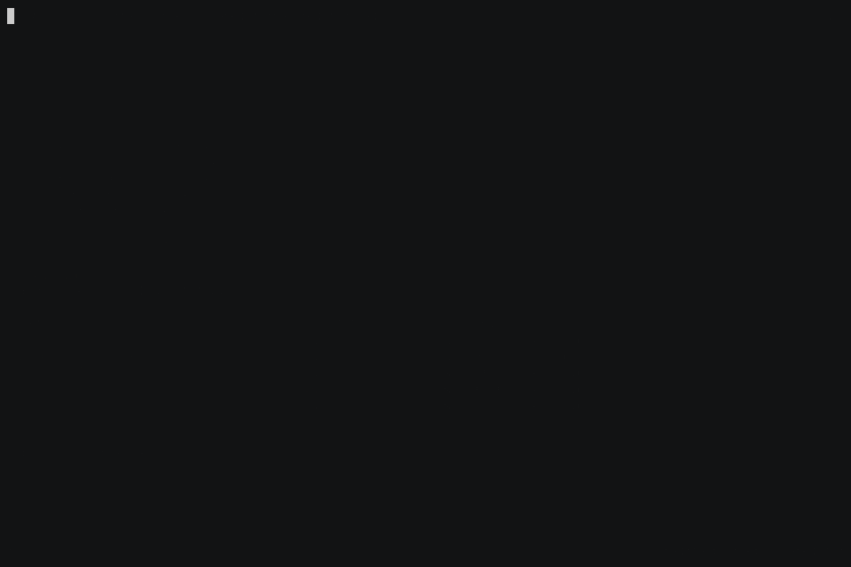
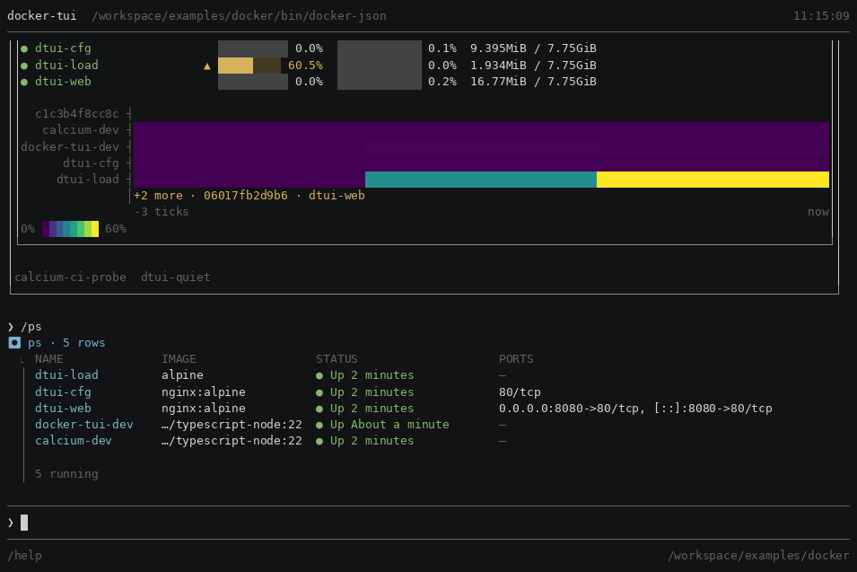
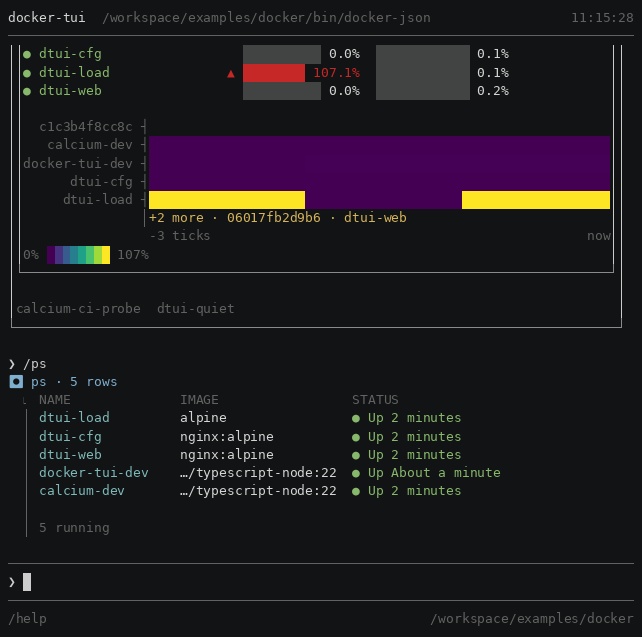
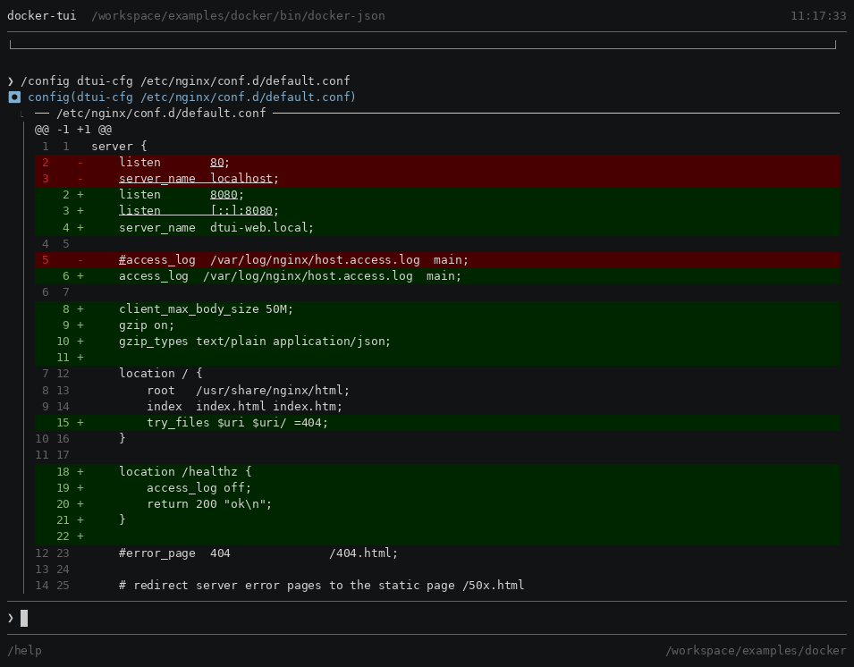
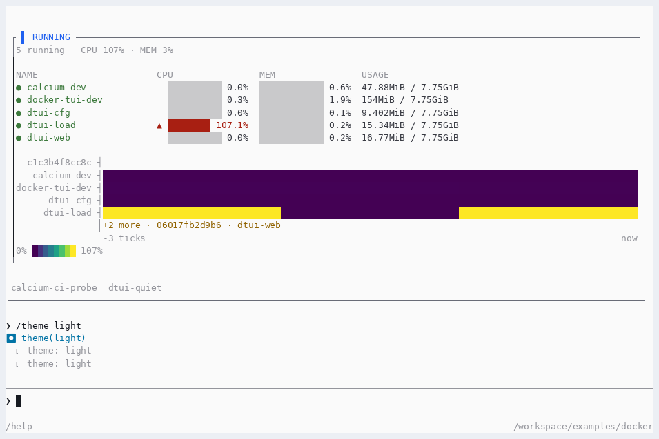

# docker-tui

![docker-tui: a ten-beat screencast — the landing dashboard refreshing in place, the /ps table, its rows walked with the arrow keys, a completion menu opening as a verb is typed, drilling into a single container where a CPU plot fills one sample at a time beside memory and network bars, a /drift comparison, a unified config diff with syntax highlighting, a log tail with container names completed from the daemon and exited with Ctrl-C, then the whole transcript scrolled back to the banner before /clear and /dashboard return the opening frame](demo.gif)

**A terminal interface over `docker`, built on [Calcium](../../README.md).** It is
the framework's reference application: twelve surfaces, every block type, and a
findings ledger recording every place the framework did not reach.

Ten beats, one session, recorded against real containers: the landing dashboard,
`/ps` and its rows under the arrow keys, a completion menu that opens as the verb
is typed, the live single-container view filling its plot, `/drift`, `/config`'s
unified diff, a log tail whose container name was completed from the daemon, and
finally the whole transcript scrolled back to the banner — everything above has
left the screen by then, and that is the only beat that shows it was kept.

**It ends where it starts.** `/clear` empties the transcript and `/dashboard`
puts the opening frame back, so the last second of the recording is the first
one and the loop has no cut in it.

**The recording is `demo.cast`**, an asciicast written by `tools/capture.py` — the
same capture the frames below were read from, not a second run. `agg demo.cast
demo.gif` re-renders it. Record a new one with `python3 tools/screencast.py
out/demo`, and read it back beat by beat with `tools/beats.py` before believing
it: a screencast is a frame-read with an audience, and doing that here found
four defects the suites could not — the fourth being that **the completion beat
had never worked.** `↓` moves focus into the live block, a printable key
arriving there does nothing rather than leaking into the prompt behind it (C16
I22, exactly as specified), and the beat before it never pressed `Esc`. So every
character was dropped and the recording showed an empty prompt where the menu was
meant to be. Nothing in the frame says so, which is the whole difficulty: an
empty prompt is what a prompt looks like.

---

## Running it

It needs a docker daemon, so it has its own container — `.devcontainer/docker-tui/`,
which A04 §4 explains. Open the repository in that one rather than in `calcium`,
and the command is linked on `PATH` when the container comes up.

```sh
make fixtures      # bring up the four containers the surfaces were designed against
docker-tui         # the landing dashboard, refreshing
make fixtures-down # and take them away again
```

Without the container: `npm install` at the repository root, `npm run build`,
then `npm install` here and `npm start`.

**One rule if you are going to run the framework's test suite afterwards.**
`make fixtures` starts `dtui-load`, which spins a core so the CPU plot has a
curve to draw, and a busy machine has broken a tier-5 timing assertion before.
`make load-down` removes that one and leaves the rest. `VERIFYING.md` §7 has both
measurements, including the one where it did not reproduce.

---

## What it looks like, and what each picture proves

Every image below is rendered from a committed `.cast` by
`tools/media.py`, so they regenerate when the app changes rather than rotting.
**None of them is a cropped screenshot** — one cannot be reproduced, and is right
only on the day it is taken.

### The drill-in — the surface everything else was built around



**A structured block that refreshes itself, inside a scrollable transcript.** The
adapter returns a description four times a second and never draws; the plot, the
bars, the panels and the failure isolation are the framework's.

### The same table, at 120 columns and at 80





**Four independent things respond, and the adapter asked for none of them.** The
table drops `PORTS` by declared priority, the dashboard drops `USAGE`, the pills
wrap, and the wordmark falls back to ASCII because the block-element variant is
103 cells wide. Column priorities are data on a `ColumnDef`; the rest is C11 and
C09.

### The block vocabulary, at its least table-like




**Two sources, one block.** `/drift` runs `docker inspect` and then `docker image
inspect` on whatever the first one reports, and pairs the fields by hand — the two
objects do not have the same shape, so no structural diff reaches it. The rows
that match collapse into a count rather than filling the screen.

The verdicts are visibly untoned, and that is F30 and F34 in the picture: a
`Comparison`'s verdict is carried by colour and nothing else, and its union mixes
a *change* axis with a *judgement* axis. It is `docs/ROADMAP.md` entry 4.

### The theme, on the terminal it is for



`/theme light`, rendered on a light terminal **on purpose**. C10 paints no
background — the surface tones stop at 1-bit precisely because *"background
colours are the emulator's and a user may override them"* — so a variant is a set
of foregrounds chosen to pair with a terminal, not a skin that repaints one.
Shown on a dark terminal it would be dark text on a dark background, which is a
picture of the wrong thing.

### Completion, from the manifest and from no code


**Nothing in this application implements the verb menu.** It is the manifest's
verbs and their summaries, from the same table dispatch uses; adding a verb makes
it completable with no code change, which is the property the manifest exists for.

**No key summoned it.** Two or more candidates open the menu as the verb is typed
(C19 I19) — `Tab` is what *enters* it, and the shot is the state before that. The
menu holds no selection while it is a display of what is available, so `Enter`
still submits the line and `↑` still walks history: a menu nobody asked for takes
no keys from the prompt underneath it.

**The rule under the last candidate is the menu's bottom edge**, and it is there
because of what a frame looked like without it. The menu spans the region and is
anchored to the prompt, so `/clear` and `❯ /co` were adjacent rows of text with
nothing between them — read as one line, `/co/container` is a path. Two findings
came out of drawing it: an empty candidate set drew a bare rule above the prompt
at the exact moment there was nothing to show, and an unlabelled rule drew a
heading's separator into a boundary, a two-cell gap at its left. Both were
invisible to every count and visible in the picture.

**The container names are the application's**, and they are the half nobody had
supplied: `TuiConfig.completionSources` had existed since C22 with no consumer, so
`/logs <Tab>` offered nothing and every candidate shown here was a framework verb.
`src/completion.ts` answers three arguments — a container for the nine verbs that
declare one, a repository for `/images`, and a path *inside* a named container,
which is the one that needs argument one to answer argument two. Registering them
found three defects, F70 to F72.

---

## What to look at

| | |
|---|---|
| `/ps` | the table, and the columns it drops as the terminal narrows |
| ⏎ on a row | **the live single-container view** — the headline |
| `/drift <c>` | the container against the image it came from, verdict-toned |
| `/config <c> <path>` | a real unified diff with hunks, context and syntax |
| `/logs <c>` | streaming into a pushed view; `⌃c` leaves it |
| `/inspect` `/diff` `/images` `/top` `/port` `/events` `/compare` | the rest |

`/help` lists them with their flags, because the manifest is the only place any
of that is written down.

---

## The documents, and which to read

This directory is mostly evidence. In the order that makes sense:

| | |
|---|---|
| [`FINDINGS.md`](FINDINGS.md) | sixty-nine entries, logged in the order they were hit |
| [`TRIAGE.md`](TRIAGE.md) | the same, grouped by shape and ranked by consumer count |
| [`../../docs/ROADMAP.md`](../../docs/ROADMAP.md) | **the deliverable** — four pieces of framework work, each with a real surface behind it |
| [`DEGRADATION.md`](DEGRADATION.md) | the same view at five colour depths, as frames |
| [`VERIFYING.md`](VERIFYING.md) | how to read a result here without being lied to |
| `*_WALK.md` | each surface walked by hand before it was built |

**`FINDINGS.md` is the point of the exercise, not a defect list.** A reference
application is usually justified as proof the framework works. Its more valuable
output is the list of places it did not — and that list is trustworthy only
because every entry was reached for while building something, rather than while
looking for problems.

---

## What it does not do

Nothing that mutates. No `stop`, no `rm`, no `run`. Every verb reads, which is
R01's second commitment and keeps a demo you can hand to someone safe to drive.

**Two block behaviours it was expected to demonstrate and does not**, in both
cases because the far side is not the shape the block assumes:

- **`b.live`'s streaming arm** — `docker stats` streams by redrawing the screen
  rather than by emitting records, so `/stats` polls (F10).
- **`b.logs`** — `docker logs` emits no level, and R01 commitment 5's own
  argument forbids parsing one out of arbitrary container output, so the app
  builds `b.raw` per line (F64).

Both are claims about the framework's coverage rather than about this app, and
both are worth more than a demonstration would have been.

**One frame-read is structurally unreachable**, and the reason took three
attempts to state correctly. `/drift` on a container whose image is gone cannot
happen: a container pins its image blob by **digest** for as long as it exists,
and the app resolves by digest. `docker rmi` will happily untag while the
container runs — measured, without `-f` — but the reference the app uses cannot
dangle. The branch that handles it is right, tested through the injected lookup,
and has no reachable input from real docker (F66).

**And R01 §13 scores the rest.** Four of twelve commitments do not hold, with
the line count that made the first one a finding rather than a miss.
