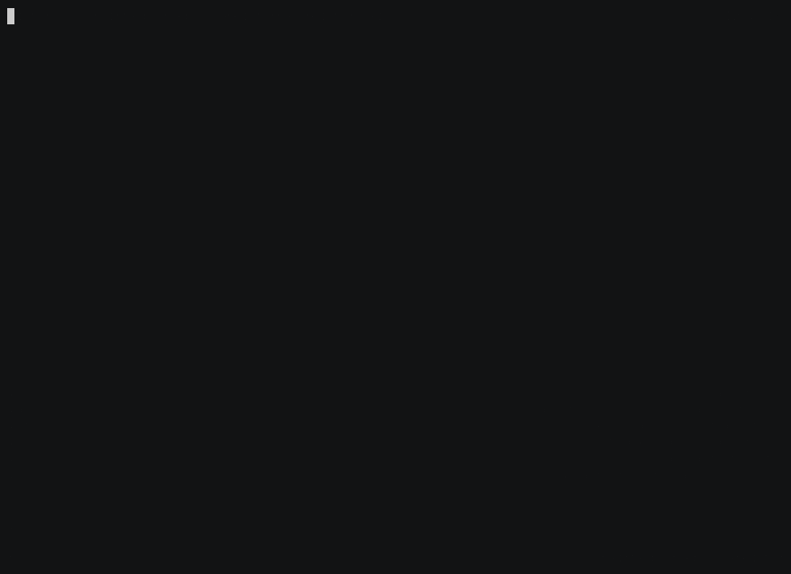

# docker-tui

**A terminal interface over `docker`, built on [Calcium](../../README.md).** It is
the framework's reference application: twelve surfaces, every block type, and a
findings ledger recording every place the framework did not reach.



Six beats, one session, recorded against real containers: the landing dashboard,
`/ps`, the live single-container view filling its plot, `/drift`, `/config`'s
unified diff, and a log tail exited with `⌃c`.

**The recording is `demo.cast`**, an asciicast written by `tools/capture.py` — the
same capture the frames below were read from, not a second run. `agg demo.cast
demo.gif` re-renders it. Record a new one with `python3 tools/screencast.py
out/demo`, and read it back beat by beat with `tools/beats.py` before believing
it: a screencast is a frame-read with an audience, and doing that here found
three defects the suites could not.

---

## Running it

It needs a docker daemon, so it has its own container — `.devcontainer/docker-tui/`,
which A04 §4 explains. Open the repository in that one rather than in `calcium`,
and the command is linked on `PATH` when the container comes up.

```sh
make fixtures      # bring up the four containers the surfaces were designed against
docker-tui         # the landing dashboard, refreshing
make fixtures-down # and take them away again
```

Without the container: `npm install` at the repository root, `npm run build`,
then `npm install` here and `npm start`.

**One rule if you are going to run the framework's test suite afterwards.**
`make fixtures` starts `dtui-load`, which spins a core so the CPU plot has a
curve to draw, and a busy machine has broken a tier-5 timing assertion before.
`make load-down` removes that one and leaves the rest. `VERIFYING.md` §7 has both
measurements, including the one where it did not reproduce.

---

## What to look at

The drill-in is the surface everything else was built around: `/ps`, then Enter
on a container, and watch it breathe. A plot filling one sample at a time, bars
moving, four independent parts where one failing leaves the other three drawing.

| | |
|---|---|
| `/ps` | the table, and the columns it drops as the terminal narrows |
| ⏎ on a row | **the live single-container view** — the headline |
| `/drift <c>` | the container against the image it came from, verdict-toned |
| `/config <c> <path>` | a real unified diff with hunks, context and syntax |
| `/logs <c>` | streaming into a pushed view; `⌃c` leaves it |
| `/inspect` `/diff` `/images` `/top` `/port` `/events` `/compare` | the rest |

`/help` lists them with their flags, because the manifest is the only place any
of that is written down.

---

## The documents, and which to read

This directory is mostly evidence. In the order that makes sense:

| | |
|---|---|
| [`FINDINGS.md`](FINDINGS.md) | sixty entries, logged in the order they were hit |
| [`TRIAGE.md`](TRIAGE.md) | the same, grouped by shape and ranked by consumer count |
| [`../../docs/ROADMAP.md`](../../docs/ROADMAP.md) | **the deliverable** — four pieces of framework work, each with a real surface behind it |
| [`DEGRADATION.md`](DEGRADATION.md) | the same view at five colour depths, as frames |
| [`VERIFYING.md`](VERIFYING.md) | how to read a result here without being lied to |
| `*_WALK.md` | each surface walked by hand before it was built |

**`FINDINGS.md` is the point of the exercise, not a defect list.** A reference
application is usually justified as proof the framework works. Its more valuable
output is the list of places it did not — and that list is trustworthy only
because every entry was reached for while building something, rather than while
looking for problems.

---

## What it does not do

Nothing that mutates. No `stop`, no `rm`, no `run`. Every verb reads, which is
R01's second commitment and keeps a demo you can hand to someone safe to drive.

**Two block behaviours it was expected to demonstrate and does not**, in both
cases because the far side is not the shape the block assumes:

- **`b.live`'s streaming arm** — `docker stats` streams by redrawing the screen
  rather than by emitting records, so `/stats` polls (F10).
- **`b.logs`** — `docker logs` emits no level, and R01 commitment 5's own
  argument forbids parsing one out of arbitrary container output, so the app
  builds `b.raw` per line (F64).

Both are claims about the framework's coverage rather than about this app, and
both are worth more than a demonstration would have been.

**One frame-read is structurally unreachable**, and the reason took three
attempts to state correctly. `/drift` on a container whose image is gone cannot
happen: a container pins its image blob by **digest** for as long as it exists,
and the app resolves by digest. `docker rmi` will happily untag while the
container runs — measured, without `-f` — but the reference the app uses cannot
dangle. The branch that handles it is right, tested through the injected lookup,
and has no reachable input from real docker (F66).

**And R01 §13 scores the rest.** Four of twelve commitments do not hold, with
the line count that made the first one a finding rather than a miss.
