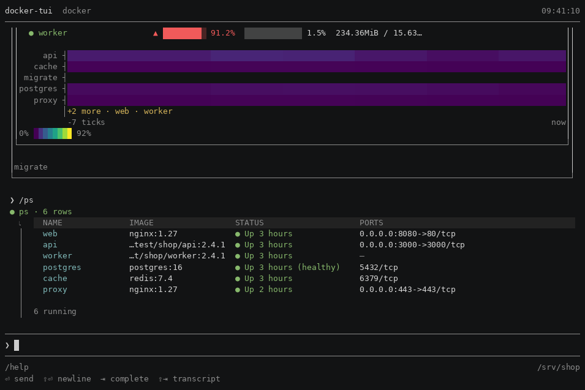
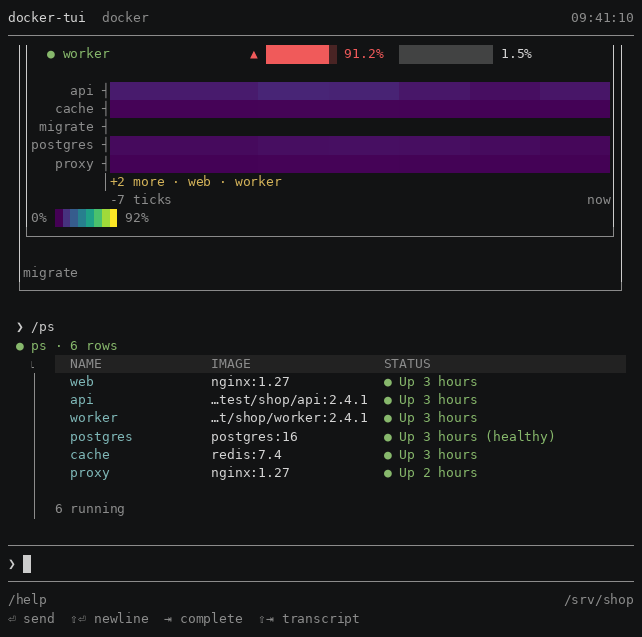
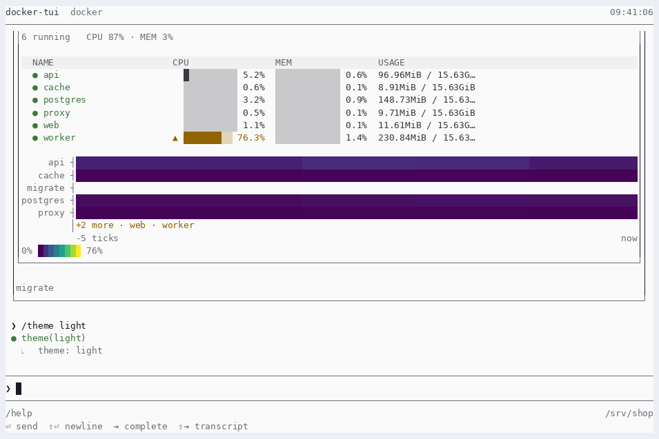
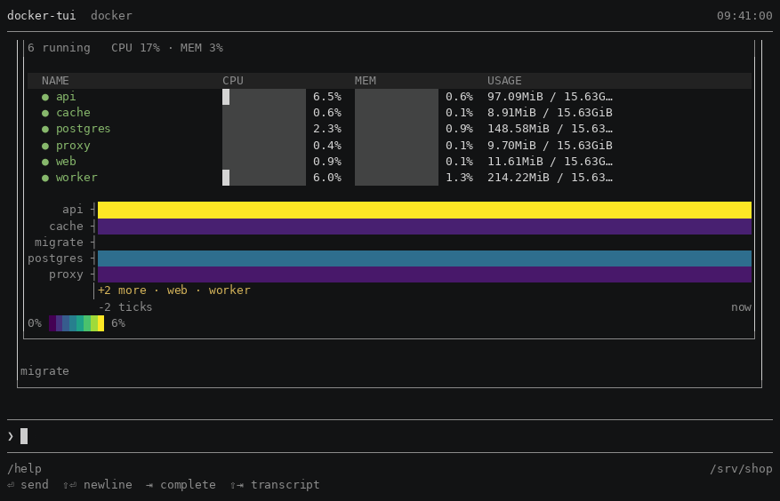

# docker-tui

![docker-tui against an invented host of seven containers — web, api, worker, postgres, cache, proxy and a stopped migrate: an eleven-beat screencast — the landing dashboard refreshing in place, then /ps, its rows walked with the arrow keys and api's detail opened, a completion menu of every verb opening as the slash is typed, an image name and the container worker completed, /container stats worker where a CPU plot fills a sample at a time, a /drift comparison of web against nginx:1.27, a unified config diff of proxy's default.conf whose path was completed inside the container, /port and /top — before the whole session is scrolled back to the whale banner and /clear and /dashboard draw the dashboard again](demo.gif)

**A terminal interface over `docker`, built on [Calcium](../../README.md).** It is
the framework's reference application: twelve surfaces, every block type, and a
findings ledger recording every place the framework did not reach.

**One session that accumulates, and the screen is taken exactly once.** Eleven
beats against an invented host (below): the landing dashboard, `/ps` and its rows under
the arrow keys, a completion menu that opens as the verb is typed, image and
container names answered by the app's own sources, `/container stats worker`
filling its plot, `/drift`, `/filediff`'s unified diff with its path completed
inside the container, two short verbs, and then the whole session scrolled back
to the banner.

**The earlier recordings bounced, and the cause was not the pacing.** They used
three `view: true` verbs — `/container stats`, `/inspect`, `/logs` — and a view
is a fullscreen layer that appends nothing (A01 D7; C15 T5.5 puts it as *the
transcript is untouched*). So leaving one gave back the frame it started from,
and three of nine beats read as jumping to the top. Measured from the frame after
`Esc`: the transcript held the dashboard and `/ps` and nothing else, because
nothing had been added to it. One dive is kept, because the live plot is the
surface everything else was built around, and the beat after it appends
immediately so the return lands on a transcript that then grows.

**It ends close to where it starts, and not on it.** `/clear` empties the
transcript and `/dashboard` draws the dashboard again — but as a transcript
entry, under the echo of the command that asked for it, so every row of it sits
three columns right of the greeting's. Measured on the 2026-09-29 recording with
`tools/beats.py` and `screen.py`: 28 of 34 rows differ from the first settled
frame — the clock, 26 rows of dashboard moved by that indent, and one where
`screen.py` prints a cursor-shape sequence as text (F966). This paragraph used to
say 28 were *identical*, and the re-recording does not bear that out. The loop has
a visible cut, and saying so is better than claiming one nobody can see.

**Every recording is made against an invented host, never a real daemon** — the
person's ruling of 2026-09-29. `src/world.ts` is a fake `docker` CLI: seven
containers (`web`, `api`, `worker`, `postgres`, `cache`, `proxy`, and `migrate`,
exited), their images (`nginx:1.27`, `postgres:16`, `redis:7.4`, `alpine:3.20`, and
`registry.example.test/shop/{api,worker,migrate}:2.4.1`), engine 27.3.1 and a
16 GB host. The adapted verbs replay it through C06's `createFixtureTransport`;
the local handlers call it as their `docker` runner. `tools/record.ts` drives the
app's real configuration (`src/app.ts`) against it under virtual time, on memory
streams, in `/srv/shop` at 09:41 UTC — so **two recordings of one script are the
same bytes**, and nothing of the recording machine reaches a frame
(`test/world.test.ts`; `capture.assert_private` refuses a cast that carries a host
path, the hostname or a lab container name). No daemon is needed to record, and
`make fixtures` is not involved. To look at the same world by hand:
`DOCKER_TUI_WORLD=demo docker-tui` (or `npm start` with it set).

**The recording is `demo.cast`**, an asciicast written by `tools/capture.py` — the
same capture the frames below were read from, not a second run. `agg --font-size 13
--theme asciinema demo.cast demo.gif` re-renders it — the same flags `tools/media.py`
uses, so the overview and the stills share one ground. Record a new one with `python3 tools/screencast.py
out/demo`, and read it back beat by beat with `tools/beats.py` before believing
it: a screencast is a frame-read with an audience, and doing that here found
five defects the suites could not — the fourth being that **the completion beat
had never worked.** `↓` moves focus into the live block, a printable key
arriving there does nothing rather than leaking into the prompt behind it (C16
I22, exactly as specified), and the beat before it never pressed `Esc`. So every
character was dropped and the recording showed an empty prompt where the menu was
meant to be. Nothing in the frame says so, which is the whole difficulty: an
empty prompt is what a prompt looks like.

---

## Running it

It needs a docker daemon, so it has its own container — `.devcontainer/docker-tui/`,
which A04 §4 explains. Open the repository in that one rather than in `calcium`,
and the command is linked on `PATH` when the container comes up.

```sh
make fixtures      # bring up the four containers the surfaces were designed against
docker-tui         # the landing dashboard, refreshing
make fixtures-down # and take them away again
```

Without the container: `npm install` at the repository root, `npm run build`,
then `npm install` here and `npm start`.

**One rule if you are going to run the framework's test suite afterwards.**
`make fixtures` starts `dtui-load`, which spins a core so the CPU plot has a
curve to draw, and a busy machine has broken a tier-5 timing assertion before.
`make load-down` removes that one and leaves the rest. `VERIFYING.md` §7 has both
measurements, including the one where it did not reproduce.

---

## What it looks like, and what each picture proves

Every image below is rendered from a committed `.cast` by
`tools/media.py`, so they regenerate when the app changes rather than rotting.
**None of them is a cropped screenshot** — one cannot be reproduced, and is right
only on the day it is taken.

### The drill-in — the surface everything else was built around


**A structured block that refreshes itself, inside a scrollable transcript.** The
adapter returns a description four times a second and never draws; the plot, the
bars, the panels and the failure isolation are the framework's.

### The same table, at 120 columns and at 80





**Four independent things respond, and the adapter asked for none of them.** The
table drops `PORTS` by declared priority, the dashboard drops `USAGE`, the pills
wrap, and the wordmark falls back to ASCII because the block-element variant is
103 cells wide. Column priorities are data on a `ColumnDef`; the rest is C11 and
C09.

### The block vocabulary, at its least table-like


**Two sources, one block.** `/drift` runs `docker inspect` and then `docker image
inspect` on whatever the first one reports, and pairs the fields by hand — the two
objects do not have the same shape, so no structural diff reaches it. The rows
that match collapse into a count rather than filling the screen.

**This picture is the argument for a change that has since landed**, and it is
kept for that. A `Comparison`'s verdict used to be carried by colour and nothing
else, and one union named two axes at once — which is why `added` and `removed`
had nowhere to go. F30 and F34.

The type is now split: `change` is neutral and drawn in a marker column
(`~ + -`, blank for unchanged), `verdict` is the judgement half and the only one
that takes a colour. The renderer had already made the split — `comparisonTone`
coloured `better`/`worse` and left the rest alone — so the type was the last
place still conflating them.

### The theme, on the terminal it is for



`/theme light`, rendered on a light terminal **on purpose**. C10 paints no
background — the surface tones stop at 1-bit precisely because *"background
colours are the emulator's and a user may override them"* — so a variant is a set
of foregrounds chosen to pair with a terminal, not a skin that repaints one.
Shown on a dark terminal it would be dark text on a dark background, which is a
picture of the wrong thing.

### The log tail, streaming



**It has a picture because it lost its place in the overview.** `/logs` is one of
three `view: true` verbs, and the demo keeps exactly one of those — so without a
shot of its own the streaming surface would have had none anywhere. It is also
the only verb in this manifest that is `view: true` **and** `streams: true`, a
combination C05 I20 permits and nothing else here uses.

The lines arrive from a `docker logs --follow` that is still running when the
frame is taken. Getting that far took F61: `mawk` block-buffers its *input*, so
the original pipeline delivered nothing at all — `docker logs --follow | cat`
gave 150 lines in four seconds and `| awk` gave zero, and `/logs` had never
worked once.

### Completion, from the manifest and from no code


**Nothing in this application implements the verb menu.** It is the manifest's
verbs and their summaries, from the same table dispatch uses; adding a verb makes
it completable with no code change, which is the property the manifest exists for.

**No key summoned it.** Two or more candidates open the menu as the verb is typed
(C19 I19) — `Tab` is what *enters* it, and the shot is the state before that. The
menu holds no selection while it is a display of what is available, so `Enter`
still submits the line and `↑` still walks history: a menu nobody asked for takes
no keys from the prompt underneath it.

**The rule under the last candidate is the menu's bottom edge**, and it is there
because of what a frame looked like without it. The menu spans the region and is
anchored to the prompt, so `/clear` and `❯ /co` were adjacent rows of text with
nothing between them — read as one line, `/co/container` is a path. Two findings
came out of drawing it: an empty candidate set drew a bare rule above the prompt
at the exact moment there was nothing to show, and an unlabelled rule drew a
heading's separator into a boundary, a two-cell gap at its left. Both were
invisible to every count and visible in the picture.

**The container names are the application's**, and they are the half nobody had
supplied: `TuiConfig.completionSources` had existed since C22 with no consumer, so
`/logs <Tab>` offered nothing and every candidate shown here was a framework verb.
`src/completion.ts` answers three arguments — a container for the nine verbs that
declare one, a repository for `/images`, and a path *inside* a named container,
which is the one that needs argument one to answer argument two. Registering them
found three defects, F70 to F72.

---

## What to look at

| | |
|---|---|
| `/ps` | the table, and the columns it drops as the terminal narrows |
| ⏎ on a row | **the live single-container view** — the headline |
| `/drift <c>` | the container against the image it came from, verdict-toned |
| `/filediff <c> <path>` | a real unified diff with hunks, context and syntax |
| `/logs <c>` | streaming into a pushed view; `⌃c` leaves it |
| `/inspect` `/diff` `/images` `/top` `/port` `/events` `/compare` | the rest of the read side |
| `/rm <c>` | **the confirm** — a question carrying what it will destroy, and a refusal passed through with a `fill` |
| `/system prune` | the same, where the list of what goes has to be fetched because no `--dry-run` exists |

`/help` lists them with their flags, because the manifest is the only place any
of that is written down.

---

## The documents, and which to read

This directory is mostly evidence. In the order that makes sense:

| | |
|---|---|
| [`FINDINGS.md`](FINDINGS.md) | every finding, logged in the order it was hit. **No count here** — it said *sixty-nine* while the ledger held 159, and a number in prose is a snapshot with no mechanism (F87, F142). `make enforce`'s SP6 is what counts them, by equality against `TRIAGE.md` |
| [`TRIAGE.md`](TRIAGE.md) | the same, grouped by shape and ranked by consumer count |
| [`../../docs/ROADMAP.md`](../../docs/ROADMAP.md) | **the deliverable** — four pieces of framework work, each with a real surface behind it |
| [`DEGRADATION.md`](DEGRADATION.md) | the same view at five colour depths, as frames |
| [`CORRECTIONS.md`](CORRECTIONS.md) | **every drawing that turned out wrong**, derived by `tools/corrections.mjs` rather than hand-listed. F11's ruling was *keep the drawings, add an appendix* — the corrections were made in place at every site and the index was never written, so the most-instantiated class in the project had no count. The number is a **floor**, and the tool says why |
| [`VERIFYING.md`](VERIFYING.md) | how to read a result here without being lied to |
| `*_WALK.md` | each surface walked by hand before it was built |

**`FINDINGS.md` is the point of the exercise, not a defect list.** A reference
application is usually justified as proof the framework works. Its more valuable
output is the list of places it did not — and that list is trustworthy only
because every entry was reached for while building something, rather than while
looking for problems.

---

## What it does, and what it will ask you first

**It mutates now, and this section said it did not.** For most of the project the
answer was *nothing that mutates — no `stop`, no `rm`, no `run`* — R01's second
commitment, and true when it was written. Steps 9 to 13 added five families and
all three of the verbs that sentence names:

| family | verbs |
|---|---|
| lifecycle | `stop` `start` `restart` `kill` `pause` `unpause` `rename` `update` |
| destructive | `rm` `rmi` `prune` `volume prune` `network prune` `system prune` |
| registry | `pull` `push` `build` |
| exec | `cp` `commit` `export` `save` `load` `import` `run` `exec` `attach` `create` |
| resources | `network ls` `volume ls` `context ls` `builder ls` `system df` · three `inspect`s · `image history` |

**Every one of them asks first**, through C23's confirm host, and the question
carries what it will destroy rather than a yes/no box. There is no `--dry-run`
on any `prune`, so each prune verb is two calls — the second is the list docker
itself walks, because with no dry-run that is the only honest source.

The refusals are passed through verbatim: `docker rm` on a running container
says *stop the container before removing or force remove*, which is better than
anything this app would write, and a `tip` carries a `fill` action so `--force`
is a decision taken at a prompt you can still edit rather than a button.

**It is still safe to hand to someone, and for a different reason than before.**
It was safe because it could not; it is safe because it asks.

**Two block behaviours it was expected to demonstrate and does not**, in both
cases because the far side is not the shape the block assumes:

- **`b.live`'s streaming arm** — `docker stats` streams by redrawing the screen
  rather than by emitting records, so `/stats` polls (F10).
- **`b.logs`** — `docker logs` emits no level, and R01 commitment 5's own
  argument forbids parsing one out of arbitrary container output, so the app
  builds `b.raw` per line (F64).

Both are claims about the framework's coverage rather than about this app, and
both are worth more than a demonstration would have been.

**One frame-read is structurally unreachable**, and the reason took three
attempts to state correctly. `/drift` on a container whose image is gone cannot
happen: a container pins its image blob by **digest** for as long as it exists,
and the app resolves by digest. `docker rmi` will happily untag while the
container runs — measured, without `-f` — but the reference the app uses cannot
dangle. The branch that handles it is right, tested through the injected lookup,
and has no reachable input from real docker (F66).

**And R01 §13 scores the rest.** Four of twelve commitments do not hold, with
the line count that made the first one a finding rather than a miss.
