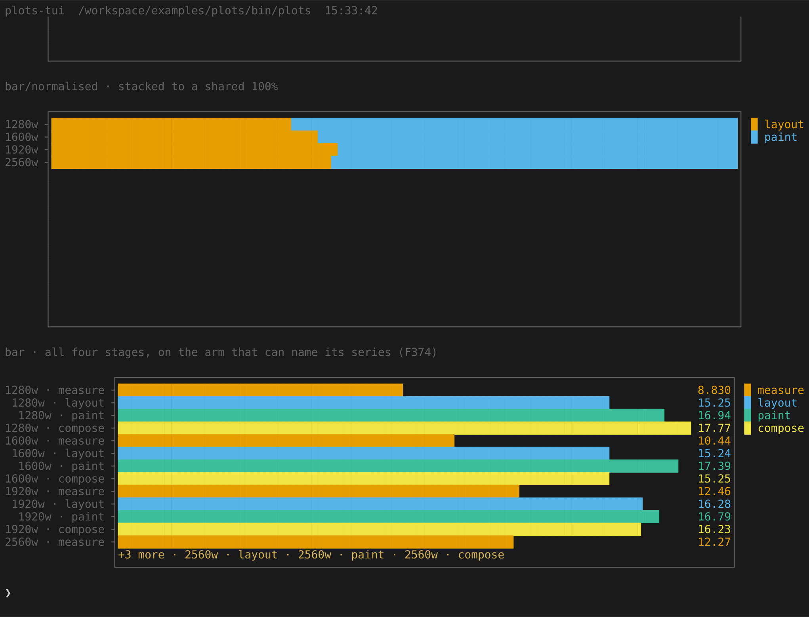

# plots-tui

**The plot system in a real terminal, and the first thing here a human has watched.**


```
cd examples/plots
npm start                   # then /sample
```

**That is usually all of it**, because the example imports `@fmx/calcium`'s
**built** output and `dist/` is normally already there — anyone who has run
`make check`, `make test` or the container's build has it. Try `npm start`
first; if it cannot resolve the package, build it:

```
npm run build               # from the REPOSITORY ROOT — there is no build here
```

**`build` is the root package's script.** Running it in this directory gets
`Missing script: "build"`, which is the honest answer to the wrong question.

**And if that build fails with `Unable to resolve @typescript/typescript-<your
platform>`**, `node_modules` was installed inside the devcontainer and holds
only *its* platform's TypeScript binary — CLAUDE.md sends every command through
the container and `node_modules` is bind-mounted, so the host sees Linux
binaries. Build in the container, or reinstall on the host. `dist/` itself is
plain JavaScript and runs anywhere, which is why the first block usually works
regardless.

**A consumer installing a published `@fmx/calcium` gets it built and skips all
of this** — that is R01 R4.4, and the reason the build step belongs in a note
rather than in the instructions.

**In a real terminal.** `plots-tui` draws on the alternate screen, so it refuses a pipe or a
redirect and says so; `npm start 2>&1 | head` gets the refusal rather than a figure.

Then, at the prompt:

```
/sample       the gallery — six figures, one of them live
/all          every form, and every rung — 95 figures, and the four that refuse
/form  <f>    one form full size, with its rungs beneath it   e.g. /form violin
/live  <f>    one form, advancing
/compare <f>  the terminal beside the SVG, as pixels
/faults       a failing source, and the way back — the framework's box, six ways
/monitor      this machine, live — cores, memory, load, heap
/rungs        the failure box at every height and width rung it has
/mosaic       layouts named as a picture — `b.mosaic`'s area grammar
```

**`/rungs` needs a block that fails, and registers one.** The framework draws its `status` box
from three places and two of them are `b.live`'s defaults at height 1 and 2 — a frame read, because
both sit inside the part's own panel. So the border, the padding and the ` ERROR ` tag are drawn
only by the registry's containment boundary, at exactly the height the failed block committed. The
demo registers a kind through `TuiConfig.blocks` whose renderer throws on purpose, which is the
same public route `table`, `plot` and `patch` take.

**`main.ts` is the wiring; `src/commands.ts` is what it draws** (F400). `main.ts` calls
`tui.start()` at module scope, so importing it starts a session — while the document builders
lived there, nothing could construct a command's document and check it. The suite tested the
pieces instead: it counted 46 forms and 53 rungs, built each one on its own, and passed while
`/all` and `/form` drew **nothing at all**, because every figure of a form carried the same
`f-<form>` id and a document holding twenty of them is refused entire by C04 I14.

**`--experimental-strip-types` is in the `start` script and it is not decoration** (F392).
Node runs a `.ts` entry point without a flag only from **22.18**; `engines` says `>=22`, and on
22.0–22.17 the demo died with `ERR_UNKNOWN_FILE_EXTENSION` before drawing anything.
`examples/docker` had carried the flag since it was written and the other two had not, so the
same clean clone ran one example and not the others.

Every form the type declares, six of them in the gallery and one live, built through **`b.plot`** —
the published builder, not the viewmodel constructor every fixture in this repository uses.

---

## Why it exists

Every instrument Calcium has compares bytes. Golden frames, the collision sweep, the pair sheet,
the arm disagreement record, the terminal baseline — each answers *did this move* and none can
answer *does it look right*. Twenty-two commits of the C12 seam arc closed with every gate green
and nobody having watched it run.

So this is an application rather than a fixture. An example verified by building a `ViewDocument`
and asserting its blocks never calls `createTui` at all, which is the surface F7 was about.

**And it builds through `b.plot` deliberately.** The catalogue, every test and every golden frame
use `block({ … })`, which is transparent to any field — so the published builder is the one
surface nothing exercises for these forms, and F335's eight missing members were invisible from
inside by construction. `test/plots.test.ts` asserts no figure reaches past it, because the day
one does, this example stops being able to find that class.

It moved a number on the way in: `enforce`'s by-use signal went from **132 of 389 published
members named by no example to 123**, all nine of them `Plot`'s — `xTitle`, `categories`,
`quartiles`, `plotFill`, `orientation`, `hierarchy`, `legend`, `yAxis`, `yCallout`.

---

## What it found

**Five findings, F371–F375**, and the first frame produced three of them. The full entries are in
[`../docker/FINDINGS.md`](../docker/FINDINGS.md).

| | | whose |
|---|---|---|
| **F371** | `b.plot` cannot express `layout`; eleven of `Plot`'s datum types are unpublished | C24 |
| **F372** | a live part is torn down in silence when the shell's own patch is refused | C23 |
| **F373** | `applyPatch` can commit a document `validateDocument` refuses — I14 is not re-established | C04 / C13 |
| **F374** | a vertical bar reserves a legend's width and draws nothing; a category label drops silently | C12 |
| **F375** | the bar's value labels abut — `4.17.4` is two numbers | C12 |

---

## Read figure by figure

Written while looking at the frames, because the third column is the one that goes wrong from
memory: **a bad-looking figure with bad data reads exactly like a bad renderer.** Three of the six
below looked like renderer defects and were not, and one looked fine in text and was empty.

### The curve — right, after two wrong readings that were mine

Two series against a shared ordinate, each named at the line it ends on, in its own colour. It is
the figure that needed least and reads best.

Both faults were the demo's. `yFormat: "duration"` drew a 58 ms tail as `58s` and topped the axis
at `1m 15s` — the formatters are named for **the unit in** (C04 I41) and there is no `ms` arm, so
the number is plain here and the unit is in the caption. And `yCallout` alone is refused at
construction: a callout is written in the right gutter and a left-axis plot has none. Widening to
`yAxis: "both"` satisfied it and drew **a complete second axis, identical labels down both
sides**; `"right"` is the value that buys the gutter without the duplicate. The pairing is
discoverable only from the validator, which does name the fix in its message.

Not a fault: the line draws as plateaus. Twenty samples across forty-three columns is two cells a
sample, and a run of cells is what that is. Honest at this width.

### The bar — where it refused, and three renderer findings

`layout` is one of F335's eight and the demo cannot reach it, so four stages of one budget are
drawn side by side where they are parts of a whole.

**The plan asked for the wrong member first.** It said `layout: "grouped"` — the reading a bar
chart is for — and rendering the block absent, `"overlap"` and `"grouped"` gives one
byte-identical frame for all three, because C12 §3ak already rules that *there is no overlapping
picture a bar can draw*. The fixture would have stated a claim its block does not make, on the
figure chosen to demonstrate the gap. The collision sweep caught it before the member was touched.

Then three that are the renderer's. `legend: "right"` **narrows the plot area by eleven cells and
draws nothing in it**. `columnLabels` drops a category name *and its tick* when it would overlap
its neighbour — at four series with five-cell names, three ticks for four groups, and the tallest
bar was the unlabelled one. And the value labels abut with no separating cell, so `4.17.4` is
`4.1` and `7.4`.

The horizontal arm of the same form gets all three right, which is why `/form bar` closes with it — the last figure on the page, under the rungs:



It names its four series and it names the three rows it could not fit. That contrast is F374.

### The matrix — correct, and it taught the method

Six cores, sixteen frames, viridis. Nothing wrong with it.

**In stripped text it is empty.** `core 0 ┤` and then nothing, for six rows — because a heatmap's
cells are coloured spaces carrying no glyph, so a `.plain` read reports a blank figure that is
plainly there. Had this been read as text, the defect filed would have been against the one figure
that needed no work. It is the whole argument for reading the frame in colour, arriving on the
demo's own first capture.

The ramp did read `0% … 1%`, and that was the demo's: `percent` takes 0–100 and `fraction` takes
0–1. Both arms end in a per-cent sign so the rendered form cannot tell them apart — the producer's
value can, which is exactly why C04 I41 names them for the unit in.

### The distribution — reads well, and its gap is recorded

Four stages, five-number summaries, whiskers, median diamonds, and `layout`'s outlier as a hollow
ring. Shape is legible at a glance.

**No value axis, so no magnitude.** That looked like the strongest defect on the frame, and going
to find the record turned up C12's own table: *the horizontal arm's bottom axis is a **value**
axis … out of scope, and named rather than left silent.* A different thing from a position axis
under a curve, and it does not exist. Known and stated, so not a finding — the instrument working
in the direction that confirms.

### The hierarchy — the areas were wrong and the tree was lying

Six leaves, area by value, labels reversed out of their own colour.

The first frame drew `raster` (12) as large as `fill` (17), which reads as broken apportionment.
It was the data: the fixture was copied from the catalogue and its parents do not equal the sum of
their children — `paint` at 46 over children summing to 38, `curve` at 21 over one child of 12.
The renderer was distributing the remainder correctly and the tree was the thing that did not add
up. **A figure can be arithmetically wrong because its input is, and it looks identical to a
renderer that cannot divide.**

What remains is a judgement rather than a defect: the intermediate names are not drawn, and the
parent boundaries appear as one-cell slivers. At ten rows the leaves are what fits.

### The live one — the finding, and it looked completely fine

`b.live` with `every: 120`, a walk folded in `derive`, redrawn into a `line`.

It drew one sample and stopped. Not an error, not a stall notice, not a spinner — **a correct
figure with the right value, frozen for the rest of the session.** Six seconds is fifty ticks; two
fetches happened.

The cause was the demo naming the live panel and the block it renders the same thing, `walk`,
which is the obvious thing to write. The first patch lands and makes the document ambiguous; every
later patch is refused; `put` returns a bare `false`; `renderPart` releases the host. `applyPatch`
produced an exact diagnosis — *there is no correct block to act on* — and it is discarded at the
one place that could report it. That is F372 and F373, and `T-live` is the row that fails when the
id is put back.

### And the frame as a whole

The dark theme holds, the palette separates six figures without any two reading alike, and nothing
is illegible at 120×48. There is no flicker: C22 writes changed rows rather than repainting, so a
tick moves the walk and touches nothing else.

**The framework refused the first document out loud**, in the frame, naming the invariant and the
remedy: *"yCallout" is "name" with "yAxis" of "left" (C04 I60) — a callout is written in the right
gutter and there is none; widen "yAxis" to "right" or "both"; id "budget" appears 2 times (C04
I14)*. Two mistakes, both mine, both named with their fix. The refusal path is in better shape
than the silent-teardown path fifty lines away, which is most of what F372 is about.

---

## The suite

`test/plots.test.ts` — four rows, and the last is the one worth reading.

- The far side responds before anything is asserted against it.
- No figure reaches past `b.plot`. *(Comments are stripped first: without that the row matched the
  doc comment explaining why it exists. A source assertion measures the prose unless told not to.)*
- The shell opens, the far side is spawned, and all five forms draw.
- **`T-live`** — the live part is still advancing three seconds on. Revert `walk()`'s plot to
  `id: "walk"` and this fails **while the other three stay green**, which is the shape of the
  defect: every assertion about what is on screen passes.

`test/run-in-pty.py` captures **twice**, seconds apart, because a cumulative byte stream cannot
answer a question about two moments. It reads bytes and not frames, deliberately —
`examples/docker/tools/capture.py` is where frames are read through a screen model, and
duplicating it here would be the F14 shape.
